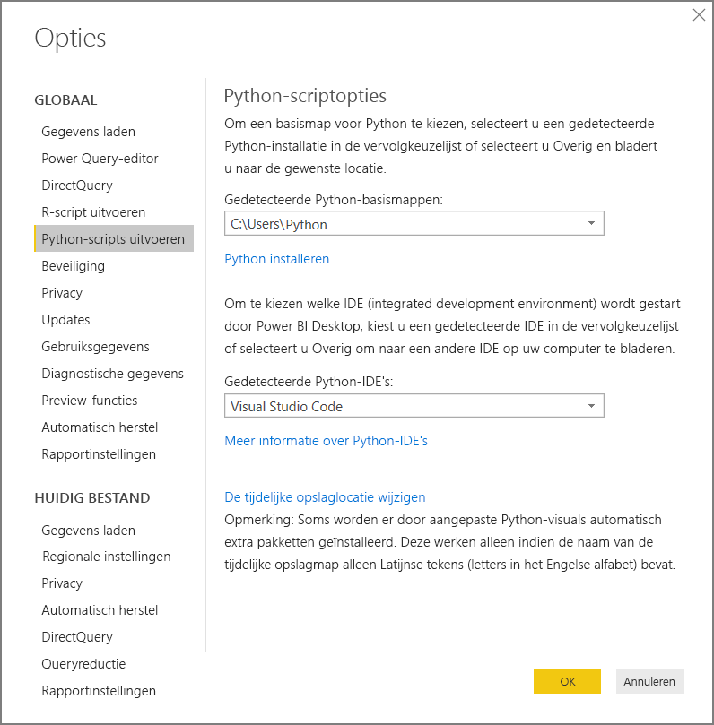
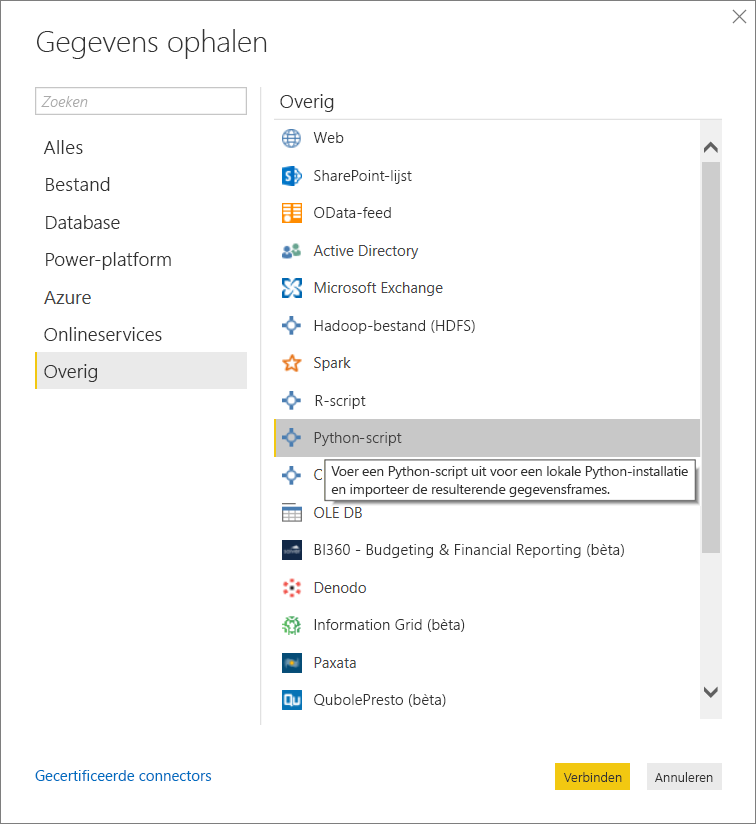
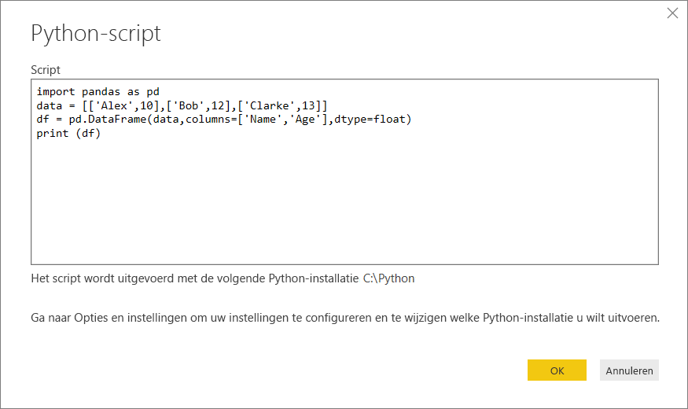
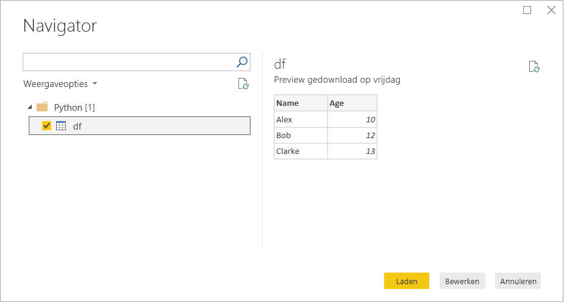

# <a name="run-python-scripts-in-power-bi-desktop"></a>Python-scripts uitvoeren in Power BI Desktop

U kunt Python-scripts rechtstreeks in Power BI Desktop uitvoeren en de resulterende gegevenssets importeren in een Power BI Desktop-gegevensmodel.

## <a name="install-python"></a>Python installeren

Als u Python-scripts wilt uitvoeren in Power BI Desktop, moet u Python afzonderlijk installeren op de lokale computer. U kunt Python downloaden op de [Python-website](https://www.python.org/). In de huidige release voor het uitvoeren van Python-scripts worden Unicode-tekens en spaties in het installatiepad ondersteund.

### <a name="install-required-python-packages"></a>Vereiste Python-pakketten installeren

Voor de integratie van Python met Power BI moeten er twee Python-pakketten worden geïnstalleerd:

* [Pandas](https://pandas.pydata.org/). Een softwarebibliotheek voor het bewerken en analyseren van gegevens. Pandas biedt gegevensstructuren en bewerkingen voor het bewerken van numerieke tabellen en tijdreeksen. Uw geïmporteerde gegevens moeten zich in een [Pandas-gegevensframe](https://www.tutorialspoint.com/python_pandas/python_pandas_dataframe.htm) bevinden. Een gegevensframe is een tweedimensionale gegevensstructuur. Gegevens worden bijvoorbeeld tabelvormig in rijen en kolommen uitgelijnd.
* [Matplotlib](https://matplotlib.org/). Een tekenbibliotheek voor Python en de numerieke wiskundige uitbreiding ervan, [NumPy](https://www.numpy.org/). Matplotlib biedt een objectgeoriënteerde API voor het insluiten van plots in toepassingen met behulp van algemene GUI-werksets, zoals Tkinter, wxPython, Qt of GTK+.

Gebruik in een console of shell het opdrachtregelprogramma [pip](https://pip.pypa.io/en/stable/) om de twee pakketten te installeren. Het hulpprogramma pip wordt geleverd met recentere Python-versies.

```CMD
pip install pandas
pip install matplotlib
```

## <a name="enable-python-scripting"></a>Het uitvoeren van Python-scripts inschakelen

Het uitvoeren van Python-scripts inschakelen:

1. In Power BI Desktop selecteert u **Bestand** > **Opties en instellingen** > **Opties** > **Python-scripts uitvoeren**. De pagina **Python-scriptopties** wordt weergegeven.

   

1. Geef indien nodig het lokale Python-installatiepad op in **Gedetecteerde Python-basismappen**.

   In de bovenstaande afbeelding is het lokale Python-installatiepad *C:\Python*. Zorg dat het pad leidt naar de lokale Python-installatie die u voor Power BI Desktop wilt gebruiken.

1. Selecteer **OK**.

Nadat u uw Python-installatie hebt opgegeven, bent u klaar om Python-scripts uit te voeren in Power BI Desktop.

## <a name="run-python-scripts"></a>Python-scripts uitvoeren

In slechts enkele stappen kunt u Python-scripts uitvoeren en een gegevensmodel maken. Vanuit dit model kunt u rapporten maken en deze delen in de Power BI-service.

### <a name="prepare-a-python-script"></a>Een Python-script voorbereiden

Maak eerst een script in uw lokale omgeving voor Python-ontwikkeling en controleer of het script foutloos wordt uitgevoerd. Hier volgt een voorbeeld van een eenvoudig Python-script waarmee Pandas worden geïmporteerd en een gegevensframe wordt gebruikt:

```python
import pandas as pd
data = [['Alex',10],['Bob',12],['Clarke',13]]
df = pd.DataFrame(data,columns=['Name','Age'],dtype=float)
print (df)
```

Tijdens het uitvoeren wordt dit script geretourneerd:

```python
     Name   Age
0    Alex  10.0
1     Bob  12.0
2  Clarke  13.0
```

Als u een Python-script in Power BI Desktop voorbereidt en uitvoert, gelden er enkele beperkingen:

* Er worden alleen Pandas-gegevensframes geïmporteerd. Zorg er dus voor dat de gegevens die u in Power BI wilt importeren, in een gegevensframe worden weergegeven
* Python-scripts waarvan het uitvoeren langer duurt dan dertig minuten, worden door een time-out afgebroken
* Bij interactieve aanroepen in het Python-script, zoals het wachten op gebruikersinvoer, wordt het uitvoeren van het script onderbroken
* Als de werkmap in het Python-script wordt ingesteld, *moet* u een volledig pad naar de werkmap definiëren in plaats van een relatief pad
* Geneste tabellen worden momenteel niet ondersteund

### <a name="run-your-python-script-and-import-data"></a>Python-script uitvoeren en gegevens importeren

Uw Python-script uitvoeren in Power BI Desktop:

1. Selecteer op het lint Start achtereenvolgens **Gegevens ophalen** > **Overig**.

1. Selecteer **Anders** > **Python-script**, zoals wordt weergegeven in de volgende afbeelding:

   

1. Selecteer **Verbinden**. De nieuwste Python-versie die lokaal is geïnstalleerd, wordt geselecteerd als de Python-engine. Kopieer uw script in het dialoogvenster **Python-script** dat wordt weergegeven. Hier voeren we het eenvoudige Python-script in dat eerder is weergegeven.

   

1. Selecteer **OK**. Als het script is uitgevoerd, wordt **Navigator** weergegeven en kunt u de gegevens laden en gebruiken. Schakel bijvoorbeeld **df** in, zoals wordt weergegeven in de afbeelding, en selecteer vervolgens **Laden**.

    

### <a name="troubleshooting"></a>Problemen oplossen

Als Python niet is geïnstalleerd of niet wordt geïdentificeerd, wordt er een waarschuwing weergegeven. U kunt ook een waarschuwing krijgen als u meerdere installaties op de lokale machine hebt. Ga terug en bekijk de vorige secties Python installeren en Het uitvoeren van Python-scripts inschakelen opnieuw.


#### <a name="using-custom-python-distributions"></a>Aangepaste Python-distributies gebruiken

Power BI voert scripts rechtstreeks uit met behulp van het uitvoerbare bestand python.exe uit een door de gebruiker opgegeven map (via de pagina Instellingen). Bij distributies waarvoor een extra stap vereist is om de omgeving voor te bereiden (bijvoorbeeld Conda), kan het zijn dat er een probleem optreedt als de uitvoering mislukt.

U kunt het beste de officiële Python-distributie van https://www.python.org/ gebruiken om verwante problemen te voorkomen.

Als mogelijke oplossing kunt u Power BI Desktop starten vanuit de prompt van uw aangepaste Python-omgeving.

### <a name="refresh"></a>Refresh

U kunt een Python-script in Power BI Desktop vernieuwen. Ga naar het lint **Start** en selecteer **Vernieuwen** om te vernieuwen. Als u een Python-script vernieuwt, wordt het opnieuw uitgevoerd in Power BI Desktop.

## <a name="next-steps"></a>Volgende stappen

Raadpleeg de volgende aanvullende informatie over Python in Power BI.

* [Python-visuals maken in Power BI Desktop](desktop-python-visuals.md)
* [Een externe Python IDE met Power BI gebruiken](desktop-python-ide.md)
