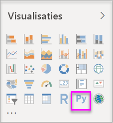
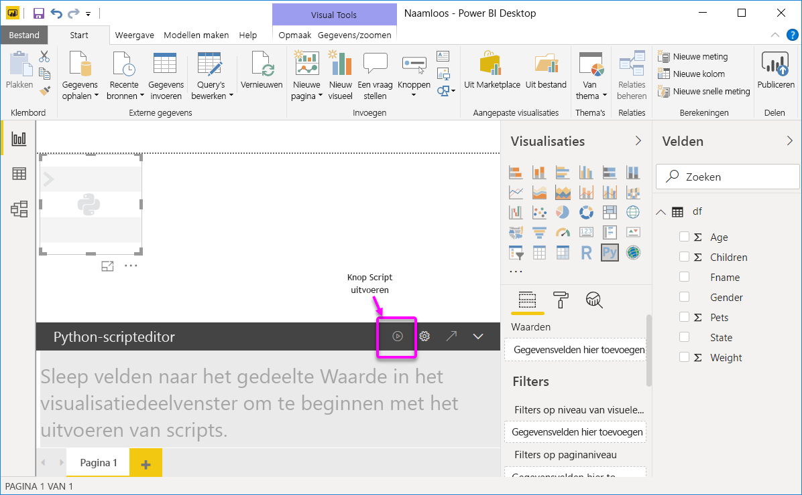
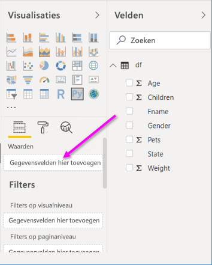
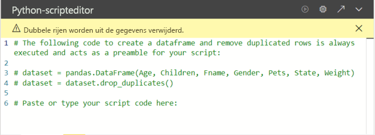
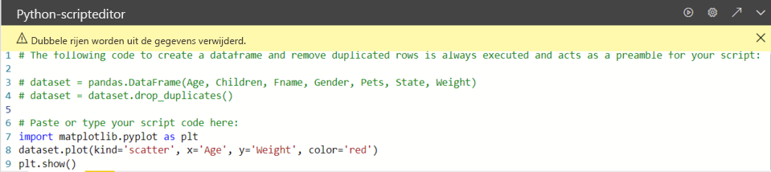

# <a name="create-power-bi-visuals-by-using-python"></a>Power BI-visuals maken met behulp van Python

In combinatie met *Power BI Desktop* kunt u Python gebruiken om uw gegevens te visualiseren.

## <a name="prerequisites"></a>Vereisten

Doorloop de zelfstudie [Python-scripts uitvoeren in Power BI Desktop](desktop-python-scripts.md) met behulp van het volgende Python-script:

```python
import pandas as pd 
df = pd.DataFrame({ 
    'Fname':['Harry','Sally','Paul','Abe','June','Mike','Tom'], 
    'Age':[21,34,42,18,24,80,22], 
    'Weight': [180, 130, 200, 140, 176, 142, 210], 
    'Gender':['M','F','M','M','F','M','M'], 
    'State':['Washington','Oregon','California','Washington','Nevada','Texas','Nevada'],
    'Children':[4,1,2,3,0,2,0],
    'Pets':[3,2,2,5,0,1,5] 
}) 
print (df) 
```

In het artikel [Python-scripts uitvoeren in Power BI Desktop](desktop-python-scripts.md) kunt u zien hoe u Python kunt installeren op de lokale machine, en hoe u het uitvoeren van Python-scripts kunt inschakelen in Power BI Desktop. In deze zelfstudie worden gegevens uit het bovenstaande script gebruikt om aan te geven hoe Python-visuals worden gemaakt.

## <a name="create-python-visuals-in-power-bi-desktop"></a>Python-visuals maken in Power BI Desktop

1. Selecteer het pictogram **Python-visual** in het deelvenster **Visualisaties**.

   

1. Selecteer in het dialoogvenster **Visuele scriptelementen inschakelen** dat wordt weergegeven de optie **Inschakelen**.

    Wanneer u een Python-visual aan een rapport toevoegt, worden in Power BI Desktop de volgende acties uitgevoerd:

    - Een tijdelijke aanduiding voor een Python-visual wordt weergegeven op het rapportcanvas.

    - De **Python-scripteditor** wordt onderin het middelste deelvenster weergegeven.

    

1. Sleep vervolgens de velden **Leeftijd**, **Kinderen**, **Voornaam**, **Geslacht**, **Huisdieren**, **Staat** en **Gewicht** naar de sectie **Waarden** bij de vermelding **Hier gegevensvelden toevoegen**.

    

   Uw Python-script kan alleen gebruikmaken van velden die zijn toegevoegd aan de sectie **Waarden**. U kunt velden toevoegen aan of verwijderen uit de sectie **Waarden** terwijl u aan het Python-script werkt. In Power BI Desktop worden veldwijzigingen automatisch gedetecteerd.

   > [!NOTE]
   > Het standaardtype voor aggregatie voor Python-visuals is *niet samenvatten*.
   > 
   > 

1. U kunt nu de gegevens gebruiken die u hebt geselecteerd voor het maken van een diagram.

    Als u velden selecteert of verwijdert, wordt in de Python-scripteditor automatisch ondersteunende code gegenereerd of verwijderd. 

    Op basis van uw selecties wordt in de Python-scripteditor de volgende bindingcode gegenereerd.

    - In de editor is een gegevensframe *gegevensset* gemaakt met de velden die u hebt toegevoegd.
    - Het standaardaggregatietype is: *Niet samenvatten*.
    - Net als bij tabelvisuals worden velden gegroepeerd en komen dubbele rijen slechts eenmaal voor.

    

     > [!TIP]
     > In bepaalde gevallen wilt u geen automatische groepering of wilt u dat alle rijen worden weergegeven, met inbegrip van duplicaten. In dat geval kunt u aan uw gegevensset een indexveld toevoegen dat ervoor zorgt dat alle rijen als uniek worden beschouwd en groepering wordt voorkomen.

   U kunt in de gegevensset toegang krijgen tot kolommen door de naam ervan te gebruiken. U kunt bijvoorbeeld `dataset["Age"]` in uw Python-script coderen om toegang te krijgen tot het veld Leeftijd.

1. Met behulp van het gegevensframe dat automatisch wordt gegenereerd vanwege de velden die u hebt geselecteerd, kunt u een Python-script schrijven dat resulteert in tekenen naar het Python-standaardapparaat. Wanneer het script af is, selecteert u **Uitvoeren** op de titelbalk van de **Python-scripteditor**.

   De visual wordt opnieuw getekend in Power BI Desktop wanneer een van de volgende gebeurtenissen optreedt:

   - Wanneer u **Uitvoeren** selecteert in de titelbalk van **Python-scripteditor**
   - Wanneer een gegevenswijziging plaatsvindt, als gevolg van het vernieuwen, filteren of markeren van gegevens

   Wanneer u een Python-script uitvoert dat leidt tot een fout, wordt de Python-visual niet getekend en wordt er een foutbericht op het canvas weergegeven. Selecteer **Details bekijken** in het bericht voor de foutdetails.

   Als u een grotere weergave van de visualisaties wilt, minimaliseert u de **Python-scripteditor**.

Laten we een aantal visuals gaan maken.

## <a name="create-a-scatter-plot"></a>Een spreidingsplot maken

We gaan een spreidingsplot maken om te zien of er sprake is van een correlatie tussen leeftijd en gewicht.

1. Voer onder **Hier uw scriptcode plakken of typen** deze code in:

   ```python
   import matplotlib.pyplot as plt 
   dataset.plot(kind='scatter', x='Age', y='Weight', color='red')
   plt.show() 
   ```  

   Uw Python-scripteditorvenster moet er nu als volgt uitzien:

   

   De **matplotlib**-bibliotheek wordt geïmporteerd om de visuals te tekenen en te maken.

1. Wanneer u de knop **Script uitvoeren** selecteert, wordt het volgende spreidingsplot gegenereerd in de tijdelijke aanduiding voor een Python-visual.

   

## <a name="create-a-line-plot-with-multiple-columns"></a>Een lijnplot met meerdere kolommen maken

 Laten we een lijnplot maken waarbij voor iedereen het aantal kinderen en huisdieren wordt weergegeven. Verwijder de code onder **Hier uw scriptcode plakken of typen** of voeg een opmerking toe en voer vervolgens deze Python-code in:

 ```python
 import matplotlib.pyplot as plt 
ax = plt.gca() 
dataset.plot(kind='line',x='Fname',y='Children',ax=ax) 
dataset.plot(kind='line',x='Fname',y='Pets', color='red', ax=ax) 
plt.show() 
```

Wanneer u de scriptknop **Uitvoeren** selecteert, wordt het volgende lijnplot met meerdere kolommen gegenereerd.


## <a name="create-a-bar-plot"></a>Een staafplot maken

Laten we een staafplot maken voor de leeftijd van elke persoon. Verwijder de code onder **Hier uw scriptcode plakken of typen** of voeg een opmerking toe en voer vervolgens deze Python-code in:

```python
import matplotlib.pyplot as plt 
dataset.plot(kind='bar',x='Fname',y='Age') 
plt.show() 
```

Wanneer u de scriptknop **Uitvoeren** selecteert, wordt het volgende staafplot gegenereerd:

 

## <a name="security"></a>Beveiliging

> [!IMPORTANT] 
> **Beveiliging van Python-scripts:** Python-visuals worden gemaakt op basis van Python-scripts, die code kunnen bevatten met beveiligings- of privacyrisico's. Wanneer een gebruiker voor het eerst een Python-visual probeert weer te geven of ermee probeert te werken, wordt er een beveiligingswaarschuwing weergegeven. Schakel Python-visuals alleen in als u de auteur en bron vertrouwt, of nadat u het Python-script hebt bekeken en begrijpt.
>  

## <a name="more-information-about-plotting-with-matplotlib-pandas-and-python"></a>Meer informatie over tekenen met Matprolib, Pandas en Python

Deze zelfstudie is ontworpen om u te helpen aan de slag te gaan met het maken van visuals met Python in Power BI Desktop. De vele opties en mogelijkheden voor het maken van visualrapporten met behulp van Python, Pandas en de Matplotlib-bibliotheek worden alleen oppervlakkig behandeld. Er is nog veel meer informatie beschikbaar. Hier volgen enkele koppelingen om aan de slag te gaan.

- Documentatie op de [Matplotlib](https://matplotlib.org/)-website. 
- [Matplotlib-zelfstudie: een basishandleiding voor het gebruik van Matplotlib met Python](https://www.datasciencelearner.com/matplotlib-tutorial-complete-guide-to-use-matplotlib-with-python/) 
- [Matplotlib-zelfstudie: Python-Matplotlib-bibliotheek met voorbeelden](https://www.edureka.co/blog/python-matplotlib-tutorial/) 
- [Naslag voor de Pandas-API](https://pandas.pydata.org/pandas-docs/stable/reference/index.html) 
- [Python-visualisaties in de Power BI-service](https://powerbi.microsoft.com/blog/python-visualizations-in-power-bi-service/) 
- [Python-visuals gebruiken in Power BI](https://www.absentdata.com/how-to-user-python-and-power-bi/)

## <a name="known-limitations"></a>Bekende beperkingen

Er gelden enkele beperkingen voor Python-visuals in Power BI Desktop:

- Beperkingen van de gegevensgrootte. Gegevens die voor de Python-visual worden gebruikt voor tekenen, zijn beperkt tot 150.000 rijen. Als er meer dan 150.000 rijen zijn geselecteerd, worden alleen de bovenste 150.000 rijen gebruikt en wordt er een bericht weergegeven op de afbeelding. Daarnaast hebben de invoergegevens een limiet van 250 MB. 
- Oplossing. Alle Python-visuals worden weergegeven bij 72 dpi.
- Tijdslimiet voor berekening. Als de berekening van een Python-visual langer duurt dan vijf minuten, treedt er een time-out op, met een fout tot gevolg.
- Relaties. net als bij andere Power BI Desktop-visuals geldt dat als er gegevensvelden uit verschillende tabellen zonder gedefinieerde relatie worden geselecteerd, er een fout optreedt.
- Python-visuals worden vernieuwd op het moment dat gegevens worden bijgewerkt, gefilterd en gemarkeerd. De afbeelding zelf is echter niet interactief en kan niet de bron van kruislings filteren zijn.
- Python-visuals reageren op de markering van andere visuals, maar u kunt niet klikken op elementen in de Python-visual om kruislings te filteren op andere elementen.
- Alleen plots die worden weergegeven op het standaard-Python-apparaat voor weergave worden correct weergegeven op het canvas. Vermijd expliciet het gebruik van een ander Python-apparaat voor weergave.
- Python-visuals bieden geen ondersteuning voor het wijzigen van de naam van invoerkolommen. Tijdens het uitvoeren van scripts wordt naar kolommen verwezen met de oorspronkelijke naam.

## <a name="next-steps"></a>Volgende stappen

Raadpleeg de volgende aanvullende informatie over Python in Power BI.

- [Python-scripts uitvoeren in Power BI Desktop](desktop-python-scripts.md)
- [Een externe Python IDE met Power BI gebruiken](desktop-python-ide.md)

