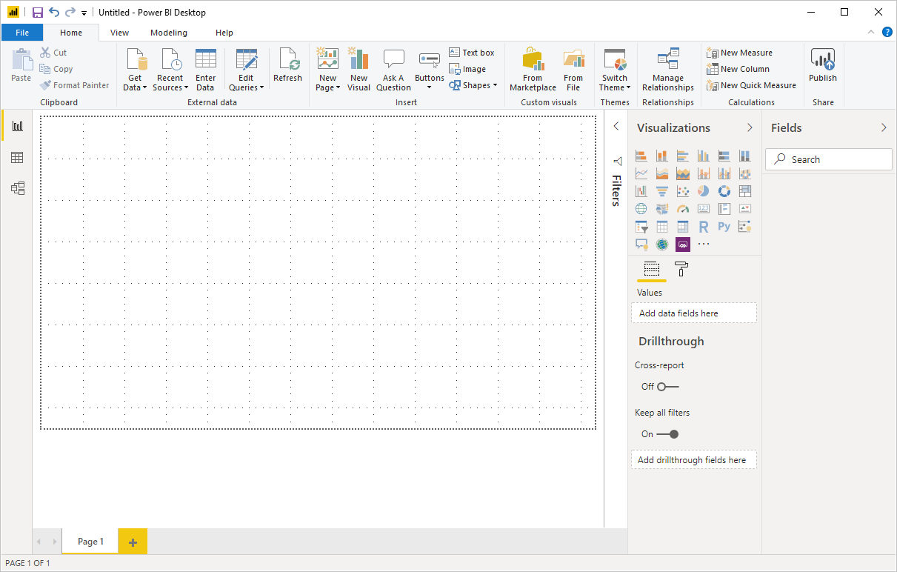
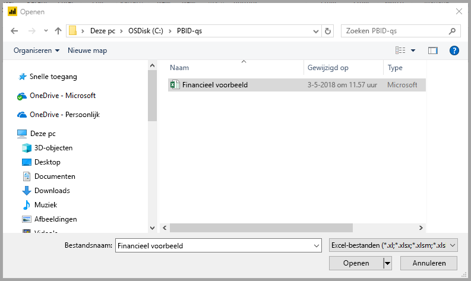

# Snelstart: Verbinding maken met gegevens in Power BI Desktop

In deze snelstart maakt u verbinding met gegevens met behulp van Power BI Desktop. Dit is de eerste stap in het bouwen van gegevensmodellen en het maken van rapporten.

Als u zich niet hebt geregistreerd voor Power BI, kunt u zich hier [aanmelden voor een gratis proefversie](https://app.powerbi.com/signupredirect?pbi_source=web) voordat u begint.

## Vereisten

U hebt de volgende resources nodig om de stappen in dit artikel uit te voeren:

* Download en installeer Power BI Desktop. Dit is een gratis toepassing die wordt uitgevoerd op uw lokale computer. U kunt [Power BI Desktop](https://powerbi.microsoft.com/desktop) rechtstreeks downloaden of u kunt de toepassing downloaden vanuit [de Microsoft Store](https://aka.ms/pbidesktopstore).
* [Download deze Excel-voorbeeldwerkmap](https://go.microsoft.com/fwlink/?LinkID=521962) en maak een map met de naam *C:\PBID-qs* waar u het Excel-bestand kunt opslaan. Bij latere stappen in deze snelstart wordt ervan uitgegaan dat dit de bestandslocatie is voor de gedownloade Excel-werkmap.
* Voor veel gegevensconnectors in Power BI Desktop is Internet Explorer 10 (of nieuwer) vereist voor verificatie.

## Power BI Desktop starten

Zodra u Power BI Desktop installeert, start u de toepassing zodat deze wordt uitgevoerd op de lokale computer. U ziet een Power BI-zelfstudie. Volg de zelfstudie of sluit het dialoogvenster om met een leeg canvas te beginnen. Op het canvas kunt u visuals en rapporten maken op basis van uw gegevens.

## Verbinding maken met gegevens

Met Power BI Desktop kunt u verbinding maken met veel verschillende typen gegevens. Deze bronnen zijn onder andere basisgegevensbronnen, zoals een Microsoft Excel-bestand. U kunt verbinding maken met onlineservices die allerlei soorten gegevens bevatten, zoals Salesforce, Microsoft Dynamics, Azure Blob Storage en nog veel meer.

Als u verbinding wilt maken met gegevens, selecteert u **Gegevens ophalen** op het lint **Start**.

Het venster **Gegevens ophalen** wordt weergegeven. U kunt kiezen uit veel verschillende gegevensbronnen waarmee Power BI Desktop verbinding kan maken. In deze snelstart gebruikt u de Excel-werkmap die u hebt gedownload bij [Vereisten](#prerequisites).

Aangezien deze gegevensbron een Excel-bestand is, selecteert u **Excel** in het venster **Gegevens ophalen**. Vervolgens selecteert u de knop **Verbinden**.

U wordt gevraagd om de locatie op te geven van het Excel-bestand waarmee verbinding moet worden gemaakt. Het gedownloade bestand wordt *Financieel voorbeeld* genoemd. Selecteer dat bestand en selecteer vervolgens **Openen**.

Vervolgens wordt de werkmap geladen in Power BI Desktop en de inhoud ervan gelezen. Hierna worden de beschikbare gegevens in het bestand weergegeven in het venster **Navigator**. In dat venster kunt u kiezen welke gegevens u in Power BI Desktop wilt laden. Selecteer de tabellen door de selectievakjes in te schakelen naast de tabellen die u wilt importeren. Importeer beide beschikbare tabellen.

Zodra u de selecties hebt gemaakt, selecteert u **Laden** om de gegevens te laden in Power BI Desktop.

## Gegevens weergeven in het deelvenster Velden

Zodra u de tabellen hebt geladen, worden de gegevens weergegeven in het deelvenster **Velden**. U kunt elke tabel uitvouwen door het pijltje naast de naam van de tabel te selecteren. In de volgende afbeelding is de tabel *financiën*uitgevouwen, waardoor alle velden worden weergegeven.

Dat is alles. U hebt verbinding gemaakt met de gegevens in Power BI Desktop, de gegevens geladen en nu ziet u alle beschikbare velden in deze tabellen.

## Volgende stappen

U kunt verschillende dingen doen met Power BI Desktop zodra u verbinding hebt gemaakt met gegevens. U kunt bijvoorbeeld visuals en rapporten maken. Bekijk de volgende resource om u te helpen aan de slag te gaan:

* [Aan de slag met Power BI Desktop](../fundamentals/desktop-getting-started.md)
