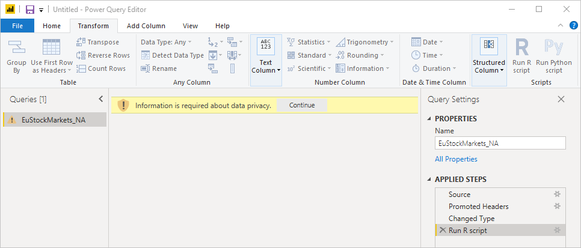
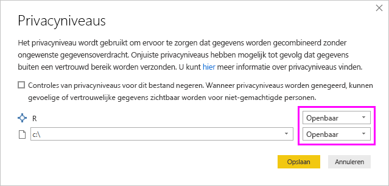
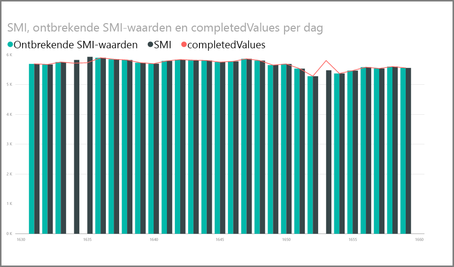
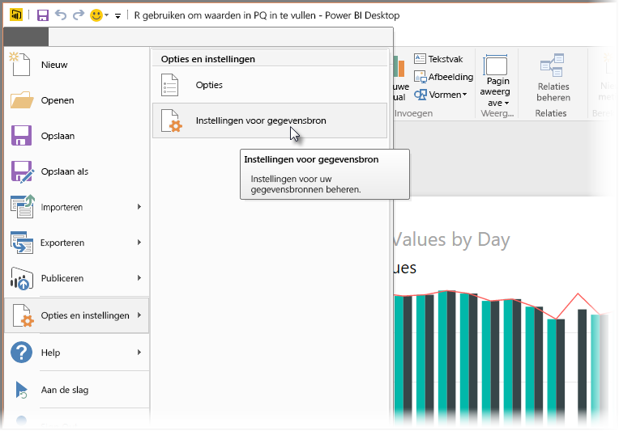
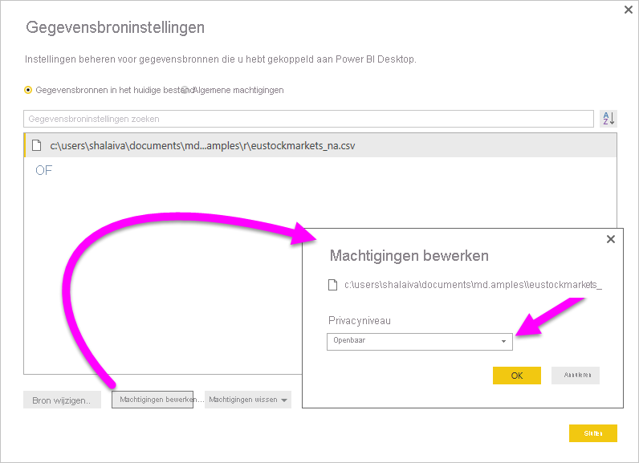

# <a name="use-r-in-power-query-editor"></a>R gebruiken in Power Query-editor

[De taal R](https://mran.microsoft.com/documents/what-is-r) is een krachtige computertaal die veel statistici, gegevenswetenschappers en gegevensanalisten gebruiken. U kunt R in Power Query-editor van Power BI Desktop gebruiken om het volgende te doen:

* Gegevensmodellen voorbereiden.

* Rapporten maken.

* Gegevens opschonen, geavanceerde data shaping en gegevenssetanalyse, waaronder aanvulling van ontbrekende gegevens, voorspellingen, clustering en meer.  

## <a name="install-r"></a>R installeren

U kunt R gratis downloaden van de [Revolution R Open-downloadpagina](https://mran.revolutionanalytics.com/download/) en de [CRAN-opslagplaats](https://cran.r-project.org/bin/windows/base/).

## <a name="install-mice"></a>mice installeren

Een vereiste is dat u de [mice-bibliotheek](https://www.rdocumentation.org/packages/mice/versions/3.5.0/topics/mice) installeert in uw R-omgeving. Zonder mice werkt de code van het voorbeeldscript niet goed. Met het mice-pakket implementeert u een methode om met ontbrekende gegevens om te gaan.

De mice-bibliotheek installeren:

1. Start het programma R.exe (bijvoorbeeld C:\Program Files\Microsoft\R Open\R-3.5.3\bin\R.exe).  

2. Voer de installatieopdracht uit vanaf de R-prompt:

   ``` 
   install.packages('mice') 
   ```

## <a name="use-r-in-power-query-editor"></a>R gebruiken in Power Query-editor

We demonstreren het gebruik van R in Power Query-editor door een voorbeeldset met beursgegevens in een CSV-bestand te gebruiken en de volgende stappen te doorlopen:

1. [Download het bestand EuStockMarkets_NA.csv](https://download.microsoft.com/download/F/8/A/F8AA9DC9-8545-4AAE-9305-27AD1D01DC03/EuStockMarkets_NA.csv). Vergeet niet waar u dit opslaat.

1. Laad het bestand in Power BI Desktop. Selecteer op het tabblad **Start** **Gegevens ophalen** > **Tekst/CSV**.

   

1. Selecteer het bestand EuStockMarkets_NA.csv en kies **Openen**. De CSV-gegevens worden weergegeven in het dialoogvenster **Tekst-/CSV-bestand**.

   

1. Selecteer **Laden** om de gegevens in het bestand te laden. Nadat Power BI de gegevens heeft geladen, wordt de nieuwe tabel weergegeven in het deelvenster **Velden**.

   

1. U opent Query-editor door op het lint **Start** de optie **Query's bewerken** te selecteren.

   

1. Op het tabblad **Transformeren** selecteert u **R-script uitvoeren**. De editor **R-script uitvoeren** wordt weergegeven. In de rijen 15 en 20 ontbreken gegevens, net als in andere rijen die u niet in de afbeelding kunt zien. In de volgende stappen ziet u hoe deze rijen in R worden aangevuld.

   

1. Voor dit voorbeeld voert u de volgende scriptcode in het vak **Script** in van het venster **R-script uitvoeren**. Zorg ervoor dat u *&lt;Uw bestandspad&gt;* vervangt door het pad naar EuStockMarkets_NA.csv in uw lokale bestandssysteem, bijvoorbeeld C:/Users/John Doe/Documents/Microsoft/EuStockMarkets_NA.csv.

    ```r
       dataset <- read.csv(file="<Your File Path>/EuStockMarkets_NA.csv", header=TRUE, sep=",")
       library(mice)
       tempData <- mice(dataset,m=1,maxit=50,meth='pmm',seed=100)
       completedData <- complete(tempData,1)
       output <- dataset
       output$completedValues <- completedData$"SMI missing values"
    ```

    > [!NOTE]
    > Mogelijk moet u een variabele met de naam *output* overschrijven om de nieuwe gegevensset met de toegepaste filters op de juiste manier te maken.

7. Selecteer **OK**. Power Query-editor geeft een waarschuwing over de privacy van gegevens weer.

   
8. Selecteer **Doorgaan** in het waarschuwingsbericht. In het dialoogvenster **Privacyniveaus** dat wordt weergegeven, stelt u alle gegevensbronnen in op **Openbaar** zodat de R-scripts goed werken in de Power BI-service. 

   

   Zie [Power BI Desktop-privacyniveaus](../admin/desktop-privacy-levels.md) voor meer informatie over privacy-instellingen en de implicaties ervan.

 9. Selecteer **Opslaan** om het script uit te voeren. 

   U ziet een nieuwe kolom in het deelvenster **Velden** met de naam **completedValues**. In deze kolom ontbreken een aantal gegevenselementen, bijvoorbeeld in rijen 15 en 18. Bekijk in het volgende gedeelte hoe R hiermee omgaat.

   Met slechts vijf regels R-script kan Power Query-editor de ontbrekende waarden invullen met behulp van een voorspellend model.

## <a name="create-visuals-from-r-script-data"></a>Visuals maken van R-scriptgegevens

We kunnen nu een visual maken om te zien hoe de R-scriptcode met de mice-bibliotheek de ontbrekende waarden voltooit.



U kunt alle voltooide visuals in één PBIX-bestand van Power BI Desktop opslaan en het gegevensmodel en de bijbehorende R-scripts gebruiken in de Power BI-service.

> [!NOTE]
> U kunt [een PBIX-bestand downloaden](https://download.microsoft.com/download/F/8/A/F8AA9DC9-8545-4AAE-9305-27AD1D01DC03/Complete%20Values%20with%20R%20in%20PQ.pbix) wanneer al deze stappen zijn voltooid.

Wanneer u het PBIX-bestand hebt geüpload naar de Power BI-service, moet u extra stappen uitvoeren om vernieuwing van de servicegegevens en bijgewerkte visuals in te schakelen:  

* **Geplande vernieuwing inschakelen voor de gegevensset**: Zie [Een geplande vernieuwing configureren](refresh-scheduled-refresh.md) als u geplande vernieuwing wilt inschakelen voor de werkmap waarin uw gegevensset met R-scripts staat. Dit artikel bevat ook informatie over persoonlijke gateways.

* **Een persoonlijke gateway installeren**: Er moet een persoonlijke gateway zijn geïnstalleerd op de computer waarop het bestand en R zich bevinden. Die werkmap wordt geopend en alle bijgewerkte visuals worden weergegeven in de Power BI-service. Zie [Persoonlijke gateways gebruiken in Power BI](service-gateway-personal-mode.md) voor meer informatie.

## <a name="limitations"></a>Beperkingen

Er gelden enkele beperkingen voor query's met R-scripts die zijn gemaakt in Power Query-editor:

* Alle R-gegevensbroninstellingen moeten zijn ingesteld op **Openbaar**. Alle andere stappen in de Power Query-editor-query moeten ook openbaar zijn. 

   Om de gegevensbroninstellingen te openen, selecteert u in Power BI Desktop de optie **Bestand** > **Opties en instellingen** > **Instellingen voor gegevensbron**.

   

   Selecteer in het dialoogvenster **Instellingen voor gegevensbron** een of meer gegevensbronnen en selecteer vervolgens **Machtigingen bewerken**. Stel het **Privacyniveau** in op **Openbaar**.

     
  
* Om een vernieuwing van uw R-visuals of gegevensset te plannen, schakelt u geplande vernieuwing in en installeert u een persoonlijke gateway op de computer waarop de werkmap en R zich bevinden. 

Er zijn veel verschillende dingen die u met R en aangepaste query's kunt doen. Verken en vorm uw gegevens precies zoals u ze wilt weergeven.

## <a name="next-steps"></a>Volgende stappen

* [Inleiding tot R](https://mran.microsoft.com/documents/what-is-r) 

* [R-scripts uitvoeren in Power BI Desktop](desktop-r-scripts.md) 

* [Gebruik een externe R IDE met Power BI](desktop-r-ide.md) 

* [Visuals maken met R-pakketten in de Power BI-service](service-r-packages-support.md)
