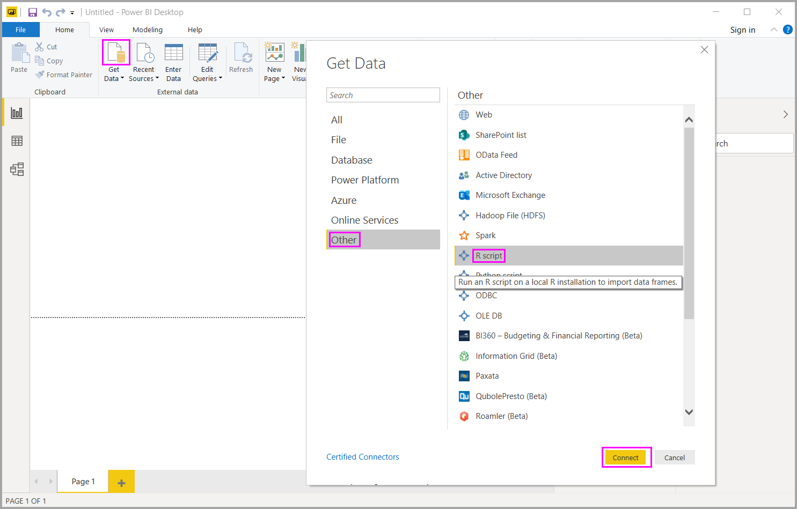
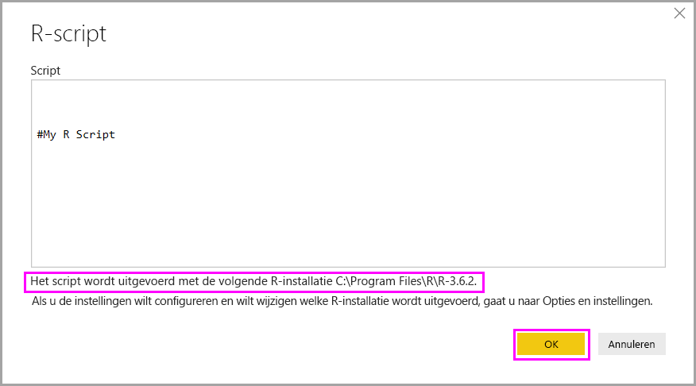
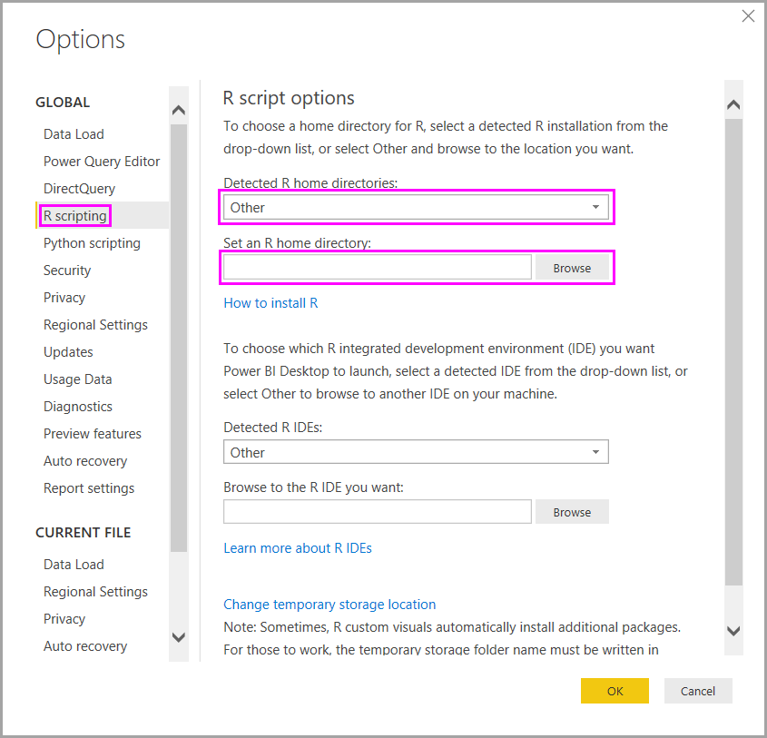

# R-scripts uitvoeren in Power BI Desktop

U kunt R-scripts rechtstreeks in Power BI Desktop uitvoeren en de resulterende gegevenssets importeren in een Power BI Desktop-gegevensmodel.

## R installeren

Als u R-scripts wilt uitvoeren in Power BI Desktop, moet u R afzonderlijk installeren op de lokale computer. U kunt R gratis downloaden en installeren vanaf tal van locaties, waaronder het [Microsoft R-toepassingsnetwerk](https://mran.revolutionanalytics.com/download/) en de [CRAN-opslagplaats](https://cran.r-project.org/bin/windows/base/). In de huidige release worden Unicode-tekens en spaties (lege tekens) in het installatiepad ondersteund.

## R-scripts uitvoeren

Met behulp van slechts enkele stappen in Power BI Desktop kunt u R-scripts uitvoeren en een gegevensmodel maken. Met het gegevensmodel kunt u rapporten maken en deze delen in de Power BI-service. R-scripts in Power BI Desktop bieden nu ondersteuning voor getalnotaties met decimalen (,) en punten (.).

### R-scripts voorbereiden

Als u een R-script wilt uitvoeren in Power BI Desktop, maakt u het script in uw lokale omgeving voor R-ontwikkeling en controleert u of het foutloos wordt uitgevoerd.

Als u het script wilt uitvoeren in Power BI Desktop, dient u ervoor te zorgen dat het foutloos in een nieuwe en ongewijzigde werkruimte wordt uitgevoerd. Deze vereiste betekent dat alle pakketten en afhankelijkheden expliciet moeten worden geladen en uitgevoerd. U kunt `source()` gebruiken om afhankelijke scripts uit te voeren.

Als u een R-script voorbereidt en uitvoert in Power BI Desktop, gelden er enkele beperkingen:

* Omdat alleen gegevensframes worden geïmporteerd, moet u niet vergeten om de gegevens die u wilt importeren in Power BI, weer te geven in een gegevensframe.
* Kolommen van het type Complex of Vector worden niet geïmporteerd, maar in de gemaakte tabel vervangen door foutwaarden.
* In Power BI Desktop worden waarden die `N/A` zijn, vertaald naar `NULL`-waarden.
* Als een R-script langer dan dertig minuten wordt uitgevoerd, treedt er een time-out op.
* Bij interactieve aanroepen in het R-script, zoals het wachten op gebruikersinvoer, wordt het uitvoeren van het script onderbroken.
* Als de werkmap in het R-script wordt ingesteld, *moet* u een volledig pad naar de werkmap definiëren in plaats van een relatief pad.

### R-script uitvoeren en gegevens importeren

Nu kunt u het R-script uitvoeren om gegevens te importeren in Power BI Desktop:

1. Selecteer in Power BI Desktop de optie **Gegevens ophalen**, kies **Overig** > **R-script**, en selecteer vervolgens **Verbinding maken**:

    

2. Als R is geïnstalleerd op de lokale computer, kopieert u het script eenvoudig naar het scriptvenster, en selecteert u **OK**. De meest recent geïnstalleerde versie wordt weergegeven als de R-engine.

    

3. Selecteer **OK** om het R-Script uit te voeren. Wanneer het script wordt uitgevoerd, kunt u vervolgens de resulterende gegevensframes toevoegen aan het Power BI-model.

U kunt bepalen welke R-installatie moet worden gebruikt om het script uit te voeren. Als u de instellingen voor de R-installatie wilt opgeven, kiest u **Bestand** > **Opties en instellingen** > **Opties**. Selecteer vervolgens **R-script**. In de vervolgkeuzelijst **Gedetecteerde R-basismappen** onder **Opties voor R-script** worden uw huidige R-installatiekeuzen weergegeven. Als de gewenste R-installatie niet wordt vermeld, kiest u **Overig** en bladert u vervolgens naar de gewenste R-installatiemap in **Een R-basismap instellen**.

### Refresh

U kunt een R-script in Power BI Desktop vernieuwen. Als u een R-script vernieuwt, wordt het R-script opnieuw uitgevoerd in de Power BI Desktop-omgeving.

## Volgende stappen

Raadpleeg de volgende aanvullende informatie over R in Power BI.

* [Power BI-visuals maken met R](../create-reports/desktop-r-visuals.md)
* [Gebruik een externe R IDE met Power BI](desktop-r-ide.md)
