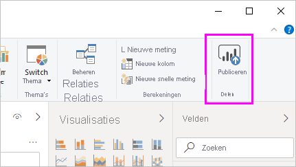
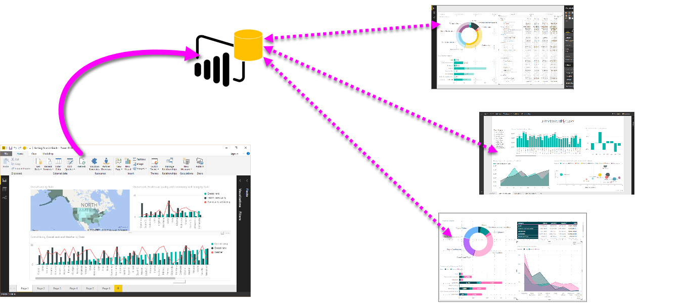
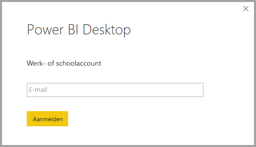
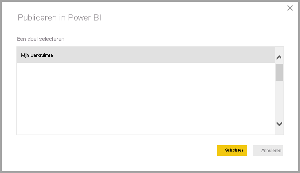
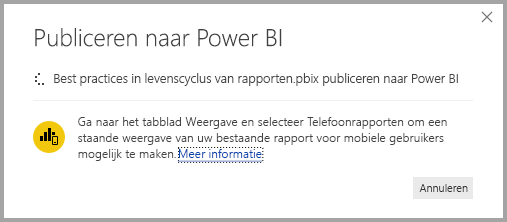
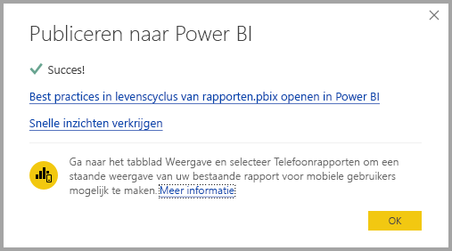
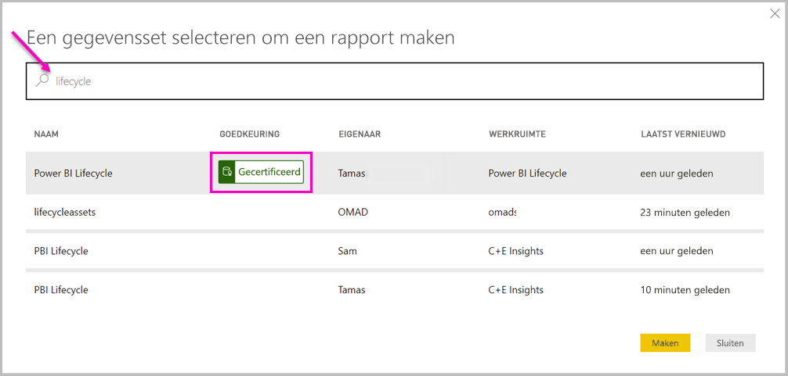

# Verbinding maken met gegevenssets in de Power BI-service vanuit Power BI Desktop

U kunt een live verbinding maken met een gedeelde gegevensset in de *Power BI-service* en veel verschillende rapporten maken op basis van dezelfde gegevensset. Dit betekent dat u in Power BI Desktop een perfect gegevensmodel kunt maken en dit kunt publiceren naar de Power BI-service. Vervolgens kunnen u en anderen in afzonderlijke *.pbix*-bestanden meerdere verschillende rapporten op basis van hetzelfde algemene gegevensmodel maken en deze opslaan in verschillende werkruimten. Deze functie heet *Live-verbinding met Power BI-service*.

Deze functie heeft allerlei voordelen, waaronder best practices, die we in dit artikel bespreken. U wordt aangeraden de [overwegingen en beperkingen](#limitations-and-considerations) van deze functie door te nemen.

## Een liveverbinding met de Power BI-service gebruiken voor het beheren van de levenscyclus van rapporten

Eén uitdaging waar de populariteit van Power BI toe leidt is de proliferatie van rapporten, dashboards en de onderliggende gegevensmodellen ervan. Het is gemakkelijk om overtuigende rapporten te maken in Power BI Desktop, deze rapporten te [publiceren](../create-reports/desktop-upload-desktop-files.md) in de Power BI-service, en geweldige dashboards te maken op basis van deze gegevenssets. Omdat zoveel mensen dit deden, vaak met (bijna) dezelfde gegevenssets, werd het een uitdaging om erachter te komen welk rapport op welke gegevensset was gebaseerd, en hoe recent elke gegevensset was. De live-verbinding met de Power BI-service pakt deze uitdaging op en maakt het delen, maken en uitbreiden van rapporten en dashboards op basis van gemeenschappelijke gegevenssets gemakkelijker en consistent.

### Maak een gegevensset die iedereen kan gebruiken, en deel deze

Stel dat Anna een bedrijfsanalist in uw team is. Anna is bekwaam bij het maken van goede gegevensmodellen, vaak gegevenssets genoemd. Dankzij haar expertise kan Anna een gegevensset en rapport maken, en dat rapport vervolgens delen in de Power BI-service.

Iedereen houdt van Anna’s rapport en gegevensset. Op dit punt zouden de problemen beginnen. Iedereen in Anna's team zou proberen *een eigen versie* van die gegevensset te maken en zijn of haar eigen rapporten met het team te delen. Opeens zou er een groot aantal rapporten van verschillende gegevenssets in de werkruimte van uw team in de Power BI-service zijn. Welk ervan was het meest recent? Waren de gegevenssets hetzelfde, of alleen bijna hetzelfde? Wat waren de verschillen? Met de functie Live-verbinding met Power BI-service kan dat allemaal ten goede veranderen. In de volgende sectie ziet u hoe anderen de gepubliceerde gegevensset van Anna voor hun eigen rapporten in hun eigen werkruimten kunnen gebruiken, en hoe iedereen dezelfde solide, goedgekeurde, gepubliceerde gegevensset kan gebruiken om eigen unieke rapporten samen te stellen.

### Verbinding maken met een gegevensset van Power BI-service via een liveverbinding

Anna maakt een rapport en maakt de gegevensset waarop dit is gebaseerd. Anna publiceert deze vervolgens naar de Power BI-service. Het rapport wordt weergegeven in de werkruimte van het team in de Power BI-service. Als Anna het rapport opslaat in een *werkruimte voor nieuwe ervaringen*. Kan Anna de *Build-machtiging* instellen zodat het rapport door iedereen in en buiten hun werkruimte kan worden bekeken en gebruikt.

Zie [werkruimten](../collaborate-share/service-new-workspaces.md) voor meer informatie over de werkruimten van de nieuwe ervaring.

Andere leden van haar werkruimte kunnen nu een live-verbinding maken met het gedeelde gegevensmodel van Anna met behulp van de functie Live-verbinding met Power BI-service. Ze kunnen hun eigen unieke rapporten maken op basis van *hun oorspronkelijke gegevensset* in *hun eigen werkruimtes voor nieuwe ervaringen*.

In de volgende afbeelding ziet u hoe Anna één Power BI Desktop-rapport maakt en het publiceert (met inbegrip van het gegevensmodel ervan) naar de Power BI-service. Vervolgens kunnen anderen verbinding maken met Anna's gegevensmodel via de live-verbinding met de Power BI-service en hun eigen unieke rapporten in hun eigen werkruimten maken op basis van Anna's gegevensset.

> [!NOTE]
> Als u uw gegevensset opslaat in een [klassieke gedeelde werkruimte](../collaborate-share/service-create-workspaces.md), kunnen alleen leden van die werkruimte rapporten op basis van uw gegevensset maken. Als u een liveverbinding met de Power BI-service wilt maken, moet de gegevensset waarmee u verbinding wilt maken zich in een gedeelde werkruimte bevinden waarvan u lid bent.
> 
> 

## Stapsgewijze aanwijzingen voor het gebruik van de live-verbinding met de Power BI-service

Nu we weten hoe nuttig de live-verbinding met de Power BI-service is en hoe u deze kunt gebruiken als best-practice-benadering voor het beheren van de levenscyclus van rapporten, gaan we de stappen eens bekijken waarmee we van Anna's fantastische rapport (en gegevensset) naar een gedeelde gegevensset gaan die haar teamgenoten met Power BI kunnen gebruiken.

### Een Power BI-rapport en gegevensset publiceren

De eerste stap bij het beheren van de levenscyclus van een rapport met behulp van een live-verbinding met de Power BI-service is het hebben van een rapport met gegevensset dat teamleden willen gebruiken. Anna moet het rapport dus eerst *publiceren* vanuit Power BI Desktop. Selecteer de optie **Publiceren** in het lint **Start** van Power BI Desktop.

Als Anna niet is aangemeld bij het Power BI-serviceaccount, wordt Anna door Power BI gevraagd dit te doen.

Van daaruit kan Anna de werkruimte kiezen waarnaar het rapport en de gegevensset worden gepubliceerd. Vergeet niet dat wanneer Anna het rapport opslaat in een werkruimte van de nieuwe ervaring, iedereen met de machtiging Samenstellen toegang tot die gegevensset heeft. De machtiging Samenstellen wordt na de publicatie ingesteld in de Power BI-service. Als werk wordt opgeslagen in een klassieke werkruimte, hebben alleen leden die toegang hebben tot de werkruimte waarin een rapport wordt gepubliceerd, toegang tot de gegevensset met behulp van een live-verbinding met de Power BI-service.

Het publicatieproces begint, en Power BI Desktop laat de voortgang zien.

Wanneer het klaar is, laat Power BI Desktop u zien dat het gelukt is, en geeft u enkele koppelingen naar het rapport zelf in de Power BI-service en een koppeling naar snelle inzichten over het rapport.

Nu u een rapport met een gegevensset in de Power BI-service hebt, kunt u het ook *promoveren*. Promotie betekent dat u de kwaliteit en betrouwbaarheid ervan aantoont. U kunt zelfs aanvragen dat het wordt *gecertificeerd* door een centrale instantie in uw Power BI-tenant. In elk van deze beide gevallen wordt uw gegevensset altijd bovenaan de lijst weergegeven wanneer mensen op zoek zijn naar gegevenssets. Zie [Uw gegevensset promoveren](service-datasets-promote.md) voor meer informatie.

De laatste stap is het instellen van de Build-machtiging voor de gegevensset waarop het rapport is gebaseerd. Met de machtiging Samenstellen wordt bepaald wie uw gegevensset kan zien en gebruiken. U kunt deze in de werkruimte zelf instellen of wanneer u een app vanuit de werkruimte deelt. Zie [Build-machtiging voor gedeelde gegevenssets](service-datasets-build-permissions.md)voor meer informatie.

Laten we nu eens kijken hoe andere teamgenoten die toegang hebben tot de werkruimte waar het rapport en de gegevensset zijn gepubliceerd, verbinding kunnen maken met de gegevensset en hun eigen rapporten maken.

### Breng een liveverbinding met de Power BI-service tot stand

Als u verbinding wilt maken met het gepubliceerde rapport en een eigen rapport wilt maken op basis van de gepubliceerde gegevensset, selecteert u **Gegevens ophalen** in het lint **Start** van Power BI Desktop, selecteert u **Power Platform** in het linkervenster en vervolgens **Power BI-gegevenssets**.

Als u niet bent aangemeld, wordt u door Power BI gevraagd u aan te melden. Als Power BI eenmaal is aangemeld, ziet u de werkruimten waarvan u lid bent. U kunt selecteren welke werkruimte de gegevensset bevat waarvoor u een Power BI-service live-verbinding wilt maken.

De gegevenssets in de lijst zijn alle gedeelde gegevenssets waarvoor u de machtiging Samenstellen in elke werkruimte hebt. U kunt een specifieke gegevensset zoeken en de naam en de eigenaar van de gegevensset weergeven. Ook kunt u bekijken in welke werkruimte de gegevensset zich bevindt en wanneer deze voor het laatst is vernieuwd. U ziet ook de **GOEDKEURINGEN** voor gegevenssets, ofwel gecertificeerd of gepromoveerd, bovenaan de lijst.

Wanneer u **Aanmaken** selecteert, brengt u een live-verbinding tot stand met de geselecteerde gegevensset. Power BI Desktop laadt de velden en de waarden die u in realtime in Power BI Desktop ziet.

Nu kunnen u en anderen aangepaste rapporten maken en delen, op basis van dezelfde gegevensset. Deze aanpak is een uitstekende manier om één kennispersoon een goed opgemaakte gegevensset te laten maken, zoals wat Anna doet. Veel teamleden kunnen die gedeelde gegevensset gebruiken om hun eigen rapporten te maken.

## Beperkingen en overwegingen

Wanneer u de liveverbinding met de Power BI-service gebruikt, zijn er enkele beperkingen en overwegingen waarmee u rekening moet houden.

* Alleen gebruikers met de machtiging Samenstellen voor een gegevensset kunnen verbinding maken met een gepubliceerde gegevensset met de liveverbinding met de Power BI-service.
* Gebruikers van gratis versies zien alleen gegevenssets in **Mijn werkruimte** en in Premium-werkruimten.
* Omdat deze verbinding een live-verbinding is, zijn de navigatie en het model van links uitgeschakeld. U kunt per rapport maar met één gegevensset verbinding maken. Dit gedrag is vergelijkbaar met het gedrag wanneer er verbinding is met *SQL Server Analysis Services*.
* Omdat deze verbinding een live-verbinding is, wordt beveiliging op rijniveau (RLS) en ander vergelijkbaar gedrag van de verbinding afgedwongen. Dit is hetzelfde als wanneer er verbinding is met SQL Server Analysis Services.
* Als de eigenaar het oorspronkelijke gedeelde *.pbix*-bestand wijzigt, worden de gegevensset en het rapport dat wordt gedeeld in de Power BI-service overschreven. Rapporten op basis van die gegevensset worden niet overschreven, maar eventuele wijzigingen in de gegevensset worden in het rapport doorgevoerd.
* Leden van een werkruimte kunnen het oorspronkelijk gedeelde rapport niet vervangen. Pogingen daartoe resulteren in een waarschuwing waarin u wordt gevraagd het bestand een andere naam te geven en het te publiceren.
* Als u de gedeelde gegevensset in de Power BI-service verwijdert, werken andere rapporten op basis van die gegevensset niet meer goed of worden de visuals van de gegevensset niet meer weergegeven.
* Voor Inhoudspakketten moet u eerst een kopie van een inhoudspakket maken voordat u het gebruikt als basis voor het delen van een *.pbix*-rapport en gegevensset met de Power BI service.
* Nadat de Inhoudspakketten van *Mijn organisatie* zijn gekopieerd, kunt u het rapport dat op de service is gemaakt en/of een rapport dat is gemaakt bij het kopiëren van een Inhoudspakket met een live-verbinding niet meer vervangen. Pogingen daartoe resulteren in een waarschuwing waarin u wordt gevraagd het bestand een andere naam te geven en het te publiceren. In dit geval kunt u alleen gepubliceerde live gekoppelde rapporten vervangen.
* Wanneer u een gedeelde gegevensset in de Power BI-service verwijdert, heeft niemand meer toegang tot die gegevensset vanuit Power BI Desktop.
* Rapporten waarin een gegevensset op de Power BI-service wordt gedeeld, bieden geen ondersteuning voor geautomatiseerde implementaties met de REST-API van Power BI.
