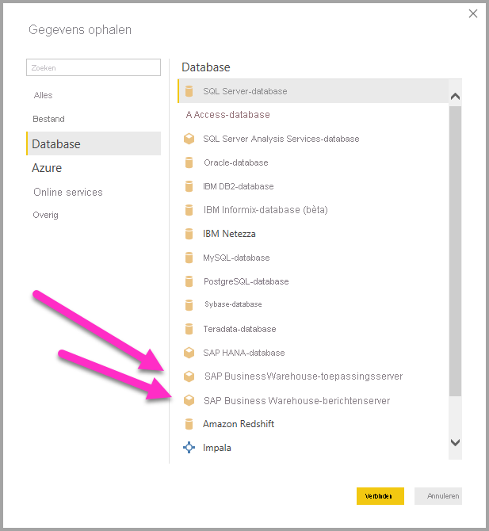
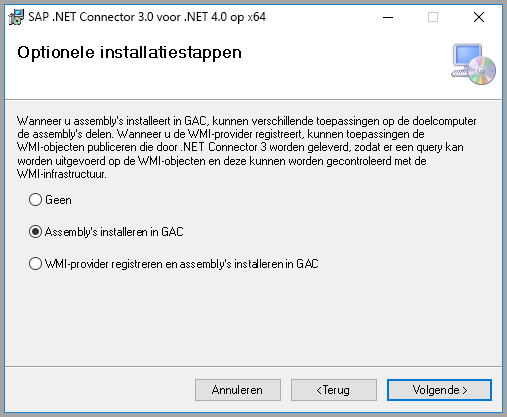
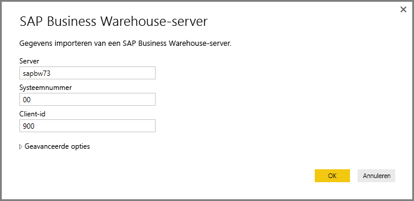
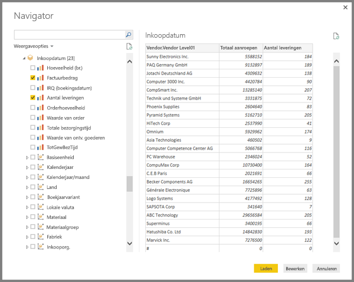
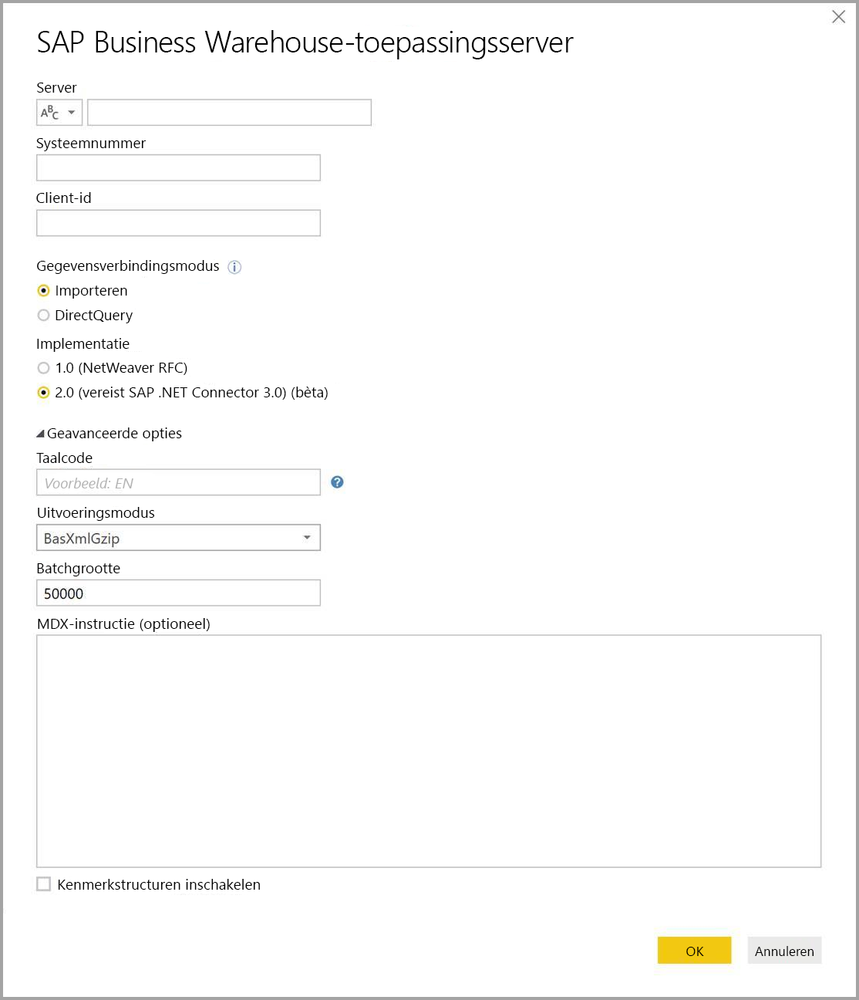
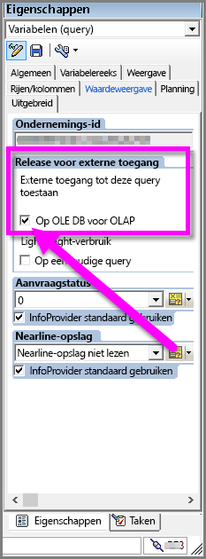

# <a name="use-the-sap-business-warehouse-connector-in-power-bi-desktop"></a>De SAP Business Warehouse-connector in Power BI Desktop gebruiken

Met Power BI Desktop hebt u toegang tot gegevens van *SAP Business Warehouse (BW)* .

Raadpleeg het [Whitepaper over Power BI en SAP BW](https://aka.ms/powerbiandsapbw) voor informatie over hoe SAP-klanten kunnen profiteren van de koppeling tussen Power BI en hun bestaande SAP BW-systemen. Zie [DirectQuery en SAP Business Warehouse (BW)](desktop-directquery-sap-bw.md) voor meer informatie over het gebruik van DirectQuery met SAP BW.

Vanaf de release van juni 2018 van Power BI Desktop (en algemeen beschikbaar vanaf de release van oktober 2018) kunt u de *SAP BW*-connector gebruiken. Er zijn belangrijke verbeteringen aangebracht in de prestaties en mogelijkheden. Microsoft heeft de SAP BW-connector *Implementation 2.0* ontwikkeld. U kunt versie 1 van de SAP BW-connector of de Implementation 2.0 SAP-connector selecteren. In de volgende gedeelten wordt voor elke versie beschreven hoe de installatie in zijn werk gaat. U kunt een van beide connectors kiezen wanneer u vanuit Power BI Desktop verbinding maakt met SAP BW.

Wij stellen voor om waar mogelijk gebruik te maken van de Implementation 2.0 SAP-connector.

## <a name="installation-of-version-1-of-the-sap-bw-connector"></a>Installatie van versie 1 van de SAP BW-connector

Het wordt aangeraden om waar mogelijk gebruik te maken van de Implementation 2.0 SAP-connector. In deze sectie wordt de installatie van versie 1 van de SAP BW-connector beschreven.

1. Installeer de *SAP NetWeaver*-bibliotheek op uw lokale computer. U kunt de SAP Netweaver-bibliotheek bij uw SAP-beheerder verkrijgen of rechtstreeks uit het [SAP Software Download Center](https://support.sap.com/swdc) downloaden. Omdat de indeling van het SAP Software Download Center vaak verandert, is er geen specifiekere richtlijnen beschikbaar voor de navigatie op die site. De SAP NetWeaver-bibliotheek is meestal ook opgenomen in de hulpprogramma's voor installatie van de SAP-client.

   U kunt zoeken naar *SAP Note #1025361* voor informatie over de downloadlocatie van de meest recente versie. Zorg ervoor dat de architectuur voor de SAP NetWeaver-bibliotheek (32-bits of 64-bits) overeenkomt met uw Power BI Desktop-installatie. Installeer alle bestanden die zijn opgenomen in de *SAP NetWeaver RFC SDK* volgens de SAP-opmerking.
2. In Power BI Desktop selecteert u **Gegevens ophalen**. Het dialoogvenster **Gegevens ophalen** bevat een vermelding voor *SAP Business Warehouse-toepassingsserver* en *SAP Business Warehouse-berichtenserver*.

   

## <a name="installation-of-implementation-20-sap-connector"></a>Installatie van de Implementation 2.0 SAP-connector

Voor Implementation 2.0 van de SAP-connector is de SAP .NET Connector 3.0 vereist. Er is een geldige S-gebruiker nodig om de download te kunnen uitvoeren. Neem contact op met uw SAP Basis-team om de SAP .NET-connector 3.0 op te halen.

U kunt de [SAP .NET connector 3.0](https://support.sap.com/en/product/connectors/msnet.html) downloaden van SAP.

De connector is verkrijgbaar in 32-bits en 64-bits versies. Kies de versie die overeenkomt met uw Power BI Desktop-toepassing. Op dit moment staan op de website twee versies vermeld voor .NET 4.0 Framework:

* De SAP-connector voor Microsoft .NET 3.0.22.0 voor Windows 32-bits (x86) als ZIP-bestand (6896 KB), 1 juni 2019
* De SAP-connector voor Microsoft .NET 3.0.22.0 voor Windows 64-bits (x64) als ZIP-bestand (7.180 KB), 1 juni 2019

Wanneer u installeert, controleert u in **Optionele installatiestappen** de optie *Assembly's installeren naar GAC*.



> [!NOTE]
> De eerste versie van SAP BW-implementatie vereiste NetWeaver-Dll's. Als u Implementation 2.0 van de SAP-connector gebruikt en niet de eerste versie, zijn de NetWeaver-Dll's niet vereist.

## <a name="version-1-sap-bw-connector-features"></a>Functies van versie 1 van de SAP BW-connector

Met versie 1 van de SAP BW-connector in Power BI Desktop kunt u gegevens importeren uit uw *SAP Business Warehouse Server*-kubussen, of u kunt DirectQuery gebruiken.

Lees voor meer informatie over de SAP BW-connector en hoe u deze kunt gebruiken met DirectQuery: [DirectQuery en SAP Business Warehouse (BW)](desktop-directquery-sap-bw.md).

U moet een **Server**, **Systeemnummer** en **Client-ID** opgeven om de verbinding tot stand te brengen.



U kunt ook twee extra **geavanceerde opties** opgeven: **Taalcode** en een aangepaste **MDX-instructie** om uit te voeren op de opgegeven server.


Als u geen MDX-instructie opgeeft, wordt in de verbindingsinstelling de lijst weergegeven met kubussen die beschikbaar zijn op de server. U kunt inzoomen en items selecteren in de beschikbare kubussen, inclusief dimensies en metingen. Power BI geeft de query's en kubussen weer die worden weergegeven door de [Open Analysis Interfaces](https://help.sap.com/saphelp_nw70/helpdata/en/d9/ed8c3c59021315e10000000a114084/content.htm).

Wanneer u een of meer items van de server selecteert, maakt het dialoogvenster Navigator een voorbeeld van de uitvoertabel gemaakt op basis van deze selectie.



Het dialoogvenster **Navigator** bevat ook weergaveopties:

* **Alleen geselecteerde items weergeven**. Standaard geeft **Navigator** alle items weer.  deze optie is handig voor het controleren van de definitieve set geselecteerde items. Een alternatieve methode om geselecteerde items weer te geven, is door de kolomnamen in het Preview-gebied te selecteren.
* **Voorbeelden van gegevens inschakelen**. Dit is de standaardwaarde. Previews van gegevens inschakelen. Het uitschakelen van previews van gegevens vermindert het aantal serveraanroepen omdat er geen gegevens meer worden aangevraagd voor de voorbeelden.
* **Technische namen**. SAP BW ondersteunt het principe van *technische namen* voor objecten in een kubus. Met technische namen kan de eigenaar van een kubus *gebruikersvriendelijke* namen weergeven voor kubusobjecten, in plaats van alleen de *fysieke namen* voor die objecten in de kubus weer te geven.


Nadat u alle benodigde objecten hebt geselecteerd, kunt u bepalen wat er moet gebeuren door een van de volgende opties te selecteren:

* Selecteer **Load** om de volledige set rijen voor de uitvoertabel in het Power BI Desktop-gegevensmodel te laden. De weergave **Rapport** wordt geopend. U kunt beginnen met het visualiseren van de gegevens of verdere wijzigingen aanbrengen met behulp van de weergaven **Gegevens** of **Relaties**.
* Selecteer **Bewerken** om de **Query-editor** te openen. Geef aanvullende gegevenstransformatie- en filterstappen op voordat de hele set rijen wordt geladen in het Power BI Desktop-gegevensmodel.

Naast het importeren van gegevens uit SAP BW-kubussen kunt u ook gegevens importeren uit een breed scala aan andere gegevensbronnen in Power BI Desktop. Vervolgens kunt u deze combineren tot één rapport. Dit geeft naast SAP BW-gegevens allerlei interessante scenario's voor rapportage en analyse.

## <a name="using-implementation-20-sap-bw-connector"></a>De Implementation 2.0 SAP BW-connector gebruiken

Maak een nieuwe verbinding voor het gebruik van Implementation 2.0 van de SAP BW-connector. Voer de volgende stappen uit om een nieuwe verbinding te maken.

1. Selecteer **Gegevens ophalen**. Selecteer u **SAP Business Warehouse**-toepassingsserver of **SAP Business Warehouse-berichtenserver** en maak verbinding.

2. Selecteer de implementatie in het dialoogvenster nieuwe verbinding. Het selecteren van **2.0** voor **Implementation**, zoals wordt weergegeven in de volgende afbeelding, schakelt de **Uitvoeringsmodus**, **Batchgrootte** en **Kenmerkende structuren** in.

    

3. Selecteer **OK**. Na dit punt is de ervaring hetzelfde als wordt beschreven in [Versie 1 SAP BW-connectorfuncties](#version-1-sap-bw-connector-features) voor de connector van Versie 1 SAP BW.

### <a name="new-options-for-implementation-20"></a>Nieuwe opties voor Implementation 2.0

Implementation 2.0 biedt ondersteuning voor de volgende opties:

* *ExecutionMode*: hiermee wordt aangegeven welke MDX-interface wordt gebruikt voor het uitvoeren van query's op de server. De volgende opties zijn geldig:

  * `SapBusinessWarehouseExecutionMode.BasXml`
  * `SapBusinessWarehouseExecutionMode.BasXmlGzip`
  * `SapBusinessWarehouseExecutionMode.DataStream`

    De standaardwaarde is `SapBusinessWarehouseExecutionMode.BasXmlGzip`.

    Met `SapBusinessWarehouseExecutionMode.BasXmlGzip` worden de prestaties mogelijk verbeterd als er sprake is van een hoge latentie bij grote gegevenssets.

* *BatchSize*: hiermee wordt aangegeven hoeveel rijen er maximaal in één keer worden opgehaald bij het uitvoeren van een MDX-instructie. Een klein aantal rijen wordt omgezet in meerdere aanroepen naar de server bij het ophalen van een grote gegevensset. Met een groot aantal rijen zijn de prestaties mogelijk beter, maar dit kan op de SAP BW-server leiden tot geheugenproblemen. De standaardwaarde is 50.000 rijen.

* *EnableStructures*: een logische waarde waarmee wordt aangegeven of kenmerkstructuren worden herkend. De standaardwaarde voor deze optie is false. Dit is van invloed op de lijst met objecten die kunnen worden geselecteerd. Niet ondersteund in de systeemeigen querymodus.

De optie *ScaleMeasures* is afgeschaft in deze implementatie. Het gedrag is nu hetzelfde als bij de instelling *ScaleMeasures* op False. Hierbij worden altijd ongeschaalde waarden weergegeven.

### <a name="additional-improvements-for-implementation-20"></a>Aanvullende verbeteringen voor Implementation 2.0

In de volgende lijst worden enkele van de aanvullende verbeteringen beschreven die deel uitmaken van de nieuwe implementatie:

* Verbeterde prestaties.
* De mogelijkheid om verschillende miljoenen rijen gegevens op te halen en af te stemmen via de parameter batchgrootte.
* De mogelijkheid om tussen uitvoeringsmodi te wisselen.
* Ondersteuning voor de gecomprimeerde modus. Dit is vooral nuttig voor verbindingen met een hoge latentie en grote gegevenssets.
* Verbeterde detectie van `Date`-variabelen.
* [Experimenteel] Geef `Date` (ABAP-type DATS)- en `Time` (ABAP-type TIMS)-dimensies weer als respectievelijk datums en tijden in plaats van tekstwaarden.
* Betere afhandeling van uitzonderingen. Fouten die optreden in BAPI-aanroepen worden nu zichtbaar.
* Kolommen inklappen in de modi BasXml en BasXmlGzip. Als met de gegenereerde MDX-query bijvoorbeeld 40 kolommen worden opgehaald, maar er voor de huidige selectie maar 10 nodig zijn, wordt de aanvraag doorgegeven aan de server om een kleinere gegevensset op te halen.

### <a name="changing-existing-reports-to-use-implementation-20"></a>Bestaande rapporten wijzigen voor het gebruik van Implementation 2.0

Bestaande rapporten kunnen alleen worden gewijzigd voor het gebruik van Implementation 2.0 als de importeermodus is ingeschakeld. Volg deze stappen:

1. Open een bestaand rapport, selecteer **Query's bewerken** in het lint en selecteer vervolgens de SAP Business Warehouse-query die u wilt bijwerken.

1. Klik met de rechtermuisknop op de query en selecteer **Geavanceerde editor**.

1. Wijzig de `SapBusinessWarehouse.Cubes`-aanroep in de **Geavanceerde editor** als volgt:

    Bepaal of de query al een optierecord bevat, zoals in het volgende voorbeeld:

    

    Als dit het geval is, voegt u de optie `Implementation` 2.0 toe en verwijdert u de optie `ScaleMeasures`, indien aanwezig, zoals wordt weergegeven:

    

    Als de query nog geen optierecord bevat, voegt u het toe. Voor de volgende optie:

    

    Verandert u dit in:

    

Er is alles aan gedaan om Implementation 2.0 van de SAP BW-connector compatibel te maken met versie 1. Er kunnen echter verschillen zijn doordat er verschillende SAP BW MDX-uitvoeringsmodi worden gebruikt. U kunt eventuele verschillen verhelpen door een andere uitvoeringsmodus te selecteren.

## <a name="troubleshooting"></a>Problemen oplossen

Dit gedeelte bevat situaties waarin problemen worden opgelost (en oplossingen hiervoor) bij het werken met de SAP BW-connector.

1. Numerieke gegevens uit SAP BW retourneren decimale punten in plaats van komma's. Bijvoorbeeld: 1,000,000 wordt geretourneerd als 1.000.000.

   SAP BW retourneert decimale gegevens met ofwel een `,` (komma) of een `.` (punt) als decimaal teken. Om op te geven welke van beide SAP BW moet gebruiken voor het decimale scheidingsteken, roept het stuurprogramma dat wordt gebruikt door Power BI Desktop `BAPI_USER_GET_DETAIL` aan. Deze aanroep retourneert een structuur met de naam `DEFAULTS`, die een veld bevat met de naam `DCPFM` waarin *Decimale notatie* wordt opgeslagen. Eén van de volgende waarden wordt gebruikt:

   * ' ' (spatie) = Decimaal punt is een komma: N.NNN,NN
   * 'X' = decimaal teken is een punt: N,NNN.NN
   * 'Y' = decimaal punt is N NNN NNN,NN

   Klanten die dit probleem hebben gerapporteerd, hebben ondervonden dat de aanroep naar `BAPI_USER_GET_DETAIL` mislukt voor een bepaalde gebruiker (de gebruiker die de onjuiste gegevens weergeeft), en er een foutbericht wordt weergegeven dat vergelijkbaar is met het volgende bericht:

   ```xml
    You are not authorized to display users in group TI:
        <item>
            <TYPE>E</TYPE>
            <ID>01</ID>
            <NUMBER>512</NUMBER>
            <MESSAGE>You are not authorized to display users in group TI</MESSAGE>
            <LOG_NO/>
            <LOG_MSG_NO>000000</LOG_MSG_NO>
            <MESSAGE_V1>TI</MESSAGE_V1>
            <MESSAGE_V2/>
            <MESSAGE_V3/>
            <MESSAGE_V4/>
            <PARAMETER/>
            <ROW>0</ROW>
            <FIELD>BNAME</FIELD>
            <SYSTEM>CLNTPW1400</SYSTEM>
        </item>
   ```

   Om deze fout op te lossen, moeten gebruikers hun SAP-beheerder vragen om de SAPBW-gebruiker die wordt gebruikt in Power BI het recht te verlenen om `BAPI_USER_GET_DETAIL` uit te voeren. Het verdient ook aanbeveling om te controleren of de gebruiker de vereiste `DCPFM`-waarde heeft, zoals eerder in deze probleemoplossing is beschreven.

2. Connectiviteit voor SAP BEx-query's
   
   U kunt BEx-query's uitvoeren in Power BI Desktop door een bepaalde eigenschap in te schakelen, zoals wordt weergegeven op de volgende afbeelding:
   
   
   
3. Het venster **Navigator** toont geen voorbeeld van gegevens, maar geeft een foutmelding dat de *-objectverwijzing niet is ingesteld op een exemplaar van een object*.
   
   SAP-gebruikers moeten toegang hebben tot specifieke BAPI-functiemodules om metagegevens en gegevens op te halen van InfoProviders van SAP BW. Deze modules omvatten:

   * BAPI_MDPROVIDER_GET_CATALOGS
   * BAPI_MDPROVIDER_GET_CUBES
   * BAPI_MDPROVIDER_GET_DIMENSIONS
   * BAPI_MDPROVIDER_GET_HIERARCHYS
   * BAPI_MDPROVIDER_GET_LEVELS
   * BAPI_MDPROVIDER_GET_MEASURES
   * BAPI_MDPROVIDER_GET_MEMBERS
   * BAPI_MDPROVIDER_GET_VARIABLES
   * BAPI_IOBJ_GETDETAIL

   Om dit probleem op te lossen, moet u eerst verifiëren dat de gebruiker toegang heeft tot de verschillende MDPROVIDER-modules en tot `BAPI_IOBJ_GETDETAIL`. Als u deze of vergelijkbare problemen verder wilt oplossen, kunt u tracering inschakelen. **Selecteer Bestand** > **Opties en Instellingen** > **Opties**. Selecteer in **Opties** **Diagnostische gegevens** en selecteer vervolgens **Traceren inschakelen**. Probeer gegevens van SAP BW op te halen terwijl de tracering actief is en bekijk het traceringsbestand voor meer informatie.

## <a name="sap-bw-connection-support"></a>Ondersteuning voor SAP BW-verbindingen

In de volgende tabel wordt de huidige ondersteuning voor SAP BW beschreven.

|Product  |Modus  |Verificatie  |Connector  |SNC-bibliotheek  |Ondersteund  |
|---------|---------|---------|---------|---------|---------|
|Power BI Desktop     |Elke         | Gebruiker / wachtwoord  | Toepassingsserver | N.v.t.  | Ja  |
|Power BI Desktop     |Elke         | Windows          | Toepassingsserver | sapcrypto + gsskrb5/gx64krb5  | Ja  |
|Power BI Desktop     |Elke         | Windows via imitatie | Toepassingsserver | sapcrypto + gsskrb5/gx64krb5  | Ja  |
|Power BI Desktop     |Elke         | Gebruiker / wachtwoord        | Berichtenserver | N.v.t.  | Ja  |
|Power BI Desktop     |Elke         | Windows        | Berichtenserver | sapcrypto + gsskrb5/gx64krb5  | Ja  |
|Power BI Desktop     |Elke         | Windows via imitatie | Berichtenserver | sapcrypto + gsskrb5/gx64krb5  | Ja  |
|Power BI Gateway     |Importeren      | Hetzelfde als Power BI Desktop |         |   |   |
|Power BI Gateway     |DirectQuery | Gebruiker / wachtwoord        | Toepassingsserver | N.v.t.  | Ja  |
|Power BI Gateway     |DirectQuery | Windows via imitatie (vaste gebruiker, geen eenmalige aanmelding) | Toepassingsserver | sapcrypto + gsskrb5/gx64krb5  | Ja  |
|Power BI Gateway     |DirectQuery | Eenmalige aanmelding via Kerberos gebruiken voor de optie DirectQuery-query’s | Toepassingsserver | sapcrypto + gsskrb5/gx64krb5   | Ja  |
|Power BI Gateway     |DirectQuery | Gebruiker / wachtwoord        | Berichtenserver | N.v.t.  | Ja  |
|Power BI Gateway     |DirectQuery | Windows via imitatie (vaste gebruiker, geen eenmalige aanmelding) | Berichtenserver | sapcrypto + gsskrb5/gx64krb5  | Ja  |
|Power BI Gateway     |DirectQuery | Eenmalige aanmelding via Kerberos gebruiken voor de optie DirectQuery-query’s | Berichtenserver | gsskrb5/gx64krb5  | Nee  |
|Power BI Gateway     |DirectQuery | Eenmalige aanmelding via Kerberos gebruiken voor de optie DirectQuery-query’s | Berichtenserver | sapcrypto  | Ja  |

## <a name="next-steps"></a>Volgende stappen

Raadpleeg de volgende resources voor meer informatie over SAP en DirectQuery:

* [DirectQuery en SAP HANA](desktop-directquery-sap-hana.md)
* [DirectQuery en SAP Business Warehouse (BW)](desktop-directquery-sap-bw.md)
* [DirectQuery gebruiken in Power BI](desktop-directquery-about.md)
* [Power BI-gegevensbronnen](power-bi-data-sources.md)
* [Technisch document over Power BI en SAP BW](https://aka.ms/powerbiandsapbw)
