# <a name="tutorial-shape-and-combine-data-in-power-bi-desktop"></a>Zelfstudie: Gegevens vormgeven en combineren in Power BI Desktop

Met Power BI Desktop kunt u verbinding maken met veel verschillende typen gegevensbronnen en de gegevens vervolgens naar wens vormgeven, zodat u visuele rapporten kunt maken die u met anderen kunt delen. Het *vormgeven* van gegevens betekent het omzetten van de gegevens: de naam van kolommen of tabellen wijzigen, tekst wijzigen in getallen, rijen verwijderen, de eerste rij instellen als koptekst, enzovoort. Het *combineren* van gegevens betekent verbinding maken met twee of meer gegevensbronnen, deze naar wens vormgeven en ze samenvoegen tot een nuttige query.

In deze zelfstudie leert u het volgende:

* Gegevens vormgeven met Queryeditor.
* Verbinding maken met verschillende gegevensbronnen.
* Deze gegevensbronnen combineren en een gegevensmodel maken dat in rapporten wordt gebruikt.

Deze zelfstudie laat zien hoe u een query vormgeeft met Power BI Desktop, waarbij de meest voorkomende taken worden toegelicht. De hier gebruikte query wordt uitvoeriger beschreven, waaronder het maken van een volledig nieuwe query, in [Aan de slag met Power BI Desktop](../fundamentals/desktop-getting-started.md).

In Queryeditor in Power BI Desktop wordt op ruime schaal gebruikgemaakt van contextmenu's en het lint **Transformeren**. De meeste opties die u op het lint kunt selecteren, worden ook weergegeven wanneer u met de rechtermuisknop op een item, zoals een kolom, klikt en een keuze maakt in het menu dat wordt weergegeven.

## <a name="shape-data"></a>Gegevens vormgeven
Wanneer u gegevens vormgeeft in Queryeditor, geeft u stapsgewijze instructies op die door Queryeditor moeten worden uitgevoerd om de gegevens aan te passen terwijl deze door Queryeditor worden geladen en weergegeven. De oorspronkelijke gegevensbron wordt daardoor niet beïnvloed. Alleen deze specifieke weergave van de gegevens wordt aangepast, ofwel *vormgegeven*.

De stappen die u opgeeft (zoals de naam van een tabel wijzigen, een gegevenstype transformeren of een kolom verwijderen) worden door Queryeditor vastgelegd. Steeds wanneer deze query verbinding maakt met de gegevensbron, voert Queryeditor die stappen uit zodat de gegevens altijd op de door u opgegeven manier worden vormgegeven. Dit vindt plaats wanneer u Queryeditor gebruikt of als iemand uw gedeelde query gebruikt, zoals in de Power BI-service. Deze stappen worden in volgorde vastgelegd in het deelvenster **Query-instellingen** onder **Toegepaste stappen**. We nemen deze stappen door in de volgende alinea's.

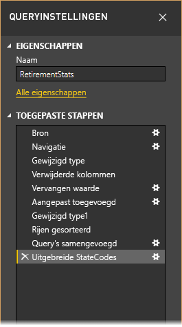

We gebruiken de pensioneringsgegevens uit [Aan de slag met Power BI Desktop](../fundamentals/desktop-getting-started.md) die we hebben gevonden door verbinding te maken met een gegevensbron op internet en passen die gegevens aan op basis van onze wensen. We voegen een aangepaste kolom toe voor het berekenen van de rangschikking, met als uitgangspunt dat alle gegevens gelijke factoren zijn, en vergelijken deze kolom met de bestaande kolom **Rangschikking**.  

1. Selecteer op het lint **Kolom toevoegen** de optie **Aangepaste kolom** zodat u een aangepaste kolom kunt toevoegen.

    

1. Voer in het venster **Aangepaste kolom** in **Nieuwe kolomnaam** de tekst _Nieuwe rangschikking_ in. Voer in **Formule voor aangepaste kolom** de volgende gegevens in:

    ```
    ([Cost of living] + [Weather] + [Health care quality] + [Crime] + [Tax] + [Culture] + [Senior] + [#"Well-being"]) / 8
    ```
 
1. Controleer of het statusbericht *Er zijn geen syntaxisfouten gedetecteerd* wordt weergegeven en selecteer **OK**.

    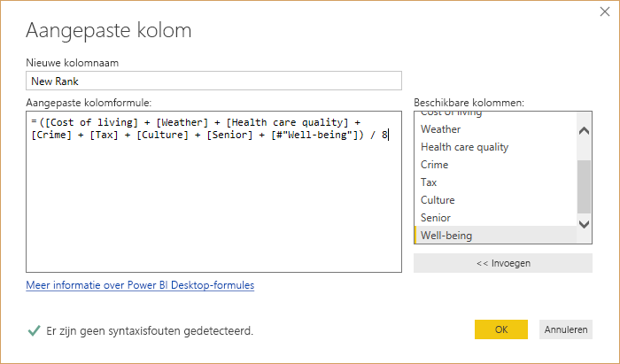

1. Zet de nieuwe kolomwaarden om in hele getallen om de kolomgegevens consistent te houden. Als u de kolomwaarden wilt wijzigen, klikt u met de rechtermuisknop op de kolomkop en selecteert u vervolgens **Type wijzigen \> Geheel getal**. 

    Als u meer dan één kolom wilt selecteren, selecteert u eerst een kolom en houdt u **SHIFT** ingedrukt, selecteert u aangrenzende kolommen en klikt u vervolgens met de rechtermuisknop op een kolomkop. U kunt ook de **CTRL**-toets gebruiken om niet-aaneengesloten kolommen te selecteren.

    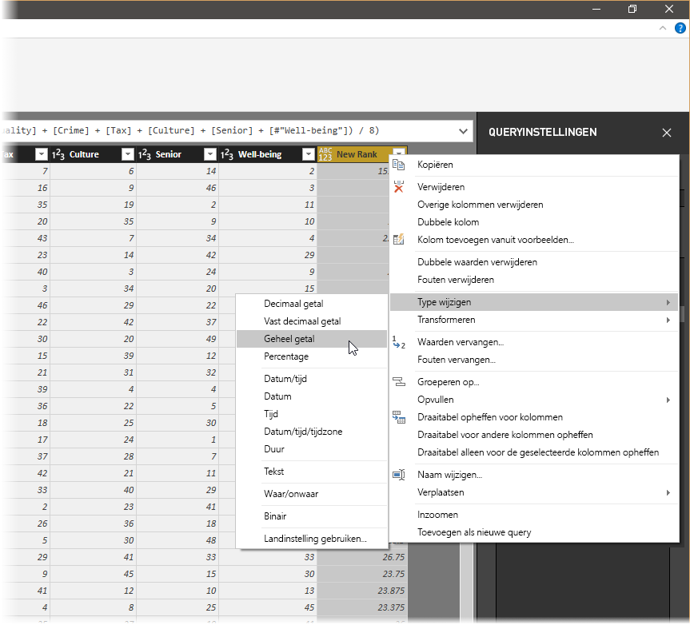

1. Als u gegevenstypen voor kolommen wilt *transformeren*, waarbij u het huidige gegevenstype omzet in een ander type, selecteert u **Gegevenstypetekst** op het lint **Transformeren**. 

   

1. In **Queryinstellingen** worden in de lijst **Toegepaste stappen** de vormgevingsstappen vermeld die op de gegevens worden toegepast. Als u een stap voor de vormgeving wilt verwijderen, selecteert u de **X** links van de betreffende stap. 

    In de volgende afbeelding bevat de lijst **Toegepaste stappen** de tot nu toe toegevoegde stappen: 
     - **Bron**: Verbinding maken met de website.
     - **Navigatie**: De tabel selecteren. 
     - **Gewijzigd type**: Kolommen met getallen in tekstvorm wijzigen van *Tekst* naar *Geheel getal*. 
     - **Aangepaste kolom toegevoegd**: Een aangepaste kolom toevoegen.
     - **Type 1 gewijzigd**: De laatst toegepaste stap.

       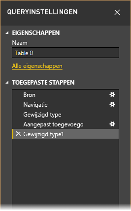

## <a name="adjust-data"></a>Gegevens aanpassen

Voordat we met deze query kunnen werken, moeten we enkele wijzigingen aanbrengen om de gegevens ervan aan te passen:

   - Pas de rangschikkingen aan door een kolom te verwijderen.

       We hebben besloten dat **Kosten van levensonderhoud** geen factor is in onze resultaten. Nadat deze kolom is verwijderd, stellen we vast dat de gegevens niet zijn gewijzigd. 

   - Corrigeer een aantal fouten.

       Omdat we een kolom hebben verwijderd, moeten we onze berekeningen in de kolom **Nieuwe rangschikking** aanpassen wat betekent dat we een formule moeten wijzigen.

   - Sorteer de gegevens.

       Sorteer de gegevens op basis van de kolommen **Nieuwe rangschikking** en **Rangschikking**.
 
   - Vervang de gegevens.

       We laten zien hoe een bepaalde waarde moet worden vervangen en wat de noodzaak is van het invoegen van een **Toegepaste stap**.

   - Wijzig de naam van de tabel. 

       Omdat **Tabel 0** geen bruikbare beschrijving voor de tabel is, wordt de naam van de tabel gewijzigd.

1. Als u de kolom **Kosten van levensonderhoud** wilt verwijderen, selecteert u de kolom en kiest u het tabblad **Start** op het lint en selecteert u vervolgens **Kolommen verwijderen**.

    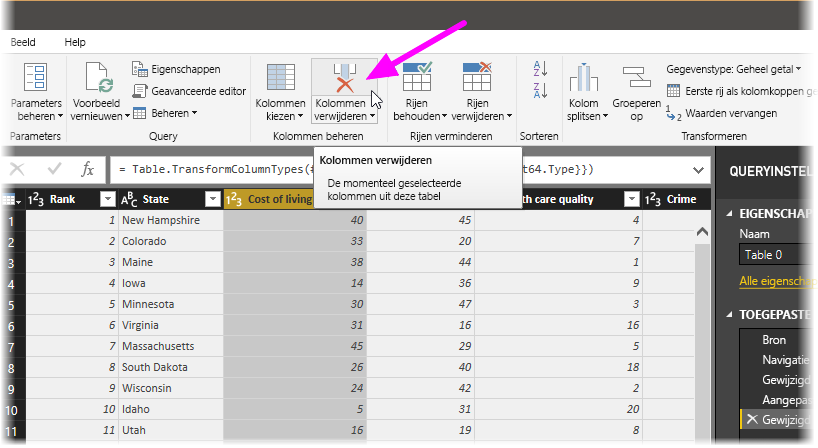

   Zoals u ziet zijn de waarden voor **Nieuwe rangschikking** niet gewijzigd. Dit komt door de volgorde van de stappen. Omdat Queryeditor de stappen opeenvolgend maar onafhankelijk van elkaar registreert, kunt u elke **toegepaste stap** omhoog of omlaag in de lijst plaatsen. 

1. Klik met de rechtermuisknop op een stap. Queryeditor bevat een menu waarmee u de volgende taken kunt uitvoeren: 
   - **Naam wijzigen**: wijzig de naam van de stap.
   - **Verwijderen**: Verwijder de stap.
   - **Verwijderen** **tot aan het einde**: Verwijder de huidige stap en alle daaropvolgende stappen.
   - **Omhoog verplaatsen**: Plaats de stap hoger in de lijst.
   - **Omlaag verplaatsen**: Plaats de stap lager in de lijst.

1. Plaats de laatste stap **Verwijderde kolommen** hoger tot net boven de stap **Aangepaste kolom toegevoegd**.

   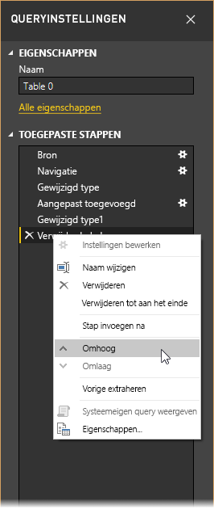

1. Selecteer de stap **Aangepaste kolom toegevoegd**. 

   Voor de gegevens wordt nu _Fout_ aangegeven en die moeten we verhelpen.

   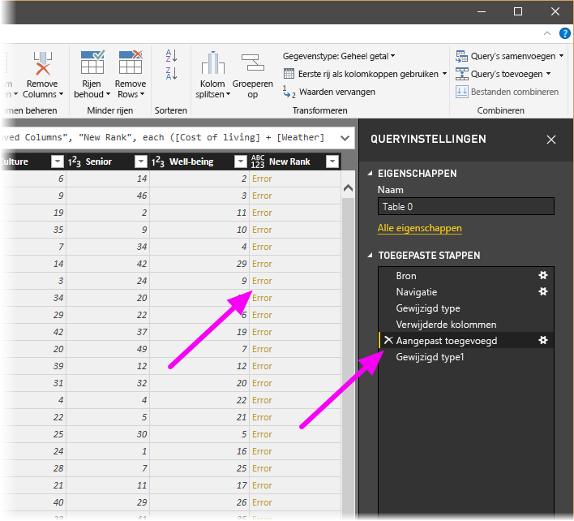

   Er zijn enkele manieren om meer informatie over elke fout te krijgen. Als u de cel selecteert zonder op het woord *Fout* te klikken, geeft Queryeditor onder in het venster de foutgegevens weer.

   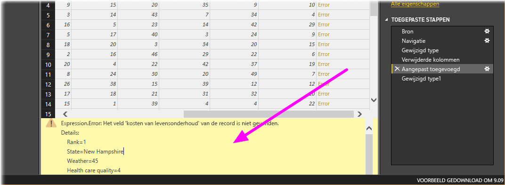

   Als u rechtstreeks het woord *Fout* selecteert, maakt Queryeditor een **toegepaste stap** in het deelvenster **Queryinstellingen** en wordt er informatie over de fout weergegeven. 

1. Omdat we geen informatie over de fouten hoeven weer te geven, selecteert u **Annuleren**.

1. Als u de fouten wilt oplossen, selecteert u de kolom **Nieuwe rangschikking**. U geeft vervolgens de gegevensformule van de kolom weer door het selectievakje **Formulebalk** op het tabblad **Weergave** te selecteren. 

   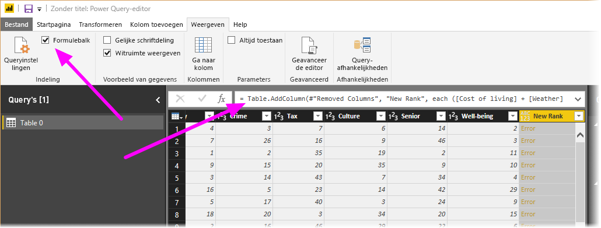

1. Verwijder de parameter _Kosten van levensonderhoud_ en verlaag de deler door de formule als volgt te wijzigen: 
   ```
    Table.AddColumn(#"Removed Columns", "New Rank", each ([Weather] + [Health care quality] + [Crime] + [Tax] + [Culture] + [Senior] + [#"Well-being"]) / 7)
   ```

1. Selecteer het groene vinkje aan de linkerkant van het formulevak of druk op **Enter**.

  Queryeditor vervangt de gegevens door de gewijzigde waarden en de stap **Aangepaste kolom toegevoegd** wordt zonder fouten uitgevoerd.

   > [!NOTE]
   > U kunt ook, met het lint of het contextmenu, **Fouten verwijderen** selecteren, waardoor alle rijen met fouten worden verwijderd. We wilden dit echter niet in deze zelfstudie doen, omdat we de gegevens in de tabel wilden behouden.

1. Sorteer de gegevens op basis van de kolom **Nieuwe rangschikking**. Selecteer eerst de laatste toegepaste stap, **Type 1 gewijzigd** om de meest recente gegevens weer te geven. Selecteer vervolgens de vervolgkeuzelijst naast de kolomkop **Nieuwe rangschikking** en selecteer **Oplopend sorteren**.

   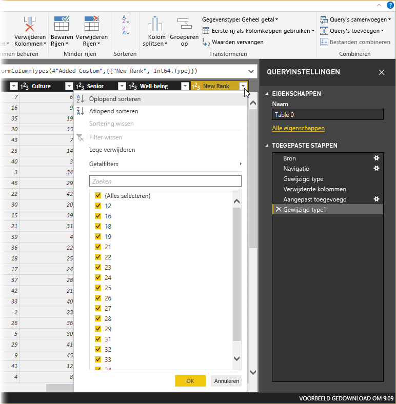

   De gegevens zijn nu gesorteerd op basis van **Nieuwe rangschikking**. Als u echter naar de kolom **Rangschikking** kijkt, ziet u dat de gegevens niet goed zijn gesorteerd in gevallen waar de waarde voor **Nieuwe rangschikking** hetzelfde is. We lossen dit in de volgende stap op.

1. Als u het probleem met het sorteren van de gegevens wilt oplossen, selecteert u de kolom **Nieuwe rangschikking** en wijzigt u de formule in de **formulebalk** in het volgende:

   ```
    = Table.Sort(#"Changed Type1",{{"New Rank", Order.Ascending},{"Rank", Order.Ascending}})
   ```

1. Selecteer het groene vinkje aan de linkerkant van het formulevak of druk op **Enter**. 

   De rijen zijn nu geordend in overeenstemming met zowel **Nieuwe rangschikking** als **Rangschikking**. Bovendien kunt u een **Toegepaste stap** overal in de lijst selecteren en doorgaan met het vormgeven van de gegevens op dat punt in de reeks. Queryeditor voegt automatisch een nieuwe stap in, onmiddellijk na de geselecteerde **Toegepaste stap**. 

1. Selecteer in **Toegepaste stap** de stap voorafgaand aan de aangepaste kolom. Dit is de stap **Verwijderde kolommen**. Hier vervangen we de waarde van de rangschikking **Weer** in Arizona. Klik met de rechtermuisknop op de betreffende cel die de rangschikking **Weer** van Arizona bevat en selecteer vervolgens **Waarden vervangen**. Onthoud welke **Toegepaste stap** momenteel is geselecteerd.

   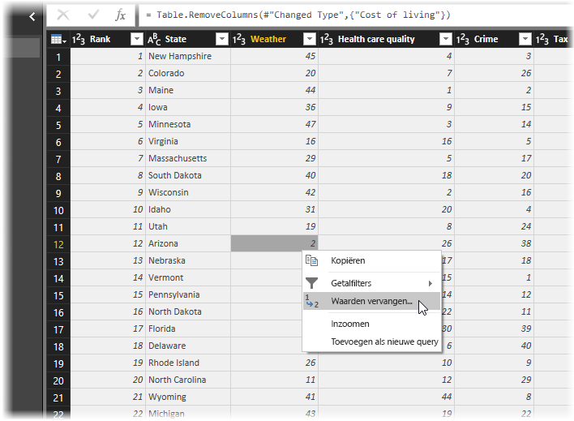

1. Selecteer **Invoegen**.

    Omdat we een stap invoegen, geeft Queryeditor daarvoor een waarschuwing: de daaropvolgende stappen zouden ervoor kunnen zorgen dat de query ongeldig wordt. 

    

1. Wijzig de gegevenswaarde in _51_. 

   Queryeditor vervangt de gegevens voor Arizona. Wanneer u een nieuwe **toegepaste stap** maakt, geeft Queryeditor deze een naam op basis van de actie, in dit geval **Vervangen waarde**. Als de query meer dan één stap met dezelfde naam bevat, voegt Queryeditor aan elke volgende **toegepaste stap** een cijfer toe (in oplopende volgorde) om ze van elkaar te onderscheiden.

1. Selecteer de laatste **toegepaste stap**, **Gesorteerde rijen**. 

   U ziet dat de gegevens zijn gewijzigd met betrekking tot de nieuwe rangschikking van Arizona. Deze wijziging vindt plaats omdat we de stap **Vervangen waarde** op de juiste plaats hebben ingevoegd, namelijk voor de stap **Aangepaste kolom toegevoegd**.

1. Tot slot willen we de naam van de tabel meer beschrijvend maken. Voer in het deelvenster **Queryinstellingen** onder **Eigenschappen** de nieuwe naam van de tabel in en selecteer **Enter**. Noem deze tabel *RetirementStats*.

   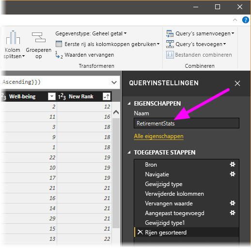

   Wanneer u rapporten gaat maken, is het handig om beschrijvende tabelnamen te gebruiken, vooral wanneer er verbinding wordt gemaakt met meerdere gegevensbronnen en deze worden vermeld in het deelvenster **Velden** van de weergave **Rapport**.

   We hebben nu de gegevens naar wens vormgegeven. Laten we nu verbinding maken met een andere gegevensbron en gegevens gaan combineren.

## <a name="combine-data"></a>Gegevens combineren
De gegevens over de verschillende staten is interessant en nuttig voor aanvullende analyses en query's. Maar er is wel één probleem: de meeste van die gegevens gebruiken de tweeletterige afkorting als code voor staten, niet de volledige naam van de staat. We moeten namen van staten op een of andere manier koppelen aan de bijbehorende afkortingen.

Er is gelukkig een andere openbare gegevensbron waarmee dat gedaan wordt. Er moet echter wel eerst het een en ander worden aangepast voordat die bron aan de pensioneringstabel kan worden gekoppeld. Als u de gegevens wilt vormgeven, voert u de volgende stappen uit:

1. Selecteer in Queryeditor **Nieuwe bron \> Internet** op het lint **Start**. 

2. Voer het adres van de website voor afkortingen van staten, *https://en.wikipedia.org/wiki/List_of_U.S._state_abbreviations* , in en selecteer vervolgens **Verbinding maken**.

   In de navigator wordt de inhoud van de website weergegeven.

    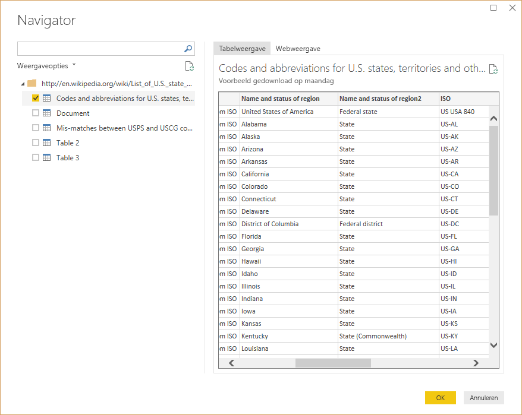

1. Selecteer **Codes en afkortingen**. 

   > [!TIP]
   > Er moet flink wat worden vormgegeven om de gegevens van deze tabel naar wens te beperken. Is er een snellere of gemakkelijkere manier om de onderstaande stappen uit te voeren? Jazeker, we zouden een *relatie* tussen de twee tabellen kunnen maken en de gegevens vormgeven op basis van die relatie. De volgende stappen zijn nog steeds prima geschikt voor het werken met tabellen, maar met relaties kunt u snel gegevens uit meerdere tabellen gebruiken.
> 
> 

Voer de volgende stappen uit om de juiste gegevens op te halen:

1. Verwijder de bovenste rij. Omdat deze een resultaat is van de manier waarop de tabel van die webpagina is gemaakt en we deze niet nodig hebben. Op het **Start** lint selecteren we **Minder rijen \> Minder rijen \> Bovenste rijen verwijderen**.

    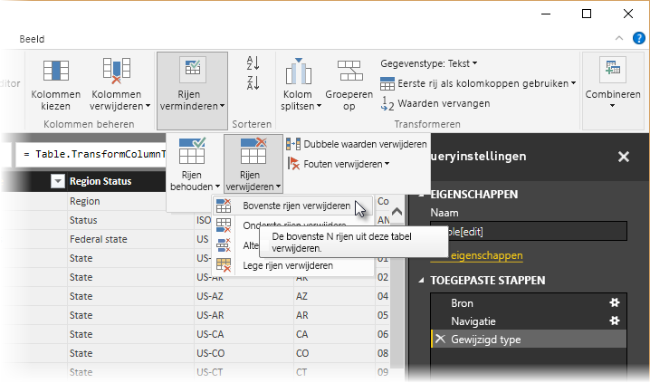

    Het venster **Bovenste rijen verwijderen** wordt weergegeven, waarin u kunt opgeven hoeveel rijen u wilt verwijderen.

    > [!NOTE]
    > Als Power BI per ongeluk de headers-tabel importeert als een rij in de gegevenstabel, kunt u **Gebruik eerste rij als headers** selecteren uit het tabblad **Start** of vanuit het tabblad **Transformeren** in het lint, om uw tabel te herstellen.

1. Verwijder de onderste 26 rijen. Deze rijen betreffen Amerikaanse gebieden die we niet nodig hebben. Op het **Start** lint selecteren we **Minder rijen \> Minder rijen \> Onderste rijen verwijderen**.

    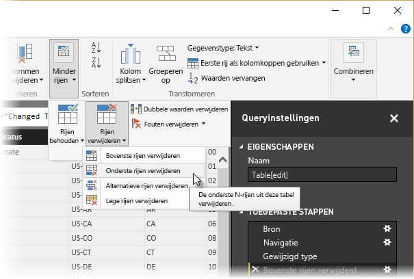

1. Omdat de tabel RetirementStats geen informatie voor Washington DC bevat, moeten we die uit onze lijst filteren. Selecteer de vervolgkeuzelijst **Regiostatus** en schakel vervolgens het selectievakje naast **Federaal district** uit.

    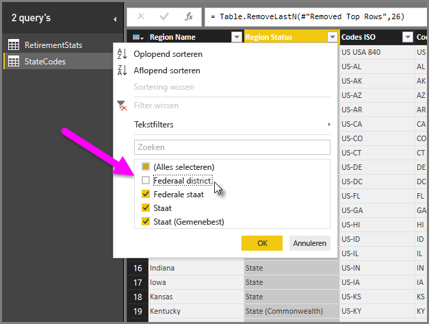

1. Verwijder enkele overbodige kolommen. Omdat we alleen de koppeling van elke staat aan de officiële bijbehorende afkorting van twee letters nodig hebben, kunnen we de volgende kolommen verwijderen: **Kolom1**, **Kolom3**, **Kolom4** en **Kolom6** tot en met **Kolom11**. Selecteer eerst **Kolom1**, houd de **CTRL**-toets ingedrukt en selecteer alle andere kolommen die moeten worden verwijderd. Selecteer op het tabblad **Start** op het lint de optie **Kolommen verwijderen \> Kolommen verwijderen**.

   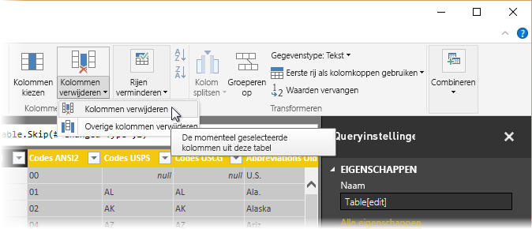

   > [!NOTE]
   > Dit is een goed moment om te vermelden dat de *reeks* toegepaste stappen in de Query-editor belangrijk is en van invloed kan zijn op hoe de gegevens worden vormgegeven. Het is ook belangrijk om na te gaan hoe de ene stap van invloed kan zijn op een volgende stap. Als u een stap uit de Toegepaste stappen verwijdert, werken daarop volgende stappen mogelijk niet meer zoals oorspronkelijk beoogd vanwege de impact van de reeks stappen van de query.

   > [!NOTE]
   > Wanneer u het venster van Query-editor smaller maakt, worden enkele items op het lint verkleind om de zichtbare ruimte zo goed mogelijk te benutten. Wanneer u het venster van Query-editor breder maakt, worden de items op het lint vergroot om de extra ruimte voor het lint zo goed mogelijk te benutten.

1. Wijzig de namen van de kolommen en de tabel. U kunt op een aantal manieren de naam van een kolom wijzigen: Selecteer eerst de kolom en vervolgens **Naam wijzigen** op het tabblad **Transformeren** op het lint. U kunt ook met de rechtermuisknop klikken en **Naam wijzigen** selecteren. De volgende afbeelding laat pijlen zien die beide opties aanwijzen; u hoeft er maar één te kiezen.

   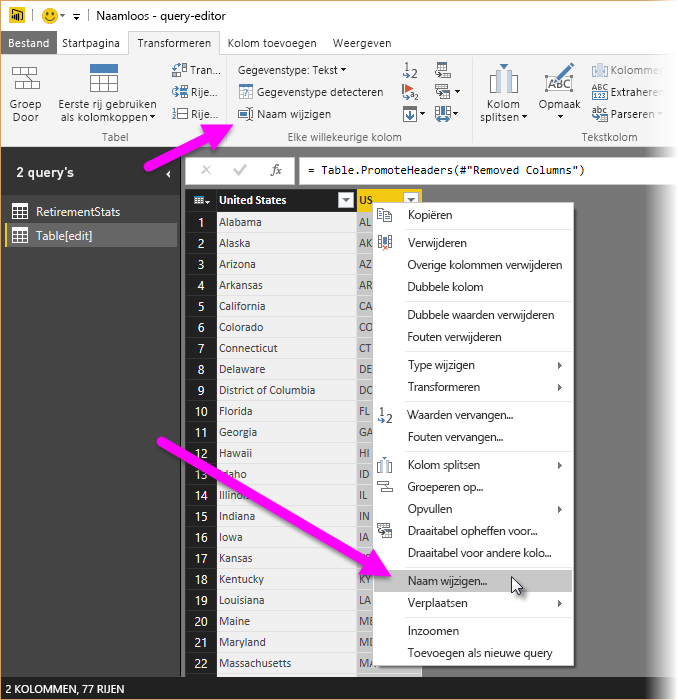

1. Wijzig de namen van de kolommen in *Staatnaam* en *Staatcode*. Als u de naam van de tabel wilt wijzigen, voert u in het deelvenster **Queryinstellingen** de **naam** in. Noem deze tabel *StateCodes*.

## <a name="combine-queries"></a>Query's combineren

Nu we de tabel StateCodes op de gewenste manier hebben vormgegeven, gaan we deze twee tabellen, of query's, in één samenvoegen. Omdat de tabellen waarover we nu beschikken het resultaat zijn van de query's die we op de gegevens hebben toegepast, worden ze vaak aangeduid als *query's*.

Query's worden voornamelijk op twee manieren gecombineerd: door *samenvoegen* en *toevoegen*.

- Wanneer u een of meer kolommen hebt die u wilt toevoegen aan een andere query gaat u de query’s *samenvoegen*. 
- Wanneer u extra rijen met gegevens hebt die u aan een bestaande query wilt toevoegen, gaat u de query *toevoegen*.

In dit geval gaan we de query's samenvoegen. Hiervoor volgt u de volgende stappen:
 
1. Selecteer in het linkerdeelvenster van Queryeditor de query *waarmee* u de andere query wilt samenvoegen. Dat is in dit geval **RetirementStats**. 

1. Selecteer **Combineren \> Query's samenvoegen** op het tabblad **Start** van het lint.

   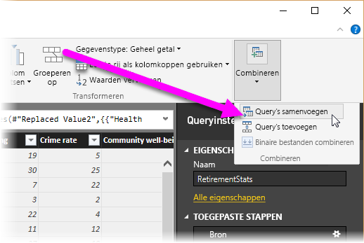

   U wordt mogelijk gevraagd de privacyniveaus in te stellen om ervoor te zorgen dat de gegevens worden gecombineerd zonder dat er gegevens worden opgenomen of overgedragen waarvan u niet wilt dat ze worden overgedragen.

   Het venster **Samenvoegen** wordt weergegeven. Hierin wordt u gevraagd om de tabel te selecteren die u wilt samenvoegen met de geselecteerde tabel en de overeenkomende kolommen aan te geven die moeten worden gebruikt voor het samenvoegen. 

1. Selecteer **Staat** in de tabel RetirementStats en selecteer vervolgens de query **StateCodes**. 

   Wanneer u de juiste overeenkomende kolommen selecteert, wordt de knop **OK** geactiveerd.

   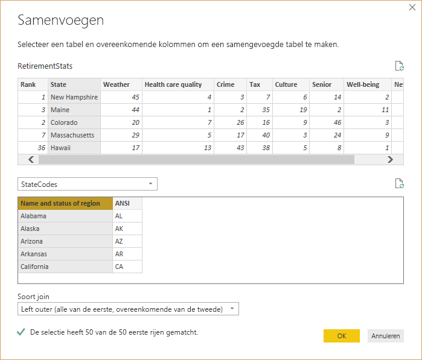

1. Selecteer **OK**.

   Er wordt door Queryeditor aan het einde van de query een kolom **NewColumn** gemaakt die de inhoud bevat van de tabel (query) die met de bestaande query is samengevoegd. Alle kolommen uit de samengevoegde query zijn gecombineerd tot de kolom **NewColumn**, maar u kunt de tabel **uitbreiden** en gewenste kolommen opnemen.

   

1. Als u de samengevoegde tabel wilt uitvouwen en de kolommen wilt selecteren die moeten worden opgenomen, selecteert u het pictogram voor uitbreiden (). 

   Het venster **Uitbreiden** wordt weergegeven.

   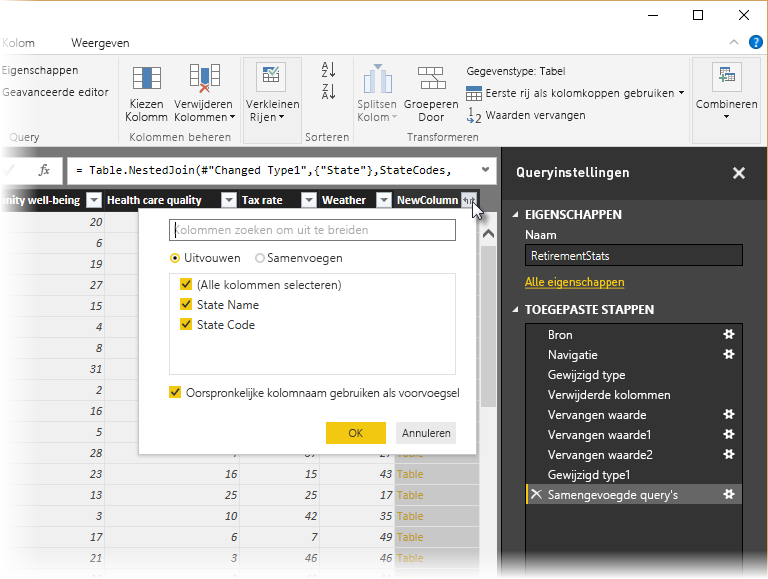

1. In dit geval willen we alleen de kolom **Staatcode** gebruiken. Selecteer die kolom, schakel het selectievakje bij **Oorspronkelijke kolomnaam als voorvoegsel gebruiken** uit en selecteer vervolgens **OK**.

   Als we het selectievakje voor **Oorspronkelijke kolomnaam als voorvoegsel gebruiken** ingeschakeld hadden gelaten, zou de samengevoegde kolom de naam **NewColumn.StateCode** hebben.

   > [!NOTE]
   > Wilt u weten hoe u de tabel NewColumn kunt invoegen? U kunt wat experimenteren en als de resultaten u niet bevallen, kunt u die stap gewoon verwijderen uit de lijst **Toegepaste stappen** in het deelvenster **Query-instellingen**. De query krijgt dan weer de status die gold voordat de stap **Uitbreiden** werd toegepast. U kunt de stap zo vaak uitvoeren als u wilt, totdat u met het uitbreiden het gewenste resultaat hebt bereikt.

   We hebben nu één query (tabel) waarin twee gegevensbronnen zijn samengevoegd, die elk volgens onze wensen zijn vormgegeven. Deze query kan fungeren als basis voor een groot aantal aanvullende en interessante gegevensverbindingen, zoals statistieken voor huisvestingskosten, demografische gegevens of werkgelegenheid in een staat.

1. Als u wijzigingen wilt toepassen en Queryeditor wilt sluiten, selecteert u **Sluiten en toepassen** op het tabblad **Start** op het lint. 

   De getransformeerde gegevensset wordt weergegeven in Power BI Desktop en is klaar voor het maken van rapporten.

   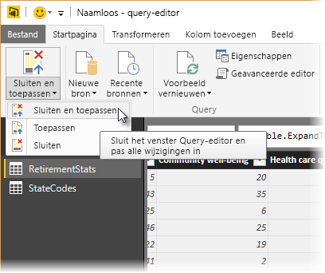

## <a name="next-steps"></a>Volgende stappen
Raadpleeg de volgende resources voor meer informatie over Power BI Desktop en de mogelijkheden die het biedt:

* [Wat is Power BI Desktop?](../fundamentals/desktop-what-is-desktop.md)
* [Queryoverzicht in Power BI Desktop](../transform-model/desktop-query-overview.md)
* [Gegevensbronnen in Power BI Desktop](desktop-data-sources.md)
* [Verbinding maken met gegevens in Power BI Desktop](desktop-connect-to-data.md)
* [Algemene querytaken in Power BI Desktop](../transform-model/desktop-common-query-tasks.md)   
