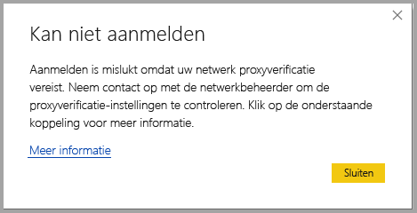
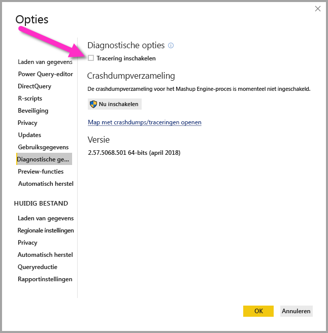
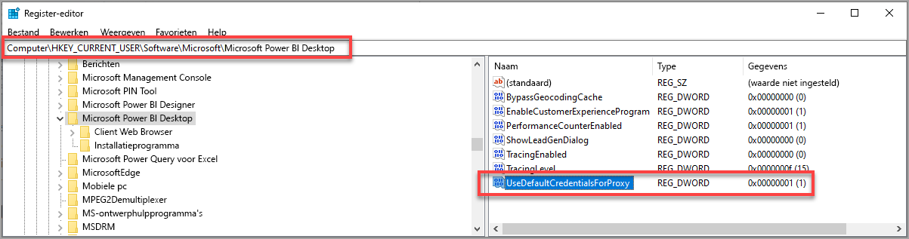

# Problemen met aanmelden in Power BI Desktop oplossen
Het kan gebeuren dat er fouten optreden wanneer u zich probeert aan te melden bij **Power BI Desktop**. Er zijn twee belangrijke oorzaken voor problemen bij het aanmelden: **Proxy-verificatiefouten** en **fouten bij de omleiding van een niet-HTTPS-URL**. 

Om de oorzaak van het aanmeldingsprobleem vast te stellen, neemt u als eerste contact op met uw beheerder en verstrekt u de nodige diagnostische gegevens, zodat de beheerder de oorzaak van het probleem kan bepalen. Beheerders kunnen bepalen welke van de volgende fouten voor u gelden door problemen te traceren die betrekking hebben op uw aanmeldingsprobleem. 

We gaan deze verschillende problemen hieronder afzonderlijk bespreken. Aan het einde van dit artikel is informatie opgenomen over het vastleggen van een *tracering* in Power BI Desktop, aan de hand waarvan u problemen nader kunt bepalen.

## Fout Proxyverificatie vereist

Het volgende scherm laat een voorbeeld zien van de fout *Proxyverificatie vereist*.

De volgende uitzonderingen in *Power BI Desktop*-traceringsbestanden hebben betrekking op deze fout:

* *Microsoft.PowerBI.Client.Windows.Services.PowerBIWebException*
* *HttpStatusCode: ProxyAuthenticationRequired*

Wanneer deze fout optreedt, is de meest waarschijnlijke reden hiervoor dat een proxyserver voor verificatie in uw netwerk de webservice-aanvragen blokkeert die worden uitgegeven door **Power BI Desktop**. 

Als uw netwerk gebruikmaakt van een proxyserver voor verificatie, kan uw beheerder dit probleem oplossen door de volgende domeinen op de proxyserver voor verificatie aan de acceptatielijst toe te voegen:

* app.powerbi.com
* api.powerbi.com
* domeinen in de naamruimte *.analysis.windows.net

Voor klanten die deel uitmaken van een overheidscloud, kan dit probleem worden opgelost door de volgende domeinen op de proxyserver voor verificatie aan de acceptatielijst toe te voegen:

* app.powerbigov.us
* api.powerbigov.us
* domeinen in de naamruimte *.analysis.usgovcloudapi.net

## Fout waarbij omleiding van een niet-HTTPS-URL niet wordt ondersteund

Huidige versies van **Power BI Desktop** maken gebruik van de huidige versie van de Active Directory Authentication Library (ADAL), die geen omleiding naar niet-beveiligde (niet-HTTPS) URL's toestaat. 

De volgende uitzonderingen in *Power BI Desktop*-traceringsbestanden hebben betrekking op deze fout:

* *Microsoft.IdentityModel.Clients.ActiveDirectory.AdalServiceException: omleiding van een niet-HTTPS-URL wordt niet ondersteund in webview*
* *ErrorCode: non_https_redirect_failed*

Als de *ErrorCode: non_https_redirect_failed* optreedt, betekent dit dat een of meer omleidingspagina's of providers in de omleidingsketen geen met HTTPS beveiligd eindpunt is of dat de certificaatuitgever van een of meer omleidingen niet tot de vertrouwde basiscertificaten van het apparaat behoort. Alle providers in een omleidingsketen voor aanmelding moeten een HTTPS-URL gebruiken. U lost dit probleem op door uw beheerder te vragen om beveiligde URL's te gebruiken voor de verificatiesites. 

## Een tracering verzamelen in Power BI Desktop

Voor het verzamelen van een tracering in **Power BI Desktop**, gaat u als volgt te werk:

1. Schakel tracering in **Power BI Desktop** in door naar **Bestand > Opties en instellingen > Opties** te gaan en vervolgens **Diagnostische gegevens** te selecteren in de opties in het linkerdeelvenster. Schakel in het weergegeven deelvenster het selectievakje naast **Tracering inschakelen** in, zoals wordt weergegeven in de volgende afbeelding. Mogelijk moet u **Power BI Desktop** opnieuw opstarten.
   
   

2. Voer vervolgens de stappen uit om de fout te reproduceren. Als dat gebeurt, voegt **Power BI Desktop** gebeurtenissen toe aan het traceringslogboek, dat op de lokale computer wordt bewaard.

3. Navigeer naar de map Traceringen op uw lokale computer. U vindt deze map door de koppeling te selecteren in de **Diagnostische gegevens** waar u tracering hebt ingeschakeld, weergegeven als *Map met crashdumps/traceringen openen* in de vorige afbeelding. Deze is vaak te vinden in de volgende locatie op de lokale computer:

    `C:\Users/<user name>/AppData/Local/Microsoft/Power BI Desktop/Traces`

Mogelijk bevat die map veel traceringsbestanden. Zorg ervoor dat u alleen de recente bestanden naar uw beheerder verzendt zodat de fout snel kan worden vastgesteld. 

## Standaardsysteemreferenties voor webproxy's gebruiken

In webaanvragen die zijn uitgegeven door Power BI Desktop wordt geen gebruik gemaakt van webproxy-referenties. In netwerken waarin gebruik wordt gemaakt van een proxyserver kan Power BI Desktop mogelijk geen webaanvraag doen. 

Vanaf de Power BI Desktop release van maart 2020 kunnen systeem- of netwerkbeheerders het gebruik van standaardsysteemreferenties voor webproxy-verificatie toestaan. Beheerders kunnen een registervermelding met de naam **UseDefaultCredentialsForProxy** maken en de waarde instellen op één (1) om het gebruik van standaardsysteemreferenties voor webproxy-verificatie in te schakelen.

De registervermelding kan op een van de volgende locaties worden geplaatst:

`[HKEY_LOCAL_MACHINE\SOFTWARE\WOW6432Node\Microsoft\Microsoft Power BI Desktop]`
`[HKEY_LOCAL_MACHINE\SOFTWARE\Microsoft\Microsoft Power BI Desktop]`

Het is niet nodig om de registervermelding op beide locaties te hebben.

Zodra de registervermelding is gemaakt (mogelijk moet opnieuw worden opgestart), worden de proxy-instellingen die in Internet Explorer zijn gedefinieerd, gebruikt wanneer Power BI Desktop webaanvragen doet. 

Net als bij elke andere wijziging van proxy- of referentie-instellingen zijn er beveiligingsimplicaties voor het maken van deze registervermelding. Beheerders moeten dus controleren of ze de Internet Explorer-proxy's correct hebben geconfigureerd voordat deze functie wordt ingeschakeld.         

### Beperkingen en overwegingen voor het gebruik van standaardsysteemreferenties

Er is een aantal beveiligingsimplicaties waarmee beheerders rekening moeten houden voordat ze deze mogelijkheid inschakelen. 

De volgende aanbevelingen moeten worden gevolgd wanneer u deze functie inschakelt voor clients:

* Gebruik **Onderhandeling** alleen als verificatieschema voor de proxyserver, om ervoor te zorgen dat alleen proxyservers die zijn gekoppeld aan het Active Directory-netwerk door de client worden gebruikt. 
* Gebruik **NTLM-terugval** niet op clients die gebruikmaken van deze functie.
* Als gebruikers zich niet in een netwerk met een proxy bevinden wanneer deze functie is ingeschakeld en geconfigureerd zoals aanbevolen in dit gedeelte, wordt het proces om te proberen verbinding te maken met de proxyserver en de standaardsysteemreferenties te gebruiken, niet gebruikt.

[Standaardsysteemreferenties voor webproxy's gebruiken](#using-default-system-credentials-for-web-proxy)

