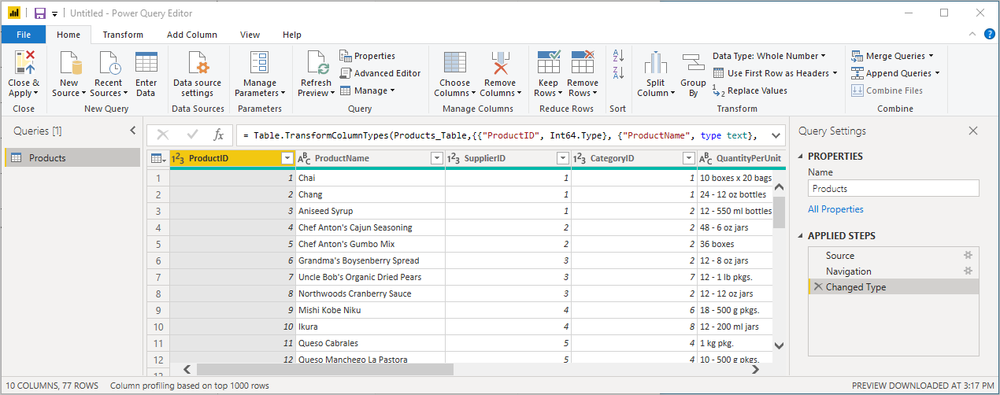

# Zelfstudie: Verkoopgegevens uit Excel en een OData-feed analyseren

Het is gebruikelijk gegevens in meerdere gegevensbronnen te hebben. U kunt bijvoorbeeld twee databases hebben, één voor productgegevens en één voor verkoopgegevens. Met *Power BI Desktop* kunt u gegevens uit verschillende bronnen combineren om interessante en aantrekkelijke gegevensanalyses en -visualisaties te maken.

In deze zelfstudie combineert u gegevens van twee gegevensbronnen:

* Een Excel-werkmap met productgegevens
* Een OData-feed met ordergegevens

U gaat elke gegevensset importeren en transformatie- en aggregatiebewerkingen uitvoeren. Daarna gebruikt u de gegevens van de twee bronnen om een verkoopanalyserapport met interactieve visualisaties te produceren. U kunt deze technieken later toepassen op SQL Server-query's, CSV-bestanden en andere gegevensbronnen in Power BI Desktop.

>[!NOTE]
>In Power BI Desktop zijn er vaak een aantal manieren om een taak uit te voeren. U kunt bijvoorbeeld met de rechtermuisknop klikken of een menu **Meer opties** gebruiken voor een kolom of cel om aanvullende lintselecties weer te geven. In de onderstaande stappen worden verschillende alternatieve methoden beschreven.

## Excel-productgegevens importeren

Importeert eerst productgegevens uit de Excel-werkmap *Products.xlsx* in Power BI Desktop.

1. [Download de Excel-werkmap Products.xlsx](https://download.microsoft.com/download/1/4/E/14EDED28-6C58-4055-A65C-23B4DA81C4DE/Products.xlsx) en sla deze op als *Products.xlsx*.

1. Selecteer de pijl naast **Gegevens ophalen** op het tabblad **Start** van het Power BI Desktop-lint. Selecteer vervolgens **Excel** in het menu **Meest voorkomend**.

   

   >[!NOTE]
   >U kunt ook het item **Gegevens ophalen** zelf selecteren of **Gegevens ophalen** in het dialoogvenster **Aan de slag** in Power BI selecteren en vervolgens **Excel** of **Bestand** > **Excel** selecteren in het dialoogvenster **Gegevens ophalen**. Selecteer vervolgens **Verbinding maken**.

1. Navigeer in het dialoogvenster **Openen** naar het bestand **Products.xlsx**, selecteer het bestand en kies **Openen**.

1. In de **Navigator** selecteert u de tabel **Products** en selecteert u vervolgens **Gegevens transformeren**.

   

In Power Query-editor wordt een voorbeeld van de tabel geopend, waarin u transformaties kunt toepassen om de gegevens op te schonen.

>[!NOTE]
>U kunt Power Query-editor ook openen door **Query's bewerken** > **Query's bewerken** te selecteren op het lint **Start** in Power BI Desktop, of door met de rechtermuisknop te klikken op **Meer opties** of deze optie te kiezen naast een query in de **rapportweergave**. Selecteer vervolgens **Query bewerken**.

## De productkolommen opschonen

In het gecombineerde rapport worden de kolommen **ProductID**, **ProductName**, **QuantityPerUnit** en **UnitsInStock** uit de Excel-werkmap gebruikt. U kunt de andere kolommen verwijderen.

1. Selecteer in Power Query-editor de kolommen **ProductID**, **ProductName**, **QuantityPerUnit** en **UnitsInStock**. U kunt Ctrl gebruiken om meer dan een kolom te selecteren of Shift om naast elkaar gelegen kolommen te selecteren.

1. Klik met de rechtermuisknop op een van de geselecteerde koppen. Selecteer **Andere kolommen verwijderen** in het vervolgkeuzemenu.
   U kunt ook **Kolommen verwijderen** > **Overige kolommen verwijderen** selecteren in de groep **Kolommen beheren** op het tabblad **Start** op het lint.

   

## De ordergegevens van de OData-feed importeren

Vervolgens importeert u de ordergegevens uit de OData-feed van het Northwind-voorbeeldverkoopsysteem.

1. Selecteer in Power Query-editor de optie **Nieuwe bron** en selecteer vervolgens in het menu **Meest voorkomend** de optie **OData-feed**.

   

1. Plak in het dialoogvenster **OData-feed** de URL voor de OData-feed Northwind, `https://services.odata.org/V3/Northwind/Northwind.svc/`. Selecteer **OK**.

   

1. Selecteer in **Navigator** de tabel **Orders** en selecteer **Gegevens transformeren** om de gegevens in Power Query-editor te laden.

   

   >[!NOTE]
   >In **Navigator** kunt u een tabelnaam selecteren (zonder het selectievakje te selecteren) om een voorbeeld te bekijken.

## De ordergegevens uitvouwen

U kunt tabelverwijzingen gebruiken om query's op te bouwen als u verbinding maakt met gegevensbronnen die meerdere tabellen bevatten, zoals relationele databases of de OData-feed Northwind. De tabel **Orders** bevat verwijzingen naar verschillende verwante tabellen. U kunt de bewerking Uitbreiden gebruiken om de kolommen **ProductID**, **UnitPrice** en **Quantity** uit de verwante tabel **Order_Details** toe te voegen aan de onderwerptabel (**Orders**).

1. Schuif naar rechts in de tabel **Orders** totdat u de kolom **Order_Details** ziet. Deze bevat verwijzingen naar een andere tabel en geen gegevens.

   

1. Selecteer het pictogram **Uitvouwen** () in de kolomkop **Order_Details**.

1. Voer het volgende uit in het vervolgkeuzemenu:

   1. Selecteer **(Alle kolommen selecteren)** om alle kolommen te wissen.

   1. Selecteer **ProductID**, **UnitPrice** en **Quantity**, en selecteer vervolgens **OK**.

      

Nadat u de tabel **Order_Details** hebt uitgebreid, vervangen drie nieuwe geneste tabelkolommen de kolom **Order_Details**. Er zijn nieuwe rijen in de tabel voor de toegevoegde gegevens van elke order.

## Een aangepaste berekende kolom maken

In Power Query-editor kunt u aangepaste berekeningen en aangepaste velden maken om uw gegevens te verrijken. U maakt een aangepaste kolom waarmee de eenheidsprijs wordt vermenigvuldigd met de artikelhoeveelheid om de totaalprijs voor elk regelartikel in een order te berekenen.

1. Selecteer in Power Query-editor op het linttabblad **Kolom toevoegen** de optie **Aangepaste kolom**.

   

1. Typ **LineTotal** in het veld **Nieuwe kolomnaam** van het dialoogvenster **Aangepaste kolom**.

1. Voer in het veld **Aangepaste kolomformule** na de **=** het volgende in: **[Order_Details.UnitPrice]** \* **[Order_Details.Quantity]** . U kunt ook de veldnamen selecteren in het schuifblok **Beschikbare kolommen** en **<< Invoegen** selecteren in plaats van de namen te typen.

1. Selecteer **OK**.

   

   Het nieuwe veld **LineTotal** wordt als laatste kolom in de tabel **Orders** weergegeven.

## Het gegevenstype voor het nieuwe veld instellen

Als Power Query-editor verbinding met gegevens maakt, wordt geschat welk gegevenstype voor elk veld moet worden weergegeven. Een koppictogram geeft het toegewezen gegevenstype voor elk veld aan. U kunt ook kijken onder **Gegevenstype** in de groep **Transformeren** van het linttabblad **Start**.

De nieuwe kolom **LineTotal** is van het gegevenstype **Elke** maar bevat valutawaarden. Als u een gegevenstype wilt toewijzen, klikt u met de rechtermuisknop op de kolomkop **LineTotal**, selecteert u **Type wijzigen** in het vervolgkeuzemenu en selecteert u vervolgens **Vast decimaal getal**.

>[!NOTE]
>U kunt ook de kolom **LineTotal** selecteren, de pijl naast **Gegevenstype** in het gebied **Transformeren** van het tabblad **Start** op het lint selecteren en vervolgens **Vast decimaal getal** selecteren.

## De orderkolommen opschonen

U kunt in rapporten gemakkelijker met uw model werken door bepaalde kolommen te verwijderen, te rangschikken en de namen van de kolommen te wijzigen.

Voor uw rapport worden de volgende kolommen gebruikt:

* **OrderDate**
* **ShipCity**
* **ShipCountry**
* **Order_Details.ProductID**
* **Order_Details.UnitPrice**
* **Order_Details.Quantity**
* **LineTotal**

Selecteer deze kolommen en gebruik **Andere kolommen verwijderen** net als bij de Excel-gegevens. Of selecteer de niet-weergegeven kolommen, klik met de rechtermuisknop op een van de kolommen en selecteer **Kolommen verwijderen**.

U kunt de namen van kolommen met het voorvoegsel **Order_Details** wijzigen zodat ze gemakkelijker te lezen zijn:

1. Dubbelklik of tik op elke kolomkop en houd deze ingedrukt, of klik met de rechtermuisknop op de kolomkop en selecteer **Naam wijzigen** in het vervolgkeuzemenu.

1. Verwijder het voorvoegsel **Order_Details.** voorvoegsel bij elke naam.

Als u de kolom **LineTotal** toegankelijker wilt maken, sleept u de kolom naar links en zet u deze rechts van de kolom **ShipCountry** neer.

## De querystappen bekijken

Uw acties in Power Query-editor voor het vormgeven en transformeren van gegevens worden vastgelegd. Elke actie wordt weergegeven aan de rechterkant in het deelvenster **Queryinstellingen** onder **Toegepaste stappen**. U kunt stap voor stap teruggaan via **Toegepaste stappen** om de stappen te bekijken en zo nodig te bewerken of verwijderen of om ze opnieuw te rangschikken. Het wijzigen van voorgaande stappen is echter riskant omdat dit problemen voor latere stappen kan veroorzaken.

Selecteer uw query's in de lijst **Query's** aan de linkerkant van Power Query-editor en bekijk de **toegepast stappen** in **Query-instellingen**. Nadat de vorige gegevenstransformaties zijn toegepast, moet **Toegepaste stappen** voor uw twee query's er als volgt uitzien:

 &nbsp;&nbsp; 

>[!TIP]
>Toegepaste stappen hebben onderliggende formules die zijn geschreven in de *Power Query-taal*, ook wel bekend als de [M-taal](https://docs.microsoft.com/powerquery-m/power-query-m-reference). Als u de formules wilt bekijken en bewerken, selecteert u **Geavanceerde editor** in de groep **Query** van het tabblad **Start** van het lint.

## De getransformeerde query's importeren

Wanneer u tevreden bent met de getransformeerde gegevens en klaar bent om deze in de **rapportweergave** in Power BI Desktop te importeren, selecteert u **Sluiten en toepassen** > **Sluiten en toepassen** in de groep **Sluiten** van het tabblad **Start**.

Wanneer de gegevens zijn geladen, worden de query's weergegeven in de lijst **Velden** in de **rapportweergave** in Power BI Desktop.

## De relatie tussen de gegevenssets beheren

In Power BI Desktop hoeft u niet query's te combineren om erover te rapporteren. U kunt echter de relaties tussen gegevenssets gebruiken (op basis van gemeenschappelijke velden) om uw rapporten uit te breiden en te verrijken. In Power BI Desktop kunnen relaties automatisch worden gedetecteerd, maar u kunt ze ook maken in het dialoogvenster **Relaties beheren**. Zie [Relaties maken en beheren in Power BI Desktop](../transform-model/desktop-create-and-manage-relationships.md) voor meer informatie.

Met het gedeelde veld `ProductID` wordt een relatie gemaakt tussen de gegevenssets `Orders` en `Products` van deze zelfstudie.

1. Selecteer in de **rapportweergave** in Power BI Desktop de optie **Relaties beheren** in het gebied **Relaties** op het tabblad **Start** van het lint.

   

1. In het dialoogvenster **Relaties beheren** ziet u dat in Power BI Desktop al een actieve relatie tussen de tabellen **Products** en **Orders** is gedetecteerd die wordt weergegeven. Selecteer **Bewerken** om de relatie weer te geven.

   

   **Relatie bewerken** wordt geopend, met de details over de relatie.  

   

1. De relatie is op de juiste manier automatisch gedetecteerd in Power BI Desktop. U kunt dus **Annuleren** en vervolgens **Sluiten** selecteren.

Selecteer aan de linkerkant in Power BI Desktop de optie **Model** om relaties van query's te bekijken en beheren. Dubbelklik op de pijl op de lijn die de twee query's verbindt om het dialoogvenster **Relatie bewerken** te openen en de relatie weer te geven of te wijzigen.

Als u vanuit de **modelweergave** terug wilt gaan naar de **rapportweergave**, selecteert u het pictogram **Rapport**.

## Visualisaties maken met behulp van uw gegevens

U kunt verschillende visualisaties maken in de beoordelingsweergave van Power BI Desktop om inzichten in gegevens te krijgen. Rapporten kunnen meerdere pagina's hebben en elke pagina kan meerdere visuals bevatten. U en andere gebruikers kunnen interactief werken met uw visualisaties om gegevens te analyseren en er meer inzicht in te krijgen. Zie [Interactie met een rapport in de bewerkweergave in Power BI-service](../create-reports/service-interact-with-a-report-in-editing-view.md) voor meer informatie.

Voor het visualiseren en analyseren van uw verkoopgegevens kunt u beide gegevenssets (en de relatie tussen deze sets) gebruiken.

Maak eerst een gestapeld kolomdiagram waarin gebruik wordt gemaakt van velden uit beide query's om de hoeveelheid van elk besteld product weer te geven.

1. Selecteer het veld **Quantity** in **Orders** in het deelvenster **Velden** aan de rechterkant of sleep het veld naar een lege plek op het canvas. Er wordt een gestapeld kolomdiagram gemaakt om de totale hoeveelheid bestelde producten weer te geven.

1. Als u de hoeveelheid van elk besteld product wilt weergeven, selecteert u **ProductName** in **Products** in het deelvenster **Fields** of sleept u het veld naar het diagram.

1. Als u de producten wilt sorteren op de minst bestelde hoeveelheden, selecteert u het beletselteken ( **...** ) bij **Meer opties** rechtsboven in de visualisatie en selecteert u vervolgens **Op hoeveelheid sorteren**.

1. Gebruik de handgrepen in de hoeken van het diagram om het diagram groter te maken zodat meer productnamen zichtbaar zijn.

   

Maak vervolgens een diagram met de orderbedragen (**LineTotal**) gedurende een bepaalde periode (**OrderDate**).

1. Zorg dat er niets is geselecteerd op het canvas, selecteer **LineTotal** in **Orders** in het deelvenster **Velden** of sleep het item naar een lege ruimte op het canvas. Het gestapelde kolomdiagram bevat het totaalbedrag voor alle orders.

1. Selecteer het gestapelde diagram en selecteer **OrderDate** in **Orders** of sleep het item naar het diagram. Het diagram bevat nu voor elke orderdatum de regeltotalen.

1. Sleep de hoeken om de grootte van de visualisatie aan te passen en meer gegevens te bekijken.

   

   >[!TIP]
   >Als u alleen de **jaren** in het diagram en slechts drie gegevenspunten ziet, klikt u op de pijl naast **OrderDate** in het veld **As** van het deelvenster **Visualisaties**. Selecteer vervolgens **OrderDate** in plaats van **Datumhiërarchie**.

Maak ten slotte een kaartvisualisatie waarin de orderbedragen van elk land worden weergegeven.

1. Zorg dat er niets is geselecteerd op het canvas, selecteer **ShipCountry** in **Orders** in het deelvenster **Velden** of sleep het item naar een lege ruimte op het canvas. Power BI Desktop detecteert dat de gegevens de namen van een land zijn. Vervolgens wordt er automatisch een kaartvisualisatie met een gegevenspunt voor elk land met orders gemaakt.

1. Als de grootte van de gegevenspunten de orderhoeveelheid van elk land moet weerspiegelen, sleept u het veld **LineTotal** naar de kaart. U kunt het ook slepen naar **Sleep hier gegevensvelden** onder **Grootte** in het deelvenster **Visualisaties**. De grootte van de cirkels op de kaart geven nu de bedragen van de orders vanuit elk land weer.

   

## Interactief werken met de visuals in uw rapport voor verdere analyse

U kunt in Power BI Desktop acties uitvoeren op visuals, zoals kruislings markeren en filteren, om verdere trends te ontdekken. Zie het artikel [Filteren en markeren in Power BI-rapporten](../create-reports/power-bi-reports-filters-and-highlighting.md) voor meer informatie.

Vanwege de relatie tussen uw query's heeft het interactief werken met één visualisatie gevolgen voor alle andere visualisaties op de pagina.

Selecteer de cirkel in het midden van **Canada** in de kaartvisualisatie. Met de andere twee visualisaties worden gegevens gefilterd om de regeltotalen en orderhoeveelheden voor Canada te markeren.

Selecteer een product van het diagram **Quantity by ProductName** om de kaart en het datumfilter voor het diagram weer te geven om de gegevens van dat product weer te geven. Selecteer een datum van het diagram **LineTotal by OrderDate** om de kaart en het filter voor het productdiagram weer te geven om de gegevens van dat product te bekijken.

>[!TIP]
>Als u een selectie wilt opheffen, selecteert u de visualisatie opnieuw of selecteert u een van de andere visualisaties.

## Het verkoopanalyserapport voltooien

In het voltooide rapport worden gegevens van het Excel-bestand *Products.xlsx* samengevoegd met gegevens van de OData-feed Northwind. Deze gegevens worden gecombineerd tot visuals waarmee u ordergegevens, tijdsbestekken en producten voor verschillende landen kunt analyseren. Wanneer uw rapport klaar is, kunt u [het uploaden naar de Power BI-service](../create-reports/desktop-upload-desktop-files.md) en delen met andere Power BI-gebruikers.

## Volgende stappen

* [Andere zelfstudies voor Power BI Desktop lezen](/power-bi/guided-learning/)
* [Power BI Desktop-video's bekijken](/power-bi/desktop-videos)
* [Een bezoek brengen aan het Power BI-forum](https://go.microsoft.com/fwlink/?LinkID=519326)
* [Het Power BI-blog lezen](https://go.microsoft.com/fwlink/?LinkID=519327)
