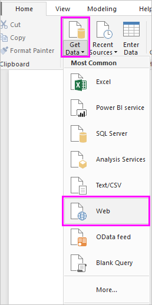
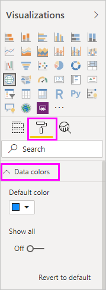

# Zelfstudie: Gegevens van een webpagina analyseren met Power BI Desktop

Als een fanatieke voetbalfan wilt u rapporteren over de winnaars van het UEFA Europees kampioenschap (Euro Cup) in de afgelopen jaren. Met Power BI Desktop kunt u deze gegevens vanuit een webpagina in een rapport importeren en visualisaties maken die de gegevens weergeven. In deze zelfstudie leert u hoe Power BI Desktop kunt gebruiken voor het volgende:

- Verbinding maken met een webgegevensbron en door alle beschikbare tabellen navigeren.
- Gegevens vormgeven en transformeren in de Power Query-editor.
- Een query een naam geven en importeren in een Power BI Desktop-rapport.
- Een kaart- en een cirkeldiagramvisualisatie maken en aanpassen.

## Verbinding maken met een webgegevensbron

U kunt de gegevens over de UEFA-winnaars verkrijgen uit de tabel met resultaten op de Wikipedia-pagina over het UEFA Europees kampioenschap (Engelstalig) op https://en.wikipedia.org/wiki/UEFA_European_Football_Championship. 

Er kunnen alleen webverbindingen worden gemaakt bij gebruik van basisverificatie. Websites waarvoor verificatie is vereist, werken mogelijk niet goed met de webconnector.

Ga als volgt te werk om de gegevens te importeren:

1. Klik op het linttabblad **Start** van Power BI Desktop op de pijl van de vervolgkeuzelijst **Gegevens ophalen** en selecteer **Web**.

    

   >[!NOTE]
   >U kunt ook het item **Gegevens ophalen** zelf selecteren of **Gegevens ophalen** in het dialoogvenster Aan de slag in Power BI Desktop selecteren en vervolgens **Web** selecteren in de sectie **Alles** of **Overige** van het dialoogvenster **Gegevens ophalen**. Selecteer vervolgens **Verbinding maken**.

1. Plak in het dialoogvenster **Van web** de URL `https://en.wikipedia.org/wiki/UEFA_European_Football_Championship` in het tekstvak **URL** en selecteer **OK**.

    

   Nadat u verbinding hebt gemaakt met de Wikipedia-pagina (Engelstalig), wordt in het dialoogvenster **Navigator** een lijst met beschikbare tabellen op de pagina weergegeven. U kunt een van de tabelnamen selecteren om een voorbeeld van de gegevens weer te geven. De tabel **Resultaten [bewerken]** bevat de gegevens die u zoekt, hoewel deze niet precies in de gewenste vorm zijn. Voordat u de gegevens in uw rapport laadt, geeft u ze vorm en schoont u ze op.

   

   >[!NOTE]
   >In het deelvenster **Voorbeeld** wordt de meest recent geselecteerde tabel weergegeven, maar alle geselecteerde tabellen worden geladen in de Power Query-editor wanneer u **Gegevens transformeren** of **Laden** selecteert.

1. Selecteer de tabel **Resultaten [bewerken]** in de lijst **Navigator**, en selecteer vervolgens **Gegevens transformeren**.

   In **Power Query-editor** wordt een voorbeeld van de tabel geopend, waarin u transformaties kunt toepassen om de gegevens op te schonen.

   

## Gegevens vormgeven in Power Query-Editor

U wilt de gegevens gemakkelijker te scannen maken door alleen het jaar en de landen die gewonnen hebben weer te geven. U kunt Power Query-editor gebruiken om deze stappen voor het vormgeven en opschonen van gegevens uit te voeren.

Verwijder eerst alle kolommen, behalve twee uit de tabel. Wijzig de namen van deze kolommen in *Year* en *Country* verderop in het proces.

1. Selecteer de kolommen in het raster **Power Query-editor**. Selecteer Ctrl om meerdere items te selecteren.

1. Klik met de rechtermuisknop en selecteer **Andere kolommen verwijderen** of selecteer **Kolommen verwijderen** > **Andere kolommen verwijderen** in de groep **Kolommen beheren** op het linttabblad **Start** en verwijder alle overige kolommen uit de tabel.

   

   of

   

Verwijder vervolgens het extra woord *Details* uit de eerste kolomcellen.

1. Selecteer de eerste kolom.

1. Klik met de rechtermuisknop en selecteer **Waarden vervangen** of selecteer **Waarden vervangen** in de groep **Transformeren** op het tabblad **Start** van het lint. Deze optie is ook te vinden in de groep **Alle kolommen** op het tabblad **Transformeren**.

    

   of

   

1. Typ in het dialoogvenster **Waarden vervangen** **Details** in het tekstvak **Te zoeken waarde** en laat het tekstvak **Vervangen door** leeg. Selecteer **OK** om het woord *Details* uit deze kolom te verwijderen.

   

Sommige cellen bevatten alleen het woord 'Year' in plaats van jaarwaarden. U kunt de kolom filteren om alleen rijen weer te geven die het woord 'Year' niet bevatten.

1. Selecteer de vervolgkeuzepijl voor het filteren van de kolom.

1. Schuif in de vervolgkeuzelijst omlaag en schakel het selectievakje naast de optie **Jaar** uit. Selecteer vervolgens **OK**.

   

U kijkt nu alleen naar de lijst met winnaars. U kunt dus nu de naam van de tweede kolom wijzigen in **Country**. Ga als volgt te werk om de naam van de kolom te wijzigen:

1. Dubbelklik of tik op de tweede kolomkop en houd deze vast, of
   - Klik met de rechtermuisknop op de kolomkop en selecteer **Naam wijzigen**, of
   - Selecteer de *kolom en selecteer **Naam wijzigen** in de groep **Alle kolommen** op het tabblad **Transformeren** van het lint.

    
  
   of

   

1. Typ **Country** in de koptekst en druk op **Enter** om de naam van de kolom te wijzigen.

Ook wilt u rijen zoals '2020' wegfilteren die null-waarden in de kolom **Country** bevatten. U kunt het filtermenu gebruiken zoals u hebt gedaan met de **Year**-waarden, of u kunt:

1. Met de rechtermuisknop op de cel **Country** in de rij **2020** klikken, die de waarde *null* heeft.

1. **Tekstfilters** > **Is niet gelijk aan** in het contextmenu selecteren om rijen die de waarde van deze cel bevatten te verwijderen.

   

## De query importeren in de rapportweergave

Nu u de gegevens de gewenste vorm hebt gegeven, kunt u de query de naam 'Euro Cup Winners' geven en importeren in uw rapport.

1. Voer in het deelvenster **Queryinstellingen** in het tekstvak **Naam** **Euro Cup Winners** in.

   

1. Selecteer **Sluiten en toepassen** > **Sluiten en toepassen** op het tabblad **Start** van het lint.

   

De query wordt geladen in de *rapportweergave* van Power BI Desktop. Deze kunt u zien in het deelvenster **Velden**.

   

>[!TIP]
>U kunt altijd terug naar Power Query-editor om uw query te bewerken en te verfijnen door:
>- Het beletselteken ( **...** ) **Meer opties** naast **Euro Cup Winners** in het deelvenster **Velden** te selecteren en **Query bewerken** te selecteren, of
>- **Query's bewerken** > **Query's bewerken** te selecteren in de groep **Externe gegevens** van het linttabblad **Start** in de rapportweergave. 

## Een visualisatie maken

Ga als volgt te werk om een visualisatie te maken op basis van uw gegevens:

1. Selecteer het veld **Country** in het deelvenster **Velden** of sleep het naar het rapportcanvas. Power BI Desktop herkent de gegevens als landnamen en maakt automatisch een **kaart** visualisatie.

   

1. Vergroot de kaart door te slepen met de grepen in de hoeken, zodat de namen van alle winnende landen zichtbaar zijn.  

   

1. De kaart toont identieke gegevenspunten voor elk land dat een toernooi Euro Cup-toernooi heeft gewonnen. Als u wilt dat de grootte van elk gegevenspunt weergeeft hoe vaak het land heeft gewonnen, sleept u het veld **Year** naar **Sleep gegevensvelden hierheen** onder **Grootte** in het onderste gedeelte van het deelvenster **Visualisaties**. Het veld wordt automatisch gewijzigd in de meetwaarde **Count of Year** en de kaartvisualisatie toont nu grotere gegevenspunten voor landen die meer toernooien hebben gewonnen.

   

## De visualisatie aanpassen

Zoals u ziet, is het zeer eenvoudig om visualisaties te maken op basis van uw gegevens. U kunt uw visualisaties ook eenvoudig aanpassen om de gegevens beter te presenteren op manieren die u wilt.

### De kaart opmaken

U kunt de weergave van een visualisatie wijzigen door deze te selecteren en vervolgens te klikken op het pictogram **Opmaak** (verfroller) in het deelvenster **Visualisaties**. De gegevenspunten 'Duitsland' in uw visualisatie kunnen bijvoorbeeld misleidend zijn, omdat West-Duitsland twee toernooien heeft gewonnen en Duitsland er een heeft gewonnen en de kaart de twee punten over elkaar heen plaatst in plaats van deze van elkaar te scheiden of bij elkaar op te tellen. U kunt deze twee punten een andere kleur geven om dit feit te markeren. U kunt de kaart ook een aantrekkelijkere en meer beschrijvende titel geven.

1. Selecteer met de visualisatie geselecteerd het pictogram **Opmaak** en selecteer vervolgens **Gegevenskleuren** om de opties voor gegevenskleuren uit te vouwen.

   

1. Schakel **Alles weergeven** in op **Aan** en selecteer vervolgens de vervolgkeuzelijst naast **West Germany** en kies de kleur geel.

   

1. Selecteer **Titel** om de opties voor titels uit te vouwen en typ in het veld **Titeltekst** de tekst **Euro Cup Winners** in plaats van de huidige titel.

1. Wijzig de **Tekenkleur** in rood, de **Tekengrootte** in **12** en de **Lettertypefamilie** in **Segoe (Bold)** .

   

De visualisatie van uw kaart ziet er nu als volgt uit:

### Het type visualisatie wijzigen

U kunt het type visualisatie wijzigen door dit te selecteren en vervolgens boven aan het deelvenster **Visualisaties** op een ander pictogram te klikken. Op uw kaartvisualisatie ontbreken bijvoorbeeld de gegevens voor de Sovjetunie en Tsjechoslowakije, omdat deze landen niet meer op de wereldkaart bestaan. Een ander type visualisatie zoals een treemap of cirkeldiagram zijn mogelijk nauwkeuriger, omdat alle waarden worden weergegeven.

Als u de kaart wilt wijzigen in een cirkeldiagram, selecteert u de kaart en selecteert u vervolgens het pictogram **Cirkeldiagram** in het deelvenster **Visualisaties**.

>[!TIP]
>- U kunt de opmaakopties voor **Gegevenskleuren** gebruiken om 'Duitsland' en 'West Duitsland' dezelfde kleur te geven. 
>- Als u de landen met de meeste overwinningen samen in het cirkeldiagram wilt groeperen, selecteert u het beletselteken ( **...** ) rechts boven in de visualisatie en selecteert u vervolgens **Sorteren op aantal jaar**.

Power BI Desktop biedt een naadloze complete ervaring voor het ophalen van gegevens uit een breed scala aan gegevensbronnen en het vormgeven van deze gegevens om te voldoen aan uw analysebehoeften. Zo kunt u deze gegevens op uitgebreide en interactieve manieren visualiseren. Wanneer uw rapport klaar is, kunt u [het uploaden naar Power BI](../create-reports/desktop-upload-desktop-files.md) en op basis van dit rapport dashboards maken die u kunt delen met andere Power BI-gebruikers.

## Zie ook

* [Microsoft Learn for Power BI](/learn/powerplatform/power-bi?WT.mc_id=powerbi_landingpage-docs-link)
* [Power BI Desktop-video's bekijken](../fundamentals/desktop-videos.md)
* [Een bezoek brengen aan het Power BI-forum](https://go.microsoft.com/fwlink/?LinkID=519326)
* [Het Power BI-blog lezen](https://go.microsoft.com/fwlink/?LinkID=519327)