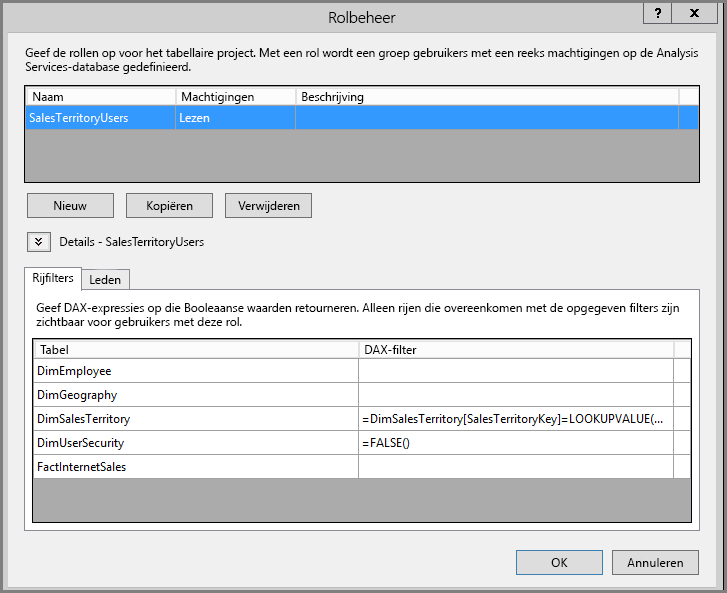
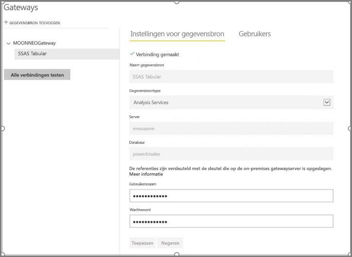
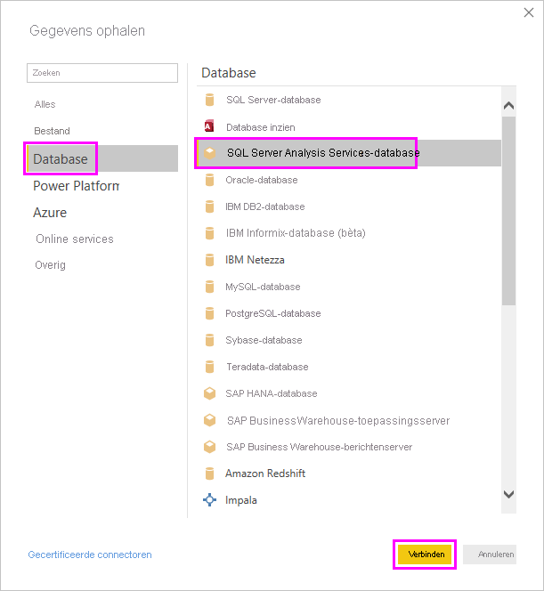
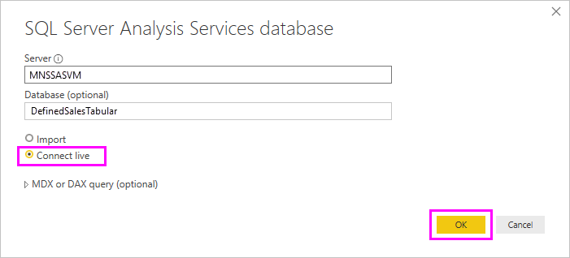
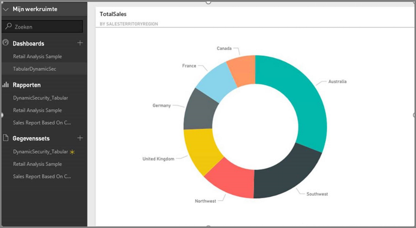
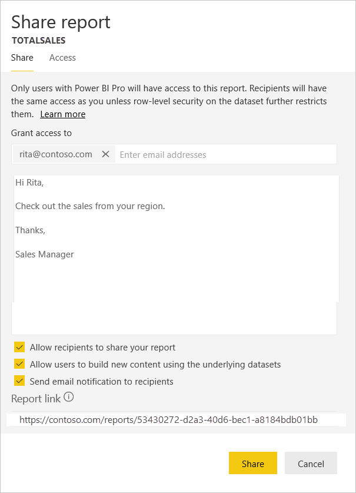

# <a name="implement-row-level-security-in-an-on-premises-analysis-services-tabular-model"></a>Beveiliging op rijniveau implementeren in een on-premises tabellair Analysis Services-model

In deze zelfstudie gebruikt u een voorbeeldgegevensset om de onderstaande stappen uit te voeren. U leert hierbij [**beveiliging op rijniveau**](../admin/service-admin-rls.md) in een on-premises *tabellair Analysis Services-model* te implementeren en deze te gebruiken in een Power BI-rapport.

* Een nieuwe beveiligingstabel maken in de [database AdventureworksDW2012](https://github.com/Microsoft/sql-server-samples/releases/tag/adventureworks)
* Het tabellaire model opbouwen met de benodigde feiten- en dimensietabellen
* Gebruikersrollen en machtigingen definiëren
* Het model implementeren in een *tabellair Analysis Services*-exemplaar
* Een Power BI Desktop-rapport samenstellen waarin gegevens worden weergegeven die zijn afgestemd op de gebruiker die het rapport opent
* Het rapport implementeren in de *Power BI-service*
* Een nieuw dashboard maken op basis van het rapport
* Het dashboard delen met uw collega's

Voor deze zelfstudie is de [database AdventureworksDW2012](https://github.com/Microsoft/sql-server-samples/releases/tag/adventureworks) vereist.

## <a name="task-1-create-the-user-security-table-and-define-data-relationship"></a>Taak 1: De gebruikersbeveiligingstabel maken en de gegevensrelatie definiëren

Er zijn veel artikelen waarin wordt beschreven hoe u dynamische beveiliging op rijniveau met het *tabellaire model van SQL Server Analysis Services (SSAS)* kunt definiëren. Voor ons voorbeeld gebruiken we [Implement Dynamic Security by Using Row Filters](/analysis-services/tutorial-tabular-1200/supplemental-lesson-implement-dynamic-security-by-using-row-filters) (Dynamische beveiliging implementeren door rijfilters te gebruiken).

Voor de hier beschreven stappen is de relationele database AdventureworksDW2012 vereist.

1. Maak in AdventureworksDW2012 de tabel `DimUserSecurity`(zie hieronder). U kunt [SQL Server Management Studio (SSMS)](/sql/ssms/download-sql-server-management-studio-ssms) gebruiken om de tabel te maken.

   

1. Wanneer u de tabel hebt gemaakt en opgeslagen, moet u de relatie tussen de kolom `SalesTerritoryID` van de tabel `DimUserSecurity` en de kolom `SalesTerritoryKey` van de tabel `DimSalesTerritory` instellen, zoals hieronder wordt weergegeven.

   Klik in SSMS met de rechtermuisknop op de tabel **DimUserSecurity** en selecteer **Ontwerpen**. Selecteer vervolgens **Tabelontwerpfunctie** > **Relaties...** . Wanneer u klaar bent, slaat u de tabel op.

   

1. Voeg gebruikers toe aan de tabel. Klik met de rechtermuisknop op **DimUserSecurity** en selecteer **Bovenste 200 rijen bewerken**. Zodra u gebruikers hebt toegevoegd, moet de tabel `DimUserSecurity` er ongeveer als volgt uitzien:

   

   In latere taken komen deze gebruikers terug.

1. Voer vervolgens een *inner join* uit op de tabel `DimSalesTerritory`. In deze tabel worden de regiodetails van de gebruiker weergegeven. De inner join wordt met de hier weergegeven SQL-code uitgevoerd en in de afbeelding is te zien hoe de tabel vervolgens wordt weergegeven.

    ```sql
    select b.SalesTerritoryCountry, b.SalesTerritoryRegion, a.EmployeeID, a.FirstName, a.LastName, a.UserName from [dbo].[DimUserSecurity] as a join [dbo].[DimSalesTerritory] as b on a.[SalesTerritoryID] = b.[SalesTerritoryKey]
    ```

   U ziet in de samengevoegde tabel wie er verantwoordelijk is voor elke verkoopregio, dankzij de relatie die is gemaakt in stap 2. U kunt bijvoorbeeld zien dat *Rita Santos* verantwoordelijk is voor *Australië*.

## <a name="task-2-create-the-tabular-model-with-facts-and-dimension-tables"></a>Taak 2: Het tabellaire model met feiten- en dimensietabellen maken

Zodra de relationele datawarehouse is geïnstalleerd, moet u het tabellaire model definiëren. U kunt het model maken met behulp van [SQL Server Data Tools (SSDT)](/sql/ssdt/sql-server-data-tools). Zie [Create a New Tabular Model Project](/analysis-services/tutorial-tabular-1400/as-lesson-1-create-a-new-tabular-model-project) (Een nieuw project voor een tabellaire model maken) voor meer informatie.

1. Importeer alle benodigde tabellen in het model zoals hieronder wordt weergegeven.

    

1. Nadat u de benodigde tabellen hebt geïmporteerd, moet u een rol met de naam *SalesTerritoryUsers* definiëren met een machtiging voor lezen. Selecteer het menu **Model** in SQL Server Data Tools en selecteer vervolgens **Rollen**. Selecteer **Nieuw** in **Rolbeheer**.

1. Voeg onder **Leden** in **Rolbeheer** de gebruikers toe die u hebt gedefinieerd in de tabel `DimUserSecurity` in [taak 1](#task-1-create-the-user-security-table-and-define-data-relationship).

    

1. Voeg vervolgens de juiste functies toe voor de tabellen `DimSalesTerritory` en `DimUserSecurity`, zoals hieronder weergegeven op het tabblad **Rijfilters**.

    

1. Met de functie `LOOKUPVALUE` worden waarden geretourneerd voor een kolom waarin de Windows-gebruikersnaam hetzelfde is als de gebruikersnaam die wordt geretourneerd door de functie `USERNAME`. Vervolgens kunt u query's beperken tot waar de door `LOOKUPVALUE` geretourneerde waarden overeenkomen met de waarden in dezelfde of een verwante tabel. Typ de volgende formule in de kolom **DAX Filter**:

    ```dax
        =DimSalesTerritory[SalesTerritoryKey]=LOOKUPVALUE(DimUserSecurity[SalesTerritoryID], DimUserSecurity[UserName], USERNAME(), DimUserSecurity[SalesTerritoryID], DimSalesTerritory[SalesTerritoryKey])
    ```

    In deze formule retourneert u met de functie `LOOKUPVALUE` alle waarden voor de kolom `DimUserSecurity[SalesTerritoryID]`, waarbij de `DimUserSecurity[UserName]` hetzelfde is als de huidige aangemelde Windows-gebruikersnaam en `DimUserSecurity[SalesTerritoryID]` hetzelfde is als de `DimSalesTerritory[SalesTerritoryKey]`.

    > [!IMPORTANT]
    > Als u beveiliging op rijniveau gebruikt, wordt de DAX-functie [USERELATIONSHIP](/dax/userelationship-function-dax) niet ondersteund.

   De set met `LOOKUPVALUE` van de `SalesTerritoryKey` van de verkoop wordt vervolgens gebruikt om de rijen die in de `DimSalesTerritory` worden weergegeven, te beperken. Alleen rijen waar de waarde `SalesTerritoryKey` voorkomt in de id's die zijn geretourneerd door de functie `LOOKUPVALUE`, worden weergegeven.

1. Voeg voor de tabel `DimUserSecurity` de volgende formule toe in de kolom **DAX Filter**:

    ```dax
        =FALSE()
    ```

    Deze formule geeft aan dat alle kolommen worden omgezet naar `false`. Dit houdt in dat er geen query voor `DimUserSecurity`-tabelkolommen kan worden uitgevoerd.

Nu moet u het model verwerken en implementeren. Zie [Implementeren](/analysis-services/tutorial-tabular-1200/lesson-13-deploy) voor meer informatie.

## <a name="task-3-add-data-sources-within-your-on-premises-data-gateway"></a>Taak 3: Gegevensbronnen toevoegen binnen uw on-premises gegevensgateway

Nadat het tabellaire model is geïmplementeerd en klaar is voor gebruik, moet u een gegevensbronverbinding toevoegen aan uw tabellaire on-premises Analysis Services-server.

1. Als u de Power BI-service toegang tot uw on-premises analyseservice wilt geven, moet u een [on-premises gegevensgateway](service-gateway-onprem.md) hebben geïnstalleerd en geconfigureerd in uw omgeving.

1. Als de gateway correct is geconfigureerd, moet u gegevensbronverbinding maken voor uw tabellaire *Analysis Services*-exemplaar. Zie [Uw gegevensbron beheren - Analysis Services](service-gateway-enterprise-manage-ssas.md) voor meer informatie.

   

Als u deze procedure hebt voltooid, is de gateway geconfigureerd en gereed voor communicatie met uw on-premises Analysis Services-gegevensbron.

## <a name="task-4-create-report-based-on-analysis-services-tabular-model-using-power-bi-desktop"></a>Taak 4: Een rapport maken op basis van het tabellaire Analysis Services-model met behulp van Power BI Desktop

1. Start Power BI Desktop en selecteer **Gegevens ophalen** > **Database**.

1. Selecteer in de lijst met gegevensbronnen **SQL Server Analysis Services-database** en selecteer **Verbinding maken**.

   

1. Vul de details van uw tabellaire Analysis Services-exemplaar in en selecteer **Live verbinding maken**. Selecteer **OK**.
  
   

   In Power BI werkt dynamische beveiliging alleen bij een liveverbinding.

1. U kunt zien dat het model is geïmplementeerd in het Analysis Services-exemplaar. Selecteer het betreffende model en selecteer vervolgens **OK**.

   In Power BI Desktop worden nu alle beschikbare velden weergegeven, rechts van het canvas in het deelvenster **Velden**.

1. Selecteer in het deelvenster **Velden** de meting **SalesAmount** in de tabel **FactInternetSales** en de dimensie **SalesTerritoryRegion** in de tabel **SalesTerritory**.

1. We willen dit rapport simpel houden, dus we zullen nu geen kolommen meer toevoegen. Als we de gegevens wat duidelijker willen weergeven, wijzigen we de visualisatie in **Ringdiagram**.

   

1. Zodra het rapport gereed is, kunt u het direct publiceren naar de Power BI-portal. Selecteer in het lint **Start** van Power BI Desktop de optie **Publiceren**.

## <a name="task-5-create-and-share-a-dashboard"></a>Taak 5: Een dashboard maken en delen

U hebt het rapport gemaakt en naar de **Power BI**-service gepubliceerd. U kunt nu het voorbeeld gebruiken dat in de vorige stappen is gemaakt, om het modelbeveiligingsscenario te demonstreren.

Met de rol van *Verkoopmanager* kan gebruiker Grace de gegevens bekijken van alle verschillende verkoopregio's. Grace maakt dit rapport en publiceert dit naar de Power BI-service. Dit rapport is gemaakt in de vorige taken.

Nadat Grace het rapport heeft gepubliceerd, moet in de Power BI-service een dashboard met de naam *TabularDynamicSec* worden gemaakt op basis van dat rapport. In de volgende afbeelding ziet u dat Grace de gegevens van alle verkoopregio's kan bekijken.

   

Grace deelt het dashboard nu met een collega, Rita, die verantwoordelijk is voor de verkoop in de regio Australië.

   

Wanneer Rita zich aanmeldt bij de Power BI-service en het door Grace gemaakte en gedeelde dashboard bekijkt, is alleen de verkoop van de regio Australië zichtbaar.

Gefeliciteerd. In de Power BI-service wordt nu de dynamische beveiliging op rijniveau weergegeven die is gedefinieerd in het tabellaire on-premises Analysis Services-model. Power BI gebruikt de eigenschap `EffectiveUserName` om de huidige Power BI-gebruikersreferenties te verzenden naar de on-premises gegevensbron waarop de query's worden uitgevoerd.

## <a name="task-6-understand-what-happens-behind-the-scenes"></a>Taak 6: Begrijpen wat er achter de schermen gebeurt

Bij deze taak wordt ervan uitgegaan dat u bekend bent met [SQL Server Profiler](/sql/tools/sql-server-profiler/sql-server-profiler), omdat u een SQL Server Profiler-tracering op uw tabellaire on-premises SSAS-exemplaar moet vastleggen.

De sessie wordt geïnitialiseerd zodra de gebruiker, Rita, het dashboard opent in de Power BI-service. U kunt zien dat de rol **salesterritoryusers** onmiddellijk van kracht wordt met de effectieve gebruikersnaam als **<EffectiveUserName>rita@contoso.com</EffectiveUserName>**
```
       <PropertyList><Catalog>DefinedSalesTabular</Catalog><Timeout>600</Timeout><Content>SchemaData</Content><Format>Tabular</Format><AxisFormat>TupleFormat</AxisFormat><BeginRange>-1</BeginRange><EndRange>-1</EndRange><ShowHiddenCubes>false</ShowHiddenCubes><VisualMode>0</VisualMode><DbpropMsmdFlattened2>true</DbpropMsmdFlattened2><SspropInitAppName>PowerBI</SspropInitAppName><SecuredCellValue>0</SecuredCellValue><ImpactAnalysis>false</ImpactAnalysis><SQLQueryMode>Calculated</SQLQueryMode><ClientProcessID>6408</ClientProcessID><Cube>Model</Cube><ReturnCellProperties>true</ReturnCellProperties><CommitTimeout>0</CommitTimeout><ForceCommitTimeout>0</ForceCommitTimeout><ExecutionMode>Execute</ExecutionMode><RealTimeOlap>false</RealTimeOlap><MdxMissingMemberMode>Default</MdxMissingMemberMode><DisablePrefetchFacts>false</DisablePrefetchFacts><UpdateIsolationLevel>2</UpdateIsolationLevel><DbpropMsmdOptimizeResponse>0</DbpropMsmdOptimizeResponse><ResponseEncoding>Default</ResponseEncoding><DirectQueryMode>Default</DirectQueryMode><DbpropMsmdActivityID>4ea2a372-dd2f-4edd-a8ca-1b909b4165b5</DbpropMsmdActivityID><DbpropMsmdRequestID>2313cf77-b881-015d-e6da-eda9846d42db</DbpropMsmdRequestID><LocaleIdentifier>1033</LocaleIdentifier><EffectiveUserName>rita@contoso.com</EffectiveUserName></PropertyList>
```
Op basis van de aanvraag voor de effectieve gebruikersnaam wordt de aanvraag in Analysis Services omgezet naar de werkelijke referentie `contoso\rita` na het uitvoeren van de query op de lokale Active Directory. Als Analysis Services de referentie heeft ontvangen, retourneert Analysis Services de gegevens die de gebruiker mag bekijken en openen.

Als er meer activiteit plaatsvindt in het dashboard, ziet u dat er in SQL Profiler een specifieke query wordt geretourneerd naar het tabellaire Analysis Services-model als een DAX-query. Als Rita bijvoorbeeld vanuit het dashboard naar het onderliggende rapport navigeert, wordt de volgende query uitgevoerd.

   

Hieronder ziet u ook de DAX-query die wordt uitgevoerd om rapportgegevens in te vullen.
   
   ```dax
   EVALUATE
     ROW(
       "SumEmployeeKey", CALCULATE(SUM(Employee[EmployeeKey]))
     )
   
   <PropertyList xmlns="urn:schemas-microsoft-com:xml-analysis">``
             <Catalog>DefinedSalesTabular</Catalog>
             <Cube>Model</Cube>
             <SspropInitAppName>PowerBI</SspropInitAppName>
             <EffectiveUserName>rita@contoso.com</EffectiveUserName>
             <LocaleIdentifier>1033</LocaleIdentifier>
             <ClientProcessID>6408</ClientProcessID>
             <Format>Tabular</Format>
             <Content>SchemaData</Content>
             <Timeout>600</Timeout>
             <DbpropMsmdRequestID>8510d758-f07b-a025-8fb3-a0540189ff79</DbpropMsmdRequestID>
             <DbPropMsmdActivityID>f2dbe8a3-ef51-4d70-a879-5f02a502b2c3</DbPropMsmdActivityID>
             <ReturnCellProperties>true</ReturnCellProperties>
             <DbpropMsmdFlattened2>true</DbpropMsmdFlattened2>
             <DbpropMsmdActivityID>f2dbe8a3-ef51-4d70-a879-5f02a502b2c3</DbpropMsmdActivityID>
           </PropertyList>
   ```

## <a name="considerations"></a>Overwegingen

* On-premises beveiliging op rijniveau met Power BI is alleen beschikbaar bij een liveverbinding.

* Dankzij de liveverbinding van de Power BI-service zijn eventuele wijzigingen in de gegevens na het verwerken van het model onmiddellijk beschikbaar voor de gebruikers die het rapport openen.
