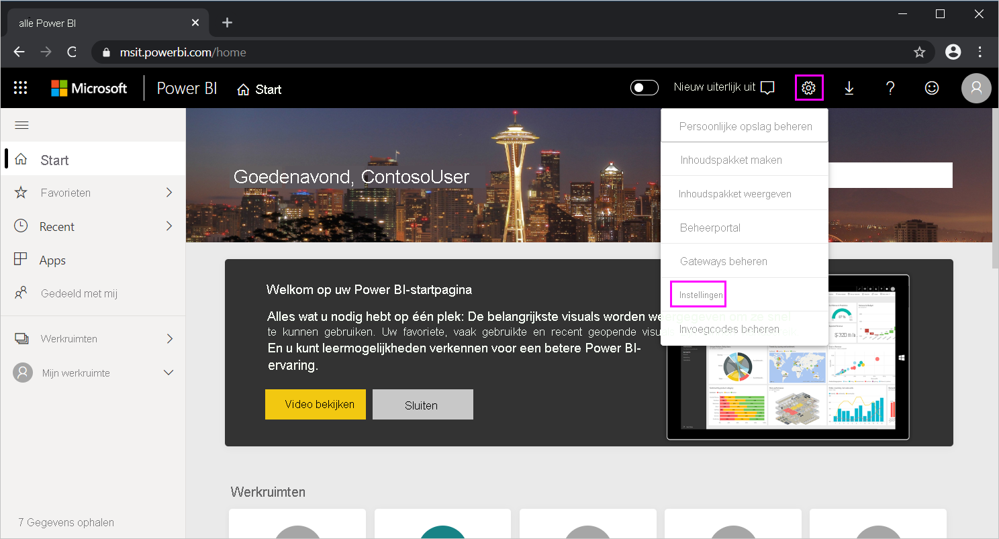

# <a name="use-directquery-in-power-bi-desktop"></a>DirectQuery in Power BI Desktop gebruiken
Wanneer u in *Power BI Desktop* verbinding maakt met een gegevensbron, kunt u altijd een kopie van de gegevens in Power BI Desktop importeren. Voor sommige gegevensbronnen kunt u ook rechtstreeks verbinding maken met de gegevensbron via DirectQuery.

## <a name="supported-data-sources"></a>Ondersteunde gegevensbronnen
Zie [Gegevensbronnen die worden ondersteund door DirectQuery](power-bi-data-sources.md) voor een volledige lijst van gegevensbronnen die worden ondersteund door DirectQuery.

## <a name="how-to-connect-using-directquery"></a>Verbinding maken met DirectQuery
Als u **Gegevens ophalen** gebruikt om verbinding te maken met een gegevensbron die wordt ondersteund door DirectQuery, kunt u in het verbindingsvenster selecteren hoe u verbinding wilt maken. Selecteer bijvoorbeeld in Power BI Desktop onder het lint **Start**, **Gegevens ophalen** > **SQL Server**. In het dialoogvenster **SQL Server Data Base** worden in de **Gegevensverbindingsmodus** opties weergegeven van **Importeren** en **DirectQuery**:


Dit zijn de verschillen tussen het selecteren van **Importeren** en **DirectQuery**:

- **Importeren**: de geselecteerde tabellen en kolommen worden geïmporteerd in Power BI Desktop. Als u een visualisatie maakt of ermee werkt, wordt in Power BI Desktop gebruikgemaakt van de geïmporteerde gegevens. U moet de gegevens vernieuwen om te zien welke wijzigingen zijn doorgevoerd in de onderliggende gegevens na de eerste importbewerking of de meest recente vernieuwing.

- **DirectQuery**: er worden geen gegevens geïmporteerd of gekopieerd naar Power BI Desktop. Voor relationele bronnen worden de geselecteerde tabellen en kolommen weergegeven in de lijst **Velden**. Voor multidimensionale bronnen, zoals SAP Business Warehouse, worden de dimensies en metingen van de geselecteerde kubus weergegeven in de lijst **Velden**. Als u een visualisatie maakt of ermee werkt, wordt in Power BI Desktop een query op de onderliggende gegevensbron uitgevoerd. De weergegeven gegevens zijn dus altijd de actuele gegevens.

Er zijn veel gegevensmodellen en gegevenstransformaties beschikbaar voor DirectQuery, met enige beperkingen. Wanneer u een visualisatie maakt of ermee werkt, moet u een query uitvoeren op de onderliggende bron. De tijd die nodig is om de visual te vernieuwen, is afhankelijk van de prestaties van de onderliggende gegevensbron. Wanneer de benodigde gegevens voor de aanvraag recentelijk zijn opgevraagd, worden in Power BI Desktop de recente gegevens gebruikt zodat de visualisatie sneller wordt weergegeven. Als u **Vernieuwen** selecteert in het lint **Start** worden alle visualisaties vernieuwd met de actuele gegevens.

Zie het artikel [Power BI en DirectQuery](desktop-directquery-about.md) voor een gedetailleerde beschrijving van DirectQuery. Zie ook de volgende secties voor meer informatie over de voordelen en beperkingen en belangrijke overwegingen bij het gebruik van DirectQuery.

## <a name="benefits-of-using-directquery"></a>Voordelen van het gebruik van DirectQuery
Het gebruik van DirectQuery biedt de volgende voordelen:

- Met DirectQuery kunt u visualisaties maken van zeer grote gegevenssets waarvoor het anders ondoenlijk zou zijn om eerst alle gegevens vooraf te aggregeren en te importeren.
- Voor onderliggende gegevenswijzigingen kan het nodig zijn gegevens te vernieuwen. Voor sommige rapporten kan de noodzaak tot het weergeven van de actuele gegevens leiden tot te grote gegevensoverdrachten om de gegevens opnieuw te kunnen importeren. In DirectQuery-rapporten worden echter altijd de actuele gegevens gebruikt.
- De limiet voor de maximale grootte van een gegevensset van 1 GB *geldt niet* in DirectQuery.

## <a name="limitations-of-directquery"></a>Beperkingen van DirectQuery
Het gebruik van DirectQuery is onderhevig aan de volgende beperkingen:

- Als de query in **Query-editor** te complex is, treedt er een fout op. Om de fout te verhelpen, moet u de problematische stap in **Query-editor** verwijderen, of de gegevens *importeren* in plaats van DirectQuery te gebruiken. Bij multidimensionale bronnen, zoals SAP Business Warehouse, is er geen **Query-editor**.

- Time intelligence-functies zijn niet beschikbaar in DirectQuery. Speciale behandeling van datumkolommen (jaar, kwartaal, maand of dag) wordt bijvoorbeeld niet ondersteund in de modus DirectQuery.

- Om de prestaties van query's die naar de onderliggende gegevensbron worden verzonden acceptabel te houden, worden er beperkingen opgelegd aan de DAX-expressies die zijn toegestaan in metingen.

- Er geldt een limiet van één miljoen rijen voor cloudbronnen en on-premises bronnen zijn beperkt tot een gedefinieerde nettolading van ongeveer 4 MB per rij (afhankelijk van een eigen compressiealgoritme) of een gegevensgrootte van 16 MB voor de volledige visual. Bepaalde limieten kunnen bij gebruik van Premium-capaciteit worden verhoogd. Deze limiet is niet van invloed op aggregaties of berekeningen die worden gebruikt om de gegevensset te maken die met DirectQuery wordt geretourneerd. Dit is alleen van invloed op de geretourneerde rijen. Met Premium-capaciteiten kunnen limieten voor rijen worden ingesteld zoals wordt beschreven in [dit bericht](https://powerbi.microsoft.com/blog/five-new-power-bi-premium-capacity-settings-is-available-on-the-portal-preloaded-with-default-values-admin-can-review-and-override-the-defaults-with-their-preference-to-better-fence-their-capacity/). 

    U kunt bijvoorbeeld 10 miljoen rijen samenvoegen met uw query die op de gegevensbron wordt uitgevoerd. De query retourneert nauwkeurig de resultaten van die aggregatie naar Power BI met behulp van DirectQuery als de geretourneerde Power BI gegevens minder dan 1 miljoen rijen zijn. Als er meer dan één miljoen rijen worden geretourneerd vanuit DirectQuery, ziet u een foutmelding van Power BI (tenzij in een Premium-capaciteit en het aantal rijen lager is dan de limiet van de beheerder).


## <a name="important-considerations-when-using-directquery"></a>Belangrijke overwegingen bij het gebruik van DirectQuery
Houd rekening met de volgende drie punten wanneer u DirectQuery gebruikt:

- **Prestaties en belasting**: alle DirectQuery-aanvragen worden verzonden naar de brondatabase, zodat de benodigde tijd voor het vernieuwen van een visual afhankelijk is van de tijd die deze back-end-bron nodig heeft om de resultaten van de query (of query's) te retourneren. De aanbevolen reactietijd (de tijd waarin de aangevraagde gegevens worden geretourneerd) van DirectQuery voor visuals is vijf seconden of minder. De aanbevolen maximumreactietijd is 30 seconden. Als de reactietijd nog groter wordt, wordt de gebruikerservaring van het rapport onaanvaardbaar negatief. Nadat een rapport is gepubliceerd naar de Power BI-service en een query langer duurt dan een paar minuten, treedt er bovendien een time-out op en wordt er een foutbericht weergegeven.
  
    Houd ook rekening met de belasting van de brondatabase op basis van het aantal Power BI-gebruikers dat het gepubliceerde rapport gebruikt. Het gebruik van **beveiliging op rijniveau** (RLS) kan ook van invloed zijn. Een niet-RLS dashboardtegel die door meerdere gebruikers wordt gedeeld, resulteert in één enkele query op de database. Het gebruik van RLS op een dashboardtegel betekent echter meestal dat voor het vernieuwen van een tegel één query *per gebruiker* nodig is, waardoor de belasting van de brondatabase aanzienlijk toeneemt en de prestaties mogelijk worden beïnvloed.
  
    In Power BI worden zo efficiënt mogelijke query's gemaakt. In bepaalde omstandigheden is de gegenereerde query mogelijk niet efficiënt genoeg om te voorkomen dat het vernieuwen mislukt. Een voorbeeld van deze situatie is wanneer een gegenereerde query een buitensporig groot aantal rijen uit de back-end-gegevensbron ophaalt. In dit geval treedt de volgende fout op:

    ```output
    The resultset of a query to external data source has exceeded
    ```
  
    Deze situatie kan zich voordoen bij een eenvoudig diagram met een kolom met een zeer hoge kardinaliteit, als de aggregatie-optie is ingesteld op **Niet samenvatten**. De visual mag alleen kolommen bevatten met een kardinaliteit van minder dan 1 miljoen, of de juiste filters moeten worden toegepast.

- **Beveiliging**: standaard maken alle gebruikers die een gepubliceerd rapport gebruiken verbinding met de back-endgegevensbron met behulp van de referenties die zijn ingevoerd na de publicatie van het rapport naar de Power BI-service. Dit proces is in feite hetzelfde als gegevens die worden geïmporteerd: alle gebruikers zien dezelfde gegevens, ongeacht eventuele beveiligingsregels die in de back-endbron zijn gedefinieerd.

    Klanten die beveiliging per gebruiker willen implementeren met DirectQuery-bronnen, moeten gebruikmaken van beveiliging op rijniveau of door Kerberos beperkte verificatie voor de bron configureren. Kerberos is niet beschikbaar voor alle bronnen. [Meer informatie over RLS](../admin/service-admin-rls.md). [Meer informatie over Kerberos in DirectQuery](service-gateway-sso-kerberos.md).

- **Ondersteunde functies**: niet alle functies in Power BI Desktop worden ondersteund in de DirectQuery-modus, of kunnen beperkt zijn. Bovendien zijn sommige functies in de Power BI-service (zoals *Snelle inzichten*) niet beschikbaar voor gegevenssets als DirectQuery wordt gebruikt. Bij het bepalen of u DirectQuery wilt gebruiken, moet u rekening houden met deze functiebeperkingen.

> [!NOTE]
> Wanneer u DirectQuery gebruikt in combinatie met Azure SQL Database en een privé-IP-adres, is een on-premises gateway vereist. 

## <a name="publish-to-the-power-bi-service"></a>Publiceren naar de Power BI-service
Rapporten die zijn gemaakt met DirectQuery, kunnen worden gepubliceerd naar de Power BI-service.

Als de **On-premises gegevensgateway** (**Azure SQL Database**, **Azure SQL Data Warehouse** of **Redshift**) niet vereist is voor de gegevensbron, moeten er referenties worden opgegeven voordat het gepubliceerde rapport in de Power BI-service wordt weergegeven. Volg deze instructies om de referenties op te geven:

1. Meld u aan bij [Power BI](https://www.powerbi.com/).
2. Selecteer in de Power BI-service het tandwielpictogram **Instellingen** en kies het menu-item **Instellingen**.

    

3. Selecteer in de pagina **Instellingen** van de Power BI-service het tabblad **Gegevenssets**, kies de gegevensset waarvoor DirectQuery wordt gebruikt, en selecteer **Referenties bewerken**.

4. Voeg de referenties toe. Anders treedt er een fout op wanneer u een gepubliceerd rapport opent of een gegevensset verkent die is gemaakt met een DirectQuery-verbinding.

Voor andere gegevensbronnen dan **Azure SQL Database**, **Azure SQL Data Warehouse**, **Redshift** of **Snowflake data Warehouse** die gebruikmaken van DirectQuery, moet u een **On-premises gegevensgateway** installeren en de gegevensbron registreren voordat er een verbinding tot stand kan worden gebracht. Zie [Wat is een on-premises gegevensgateway](service-gateway-onprem.md) voor meer informatie

## <a name="next-steps"></a>Volgende stappen
Bekijk de volgende bronnen voor meer informatie over DirectQuery:

- [DirectQuery gebruiken in Power BI](desktop-directquery-about.md)
- [Data sources supported by DirectQuery](power-bi-data-sources.md) (Gegevensbronnen die worden ondersteund door DirectQuery)
- [DirectQuery en SAP Business Warehouse (BW)](desktop-directquery-sap-bw.md)
- [DirectQuery en SAP HANA](desktop-directquery-sap-hana.md)
- [Wat is een on-premises gegevensgateway?](service-gateway-onprem.md)
