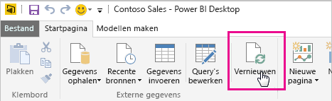
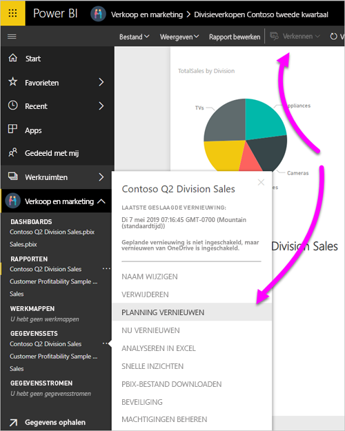
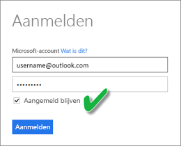

# Een gegevensset vernieuwen die is opgeslagen in OneDrive of SharePoint Online
Bestanden van OneDrive of SharePoint Online importeren naar de Power BI-service is een geweldige manier om uw werk in Power BI Desktop gesynchroniseerd te houden met de Power BI-service.

## Voordelen van het opslaan van een Power BI Desktop-bestand in OneDrive of SharePoint Online
Wanneer u een Power BI Desktop-bestand opslaat in OneDrive of SharePoint Online, worden alle gegevens die u in het model van uw bestand hebt geladen, geïmporteerd in de gegevensset. Alle rapporten die u in het bestand hebt gemaakt, worden geladen in **Rapporten** in de Power BI-service. Stel, u brengt wijzigingen aan in uw bestand in OneDrive of SharePoint Online. Deze wijzigingen kunnen bijvoorbeeld zijn: nieuwe metingen toevoegen, de namen van kolommen wijzigen, of het bewerken van visualisaties. Zodra u het bestand opslaat, wordt de Power BI-service ook gesynchroniseerd met deze wijzigingen. Meestal gebeurt dit ongeveer binnen een uur.

U kunt de gegevens eenmalig handmatig vernieuwen in Power BI Desktop door **Vernieuwen** te selecteren op het tabblad **Start** in het lint. Wanneer u **Vernieuwen** selecteert, vernieuwt u het model van het bestand met bijgewerkte gegevens uit de oorspronkelijke gegevensbron. Dit soort vernieuwen gebeurt volledig binnen de Power BI Desktop-toepassing zelf. Dit verschilt van een handmatige of geplande vernieuwing in Power BI. Het is belangrijk dat u dit verschil begrijpt.

Als u uw Power BI Desktop-bestand importeert uit OneDrive of SharePoint Online, laadt u de gegevens en informatie over het model in een gegevensset in Power BI. U kunt het beste de gegevensset in de Power BI-service vernieuwen omdat uw rapporten hierop zijn gebaseerd. Omdat de gegevensbronnen extern zijn, kunt u de gegevensset handmatig vernieuwen met **Nu vernieuwen** of een vernieuwingsschema opstellen met **Vernieuwen plannen**. 

Wanneer u de gegevensset vernieuwt, wordt in Power BI geen verbinding gemaakt met het bestand in OneDrive of SharePoint Online om de bijgewerkte gegevens op te halen. De informatie in de gegevensset wordt gebruikt om rechtstreeks verbinding te maken met de gegevensbronnen en de bijgewerkte gegevens op te halen. Vervolgens worden deze gegevens in de gegevensset geladen. Deze vernieuwde gegevens in de gegevensset worden niet gesynchroniseerd naar het bestand in OneDrive of SharePoint Online.

## Wat wordt ondersteund?
In Power BI worden **Vernieuwen** en **Vernieuwen plannen** ondersteund voor gegevenssets die zijn gemaakt uit Power BI Desktop-bestanden die zijn geïmporteerd van een lokaal station, waarbij u **Gegevens ophalen** of **Query-editor** gebruikt om verbinding te maken en gegevens te laden uit de volgende gegevensbronnen.

> [!NOTE]
> Het vernieuwen van Onedrive voor een liveverbinding met gegevenssets wordt ondersteund. Het wijzigen van de liveverbinding met een gegevensset, van de ene gegevensset naar een andere gegevensset in een al gepubliceerd rapport, wordt echter niet ondersteund in het scenario waarbij OneDrive wordt vernieuwd.

### Power BI Gateway - Personal
* Alle onlinegegevensbronnen die worden weergegeven in **Gegevens ophalen** en **Query-editor** in Power BI Desktop.
* Alle on-premises gegevensbronnen die worden weergegeven in **Gegevens ophalen** en **Query-editor** in Power BI Desktop, met uitzondering van Hadoop-bestanden (HDFS) en Microsoft Exchange.

<!-- Refresh Data sources-->
[!INCLUDE [refresh-datasources](../includes/refresh-datasources.md)]

> [!NOTE]
> Power BI kan alleen verbinding maken met on-premises gegevensbronnen en de gegevensset vernieuwen als een gateway is geïnstalleerd en actief is.
> 
> 

## OneDrive of OneDrive voor Bedrijven. Wat is het verschil?
Als u zowel een persoonlijk OneDrive-account als een OneDrive voor Bedrijven-account hebt, kunt u het beste alle bestanden die u wilt importeren in Power BI, bewaren in OneDrive voor Bedrijven. Waarom? Omdat u waarschijnlijk twee verschillende accounts gebruikt om u aan te melden.

Als u verbinding maakt met OneDrive voor Bedrijven in Power BI, is verbinden eenvoudig omdat uw Power BI-account vaak hetzelfde account is als uw OneDrive voor Bedrijven-account. Bij het persoonlijke OneDrive-account meldt u zich gewoonlijk aan met een ander [Microsoft-account](https://account.microsoft.com).

Wanneer u zich aanmeldt met uw Microsoft-account, moet u **Aangemeld blijven** selecteren. In dit geval kunnen alle wijzigingen die u aanbrengt in het bestand, in Power BI Desktop worden gesynchroniseerd met gegevenssets in Power BI.

Als u uw referenties in Microsoft hebt gewijzigd, kunt u geen wijzigingen synchroniseren tussen uw bestand in OneDrive en de gegevensset in Power BI. U moet verbinding maken met OneDrive en het bestand opnieuw importeren.

## Hoe kan ik een vernieuwing plannen?
Als u een vernieuwingsschema opstelt, maakt Power BI rechtstreeks verbinding met de gegevensbronnen. Power BI maakt gebruik van de verbindingsgegevens en referenties in de gegevensset om de bijgewerkte gegevens op te halen. Vervolgens worden de bijgewerkte gegevens in Power BI in de gegevensset geladen. Daarna worden eventuele rapportvisualisaties en dashboards bijgewerkt op basis van deze gegevensset in de Power BI-service.

Zie [Geplande vernieuwing configureren](refresh-scheduled-refresh.md) voor meer informatie over het opstellen van een vernieuwingsschema.

## Wanneer het fout gaat
Als er iets fout gaat, is dit meestal omdat Power BI niet kan worden aangemeld bij gegevensbronnen. Er kan ook iets misgaan als de gegevensset probeert verbinding te maken met een on-premises gegevensbron, maar de gateway offline is. Controleer eerst of Power BI kan worden aangemeld bij gegevensbronnen om deze problemen te voorkomen. Probeer u aan te melden bij uw gegevensbronnen in **Gegevensbronreferenties**. Soms wordt het wachtwoord gewijzigd dat u gebruikt om u aan te melden bij een gegevensbron, of wordt Power BI afgemeld bij een gegevensbron.

Als u uw wijzigingen opslaat in het Power BI Desktop-bestand in OneDrive maar deze wijzigingen na ongeveer een uur nog niet zichtbaar zijn in Power BI, kan dit zijn omdat Power BI mogelijk geen verbinding kan maken met OneDrive. Probeer nogmaals verbinding te maken met het bestand in OneDrive. Zorg ervoor dat u **Aangemeld blijven** selecteert, als u wordt gevraagd om u aan te melden. Omdat in Power BI geen verbinding met OneDrive tot stand kon worden gebracht om het bestand te synchroniseren, moet u het bestand opnieuw importeren.

Laat de optie **Mij e-mail met melding voor mislukte vernieuwing sturen** ingeschakeld. U wilt het immers direct weten als een geplande vernieuwing mislukt.

## Problemen oplossen
Soms gaat het vernieuwen van gegevens niet zoals u verwacht. Problemen met het vernieuwen van gegevens treden meestal op als u bent verbonden met een gateway. Zie de artikelen over het oplossen van problemen met de gateway voor informatie over hulpprogramma's en bekende problemen.

[Problemen met de on-premises gegevensgateway oplossen](service-gateway-onprem-tshoot.md)

[Problemen met Power BI Gateway - Personal oplossen](service-admin-troubleshooting-power-bi-personal-gateway.md)

Hebt u nog vragen? Misschien dat de[Power Bi-community](https://community.powerbi.com/) het antwoord weet.
