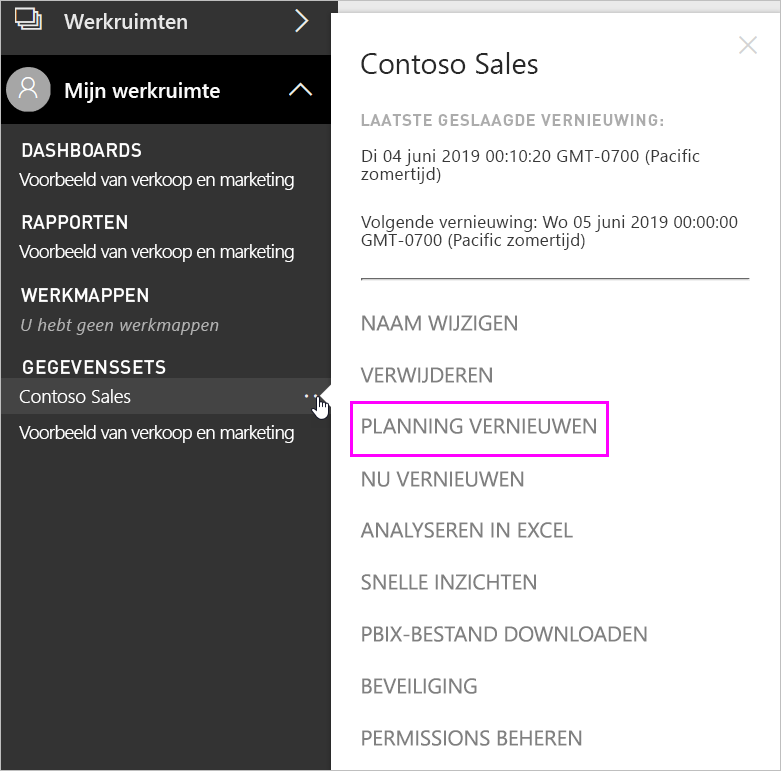
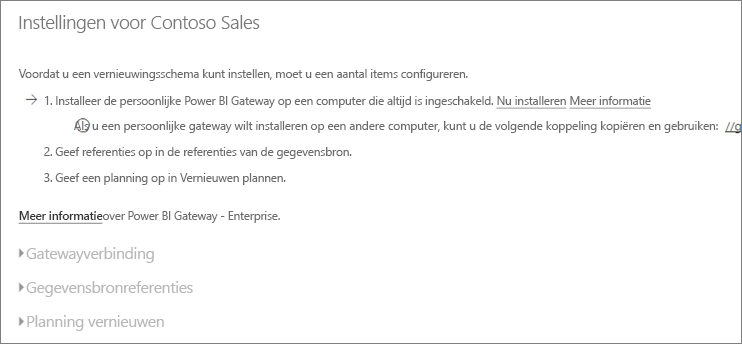
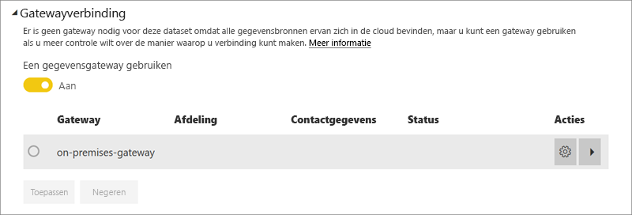
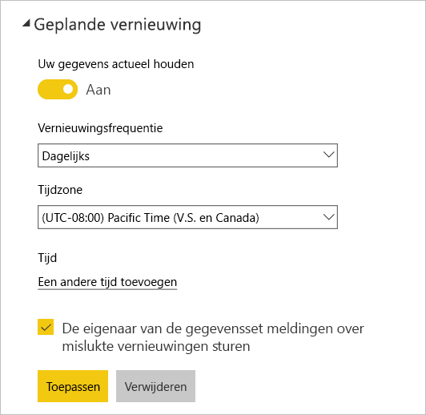

# Geplande vernieuwing configureren

>[!NOTE]
>Na twee maanden van inactiviteit wordt de geplande vernieuwing voor uw gegevensset onderbroken. Zie [*Geplande vernieuwing*](#scheduled-refresh) verderop in dit artikel voor meer informatie.

In dit artikel worden de opties voor geplande vernieuwing beschreven voor de [On-premises gegevensgateway (persoonlijke modus)](service-gateway-personal-mode.md) en de [On-premises gegevensgateway](service-gateway-onprem.md). U geeft de vernieuwingsopties op in de volgende gebieden van de Power BI-service: **Gatewayverbinding**, **Gegevensbronreferenties** en **Geplande vernieuwing**. We bekijken elk gebied één voor één. Zie [Gegevens vernieuwen](refresh-data.md#data-refresh) voor meer informatie over het vernieuwen van gegevens, met inbegrip van beperkingen voor vernieuwingsschema's.

Het scherm **Geplande vernieuwing** openen:

1. Selecteer in het navigatievenster onder **Gegevenssets** **Meer opties** (...) naast een gegevensset die wordt vermeld.
2. Selecteer **Vernieuwen plannen**.

    

## Gatewayverbinding

Welke opties hier worden weergegeven, is afhankelijk van het type gateway (een persoonlijke of bedrijfsgateway) en of de gateway online en beschikbaar is.

Als er geen gateway beschikbaar is, ziet u dat **Gatewayverbinding** is uitgeschakeld. Daarnaast wordt er een bericht weergegeven met informatie hoe u de persoonlijke gateway kunt installeren.

Als u een persoonlijke gateway hebt geconfigureerd en deze online is, is deze beschikbaar om te selecteren. De gateway wordt als offline weergegeven als deze niet beschikbaar is.

U kunt ook de bedrijfsgateway selecteren als deze beschikbaar is voor. Er is alleen een bedrijfsgateway beschikbaar als uw account wordt vermeld op het tabblad **Gebruikers** van de gegevensbron die is geconfigureerd voor een bepaalde gateway.

## Gegevensbronreferenties

### Power BI Gateway - Personal

Als u de persoonlijke gateway gebruikt om gegevens te vernieuwen, moet u de referenties opgeven waarmee u verbinding maakt met de back-endgegevensbron. Als u verbinding hebt gemaakt met een inhoudspakket van een onlineservice, worden de referenties die u hebt opgegeven om verbinding te maken, overgedragen voor geplande vernieuwing.

U hoeft zich alleen de eerste keer dat u een gegevensset vernieuwt aan te melden bij de gegevensbron. Wanneer u de referenties eenmaal hebt ingevoerd, worden deze bewaard in de gegevensset.

> [!NOTE]
> Als het wachtwoord dat u gebruikt om u aan te melden bij een gegevensbron, is verlopen of gewijzigd, moet u voor bepaalde verificatiemethoden het wachtwoord voor de gegevensbron ook wijzigen in **Gegevensbronreferenties**.

Wanneer er iets niet goed gaat, komt dit doorgaans doordat de gateway offline is omdat deze niet kan worden aangemeld bij Windows, en dus de service niet kan worden gestart, of omdat Power BI niet kan worden aangemeld bij de gegevensbronnen om naar bijgewerkte gegevens te zoeken. Als de vernieuwingsbewerking mislukt, controleert u de instellingen van de gegevensset. Als de gatewayservice offline is, wordt deze fout weergegeven bij **Status**. Als Power BI niet kan worden aangemeld bij de gegevensbronnen, wordt er een fout weergegeven in Gegevensbronreferenties.

### On-premises gegevensgateway

Als u de on-premises gegevensgateway gebruikt om gegevens te vernieuwen, hoeft u geen referenties op te geven, aangezien de referenties voor de gegevensbron worden gedefinieerd de gatewaybeheerder.

> [!NOTE]
> Als u verbinding met een on-premises SharePoint maakt om gegevens te vernieuwen, ondersteunt Power BI alleen de volgende verificatiemechanismen: *Anoniem*, *Basis* en *Windows (NTLM/Kerberos)* . Power BI biedt geen ondersteuning voor *ADFS* of een *formulieren gebaseerde verificatie* om gegevens van on-premises SharePoint-gegevensbronnen te vernieuwen.

## Geplande vernieuwing

In de sectie **Geplande vernieuwing** definieert u de frequentie en de tijdvakken voor het vernieuwen van de gegevensset. Bij sommige gegevensbronnen is het niet nodig dat er een gateway voor vernieuwen kan worden geconfigureerd; voor andere gegevensbronnen is wel een gateway vereist.

Stel de schuifregelaar **Uw gegevens actueel houden** in op **Aan** om de instellingen te configureren.

> [!NOTE]
> Het doel is om de vernieuwing binnen vijftien minuten te starten na het geplande tijdvak, maar er kan zich een vertraging van maximaal één uur voordoen als de service de vereiste resources niet sneller kan toewijzen.

> [!NOTE]
> Na twee maanden van inactiviteit wordt de geplande vernieuwing voor uw gegevensset onderbroken. Een gegevensset wordt gezien als inactief als de dasboards en rapporten die op basis van de gegevensset zijn samengesteld, niet door gebruikers zijn bezocht. Op dat moment ontvangt de eigenaar van de gegevensset een e-mail met de melding dat de geplande vernieuwing is onderbroken. Het vernieuwingsschema voor de gegevensset wordt vervolgens weergegeven als **uitgeschakeld**. Als u de geplande vernieuwing wilt hervatten, hoeft u een van de dashboard of rapporten die op basis van de gegevensset zijn samengesteld, alleen maar te bezoeken.

## Wat wordt er ondersteund?

> [!NOTE]
> Geplande vernieuwing wordt ook automatisch uitgeschakeld na vier opeenvolgende fouten.

Bepaalde gegevenssets worden ondersteund door verschillende gateways met betrekking tot geplande vernieuwingen. Ter referentie volgt hier wat beschikbaar.

### Power BI Gateway - Personal

**Power BI Desktop**

* Alle online gegevensbronnen die worden weergegeven in **Gegevens ophalen** en Query-editor in Power BI Desktop.
* Alle on-premises gegevensbronnen die worden weergegeven in **Gegevens ophalen** en Query-editor in Power BI Desktop, met uitzondering van Hadoop-bestanden (HDFS) en Microsoft Exchange.

**Excel**

* Alle onlinegegevensbronnen die worden weergegeven in Power Query.
* Alle on-premises gegevensbronnen die worden weergegeven in Power Query, met uitzondering van Hadoop-bestanden (HDFS) en Microsoft Exchange.
* Alle onlinegegevensbronnen die worden weergegeven in Power Pivot.
* Alle on-premises gegevensbronnen die worden weergegeven in Power Pivot, met uitzondering van Hadoop-bestanden (HDFS) en Microsoft Exchange.

> [!NOTE]
> In Excel 2016 en hoger wordt Power Query in de sectie **Gegevens** van het lint onder **Gegevens ophalen en transformeren** weergegeven.

### Power BI Gateway

Zie [Power BI-gegevensbronnen](power-bi-data-sources.md) voor informatie over ondersteunde gegevensbronnen.

## Problemen oplossen
Soms gaat het vernieuwen van gegevens niet zoals u verwacht. Meestal komt dat door een probleem met een gateway. Zie de artikelen over het oplossen van problemen met de gateway voor informatie over hulpprogramma's en bekende problemen.

- [Problemen met de on-premises gegevensgateway oplossen](service-gateway-onprem-tshoot.md)
- [Problemen met Power BI Gateway - Personal oplossen](service-admin-troubleshooting-power-bi-personal-gateway.md)

## Volgende stappen

- [Gegevens vernieuwen in Power BI](refresh-data.md)  
- [Power BI Gateway - Personal](service-gateway-personal-mode.md)  
- [On-premises data gateway (personal mode)](service-gateway-onprem.md) (On-premises gegevensgateway (persoonlijke modus))  
- [Problemen met de on-premises gegevensgateway oplossen](service-gateway-onprem-tshoot.md)  
- [Problemen met Power BI Gateway - Personal oplossen](service-admin-troubleshooting-power-bi-personal-gateway.md)  

Hebt u nog vragen? [Misschien dat de Power BI-community het antwoord weet](https://community.powerbi.com/)