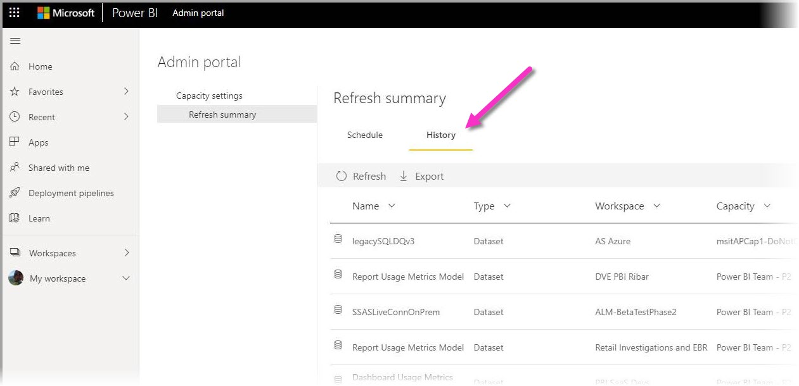
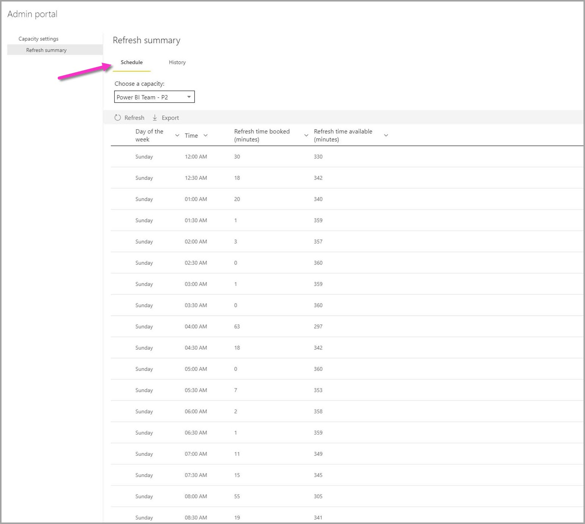

# Vernieuwingsoverzichten in Power BI

De pagina **Vernieuwingsoverzichten** in Power BI die te vinden is in de Power BI-beheerportal, biedt u beheer en inzicht in uw vernieuwingsplanningen, capaciteiten en mogelijke overlappingen in uw vernieuwingsplanningen. U kunt de pagina Vernieuwingsoverzichten gebruiken om te bepalen of u de vernieuwingsplanningen moet aanpassen, om foutcodes te leren die zijn gekoppeld aan vernieuwingsproblemen en de planning voor het vernieuwen van gegevens op de juiste manier te beheren. 

De pagina Vernieuwingsoverzichten heeft twee weergaven:

* **Geschiedenis**: geeft de geschiedenis van Vernieuwingsoverzichten weer voor de Power BI Premium-capaciteiten waarvan u beheerder bent.

* **Planning**: toont de planningsweergave voor geplande vernieuwing, waarmee ook problemen kunnen worden gedetecteerd met tijdvakken waarin teveel vernieuwingen plaatsvinden.

U kunt ook informatie over een vernieuwingsgebeurtenis exporteren naar een CSV-bestand, dat belangrijke informatie over en inzichten in vernieuwingsgebeurtenissen of fouten kan geven die invloed kunnen hebben op de prestaties of uitvoering van geplande vernieuwingsgebeurtenissen.

In de volgende secties ziet u beurtelings elk van deze beide weergaven. 

## Geschiedenis vernieuwen

U kunt de weergave **Geschiedenis** selecteren door op **Geschiedenis** te klikken op de pagina Vernieuwingsoverzichten.

De weergave Geschiedenis biedt een overzicht van de resultaten van recent geplande vernieuwingen voor de capaciteiten waarvoor u beheerdersbevoegdheden hebt. U kunt de weergave op een willekeurige kolom sorteren door te klikken op de kolom. U kunt ervoor kiezen om de weergave te sorteren op de geselecteerde kolom in oplopende of aflopende volgorde, of met behulp van tekstfilters.

In de weergave Geschiedenis worden de gegevens die betrekking hebben op een bepaalde vernieuwing gebaseerd op de 60 meest recente records voor elke geplande vernieuwing.

U kunt ook gegevens van elke geplande vernieuwing naar een CSV-bestand exporteren, dat gedetailleerde informatie bevat, met onder meer foutberichten voor elke vernieuwingsgebeurtenis. Wanneer u gegevens naar een CSV-bestand exporteert, kunt u het bestand sorteren op basis van een van de kolommen, zoeken naar woorden, sorteren op basis van foutcodes of eigenaren, enzovoort. In de volgende afbeelding ziet u een voorbeeld van een geëxporteerd CSV-bestand. 

Met de informatie in het geëxporteerde bestand kunt u de capaciteit, duur en foutberichten bekijken die zijn vastgelegd voor het vernieuwingsexemplaar. 

## Vernieuwingsschema

U kunt de weergave **Planning** selecteren door te klikken op **Planning** in Vernieuwingsoverzichten. In de weergave Planning worden de planningsgegevens voor de week weergegeven, opgesplitst in tijdvakken van 30 minuten. 

De weergave Planning is erg handig om te bepalen of de geplande vernieuwingsgebeurtenissen op de juiste manier zijn verdeeld, zodat alle vernieuwingen zonder overlapping kunnen worden uitgevoerd, of dat u geplande vernieuwingsgebeurtenissen hebt die te lang duren en voor resourceconflicten zorgen. Als u dergelijke resourceconflicten aantreft, moet u de vernieuwingsplanningen aanpassen om conflicten of overlappingen te voorkomen, zodat uw geplande vernieuwingen goed kunnen worden uitgevoerd. 

De kolom *Geboekte vernieuwingstijd (minuten)* is een berekening van het gemiddelde van maximaal 60 records voor elke bijbehorende gegevensset. De numerieke waarde voor elk tijdvak van 30 minuten is de som van de minuten die zijn berekend voor alle geplande vernieuwingen die volgens planning beginnen in het tijdvak **en** geplande vernieuwingen zijn ingesteld om te beginnen in het *vorige* tijdvak, maar waarvan de gemiddelde duur overloopt in het geselecteerde tijdvak.

De kolom *Beschikbare vernieuwingstijd (minuten)* is een berekening van het aantal beschikbare minuten voor vernieuwingen in elk tijdsslot, minus de vernieuwing die al is ingepland voor dat tijdslot. Als uw P2-abonnement bijvoorbeeld 12 gelijktijdig uitgevoerde vernieuwingen biedt, hebt u 12 slots van 30 minuten, dus 12 vernieuwingen x 30 minuten per stuk = 360 beschikbare minuten voor vernieuwingen in dat tijdslot. Als u één vernieuwing hebt geboekt in dat slot die 20 minuten duurt, is uw *Beschikbare vernieuwingstijd (minuten)* in dat tijdslot 340 minuten (360 totale beschikbare minuten, min 20 geboekte minuten = 340 beschikbare minuten). 

U kunt een tijdvak selecteren en vervolgens de bijbehorende knop **Details** selecteren om te zien welke geplande vernieuwingsgebeurtenissen onderdeel uitmaken van de geboekte vernieuwingstijd, de eigenaren daarvan en hoe lang het duurt voordat deze zijn voltooid.

We bekijken een voorbeeld om te zien hoe dit werkt. Het volgende dialoogvenster wordt weergegeven wanneer we het tijdvak van 20:30 uur selecteren voor zondag, en op **Details** klikken.

Er zijn drie geplande vernieuwingsgebeurtenissen die in dit tijdvak optreden. 

Geplande vernieuwing nr. 1 en nr. 3 zijn beide gepland voor dit tijdvak van 20:30, die we kunnen bepalen door naar de waarde te kijken in de kolom **Gepland tijdvak**. De gemiddelde duur is respectievelijk 4:39 en zes (0:06) seconden. Dit is allemaal ok.

Geplande vernieuwing nr. 2 is echter gepland voor het tijdvak van 20:00 uur, maar omdat de uitvoering ervan gemiddeld ongeveer 48 minuten duurt (te zien in de kolom **Gemiddelde duur**), loopt de vernieuwingsgebeurtenis over in het volgende tijdvak van 30 minuten. 

Dat is niet goed. De beheerder moet in dit geval contact opnemen met de eigenaren van dat geplande vernieuwingsexemplaar en voorstellen om een ander tijdvak voor die geplande vernieuwing te zoeken, of de andere vernieuwingen opnieuw plannen, zodat er geen overlappingen zijn, of een andere oplossing zoeken om dergelijke overlappingen te voorkomen. 

## Volgende stappen

- [Gegevens vernieuwen in Power BI](refresh-data.md)  
- [Power BI Gateway - Personal](service-gateway-personal-mode.md)  
- [On-premises data gateway (personal mode)](service-gateway-onprem.md) (On-premises gegevensgateway (persoonlijke modus))  
- [Problemen met de on-premises gegevensgateway oplossen](service-gateway-onprem-tshoot.md)  
- [Problemen met Power BI Gateway - Personal oplossen](service-admin-troubleshooting-power-bi-personal-gateway.md)  

Hebt u nog vragen? [Misschien dat de Power BI-community het antwoord weet](https://community.powerbi.com/)