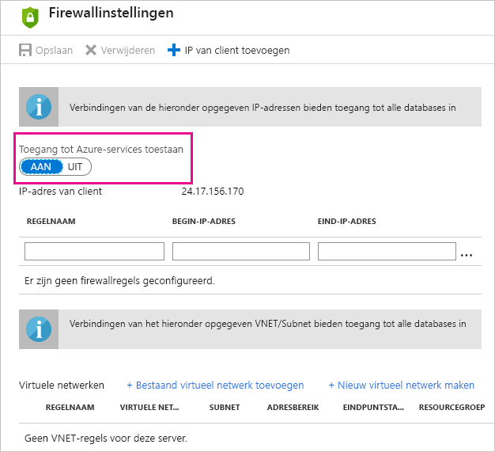

# Problemen met een geplande vernieuwing voor Azure SQL-databases oplossen in Power BI

Zie [Gegevens in Power BI vernieuwen](refresh-data.md) en [Geplande vernieuwing configureren](refresh-scheduled-refresh.md) voor gedetailleerde informatie over vernieuwen.

Als u tijdens het instellen van de geplande vernieuwing voor Azure SQL-database bij het bewerken van de referenties een fout met foutcode 400 krijgt, probeert u het volgende om de juiste firewallregel in te stellen:

1. Meld u aan bij de [Azure-portal](https://portal.azure.com).

1. Ga naar de Azure SQL-database waarvoor u het vernieuwen aan het configureren bent.

1. Selecteer **Serverfirewall instellen** bovenaan de blade **Overzicht**.

1. Zorg ervoor dat **Toegang tot Azure-services toestaan** op de blade **Firewallinstellingen** is ingesteld op **AAN**.

      

Nog vragen? [Misschien dat de Power BI-community het antwoord weet](https://community.powerbi.com/)
