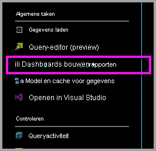
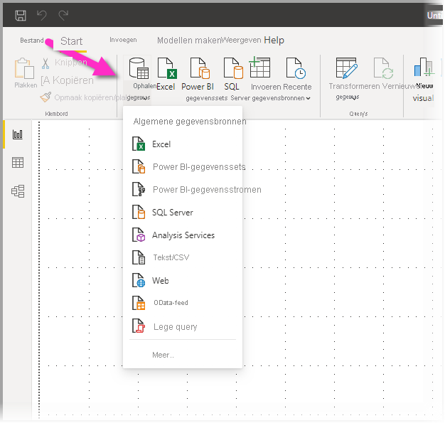
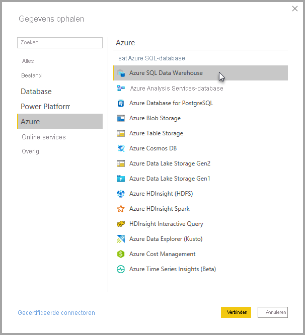
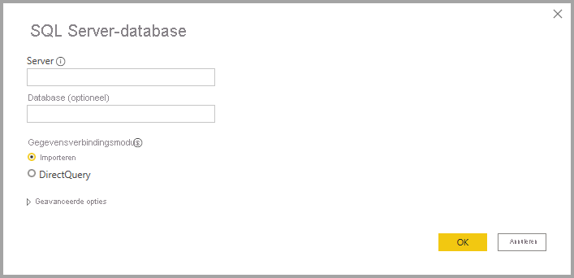
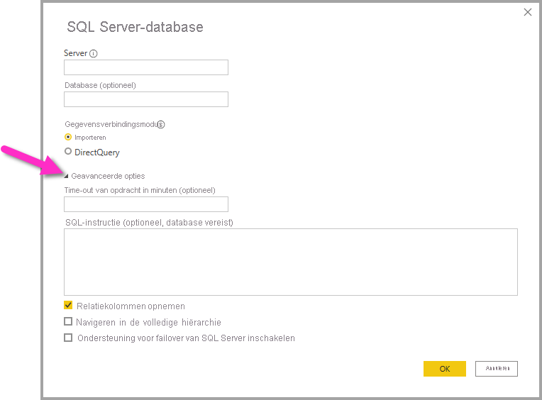
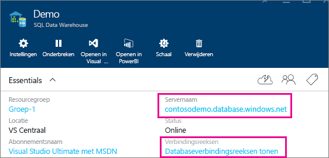

# Azure SQL Data Warehouse met DirectQuery

Door het gebruik van Azure SQL Data Warehouse in combinatie DirectQuery kunt u dynamische rapporten maken op basis van gegevens en metrische gegevens die al beschikbaar zijn in Azure SQL Data Warehouse. Met DirectQuery worden in realtime query’s teruggestuurd naar Azure SQL Database Warehouse wanneer u de gegevens in de rapportweergave verkent. Query's in realtime, in combinatie met de schaal van SQL Data Warehouse, biedt gebruikers de mogelijkheid om in enkele minuten dynamische rapporten te maken op basis van terabytes aan gegevens. Bovendien kunnen gebruikers met de koppeling **Build-dashboards + rapporten** Power BI-rapporten maken met behulp van hun SQL Data Warehouse.

Als u de SQL Data Warehouse-connector gebruikt:

* Geef de volledige servernaam op wanneer u verbinding maakt (zie hieronder voor meer informatie).
* Zorg ervoor dat de firewallregels voor de server zijn ingesteld op Toegang tot Azure-services toestaan.
* Voor elke actie, zoals het selecteren van een kolom of het toevoegen van een filter, wordt er rechtstreeks een query terug naar de database verzonden.
* Tegels worden ongeveer elke 15 minuten vernieuwd zonder dat hier een schema voor hoeft te worden ingesteld.  Vernieuwen kan worden aangepast in de geavanceerde instellingen wanneer u verbinding maakt.
* Q&A is niet beschikbaar voor DirectQuery-gegevenssets
* Schemawijzigingen worden niet automatisch doorgevoerd

Deze beperkingen en opmerkingen kunnen veranderen, aangezien we de ervaring voortdurend proberen te verbeteren. De stappen om verbinding te maken, worden hieronder beschreven.

## Dashboards en rapporten bouwen in Power BI

> [!Important]
> De connectiviteit met Azure SQL Data Warehouse is verbeterd. Gebruik Power BI Desktop voor de beste ervaring bij het maken van verbinding met uw Azure SQL Data Warehouse-gegevensbron. Als u uw model en het rapport hebt gemaakt, kunt u deze publiceren naar Power BI-service. De eerder beschikbare directe connector voor Azure SQL Data Warehouse in Power BI-service is niet meer beschikbaar.

De eenvoudigste manier om te verplaatsen tussen uw SQL Data Warehouse en Power BI is het maken van rapporten in Power BI Desktop. U kunt de knop **Build-dashboards + rapporten** gebruiken in Azure Portal.

1. Download en installeer Power BI Desktop om aan de slag te gaan. Zie het artikel [Get Power BI Desktop](../fundamentals/desktop-get-the-desktop.md) voor informatie over downloaden en installeren of ga direct naar de volgende stap.

2. U kunt ook op de koppeling **Build-dashboards + rapporten** klikken om Power BI Desktop te downloaden.

    

## Verbinding maken via Power BI Desktop

U kunt verbinding maken met een SQL Data Warehouse via de knop **Gegevens ophalen** in Power BI Desktop. 

1. Selecteer de knop **Gegevens ophalen** in het menu **Start**.  

    

2. Selecteer **meer...** om alle beschikbare gegevensbronnen weer te geven. Selecteer in het venster dat wordt weergegeven **Azure** in het linker deelvenster en selecteer vervolgens **Azure SQL Data Warehouse** in de lijst met beschikbare connectoren in het rechter deelvenster.

    

3. Voer in het venster dat wordt weergegeven de server in en geef optioneel de database op waarmee u verbinding wilt maken. U kunt ook uw gegevensconnectiviteitsmodus selecteren: Import of DirectQuery. Gebruik DirectQuery voor realtime toegang tot informatie in uw Azure SQL Data Warehouse.

    

4. Selecteer voor geavanceerde opties voor de Azure SQL Data Warehouse-verbinding de pijl-omlaag naast **Geavanceerde opties** om extra opties voor uw verbinding weer te geven.

    

In de volgende sectie wordt beschreven hoe u parameterwaarden voor uw verbinding kunt vinden. 

## Parameterwaarden zoeken

De volledige servernaam en databasenaam vindt u in de Azure-portal. SQL Data Warehouse is op dit moment alleen beschikbaar in Azure Portal.

> [!NOTE]
> Als uw Power BI-tenant zich in dezelfde regio bevindt als Azure SQL Data Warehouse, zijn er geen kosten voor uitgaande verkeer. U kunt nagaan waar uw Power BI-tenant zich bevindt met [deze instructies](https://docs.microsoft.com/power-bi/service-admin-where-is-my-tenant-located).

[!INCLUDE [direct-query-sso](../includes/direct-query-sso.md)]

## Volgende stappen

* [Informatie over DirectQuery in Power BI](desktop-directquery-about.md)
* [Wat is Power BI?](../fundamentals/power-bi-overview.md)  
* [Gegevens ophalen voor Power BI](service-get-data.md)  
* [Azure SQL Data Warehouse](/azure/sql-data-warehouse/sql-data-warehouse-overview-what-is/)

Hebt u nog vragen? [Misschien dat de Power BI-community het antwoord weet](https://community.powerbi.com/)
