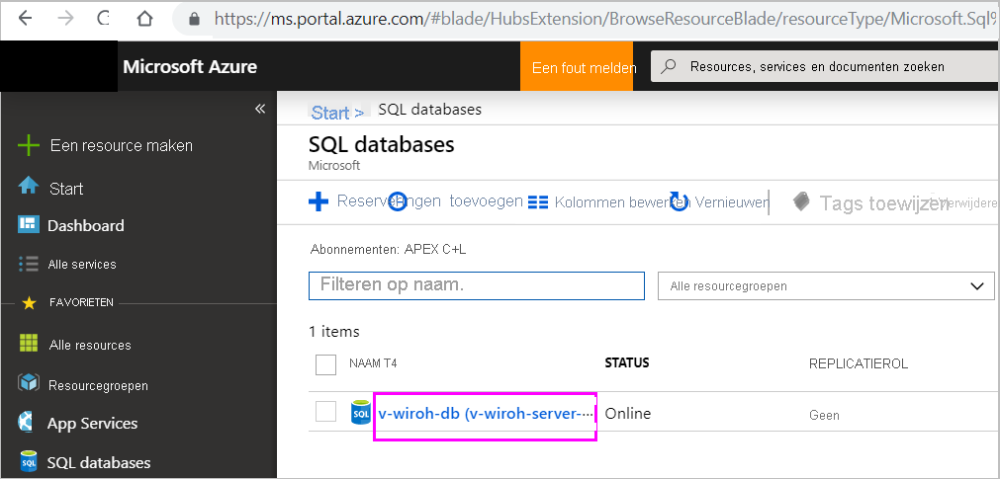

# Azure SQL Database met DirectQuery

Ontdek hoe u rechtstreeks verbinding met Azure SQL Database maakt en rapporten kunt maken waarin dynamische gegevens worden gebruikt. U kunt uw gegevens in de bron in plaats van Power BI bewaren.

Met DirectQuery worden query’s teruggestuurd naar Azure SQL Database wanneer u de gegevens in de rapportweergave verkent. Deze ervaring wordt aangeraden voor gebruikers die vertrouwd zijn met de databases en entiteiten waarmee ze verbinding maken.

> [!Important]
> In deze beschrijving wordt ervan uitgegaan dat Azure SQL-database zich niet achter een VNET bevindt of dat het eindpunt van privékoppeling is ingeschakeld.

**Opmerkingen:**

* Geef de volledige servernaam op wanneer u verbinding maakt (zie hieronder voor meer informatie).
* Zorg dat de firewallregels voor de database zijn ingesteld op "[Toegang tot Azure-services toestaan](https://docs.microsoft.com/azure/sql-database/sql-database-networkaccess-overview#allow-azure-services)".
* Voor elke actie, zoals het selecteren van een kolom of het toevoegen van een filter, wordt er een query teruggestuurd naar de database.
* Tegels worden om het uur vernieuwd (vernieuwen hoeft niet te worden gepland). U kunt aanpassen hoe vaak gegevens in Geavanceerde instellingen moeten worden vernieuwen wanneer u verbinding maakt.
* V&A is niet beschikbaar voor DirectQuery-gegevenssets.
* Wijzigingen in het schema worden niet automatisch doorgevoerd.

Deze beperkingen en opmerkingen kunnen veranderen, aangezien we de ervaring voortdurend proberen te verbeteren. De stappen om verbinding te maken, worden hieronder beschreven.

> [!Important]
> De connectiviteit met Azure SQL Database is verbeterd.  Gebruik Power BI Desktop voor de beste ervaring bij het maken van verbinding met uw Azure SQL Database-gegevensbron.  Als u uw model en het rapport hebt gemaakt, kunt u deze publiceren naar Power BI-service.  De directe verbinding voor Azure SQL Database in Power BI-service is afgeschaft.

## Power BI Desktop en DirectQuery

U moet Power BI Desktop gebruiken om verbinding te maken met Azure SQL Database via DirectQuery. Deze benadering biedt extra flexibiliteit en mogelijkheden. Rapporten die zijn gemaakt met Power BI Desktop, kunnen vervolgens worden gepubliceerd naar de Power BI-service. Meer informatie over hoe u verbinding maakt met [Azure SQL Database via DirectQuery](desktop-use-directquery.md) vindt u in Power BI Desktop.

## Parameterwaarden vinden

U kunt de volledige servernaam en databasenaam vinden in de Azure Portal.

[!INCLUDE [direct-query-sso](../includes/direct-query-sso.md)]

## Volgende stappen

* [DirectQuery in Power BI Desktop gebruiken](desktop-use-directquery.md)  
* [Wat is Power BI?](../fundamentals/power-bi-overview.md)  
* [Gegevens ophalen voor Power BI](service-get-data.md)  

Hebt u nog vragen? [Probeer de Power BI-community](https://community.powerbi.com/)
