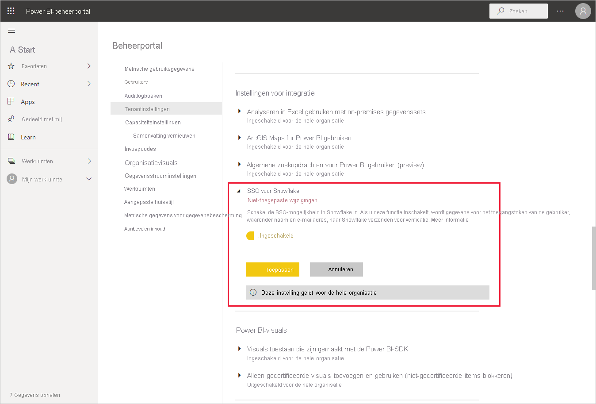
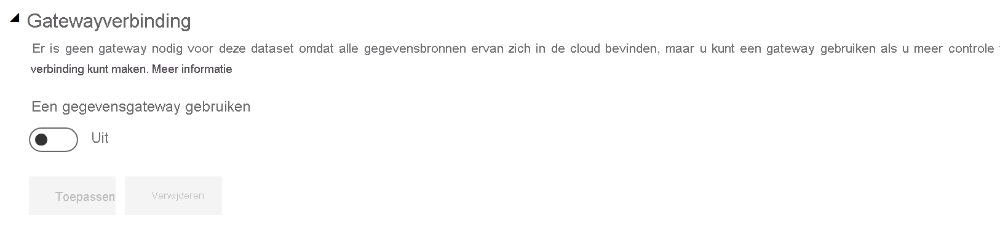
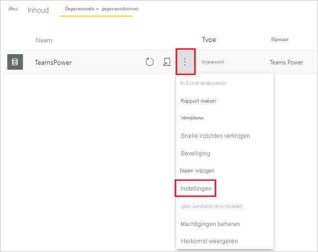
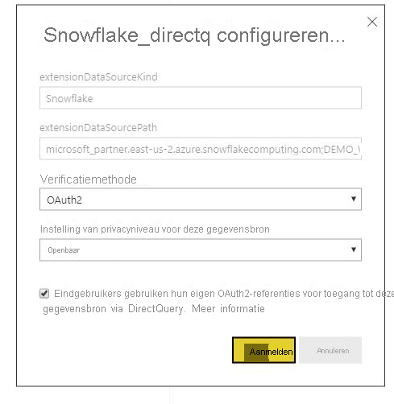

# Verbinding maken met Snowflake in Power BI-service

## Inleiding

Verbinding maken met Snowflake in de Power BI-service verschilt op slechts één manier van andere connectors. Snowflake heeft een extra mogelijkheid voor Azure Active Directory (AAD), met een optie voor eenmalige aanmelding (SSO). Voor delen van de integratie zijn verschillende beheerdersrollen vereist binnen Snowflake, Power BI en Azure. U kunt er ook voor kiezen om AAD-verificatie in te schakelen zonder SSO te gebruiken. Basisverificatie werkt op dezelfde manier voor andere connectors in de service.

Volg de stappen in dit artikel om AAD-integratie in te stellen en optioneel SSO in te schakelen:

* Als u de Snowflake-beheerder bent, raadpleegt u het artikel [Power BI SSO met Snowflake - aan de slag](https://docs.snowflake.com/en/user-guide/oauth-powerbi.html) in de Snowflake-documentatie.
* Als u een Power BI-beheerder bent, raadpleegt u [Configuratie van Power BI-service - Beheerderportal](service-connect-snowflake.md#admin-portal) voor meer informatie over het inschakelen van SSO.
* Als u een maker van een Power BI-gegevensset bent, verwijst u naar [Configuratie van Power BI-service - Een gegevensset configureren met AAD](service-connect-snowflake.md#configuring-a-dataset-with-aad) voor meer informatie over het inschakelen van SSO.

## Power BI-serviceconfiguratie

### Beheerportal

Om SSO in te schakelen, moet een globale beheerder de instelling inschakelen in de Beheerportal van Power BI. Deze instelling keurt het verzenden van AAD-referenties naar Snowflake voor verificatie voor de hele organisatie goed. Voer de volgende stappen uit om SSO in te schakelen:

1. [Meld u aan bij Power BI](https://app.powerbi.com) met behulp van globale beheerdersreferenties.
1. Selecteer **Instellingen** uit het menu bovenaan de pagina en selecteer vervolgens **Beheerportal**.
1. Selecteer **Tenantinstellingen** en ga vervolgens naar **Instellingen voor integratie**.

   

4. Vouw **SSO voor Snowflake** uit, zet de instelling op **Ingeschakeld** en selecteer **Toepassen**.

Deze stap is vereist om toestemming te geven voor het verzenden van uw AAD-token naar de Snowflake-servers. Nadat u de instelling hebt ingeschakeld, kan het een uur duren voordat deze is doorgevoerd.

Nadat SSO is ingeschakeld, kunt u rapporten gebruiken met SSO.

### Een gegevensset met AAD configureren

Nadat een rapport dat is gebaseerd op de Snowflake-connector wordt gepubliceerd op de Power BI-service, moet de maker van de gegevensset de instellingen voor de juiste werkruimte bijwerken zodat SSO wordt gebruikt.

Door de manier waarop Power BI werkt, werkt SSO alleen wanneer er geen gegevensbronnen door de on-premises gegevensgateway worden geleid. De beperkingen worden hieronder weergegeven:

* Als u alleen een Snowflake-bron in uw gegevensmodel gebruikt, kunt u SSO gebruiken als u ervoor kiest de on-premises gegevensgateway niet te gebruiken.
* Als u een Snowflake-bron en een andere bron gebruikt, kunt u SSO gebruiken als geen van de bronnen gebruikmaakt van de on-premises gegevensgateway.
* Als u een Snowflake-bron gebruikt via de on-premises gegevensgateway: AAD-referenties worden momenteel niet ondersteund. Deze overweging kan relevant zijn voor als u probeert toegang te krijgen tot een VNet vanuit een enkel IP-adres waarop de gateway is geïnstalleerd, in plaats van vanuit het gehele IP-bereik van Power BI.
* Als u een Snowflake-bron en een andere bron gebruikt waarvoor een gateway is vereist, moet u Snowflake ook via de on-premises gegevensgateway gebruiken. In dit geval kunt u geen SSO gebruiken.

Zie [Wat is een on-premises gegevensgateway?](service-gateway-onprem.md) voor meer informatie over het gebruik van de on-premises gegevensgateway.

Als u de gateway niet wilt gebruiken, bent u klaar. Wanneer u Snowflake-referenties hebt geconfigureerd in uw on-premises gegevensgateway, maar alleen die gegevensbron gebruikt in uw model, kunt u klikken op de wisselknop op de pagina Gegevenssetinstellingen om de gateway uit te schakelen voor dat gegevensmodel.

Voer de volgende stappen uit om SSO in te schakelen voor een gegevensset:

1. [Meld u aan bij Power BI](https://app.powerbi.com) met behulp van de referenties voor de maker van de gegevensset.
1. Selecteer de juiste werkruimte en kies vervolgens **Instellingen** in het menu meer opties dat zich naast de naam van de gegevensset bevindt.
  
1. Selecteer **Gegevensbronreferenties** en meld u aan. De gegevensset kan worden aangemeld bij Snowflake met Basic of OAuth2-referenties (AAD). Als u AAD gebruikt, kunt u SSO inschakelen in de volgende stap.
1. Selecteer de optie **Eindgebruikers gebruiken hun eigen OAuth2-referenties voor toegang tot deze gegevensbron via DirectQuery**. Met deze instelling wordt AAD-SSO ingeschakeld. Voor SSO worden de AAD-referenties verzonden, ongeacht of de eerste gebruiker zich aanmeldt via basisverificatie of via OAuth2 (AAD).

    

Nadat deze stappen zijn voltooid, moeten gebruikers automatisch hun AAD-verificatie gebruiken om verbinding te maken met gegevens van deze Snowflake-gegevensset.

Als u ervoor kiest eenmalige aanmelding niet in te schakelen, worden voor gebruikers die het rapport vernieuwen de referenties gebruikt van de gebruiker die zich heeft aangemeld, zoals bij de meeste andere Power BI-rapporten.

### Problemen oplossen

Als u problemen ondervindt met de integratie, raadpleegt u de [Gids voor probleemoplossing](https://docs.snowflake.com/en/user-guide/oauth-powerbi.html#troubleshooting) van Snowflake.

## Volgende stappen

* [Gegevensbronnen voor de Power BI-service](service-get-data.md)
* [Verbinding maken met gegevenssets in de Power BI-service vanuit Power BI-desktop](desktop-report-lifecycle-datasets.md)
* [Verbinding maken met een Snowflake Computing-magazijn](desktop-connect-snowflake.md)