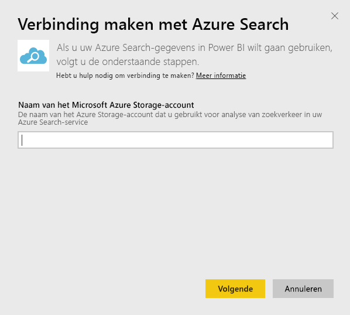
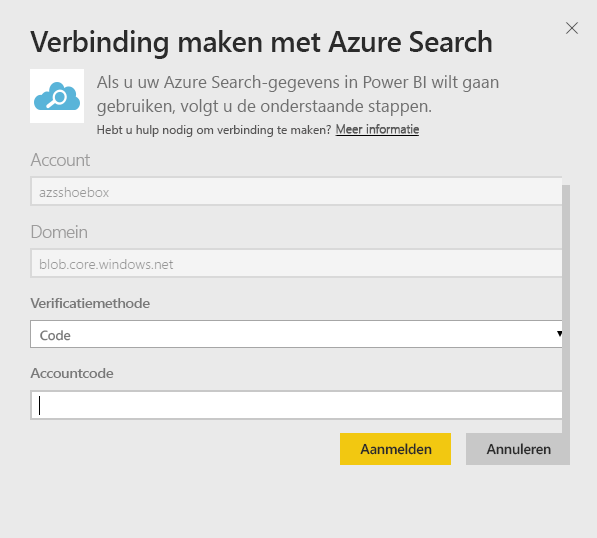

# Verbinding maken met Azure Search met Power BI
Met Azure Search Traffic Analytics kunt u het verkeer naar uw Azure Search-service volgen en begrijpen. Het Azure Search-inhoudspakket voor Power BI biedt gedetailleerde informatie over uw zoekgegevens, waaronder zoeken, indexeren, zoekstatistieken en latentie van de afgelopen 30 dagen. Meer informatie vindt u in het [Azure-blogbericht](https://azure.microsoft.com/blog/analyzing-your-azure-search-traffic/).

[!INCLUDE [include-short-name](../includes/service-deprecate-content-packs.md)]

Verbinding maken met het [inhoudspakket van Azure Search](https://app.powerbi.com/getdata/services/azure-search) voor Power BI.

## Verbinding maken
1. Selecteer **Gegevens ophalen** onderaan het navigatievenster.
   
    
2. Selecteer **Ophalen** in het vak **Services**.
   
    
3. Selecteer **Azure Search** \> **Ophalen**.
   
   
4. Geef de naam van het tabelopslagaccount waarop uw Azure Search-analyse is opgeslagen.
   
   
5. Selecteer **Sleutel** als verificatiemechanisme en voer de sleutel van uw opslagaccount in. Klik op **Aanmelden** om te beginnen met het laadproces.
   
   
6. Zodra het laden is voltooid, worden een nieuw dashboard, rapport en model in het navigatievenster weergegeven. Selecteer het dashboard om uw geïmporteerde gegevens weer te geven.
   
    

**Wat nu?**

* [Stel vragen in het vak Q&A](../consumer/end-user-q-and-a.md) boven in het dashboard.
* [Wijzig de tegels](../create-reports/service-dashboard-edit-tile.md) in het dashboard.
* [Selecteer een tegel](../consumer/end-user-tiles.md) om het onderliggende rapport te openen.
* Als uw gegevensset is ingesteld op dagelijks vernieuwen, kunt u het vernieuwingsschema wijzigen of de gegevensset handmatig vernieuwen met **Nu vernieuwen**

## Systeemvereisten
Voor het inhoudspakket van Azure Search moet Azure Search Traffic Analytics ingeschakeld zijn op het account.

## Problemen oplossen
Controleer of de naam van het opslagaccount correct is opgegeven samen met de volledige toegangssleutel. De opslagaccountnaam moet overeenkomen met het account dat is geconfigureerd voor Azure Search Traffic Analytics.

## Volgende stappen
[Wat is Power BI?](../fundamentals/power-bi-overview.md)

[Basisconcepten voor ontwerpers in de Power BI-service](../fundamentals/service-basic-concepts.md)
