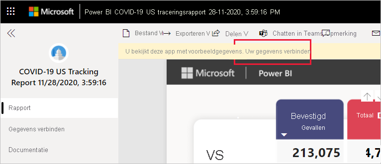
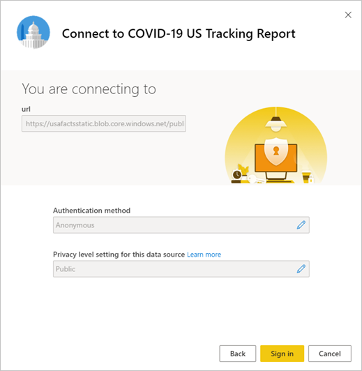

# Verbinding maken met Traceringsrapport voor COVID-19 in de Verenigde Staten
In dit artikel leest u hoe u de sjabloon-app voor het traceringsrapport voor COVID-19 installeert en hoe u verbinding maakt met de gegevensbronnen.

Voor gedetailleerde informatie over het rapport zelf, met inbegrip van disclaimers en informatie over de gegevens, raadpleegt u [COVID-19-traceringsvoorbeeld voor Amerikaanse staats- en lokale overheden](../create-reports/sample-covid-19-us.md).

Nadat u de sjabloon-app hebt geïnstalleerd en verbinding hebt gemaakt met de gegevensbronnen, kunt u het rapport aanpassen aan uw behoeften. Vervolgens kunt u deze als app distribueren naar collega's in uw organisatie.

## De app installeren

1. Klik op de volgende koppeling om naar de app te gaan: [De sjabloon-app Traceringsrapport voor COVID-19 in de Verenigde Staten](https://app.powerbi.com/groups/me/getapps/services/pbi-contentpacks.covid19ms)

1. Als u zich op de AppSource-pagina van de app bevindt, klikt u op [**NU DOWNLOADEN**](https://app.powerbi.com/groups/me/getapps/services/pbi-contentpacks.covid19ms).

    

1. Klik op **Installeren** wanneer dat wordt gevraagd. Zodra de app is geïnstalleerd, ziet u deze op uw Apps-pagina.

   

## Verbinding maken met gegevensbronnen

1. Klik op het pictogram op de Apps-pagina om de app te openen. De app wordt geopend met voorbeeldgegevens.

1. Selecteer de koppeling **Uw gegevens koppelen** op de banner bovenaan de pagina.

   

1. Het dialoogvenster Parameters wordt weergegeven. Er zijn geen vereiste parameters. Klik op **Volgende**.

   

1. Het dialoogvenster Verificatiemethode wordt weergegeven. Aanbevolen waarden zijn vooraf ingevuld. Wijzig deze instellingen alleen als u specifieke kennis van verschillende waarden hebt.

    Klik op **Volgende**.

   

1. Klik op **Aanmelden**.

   
 
   Het rapport wordt verbonden met de gegevensbronnen en gevuld met actuele gegevens. Ondertussen ziet u voorbeeldgegevens en wordt aangegeven dat de vernieuwing wordt uitgevoerd.

   

## Vernieuwen van het rapport plannen

Wanneer het vernieuwen van de gegevens is voltooid, bevindt u zich in de werkruimte die aan de app is gekoppeld. [Stel een vernieuwingsschema in](../connect-data/refresh-scheduled-refresh.md) om de rapportgegevens up-to-date te houden.

## Aanpassen en delen

Zie [De app aanpassen en delen](../connect-data/service-template-apps-install-distribute.md#customize-and-share-the-app) voor meer informatie. Zorg ervoor dat u de [rapportdisclaimers](../create-reports/sample-covid-19-us.md#disclaimers) controleert voordat u de app publiceert of distribueert.

## Volgende stappen
* [COVID-19-traceringsvoorbeeld voor Amerikaanse staats- en lokale overheden](../create-reports/sample-covid-19-us.md)
* Vragen? [Misschien dat de Power BI-community het antwoord weet](https://community.powerbi.com/)
* [Wat zijn Power BI-sjabloon-apps?](../connect-data/service-template-apps-overview.md)
* [Sjabloon-apps in uw organisatie installeren en distribueren](../connect-data/service-template-apps-install-distribute.md)
