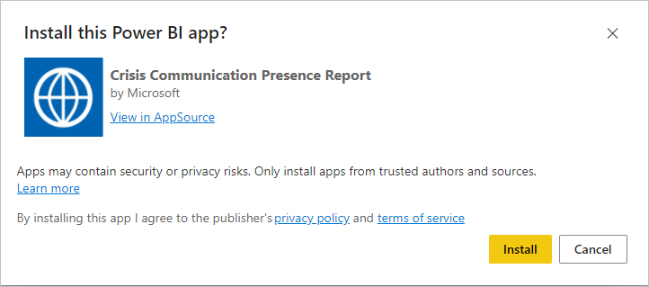
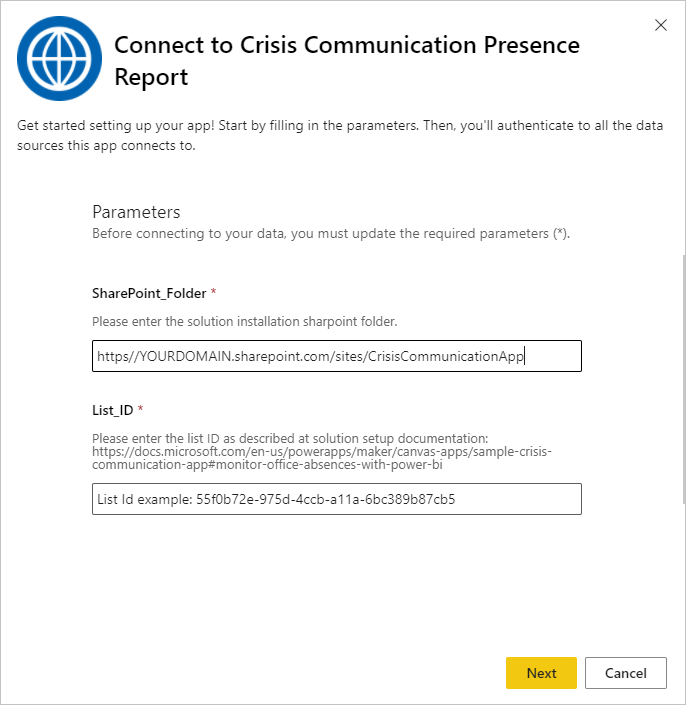
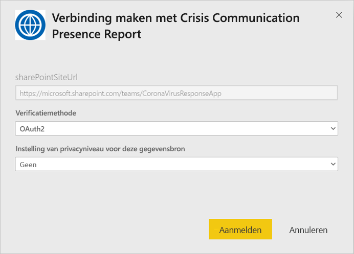

# Verbinding maken met Aanwezigheidsrapport voor Crisis Communication

Deze Power BI-app is het rapport/dashboard-artefact in de Microsoft Power Platform-oplossing voor Crisis Communication. Hiermee wordt de locatie van werknemers bijgehouden voor gebruikers van de app Crisis Communication. De oplossing biedt een combinatie van de mogelijkheden van Power Apps, Power Automate, Teams, SharePoint en Power BI. Deze oplossing kan worden gebruikt op internet, op mobiele apparaten of in Teams.

Op het dashboard wordt weergegeven dat managers voor noodsituaties gegevens van hun zorgsystemen aggregeren om tijdige, juiste beslissingen te kunnen nemen.

In dit artikel leest u hoe u de app installeert en hoe u verbinding maakt met de gegevensbronnen. Zie [De voorbeeldsjabloon Crisis Communication instellen en leren kennen in Power Apps](https://docs.microsoft.com/powerapps/maker/canvas-apps/sample-crisis-communication-app) voor meer informatie over de app Crisis Communication

Nadat u de sjabloon-app hebt geïnstalleerd en verbinding hebt gemaakt met de gegevensbronnen, kunt u het rapport aanpassen aan uw behoeften. Vervolgens kunt u deze als app distribueren naar collega's in uw organisatie.

## Vereisten

Voordat u deze sjabloon-app installeert, moet u eerst het [Crisis Communication-voorbeeld](https://docs.microsoft.com/powerapps/maker/canvas-apps/sample-crisis-communication-app) installeren en instellen. Als u deze oplossing installeert, worden de gegevensbronverwijzingen gemaakt die nodig zijn om de app te vullen met gegevens.

Let bij het installeren van het Crisis Communication-voorbeeld op het [SharePoint-lijstmappad van CI_Employee Status en de lijst-id](https://docs.microsoft.com/powerapps/maker/canvas-apps/sample-crisis-communication-app#monitor-office-absences-with-power-bi).

## De app installeren

1. Klik op de volgende koppeling om naar de app te gaan: [De sjabloon-app Aanwezigheidsrapport voor Crisis Communication](https://appsource.microsoft.com/en-us/product/power-bi/pbi-contentpacks.crisiscomms)

1. Selecteer [**NU DOWNLOADEN**](https://appsource.microsoft.com/en-us/product/power-bi/pbi-contentpacks.crisiscomms) op de AppSource-pagina voor de app.

    

1. Lees de informatie in **Nog iets...** en selecteer **Doorgaan**.

    

1. Selecteer **Installeren**. 

    

    Zodra de app is geïnstalleerd, ziet u deze op uw Apps-pagina.

   

## Verbinding maken met gegevensbronnen

1. Selecteer het pictogram op de Apps-pagina om de app te openen.

1. Selecteer **Verkennen** op het welkomstscherm.

   

   De app wordt geopend met voorbeeldgegevens.

1. Selecteer de koppeling **Uw gegevens koppelen** op de banner bovenaan de pagina.

   

1. Ga als volgt te werk in het dialoogvenster:
   1. Voer in het veld SharePoint_Folder uw [CI_Employee Status van het SharePoint-lijstpad](https://docs.microsoft.com/powerapps/maker/canvas-apps/sample-crisis-communication-app#monitor-office-absences-with-power-bi) in.
   1. Voer in het veld List_ID de lijst-id in die u hebt verkregen via de lijstinstellingen. Klik op **Volgende** als u klaar bent.

   

1. In het volgende dialoogvenster dat wordt weergegeven, stelt u de verificatiemethode in op **OAuth2**. U hoeft niets te doen met de instelling voor het privacyniveau.

   Selecteer **Aanmelden**.

   

1. Meld u op het Microsoft-aanmeldingsscherm aan bij Power BI.

   

   Nadat u zich hebt aangemeld, wordt het rapport verbonden met de gegevensbronnen en wordt het gevuld met actuele gegevens. Gedurende deze periode wordt de activiteitsbewaking ingeschakeld.

   

## Vernieuwen van het rapport plannen

Wanneer het vernieuwen van gegevens is voltooid, [stelt u een vernieuwingsschema in](../connect-data/refresh-scheduled-refresh.md) om de rapportgegevens up-to-date te houden.

1. Selecteer op de bovenste koptekstbalk **Power BI**.

   

1. Zoek in het linkernavigatiedeelvenster onder **Werkruimten** naar de werkruimte Ondersteuningsdashboard voor Hospital Emergency Response en volgt de instructie in het artikel [Geplande vernieuwing configureren](../connect-data/refresh-scheduled-refresh.md).

## Aanpassen en delen

Zie [De app aanpassen en delen](../connect-data/service-template-apps-install-distribute.md#customize-and-share-the-app) voor meer informatie. Zorg ervoor dat u de [rapportdisclaimers](../create-reports/sample-covid-19-us.md#disclaimers) controleert voordat u de app publiceert of distribueert.

## Volgende stappen
* [De voorbeeldsjabloon Crisis Communication instellen en leren kennen in Power Apps](https://docs.microsoft.com/powerapps/maker/canvas-apps/sample-crisis-communication-app)
* Vragen? [Misschien dat de Power BI-community het antwoord weet](https://community.powerbi.com/)
* [Wat zijn Power BI-sjabloon-apps?](../connect-data/service-template-apps-overview.md)
* [Sjabloon-apps in uw organisatie installeren en distribueren](../connect-data/service-template-apps-install-distribute.md)
