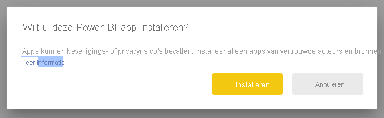
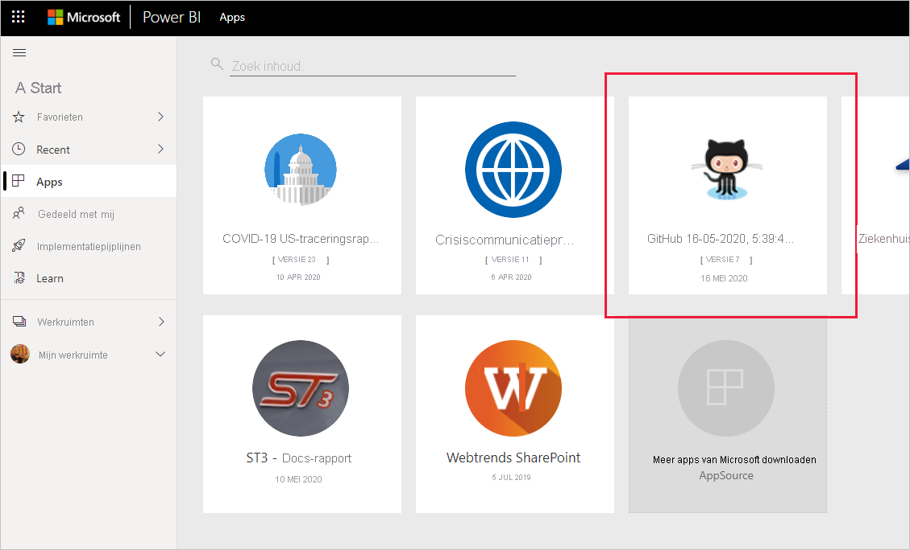
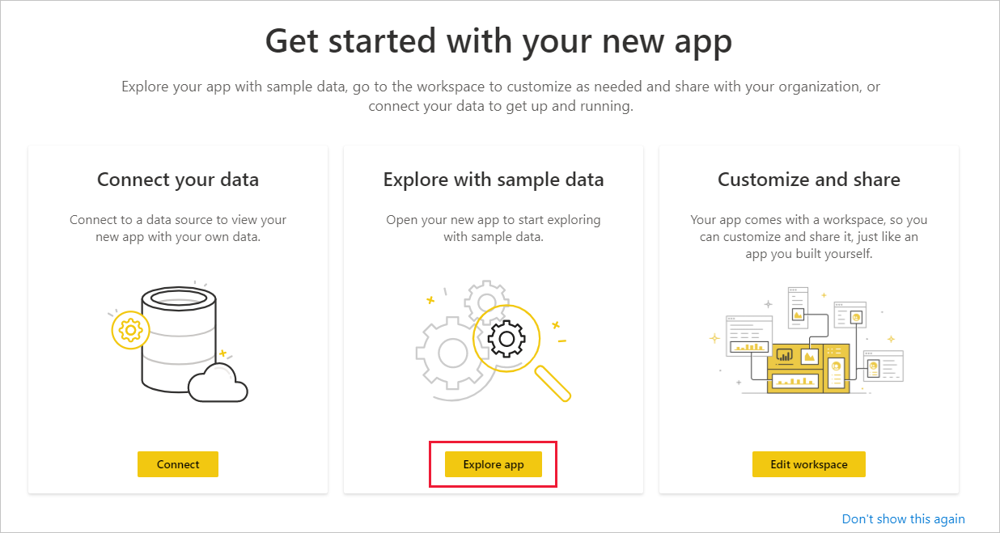
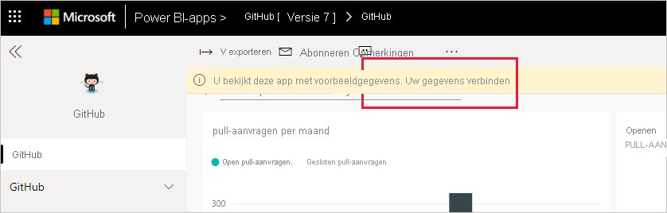
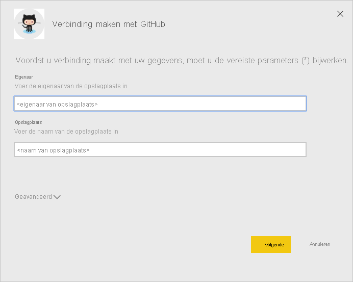
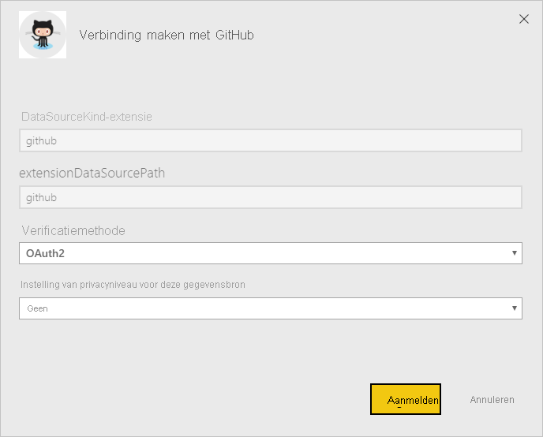
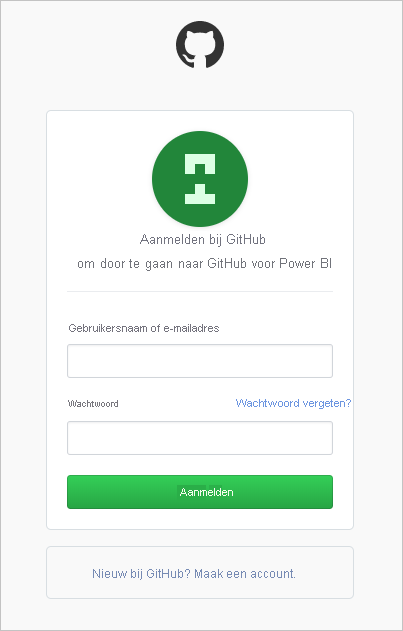
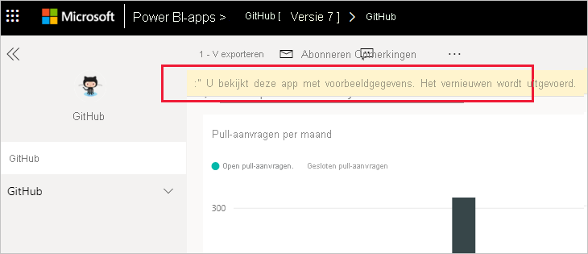
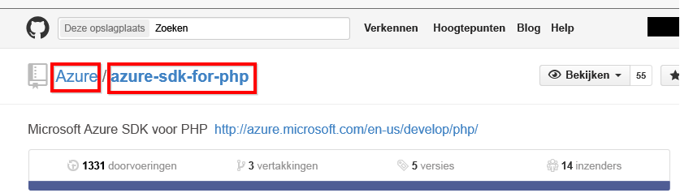

# <a name="connect-to-github-with-power-bi"></a>Verbinding maken met GitHub via Power BI
In dit artikel wordt uitgelegd hoe u uw gegevens ophaalt uit uw GitHub-account met een Power BI-sjabloon-app. De sjabloon-app genereert een werkruimte met een dashboard, een set rapporten en een gegevensset waarmee u uw GitHub-gegevens kunt verkennen. De GitHub-app voor Power BI maakt het mogelijk om inzicht te verkrijgen in een GitHub-opslagplaats (ook wel een repository of repo genoemd) met gegevens van bijdragen, problemen, pull-aanvragen en actieve gebruikers.


Nadat u de sjabloon-app hebt geïnstalleerd, kunt u het dashboard en rapport wijzigen. Vervolgens kunt u deze als een app distribueren naar collega's in uw organisatie.

Maak verbinding met de [GitHub-sjabloon-app](https://app.powerbi.com/groups/me/getapps/services/pbi-contentpacks.pbiapps-github) of lees meer over de [integratie van GitHub](https://powerbi.microsoft.com/integrations/github) met Power BI.

U kunt ook de [zelfstudie voor GitHub](service-tutorial-connect-to-github.md) gebruiken. Hiermee worden echte GitHub-gegevens over de openbare opslagplaats voor de Power BI-documentatie geïnstalleerd.

>[!NOTE]
>Deze sjabloon-app werkt alleen als het GitHub-account toegang heeft tot de opslagplaats. Meer informatie over de vereisten volgt hieronder.
>
>Deze sjabloon-app biedt geen ondersteuning voor GitHub Enterprise.

## <a name="install-the-app"></a>De app installeren

1. Klik op de volgende koppeling om naar de app te gaan: [GitHub-sjabloon-app](https://app.powerbi.com/groups/me/getapps/services/pbi-contentpacks.pbiapps-github)

1. Selecteer [**NU DOWNLOADEN**](https://app.powerbi.com/groups/me/getapps/services/pbi-contentpacks.pbiapps-github) op de AppSource-pagina voor de app.

    [](https://app.powerbi.com/groups/me/getapps/services/pbi-contentpacks.pbiapps-github)

1. Selecteer **Installeren**. 

    

    Zodra de app is geïnstalleerd, ziet u deze op uw Apps-pagina.

   

## <a name="connect-to-data-sources"></a>Verbinding maken met gegevensbronnen

1. Selecteer het pictogram op de Apps-pagina om de app te openen.

1. Selecteer **App verkennen** op het welkomstscherm.

   

   De app wordt geopend met voorbeeldgegevens.

1. Selecteer de koppeling **Uw gegevens koppelen** op de banner bovenaan de pagina.

   

1. Voer in het weergegeven dialoogvenster de naam in van de opslagplaats en de naam van de eigenaar van de opslagplaats. Hieronder vindt u informatie over [het vinden van deze parameters](#FindingParams). Klik op **Volgende** als u klaar bent.

   

1. Zorg ervoor dat u in het volgende dialoogvenster dat wordt weergegeven, de verificatiemethode instelt op **OAuth2**. U hoeft niets te doen met de privacyinstelling. Klik op **Aanmelden** als u klaar bent.

   

1. Geef uw referenties voor GitHub op en volg het GitHub-verificatieproces op (deze stap kan worden overgeslagen als u al bent aangemeld in uw browser).

   


Nadat u zich hebt aangemeld, wordt het rapport verbonden met de gegevensbronnen en wordt het gevuld met actuele gegevens. Gedurende deze periode wordt de activiteitsbewaking ingeschakeld.



Uw rapportgegevens worden eenmaal per dag automatisch vernieuwd, tenzij u dit hebt uitgeschakeld tijdens het aanmeldingsproces. U kunt desgewenst ook [uw eigen vernieuwingsplanning instellen](./refresh-scheduled-refresh.md) om de rapportgegevens up-to-date te houden.

## <a name="customize-and-share"></a>Aanpassen en delen

Als u uw app wilt aanpassen en delen, selecteert u het potloodpictogram in de rechterbovenhoek van de pagina.


Raadpleeg voor meer informatie over het bewerken van artefacten in de werkruimte het artikel
* [Rondleiding door de rapporteditor in Power BI](../create-reports/service-the-report-editor-take-a-tour.md)
* [Basisconcepten voor ontwerpers in de Power BI-service](../fundamentals/service-basic-concepts.md)

Zodra u klaar bent met het maken van wijzigingen in de artefacten in de werkruimte, kunt u de app publiceren en delen. Zie [Uw app publiceren](../collaborate-share/service-create-distribute-apps.md#publish-your-app) om te leren hoe u dit doet.

## <a name="whats-included-in-the-app"></a>Wat is opgenomen in de app
De volgende gegevens van GitHub zijn beschikbaar in Power BI:     

| Tabelnaam | Beschrijving |
| --- | --- |
| Bijdragen |Deze tabel bevat het totale aantal toevoegingen, verwijderingen en wijzigingen dat een inzender per week heeft bijgedragen. De tabel bevat gegevens van de 100 actiefste medewerkers. |
| Problemen |Een overzicht van alle problemen voor de geselecteerde opslagplaats en berekeningen zoals de totale en gemiddelde tijd voor het afhandelen van een probleem, het totale aantal openstaande problemen en het totale aantal afgesloten problemen. Deze tabel is leeg wanneer er geen problemen zijn gemeld voor de opslagplaats. |
| Pull requests |Deze tabel bevat alle pull-aanvragen voor de opslagplaats en wie de aanvraag heeft gedaan. De tabel bevat daarnaast berekeningen van het aantal openstaande en gesloten pull-aanvragen, het totale aantal pull-aanvragen, hoe lang het heeft geduurd om aanvragen te verwerken en hoe lang de gemiddelde pull-aanvraag heeft geduurd. Deze tabel is leeg wanneer er geen pull-aanvragen zijn gemeld voor de opslagplaats. |
| Gebruikers |Deze tabel bevat een lijst van GitHub-gebruikers of -inzenders die bijdragen hebben geleverd, problemen hebben gemeld of pull-aanvragen hebben opgelost voor de geselecteerde opslagplaats. |
| Milestones |Deze tabel bevat alle mijlpalen voor de geselecteerde opslagplaats. |
| DateTable |Deze tabel bevat datums vanaf vandaag tot jaren in het verleden waarmee u gegevens van GitHub kunt analyseren op datum. |
| ContributionPunchCard |Deze tabel kan worden gebruikt als een controlemiddel voor bijdragen aan de geselecteerde opslagplaats. U ziet hier 'commits' per dag van de week en tijdstip van de dag. Deze tabel is niet verbonden met andere tabellen in het model. |
| RepoDetails |Deze tabel bevat details voor de geselecteerde opslagplaats. |

## <a name="system-requirements"></a>Systeemvereisten
* Een GitHub-account met toegang tot de opslagplaats.  
* Machtiging verleend aan de app Power BI voor GitHub tijdens de eerste aanmelding. Zie de details hieronder om de toegang weer in te trekken.  
* Er zijn voldoende API-aanroepen beschikbaar om de gegevens op te halen en te vernieuwen.
>[!NOTE]
>Deze sjabloon-app biedt geen ondersteuning voor GitHub Enterprise.

### <a name="de-authorize-power-bi"></a>Autorisatie van Power BI intrekken
Als u Power BI geen toestemming meer wilt geven om verbinding te maken met uw GitHub-opslagplaats, kunt u de toegang intrekken in GitHub. Zie dit [Help-onderwerp over GitHub](https://help.github.com/articles/keeping-your-ssh-keys-and-application-access-tokens-safe/#reviewing-your-authorized-applications-oauth) voor meer informatie.

<a name="FindingParams"></a>
## <a name="finding-parameters"></a>Parameters zoeken
U kunt de eigenaar en opslagplaats vaststellen door te kijken naar de opslagplaats in GitHub zelf:



Het eerste deel, 'Azure', is de eigenaar en het tweede deel, 'azure-sdk-for-php', is de opslagplaats zelf.  Deze twee items komen ook terug in de URL van de opslagplaats:

```console
<https://github.com/Azure/azure-sdk-for-php> .
```

## <a name="troubleshooting"></a>Problemen oplossen
Indien nodig kunt u uw GitHub-referenties controleren.  

1. Ga in een ander browservenster naar de website van GitHub en meld u aan bij GitHub. U kunt in de rechterbovenhoek van de GitHub-site zien of u bent aangemeld.    
2. Navigeer in GitHub naar de URL van de opslagplaats die u wilt raadplegen in Power BI, Bijvoorbeeld: https://github.com/dotnet/corefx.  
3. Ga terug naar Power BI en probeer verbinding te maken met GitHub. Gebruik in het dialoogvenster Configure GitHub de naam van de opslagplaats en de naam van de eigenaar van dezelfde opslagplaats.  

## <a name="next-steps"></a>Volgende stappen

* [Zelfstudie: Verbinding maken met een GitHub-opslagplaats met Power BI](service-tutorial-connect-to-github.md)
* [De nieuwe werkruimten maken in Power BI](../collaborate-share/service-create-the-new-workspaces.md)
* [Apps in Power BI installeren en gebruiken](../consumer/end-user-apps.md)
* [Verbinding maken met Power BI-apps voor externe services](service-connect-to-services.md)
* Vragen? [Misschien dat de Power BI-community het antwoord weet](https://community.powerbi.com/)
