# Verbinding maken met het Ondersteuningsdashboard voor Hospital Emergency Response
De sjabloon-app Ondersteuningsdashboard voor Hospital Emergency Response is het rapportageonderdeel van de [Microsoft Power Platform-oplossing voor noodsituaties in de gezondheidszorg](https://powerapps.microsoft.com/blog/emergency-response-solution-a-microsoft-power-platform-solution-for-healthcare-emergency-response/). Op het dashboard wordt weergegeven dat managers voor noodsituaties gegevens van hun zorgsystemen aggregeren om tijdige, juiste beslissingen te kunnen nemen.

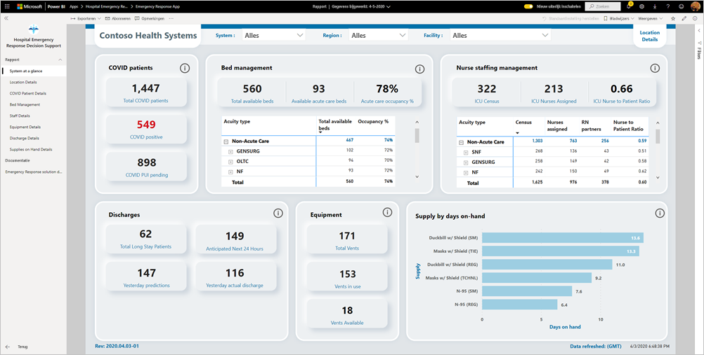

In dit artikel leest u hoe u de app installeert en hoe u verbinding maakt met de gegevensbronnen. Raadpleeg [Ondersteuningsdashboard voor Hospital Emergency Response](https://docs.microsoft.com/powerapps/sample-apps/emergency-response/deploy-configure#view-the-power-bi-dashboard) voor meer informatie over het gebruik van het rapport dat u in deze app te zien krijgt.

Nadat u de sjabloon-app hebt geïnstalleerd en verbinding hebt gemaakt met de gegevensbronnen, kunt u het rapport aanpassen aan uw behoeften. Vervolgens kunt u deze als app distribueren naar collega's in uw organisatie.

## Vereisten

Voordat u deze sjabloon-app installeert, moet u eerst de [Microsoft Power Platform-oplossing Hospital Emergency Response](https://docs.microsoft.com/powerapps/sample-apps/emergency-response/deploy-configure) installeren en instellen. Als u deze oplossing installeert, worden de gegevensbronverwijzingen gemaakt die nodig zijn om de app te vullen met gegevens.

Let bij het installeren van de Microsoft Power Platform-oplossing Hospital Emergency Response op de [URL van uw Common Data Service-omgevingsinstantie](https://docs.microsoft.com/powerapps/sample-apps/emergency-response/deploy-configure#publish-the-power-bi-dashboard). U hebt deze nodig om de sjabloon-app te verbinden met de gegevens.

## De app installeren

1. Klik op de volgende koppeling om naar de app te gaan: [Sjabloon-app Ondersteuningsdashboard voor Hospital Emergency Response](https://aka.ms/AppSource_Hospital_offer)

1. Selecteer [**NU DOWNLOADEN**](https://aka.ms/AppSource_Hospital_offer) op de AppSource-pagina voor de app.

    [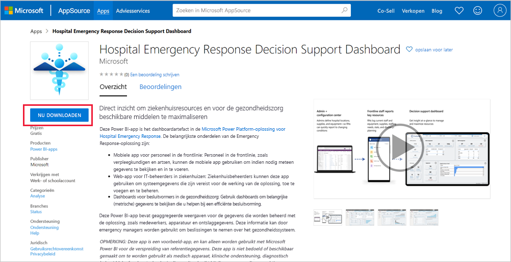](https://aka.ms/AppSource_Hospital_offer)

1. Lees de informatie in **Nog iets...** en selecteer **Doorgaan**.

    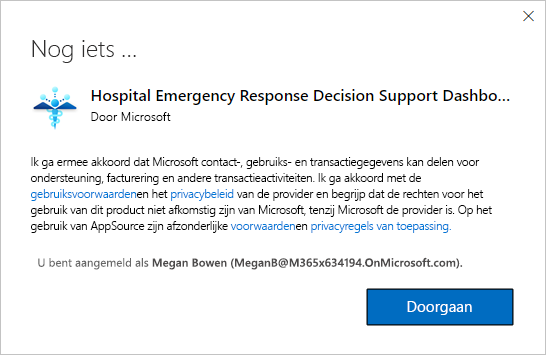

1. Selecteer **Installeren**. 

    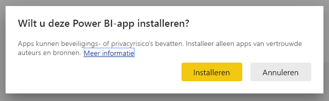

    Zodra de app is geïnstalleerd, ziet u deze op uw Apps-pagina.

   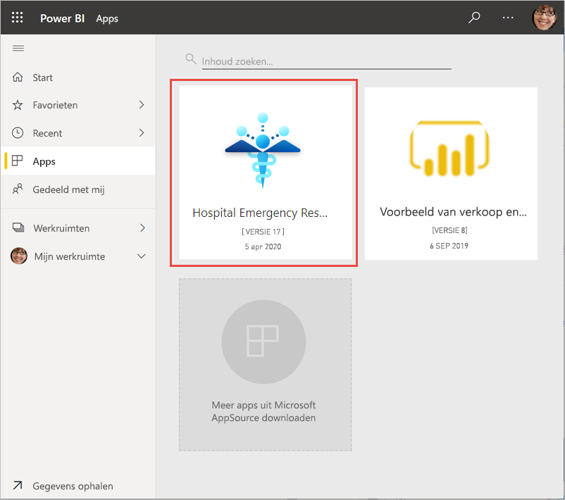

## Verbinding maken met gegevensbronnen

1. Selecteer het pictogram op de Apps-pagina om de app te openen.

1. Selecteer **Verkennen** op het welkomstscherm.

   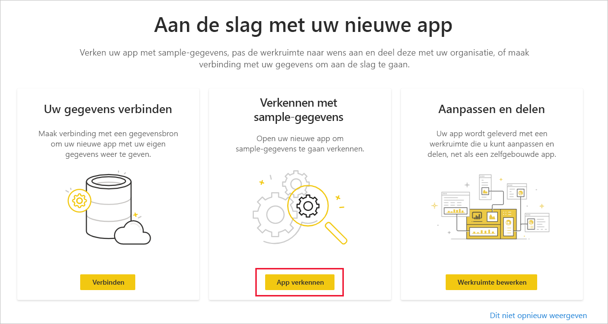

   De app wordt geopend met voorbeeldgegevens.

1. Selecteer de koppeling **Uw gegevens koppelen** op de banner bovenaan de pagina.

   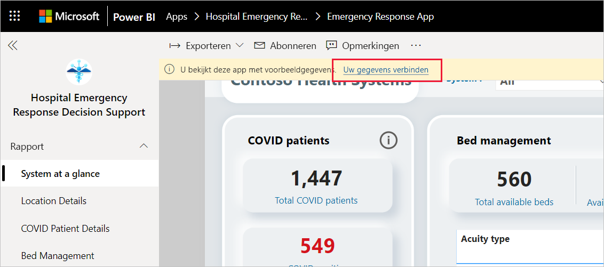

1. Ga als volgt te werk in het dialoogvenster:
   1. Voer in het veld Organisatienaam de naam van uw organisatie in, bijvoorbeeld Contoso Health Systems. Dit veld is optioneel. Deze naam wordt linksboven in het dashboard weergegeven.
   1. Typ in het veld CDS_base_solution de [URL van uw Common Data Service-omgevingsinstantie](https://docs.microsoft.com/powerapps/sample-apps/emergency-response/deploy-configure#publish-the-power-bi-dashboard). Bijvoorbeeld: https://[mijnomgeving].crm.dynamics.com. Klik op **Volgende** als u klaar bent.

   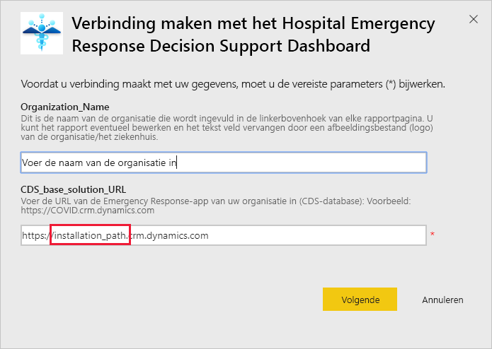

1. In het volgende dialoogvenster dat wordt weergegeven, stelt u de verificatiemethode in op **OAuth2**. U hoeft niets te doen met de instelling voor het privacyniveau.

   Selecteer **Aanmelden**.

   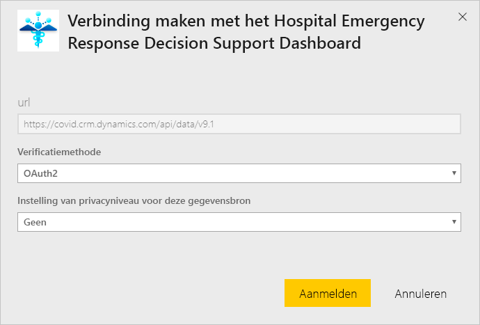

1. Meld u op het Microsoft-aanmeldingsscherm aan bij Power BI.

   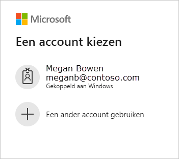

   Nadat u zich hebt aangemeld, wordt het rapport verbonden met de gegevensbronnen en wordt het gevuld met actuele gegevens. Gedurende deze periode wordt de activiteitsbewaking ingeschakeld.

   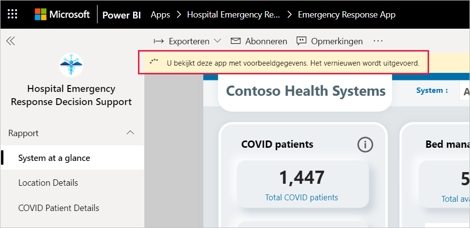

## Vernieuwen van het rapport plannen

Wanneer het vernieuwen van gegevens is voltooid, [stelt u een vernieuwingsschema in](../connect-data/refresh-scheduled-refresh.md) om de rapportgegevens up-to-date te houden.

1. Selecteer op de bovenste koptekstbalk **Power BI**.

   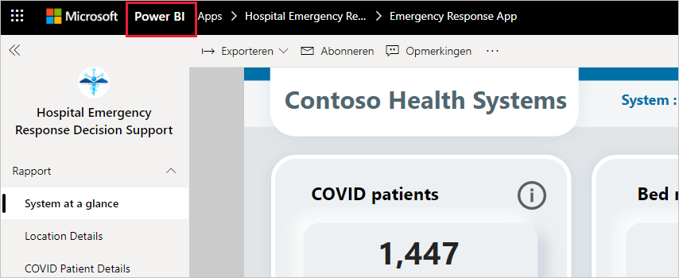

1. Zoek in het linkernavigatiedeelvenster onder **Werkruimten** naar de werkruimte Ondersteuningsdashboard voor Hospital Emergency Response en volgt de instructies in het artikel [Geplande vernieuwing configureren](../connect-data/refresh-scheduled-refresh.md).

## Aanpassen en delen

Zie [De app aanpassen en delen](../connect-data/service-template-apps-install-distribute.md#customize-and-share-the-app) voor meer informatie. Zorg ervoor dat u de [rapportdisclaimers](../create-reports/sample-covid-19-us.md#disclaimers) controleert voordat u de app publiceert of distribueert.

## Volgende stappen
* [Informatie over het Hospital Emergency Response-rapport](https://docs.microsoft.com/powerapps/sample-apps/emergency-response/deploy-configure#view-the-power-bi-dashboard)
* [De voorbeeldsjabloon Crisis Communication instellen en leren kennen in Power Apps](https://docs.microsoft.com/powerapps/maker/canvas-apps/sample-crisis-communication-app)
* Vragen? [Misschien dat de Power BI-community het antwoord weet](https://community.powerbi.com/)
* [Wat zijn Power BI-sjabloon-apps?](../connect-data/service-template-apps-overview.md)
* [Sjabloon-apps in uw organisatie installeren en distribueren](../connect-data/service-template-apps-install-distribute.md)
