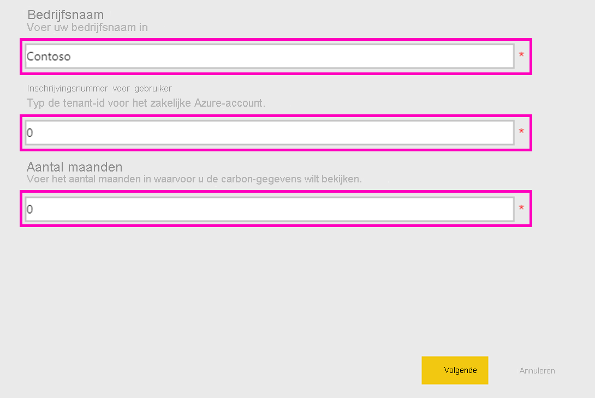

# Microsoft Sustainability Calculator verbinden
Krijg inzicht in de CO2-uitstoot van uw IT infrastructuur voor duurzamere computingbeslissingen

Microsoft Sustainability Calculator biedt meer inzicht in de CO2-uitstoot die verband houdt met Azure-services. Degenen die verantwoordelijk zijn voor rapportage over en bevordering van duurzaamheid in hun organisatie hebben nu de mogelijkheid om de CO2-uitstoot van elk Azure-abonnement te kwantificeren en te bekijken hoeveel lager de uitstoot wordt als werkbelastingen worden uitgevoerd in Azure in plaats van in on-premises datacentrums. Deze gegevens zijn bruikbaar voor rapportage over broeikasgassen of scope 3-emissies. Voor toegang tot Microsoft Sustainability Calculator zijn uw tenant-ID en toegangssleutel vereist. Deze kunt u doorgaans opvragen bij de Azure-beheerder van uw organisatie.

Voor het gebruik van deze app hebt u informatie uit de Azure Enterprise-portal nodig. De systeembeheerders van uw onderneming kunnen u helpen bij het verkrijgen van deze informatie. Raadpleeg deze instructies en verkrijg de vereiste informatie voordat u de app installeert. 

In deze versie van de connector worden alleen Enterprise-inschrijvingen vanuit [https://ea.azure.com](https://ea.azure.com/) ondersteund. China-inschrijvingen worden momenteel niet ondersteund.

## Verbinding maken
[!INCLUDE [powerbi-service-apps-get-more-apps](../includes/powerbi-service-apps-get-more-apps.md)]

1. Selecteer **Microsoft Sustainability Calculator** \> **Nu downloaden**.
1. Selecteer in **Deze Power BI-app installeren?** de optie **Installeren**.
1. Selecteer in het deelvenster **Apps** de tegel **Microsoft Sustainability Calculator**.
1. Selecteer in **Aan de slag met uw nieuwe app** de optie **Verbinding maken**.

    

1. Selecteer achtereenvolgens uw **bedrijfsnaam, inschrijvingsnummer,** en **aantal maanden \>Aanmelden.** Hieronder vindt u informatie over [het vinden van deze parameters](#finding-parameters).

    

1. Bij **Verificatiemethode** selecteert u **Sleutel**, en bij **Privacyniveau** selecteert u **Organisatie**.
1. Bij **Sleutel** gebruikt u uw **toegangssleutel \> Aanmelden**.

    

1. Het importproces wordt automatisch gestart. Als dit is voltooid, bevat het **navigatievenster** een nieuw dashboard, rapport en model. Selecteer het rapport om uw geïmporteerde gegevens weer te geven.

## Parameters zoeken

Als u de **inschrijvings-id** en **toegangssleutel** van uw bedrijf wilt vinden, moet u samenwerken met uw Azure-beheerder om de vereiste gegevens te verkrijgen. Stappen voor de beheerder

1. Log in bij de [Azure Enterprise-portal](https://ea.azure.com), klik op **Beheren** op het lint aan de linkerkant en het verkrijg het **inschrijvingsnummer** zoals hieronder wordt weergegeven
2. Klik in de [Azure Enterprise-portal](https://ea.azure.com) op **Rapporten** en vervolgens op API-toegangssleutel zoals hieronder wordt weergegeven om de primaire inschrijvingsaccountsleutel te verkrijgen

## De app gebruiken

Als u de parameters op een willekeurig moment wilt bijwerken, gaat u naar de instellingen van de **gegevensset**, opent u de gekoppelde app-werkruimte en werkt u de tenant-id, bedrijfsnaam of het aantal maanden aan gegevens bij. Nadat u de parameters hebt toegepast, klikt u op **Vernieuwen** om de gegevens opnieuw te laden met de toegepaste nieuwe parameters.