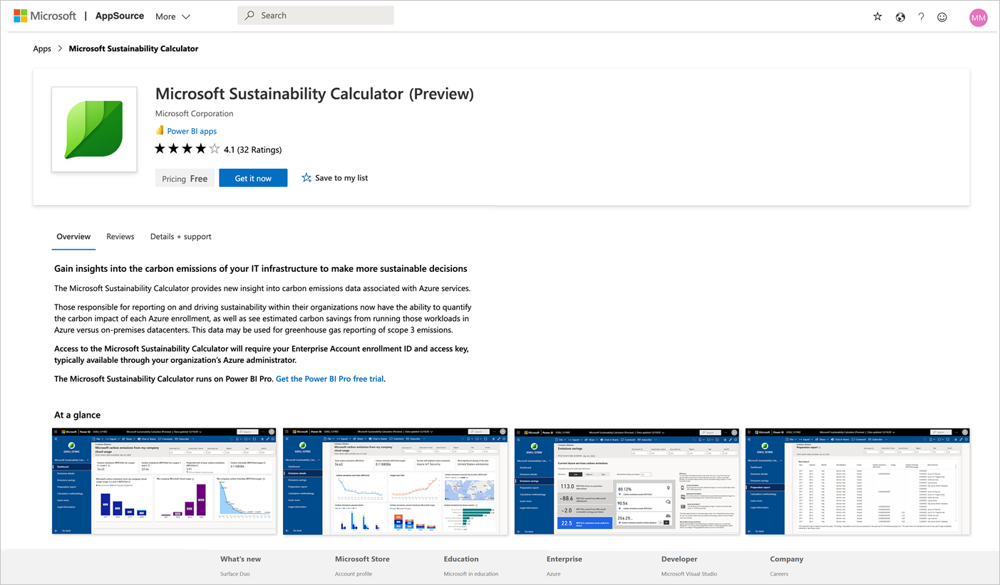

# Ondersteuningspagina voor Microsoft Sustainability Calculator

Microsoft Sustainability Calculator biedt meer inzicht in de CO2-uitstoot die verband houdt met Azure-services. Degenen die verantwoordelijk zijn voor het rapporteren over en het bevorderen van de duurzaamheid in hun organisatie kunnen voortaan de CO2-uitstoot van elk Azure-abonnement kwantificeren en tevens bekijken hoeveel lager de uitstoot wordt als workloads worden uitgevoerd in Azure in plaats van in on-premises datacentra. Deze gegevens zijn bruikbaar voor rapportage over Scope 3-emissies van broeikasgassen.

> [!NOTE]
> In deze versie van de connector worden alleen inschrijvingen vanuit de [Azure Enterprise-portal](https://ea.azure.com) ondersteund. China-inschrijvingen worden momenteel niet ondersteund.

## Vereisten

Voor toegang tot de Microsoft Sustainability Calculator hebt u de volgende informatie nodig van de Azure-beheerder van uw organisatie:

- Tenant-id
- Toegangssleutel
- Inschrijvingsnummer
- Alleen de rol Azure-beheerder kan een rekenmachine verifiëren en koppelen aan bedrijfsgegevens. (**Alleen voor de previewversie van december 2020**)

Ga als volgt te werk om het inschrijvingsnummer van uw bedrijf te vinden:

1. Meld u als beheerder aan bij de [Azure Enterprise-portal](https://ea.azure.com).
2. Op de linkernavigatiebalk selecteert u **Active Directory** of **Beheren**. Het inschrijvingsnummer van uw bedrijf wordt weergegeven.

   

Ga als volgt te werk om de toegangssleutel van uw bedrijf te vinden:

1. Meld u als beheerder aan bij de [Azure Enterprise-portal](https://ea.azure.com).
2. Selecteer **Rapporten** en vervolgens **API-toegangssleutel** om de primaire sleutel voor het inschrijvingsaccount te verkrijgen.

## Sustainability Calculator: versie van januari 2020

### Verbinding maken

[!INCLUDE [powerbi-service-apps-get-more-apps](../includes/powerbi-service-apps-get-more-apps.md)]

3. Selecteer **Microsoft Sustainability Calculator** en vervolgens **Nu downloaden**.

4. Selecteer in **Deze Power BI-app installeren?** de optie **Installeren**.

5. Selecteer in het deelvenster **Apps** de tegel **Microsoft Sustainability Calculator**.

6. Selecteer in **Aan de slag met uw nieuwe app** de optie **Verbinding maken**.

   

7. Voer **Bedrijfsnaam**, **Inschrijvingsnummer gebruiker** en **Aantal maanden** in. Zie [Vereisten](#prerequisites) voor meer informatie over het verkrijgen van uw inschrijvingsnummer. Selecteer **Volgende**.

   

8. Voer de volgende informatie in:

   | Veld | Waarde |
   | --- | --- |
   | **Verificatiemethode** | Selecteer **Sleutel**. |
   | **Accountsleutel** | Voer uw toegangssleutel in. |
   | **Instelling van privacyniveau voor deze gegevensbron** | Selecteer **Organisatie**. |

   

9. Selecteer **Aanmelden**.

10. Het importproces wordt automatisch gestart. Als dit is voltooid, bevat het **navigatievenster** een nieuw dashboard, rapport en model. Selecteer het rapport om uw geïmporteerde gegevens weer te geven.

### De app gebruiken

Ga als volgt te werk om de parameters bij te werken:

1. Ga naar de instellingen voor **Gegevensset** en open de instellingen met betrekking tot de app-werkruimte.
2. Werk zo nodig de **bedrijfsnaam**, het **inschrijvingsnummer voor de gebruiker** of het **aantal maanden** bij.
3. Selecteer **Vernieuwen** om de gegevens waarop de nieuwe parameters zijn toegepast, opnieuw te laden.

## Sustainability Calculator: versie van december 2020 (preview)

Bereken vandaag nog uw koolstofuitstoot met betrekking tot de cloud met de Microsoft Sustainability Calculator.

Voor een nauwkeurige koolstofboekhouding zijn de juiste gegevens van partners en leveranciers vereist. Dankzij de Microsoft Sustainability Calculator hebt u een transparant overzicht van de koolstofemissies die afkomstig zijn als gevolg van uw gebruik van Azure en Microsoft Dynamics.

De koolstofboekhouding van Microsoft bestrijkt alle drie de emissiebereiken (Scope 1, 2 en 3) met een door Stanford University in 2018 gevalideerde methodologie. Er wordt gebruikgemaakt van een consistente en nauwkeurige koolstofboekhouding om de impact van Microsoft-cloudservices op de milieuvoetafdruk van klanten te kwantificeren. Microsoft is de enige cloudprovider die dit niveau van transparantie aan klanten ter beschikking stelt bij het samenstellen van rapporten voor vrijwillige of wettelijke rapportagevereisten.

### Voordat u begint

Microsoft Sustainability Calculator wordt uitgevoerd onder Power BI Pro. Als u geen Power BI Pro hebt, [kunt u een gratis proefversie krijgen](https://powerbi.microsoft.com/power-bi-pro).

U hebt uw Azure-inschrijvingsnummer nodig. Als u dit niet hebt, vraagt u de Azure-beheerder van uw organisatie om hulp. Zie [Vereisten](#prerequisites) voor meer informatie.

### Verbinding maken met de calculator: koolstofboekhouding in vijf eenvoudige stappen

1. Download de app in [AppSource](https://go.microsoft.com/fwlink/?linkid=2151690).

   

   U kunt de app ook in Power BI vinden.

   

2. Open de app.

3. Voer uw inschrijvingsnummer in. Selecteer **Verbinding maken met uw gegevens** en voer uw inschrijvingsnummer in. Zie [Vereisten](#prerequisites) voor meer informatie over het verkrijgen van uw inschrijvingsnummer.

   

4. Maak verbinding met uw account:
   - In **U maakt verbinding met (1 van 2)** onder **Verificatiemethode** selecteert u **OAuth2** en onder **Privacyniveau-instellingen voor deze gegevensbron** selecteert u **Organisatie**.

      
 
   - Selecteer het gebruikersaccount.

      
       
   - In **U maakt verbinding met (2 van 2)** onder **Verificatiemethode** selecteert u **Anoniem** en onder **Privacyniveau-instellingen voor deze gegevensbron** selecteert u **Organisatie**.

     
    
5. Wacht tot de weergave is opgebouwd. Dit kan 24 uur duren.

### Aanvullende bronnen

- [Instructievideo](https://go.microsoft.com/fwlink/?linkid=2151608)
- [De koolstofbaten van cloud-computing: A study on the Microsoft Cloud in partnership with WSP](https://download.microsoft.com/download/7/3/9/739BC4AD-A855-436E-961D-9C95EB51DAF9/Microsoft_Cloud_Carbon_Study_2018.pdf) (Een onderzoek naar de Microsoft-cloud in samenwerking met WSP)

### Veelgestelde vragen

#### Installatie van app

**Er wordt een foutbericht weergegeven als ik mijn gegevens met de calculator wil koppelen. Wat kan ik doen?**

Controleer eerst in Azure Cost Management of u over IT-beheerdersbevoegdheden beschikt. Als dat niet het geval is, vraagt u de toegang aan bij uw beheerder. Controleer vervolgens of u het juiste inschrijvingsnummer gebruikt.

**Ik heb mijn inschrijvingsnummer ingevoerd, maar mijn bedrijfsgegevens worden niet geladen. Wat is het probleem?**

Het kan 24 uur duren voordat uw gegevens met de openbare preview van de Sustainability Calculator zijn geladen. Controleer dit na 24 uur en selecteer de knop **Vernieuwen** in Power BI.

**Wil Microsoft de verantwoordelijkheid voor de emissies op mij afschuiven?**

Nee. CO2-emissies van Azure-services worden gerapporteerd als Scope 1 en 2-emissies van Microsoft, in overeenstemming met het voor de branche gestandaardiseerde [Greenhouse Gas Protocol (GHG)](https://ghgprotocol.org/). Het GHG-protocol definieert Scope 3-emissies als emissies die namens u door een andere entiteit worden uitgestoten. Deze worden per definitie dubbel geteld. Dankzij de Microsoft Sustainability Calculator wordt een nieuw, transparant inzicht geboden van uw Scope 3-emissies met betrekking tot uw gebruik van Azure-services, met name categorie 1 van Scope 3: Aangeschafte goederen en services.

**Waarom zijn mijn emissies door het gebruik van de Microsoft-cloud zoveel lager dan wanneer ik een on-premises oplossing zou gebruiken?**

Microsoft heeft een [in 2018 gepubliceerd onderzoek](https://blogs.microsoft.com/on-the-issues/2018/05/17/microsoft-cloud-delivers-when-it-comes-to-energy-efficiency-and-carbon-emission-reductions-study-finds/) uitgevoerd waarin het verschil tussen de Microsoft-cloud en on-premises of traditionele datacentra is geëvalueerd. De resultaten laten zien dat Azure Compute en Storage 52 tot 79 procent energiezuiniger zijn dan traditionele datacentra van ondernemingen, afhankelijk van de specifieke vergelijking die wordt gemaakt met een te laag, gemiddeld of hoog rendement on-premises alternatief. Als er rekening wordt gehouden met onze duurzame energieaankopen, is Azure 79 tot 98 procent CO2-zuiniger. Deze besparingen worden veroorzaakt door vier belangrijke functies van de Microsoft-cloud: Operationele efficiëntie van IT, efficiëntie van IT-apparatuur, efficiëntie van de infrastructuur van het datacentrum en duurzame elektriciteit.

**Als de activiteiten van Microsoft koolstofneutraal zijn en worden aangedreven door hernieuwbare energiebronnen, waarom is de uitstoot van Azure-services van de klant dan niet nul?**

Er zijn twee belangrijke redenen waarom emissies van klanten van Microsoft niet nul zijn. De eerste heeft betrekking op boekhoudkundige praktijken van GHG; de tweede heeft te maken met de grens van deze analyse. Voor het uitvoeren van CO2-neutrale activiteiten maakt Microsoft gebruik van compensatieprogramma's om bepaalde emissiebronnen te reduceren, zoals de verbranding ter plekke van brandstof voor back-upgeneratoren, koelmiddelen en wagenparken. Dit reduceert de *netto*-emissies van Microsoft tot nul. De calculator rapporteert *bruto* GHG-emissiewaarden voordat deze programma's worden toegepast, hoewel het aantal toegepaste compensatieprogramma's en het aantal netto-emissies wordt gerapporteerd op het tabblad **GHG Reporting** voor een duidelijker overzicht. De tweede reden is dat naast de energie en emissies met betrekking tot de activiteit van de datacentra van Microsoft, de voetafdruk van de emissies de energie bevat die wordt gebruikt door internetserviceproviders buiten de operationele grens van Microsoft om gegevens over te brengen tussen de datacentra van Microsoft en Azure-klanten.

**Hoe moet ik deze gegevens gebruiken en waar kan ik ze rapporteren?**

Uw emissies kunnen worden gerapporteerd als onderdeel van de indirecte Scope 3-koolstofemissies van uw bedrijf. Scope 3 -emissies worden vaak vermeld in duurzaamheidsrapporten, CDP-rapporten over klimaatverandering en andere rapporten. Naast het totaal aan emissies bieden de emissiebesparingen een duidelijk voorbeeld van hoe de beslissing van uw bedrijf om gebruik te maken van Microsoft Azure Services bijdraagt aan mondiale emissiereducties. Om dit in context te plaatsen: de app geeft de equivalente niet-afgelegde voertuigkilometers aan die overeenkomen met de reductie in GHG-emissies, op basis van de EPA-equivalente rekenfactor per januari 2020.

**Wat kan ik doen om de emissies verder te verminderen?**

Door in Azure efficiënt met resources en kosten om te gaan, wordt de impact op het milieu van uw gebruik van Azure verminderd. Zo zijn bijvoorbeeld ongebruikte virtuele machines verkwistend, zowel in de cloud als on-premises. Het aanpassen van virtuele machines ter verbetering van de ingebruiksfactoren voor rekenkracht (CUF) vermindert het energiegebruik per nuttige uitvoer, net zoals bij fysieke servers. [Azure Cost Management](https://docs.microsoft.com/azure/cost-management-billing/costs/cost-mgt-best-practices) biedt de hulpmiddelen om uw uitgaven te plannen, te analyseren en te verlagen om uw investering in de cloud te maximaliseren.

#### Methodologie

**Wat is de methodologie achter het hulpprogramma?**

De Microsoft Sustainability Calculator weerspiegelt de specifieke cloudservices die zijn gebruikt en de bijbehorende energievereisten, de efficiency van de datacentra die deze services leveren, de brandstofmengsels voor de elektriciteit in de regio's waarin deze datacentra actief zijn en de aankopen van hernieuwbare energie van Microsoft. Als onderdeel van de ontwikkeling van de app, werd de methodologie en de implementatie ervan door derden gecontroleerd om ervoor te zorgen dat deze is afgestemd op de WRI (World Resources Institute)/World Business Council for Sustainable Development (WBCSD) Greenhouse Gas (GHG) Protocol Corporate Accounting and Reporting Standard. De draagwijdte van de controle, uitgevoerd in overeenstemming met ISO 14064-3: Greenhouse gases--Part 3: (Broeikasgassen - deel 3:) Specification with guidance for the validation and verification of greenhouse gas assertions (Specificatie met richtlijnen voor de validatie en verificatie van beweringen ten aanzien van broeikasgassen), is inclusief de schatting van emissies van Azure-services, maar exclusief de schatting van de on-premises emissies, gezien de contrafeitelijke aard van die schatting. Een meer gedetailleerde beschrijving van de koolstofberekening wordt in het hulpprogramma beschreven op het tabblad **Calculation Methodology**.

**Welke gegevens zijn vereist voor het berekenen van de Azure-koolstofvoetafdruk? Hebt u toegang tot de gegevens van mijn bedrijf?**

De geschatte koolstofberekeningen worden uitgevoerd op basis van het gebruik van Azure-services die zijn geopend met behulp van Azure Consumed Revenue. De calculator heeft geen toegang tot de opgeslagen gegevens van klanten. De verbruiksgegevens worden gecombineerd met de gegevens van Microsoft over het energieverbruik en de CO2-uitstoot, om de geschatte emissies te berekenen die betrekking hebben op uw gebruik van Azure-services uitgaande van de datacentra die deze services bieden.

**Is deze berekening van toepassing op alle Azure-services en alle Azure-regio's?**

De schattingen omvatten alle Azure-services in alle Azure-regio's die zijn gekoppeld aan de tenant-id die tijdens de installatie is verstrekt.

#### Kenmerken van on-premises emissies

**Waar haalt de Microsoft Sustainability Calculator de gegevens vandaan over mijn on-premises emissies en activiteiten?**

De Microsoft Sustainability Calculator verzamelt geen informatie die specifiek is voor uw on-premises datacentra, *met uitzondering van* wat u zelf opgeeft. Zoals beschreven in volgende Veelgestelde vragen, is de Microsoft Sustainability Calculator afhankelijk van het bedrijfsmatig onderzoek en de invoer van gebruikers over de efficiency en de energiemix van on-premises alternatieven om een schatting van on-premises emissies te kunnen maken.

**Wat zijn de aannames met betrekking tot on-premises schattingen? Zijn efficiëntiebesparingen alleen afkomstig van verbeteringen in de effectiviteit van het energieverbruik (Power Usage Effectiveness, PUE)?**

De efficiëntie met betrekking tot Microsoft-cloudservices omvat veel meer dan een verhoogde PUE. Hoewel de datacentra van Microsoft zich richten op het optimaliseren van de PUE, zijn de belangrijkste verbeteringen te danken aan operationele IT-efficiency (dynamisch inrichten, meerdere tenants, servergebruik) en de efficiëntie van IT-apparatuur (hardware aanpassen aan services, waardoor er meer energie voor een bruikbare uitvoer vrijkomt), en daarnaast de efficiëntie van de infrastructuur van het datacentrum (verbeteringen in PUE). In ons [onderzoek uit 2018](https://blogs.microsoft.com/on-the-issues/2018/05/17/microsoft-cloud-delivers-when-it-comes-to-energy-efficiency-and-carbon-emission-reductions-study-finds/) worden deze besparingen gekwantificeerd in vergelijking met een reeks on-premises alternatieven, variërend van laag-efficiënte tot hoog-efficiënte datacentra. Deze uitkomsten worden gebruikt voor een schatting van het energieverbruik dat vereist is voor een overeenkomstig on-premises datacentrum om dezelfde services te bieden die elke klant met de Microsoft-cloud gebruikt.

**Van welke energiemix wordt uitgegaan voor de on-premises infrastructuur?**

Standaard worden on-premises emissies door de Microsoft Sustainability Calculator geschat op basis van de combinatie van duurzame en niet-duurzame energiebronnen op het net. Er wordt van uitgegaan dat het on-premises datacentrum zich op hetzelfde net bevindt als de datacentra van Microsoft. Echter, voor klanten die duurzame elektriciteit aanschaffen *naast* wat het net te bieden heeft (bijvoorbeeld via Power Purchase Agreements), kunnen gebruikers het percentage duurzame elektriciteit selecteren. De Microsoft Sustainability Calculator past vervolgens de on-premises emissies dienovereenkomstig aan.

**Wanneer moet ik voor Laag, Gemiddeld of Hoog kiezen voor de efficiëntie van de on-premises infrastructuur?**

Gebruikers moeten een keuze maken voor de efficiëntie die het meest representatief is voor de on-premises implementatie die ze willen vergelijken, op basis van de kenmerken van de apparatuur en het datacentrum:

- **Laag**: fysieke servers en direct gekoppelde opslag in een klein, gelokaliseerd datacentrum (50 - 200 vierkante meter)
- **Gemiddeld**: combinatie van fysieke/gevirtualiseerde servers en gekoppelde/toegewezen opslag in een intern datacentrum van gemiddeld niveau (200 - 2000 vierkante meter)
- **Hoog**: Gevirtualiseerde servers en toegewezen opslag in een geavanceerd intern datacentrum (> 2000 vierkante meter)
