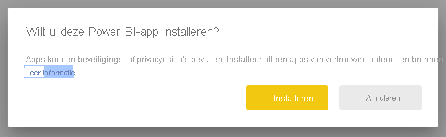
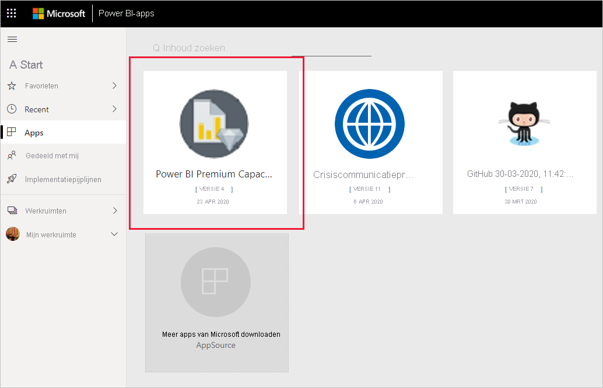
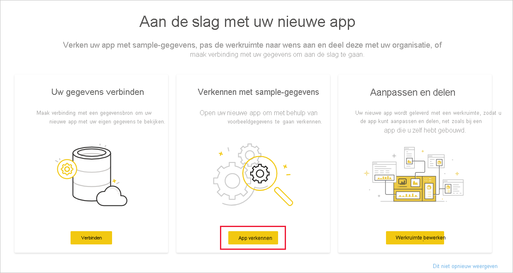
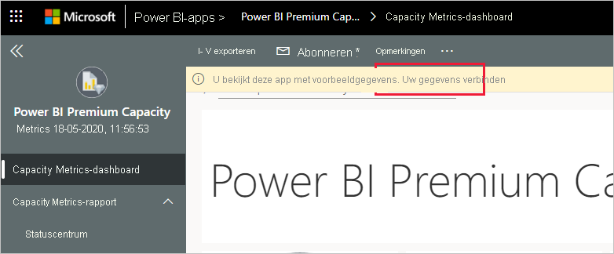
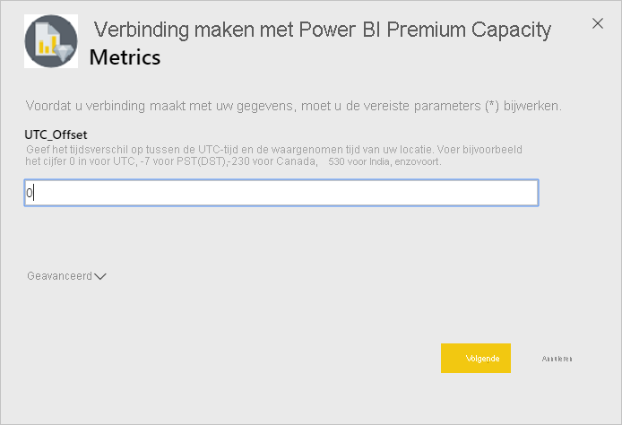
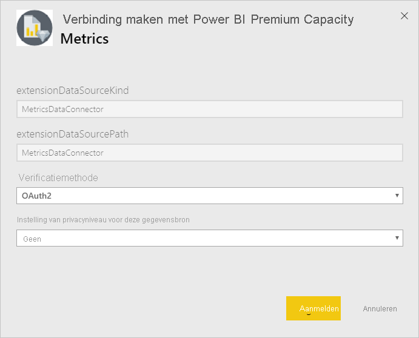
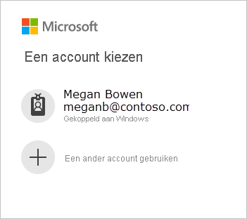
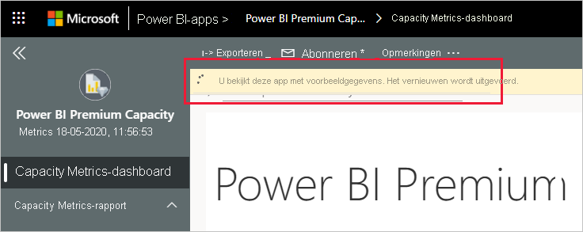
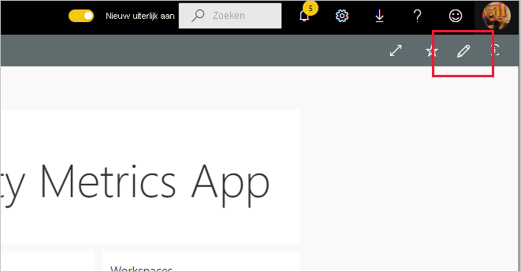

# Verbinding maken met metrische Power BI Premium-capaciteitsgegevens

Bewaking van uw capaciteiten is essentieel voor het nemen van gefundeerde beslissingen over hoe u uw Premium-capaciteitsresources het beste kunt gebruiken. De Power BI Premium Capacity Metrics-app biedt de meest uitgebreide informatie over hoe uw capaciteiten presteren.

In dit artikel leest u hoe u de app moet installeren en hoe u verbinding maakt met de gegevensbronnen. Zie [Premium-capaciteiten bewaken met de app](../admin/service-admin-premium-monitor-capacity.md) en de blogpost [Premium-capaciteit bewaken met de app](https://powerbi.microsoft.com/blog/premium-capacity-metrics-app-new-health-center-with-kpis-to-explore-relevant-metrics-and-steps-to-mitigate-issues/) voor informatie over de inhoud van het rapport en hoe u deze kunt gebruiken.

Nadat u de app hebt geïnstalleerd en verbinding hebt gemaakt met de gegevensbronnen, kunt u het rapport aanpassen aan uw behoeften. Vervolgens kunt u de app distribueren naar collega's in uw organisatie.

> [!NOTE]
> Voor het installeren van sjabloon-apps zijn [machtigingen](./service-template-apps-install-distribute.md#prerequisites) vereist. Neem contact op met de Power BI-beheerder als u niet over voldoende machtigingen beschikt.

## De app installeren

1. Klik op de volgende koppeling om naar de app te gaan: [De sjabloon-app Power BI Premium Capacity Metrics](https://app.powerbi.com/groups/me/getapps/services/pbi_pcmm.capacity-metrics-dxt)

1. Selecteer [**NU DOWNLOADEN**](https://app.powerbi.com/groups/me/getapps/services/pbi_pcmm.capacity-metrics-dxt) op de AppSource-pagina voor de app.

    

1. Selecteer **Installeren**. 

    

    > [!NOTE]
    > Als u de app eerder hebt geïnstalleerd, wordt u gevraagd of u die [instantie wilt overschrijven](./service-template-apps-install-distribute.md#update-a-template-app) of dat u de app naar een nieuwe werkruimte wilt installeren.

    Zodra de app is geïnstalleerd, ziet u deze op uw Apps-pagina.

   

## Verbinding maken met gegevensbronnen

1. Selecteer het pictogram op de Apps-pagina om de app te openen.

1. Selecteer **Verkennen** op het welkomstscherm.

   

   De app wordt geopend met voorbeeldgegevens.

1. Selecteer de koppeling **Uw gegevens koppelen** op de banner bovenaan de pagina.

   

1. In het dialoogvenster dat wordt weergegeven, stelt u de UTC-offset in, dat wil zeggen, het verschil in uren tussen de UTC-tijd (Coordinated Universal Time) en de tijd op uw locatie. Klik of tik op **Volgende**.
  
   
   **Opmerking: De indelingen voor halve uren moeten decimalen zijn (bijvoorbeeld 5,5, 2,5, enz.).**

1. In het volgende dialoogvenster dat wordt weergegeven, hoeft u niets te doen. U kunt gewoon **Aanmelden** selecteren.

   

1. Meld u op het Microsoft-aanmeldingsscherm aan bij Power BI.

   

   Nadat u zich hebt aangemeld, wordt het rapport verbonden met de gegevensbronnen en wordt het gevuld met actuele gegevens. Gedurende deze periode wordt de activiteitsbewaking ingeschakeld.

   

   Uw rapportgegevens worden eenmaal per dag automatisch vernieuwd, tenzij u dit hebt uitgeschakeld tijdens het aanmeldingsproces. U kunt desgewenst ook [uw eigen vernieuwingsplanning instellen](./refresh-scheduled-refresh.md) om de rapportgegevens up-to-date te houden.

## Aanpassen en delen

Als u de app wilt aanpassen, klikt u op het potloodpictogram in de rechterbovenhoek.

 

Zie [De app aanpassen en delen](./service-template-apps-install-distribute.md#customize-and-share-the-app) voor meer informatie.

## Volgende stappen
* [Premium-capaciteiten bewaken met de app](../admin/service-admin-premium-monitor-capacity.md)
* [Power BI Premium Capacity Metrics-app - blogpost](https://powerbi.microsoft.com/blog/premium-capacity-metrics-app-new-health-center-with-kpis-to-explore-relevant-metrics-and-steps-to-mitigate-issues/)
* [Wat zijn Power BI-sjabloon-apps?](./service-template-apps-overview.md)
* [Sjabloon-apps in uw organisatie installeren en distribueren](./service-template-apps-install-distribute.md)
* Vragen? [Misschien dat de Power BI-community het antwoord weet](https://community.powerbi.com/)