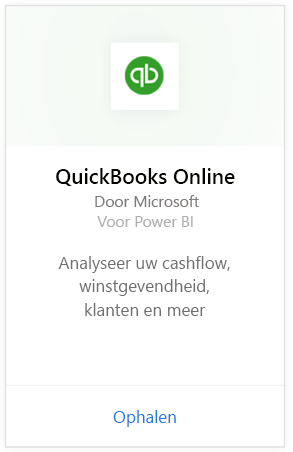
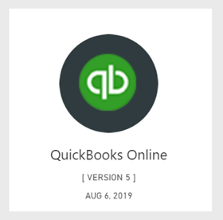
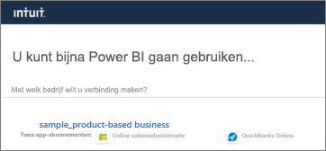
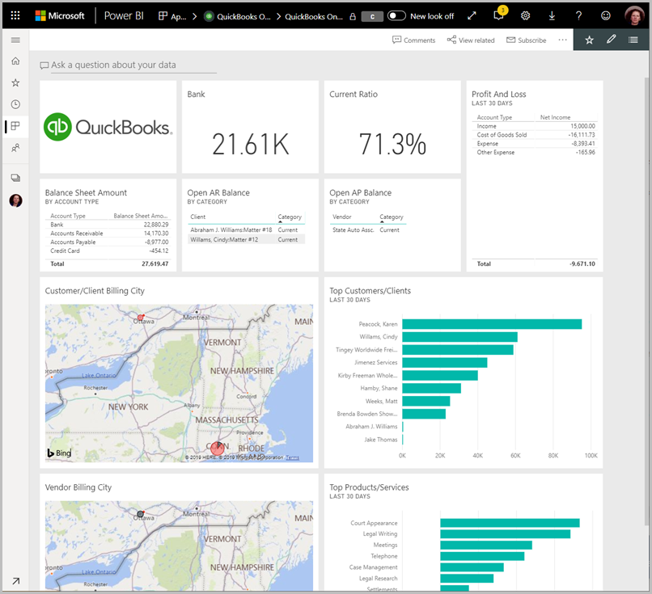
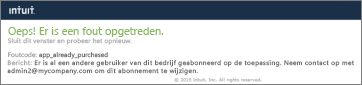
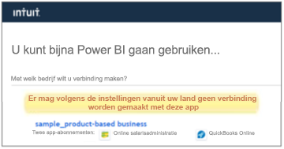

# Verbinding maken met QuickBooks Online via Power BI
Wanneer u in Power BI verbinding maakt met uw QuickBooks Online-gegevens, worden direct een Power BI-dashboard en Power BI-rapporten weergegeven die inzicht geven in onder andere uw cashflow, winstgevendheid en klanten. U kunt het dashboard en de rapporten ongewijzigd gebruiken of deze aanpassen om de informatie die u het belangrijkst vindt eruit te laten springen. De gegevens worden eenmaal per dag automatisch vernieuwd.

Maak verbinding met het [QuickBooks Online-sjabloon-app](https://dxt.powerbi.com/getdata/services/quickbooks-online) voor Power BI.

>[!NOTE]
>Als u uw QuickBooks Online-gegevens in Power BI wilt importeren, moet u een beheerder zijn voor uw QuickBooks Online-account en u aanmelden met uw beheerdersreferenties voor het account. U kunt deze connector niet gebruiken in combinatie met QuickBooks Desktop-software. 

## Verbinding maken

[!INCLUDE [powerbi-service-apps-get-more-apps](../includes/powerbi-service-apps-get-more-apps.md)]

3. Selecteer **QuickBooks Online** en vervolgens **Ophalen**.
   
   

4. Selecteer in **Deze Power BI-app installeren?** de optie **Installeren**.

    

4. Selecteer in het deelvenster **Apps** de tegel **QuickBooks**.

   

6. Selecteer in **Aan de slag met uw nieuwe app** de optie **Verbinding maken**.

    

4. Selecteer **oAuth2** als verificatiemethode en vervolgens **Aanmelden**. 
5. Geef desgevraagd uw QuickBooks Online-referenties op en voer het QuickBooks Online-verificatieproces uit. Als u al bent aangemeld bij QuickBooks Online in uw browser, wordt u mogelijk niet gevraagd om uw referenties in te voeren.
   >[!NOTE]
   >U moet over beheerdersreferenties beschikken voor uw QuickBooks Online-account.
6. Selecteer in het volgende scherm het bedrijf waarmee u via Power BI verbinding wilt maken.
   
   

7. Selecteer in het volgende scherm **Autoriseren** om het importeren te starten. Het proces kan enkele minuten duren, afhankelijk van de omvang van uw bedrijfsgegevens. 
   
   
   
8. Nadat de gegevens in Power BI zijn geïmporteerd, ziet u de lijst met inhoud voor uw QuickBooks-app: een nieuw dashboard, een nieuw rapport en een nieuwe gegevensset.
9. Selecteer het QuickBooks-dashboard om het verkenningsproces te starten. Dit dashboard wordt automatisch door Power BI gemaakt om de geïmporteerde gegevens weer te geven.

    

**Wat nu?**

* [Stel vragen in het vak Q&A](../consumer/end-user-q-and-a.md) boven in het dashboard.
* [Wijzig de tegels](../create-reports/service-dashboard-edit-tile.md) in het dashboard.
* [Selecteer een tegel](../consumer/end-user-tiles.md) om het onderliggende rapport te openen.
* Als uw gegevensset is ingesteld op dagelijks vernieuwen, kunt u het vernieuwingsschema wijzigen of de gegevensset handmatig vernieuwen met **Nu vernieuwen**

## Problemen oplossen
**"Helaas, er is een fout opgetreden"**

Als u het volgende bericht krijgt wanneer u **Autoriseren** hebt geselecteerd:

"Helaas, er is een fout opgetreden. Sluit dit venster en probeer het opnieuw.

Er is al een andere gebruiker van dit bedrijf geabonneerd op de toepassing. Neem contact op met [e-mailadres van de beheerder] om dit abonnement te wijzigen."

... Deze fout betekent dat een andere beheerder in uw bedrijf al via Power BI verbinding heeft gemaakt met uw bedrijfsgegevens. Vraag de beheerder om het dashboard met u te delen. Op dit moment kan slechts één beheerder een verbinding maken tussen een specifieke QuickBooks Online-bedrijfsgegevensset en Power BI. Nadat het dashboard door Power BI is gemaakt, kan de beheerder deze met meerdere collega's in dezelfde Power BI-tenants delen.

**"Er mag volgens de instellingen vanuit uw land geen verbinding worden gemaakt met deze app"**

Power BI ondersteunt momenteel alleen Amerikaanse edities van QuickBooks Online. 

## Volgende stappen
[Wat is Power BI?](../fundamentals/power-bi-overview.md)

[Basisconcepten voor ontwerpers in de Power BI-service](../fundamentals/service-basic-concepts.md)
