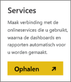
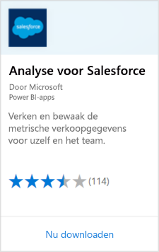
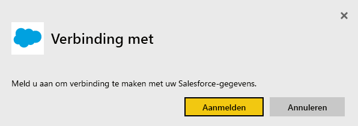
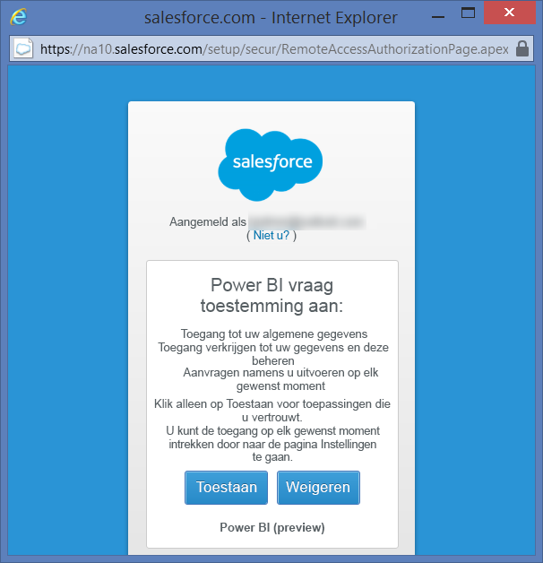
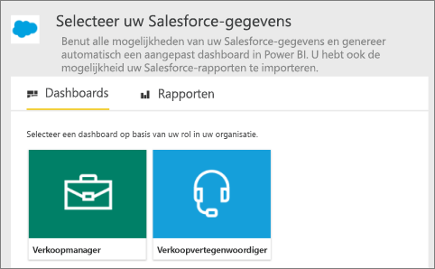
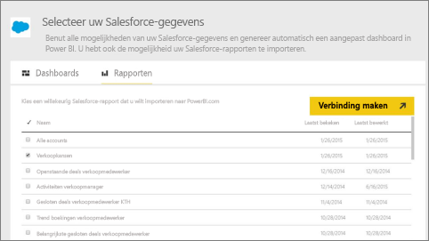
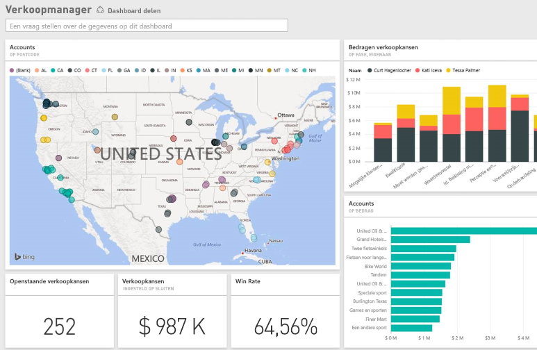

# Verbinding met Salesforce maken via Power BI
Met Power BI kunt u eenvoudig verbinding maken met uw Salesforce.com-account. Met deze verbinding kunt u uw Salesforce-gegevens ophalen en automatisch een dashboard en rapporten leveren.

Meer informatie over de [Salesforce-integratie](https://powerbi.microsoft.com/integrations/salesforce) met Power BI.

## Verbinding maken
1. Selecteer in Power BI **Gegevens ophalen** onderaan het navigatievenster.
   
    
2. Selecteer **Ophalen** in het vak **Services**.
   
    
3. Selecteer **Analytics voor Salesforce** en selecteer **Ophalen**.  
   
   
4. Selecteer **Aanmelden** om de stroom voor aanmelden te starten.
   
    
5. Geef desgevraagd uw Salesforce-referenties op. Selecteer **Toestaan** zodat Power BI toegang heeft tot uw basisinformatie en -gegevens van Salesforce.
   
   
6. Gebruik de vervolgkeuzelijst om te configureren wat u wilt importeren in Power BI:
   
   * **Dashboard**
     
     Selecteer een vooraf gedefinieerde dashboard op basis van een persoon (zoals **salesmanager**). Met deze dashboards wordt een specifieke set standaard-Salesforce-gegevens opgehaald die geen aangepaste velden bevat.
     
     
   * **Rapporten**
     
     Selecteer een of meer aangepaste rapporten in uw Salesforce-account. Deze rapporten komen overeen met uw weergaven in Salesforce en kunnen gegevens uit aangepaste velden of objecten bevatten.
     
     
     
     Als er geen rapporten worden weergegeven, voegt u ze toe aan of maakt u ze in uw Salesforce-account en maakt u opnieuw verbinding.

7. Selecteer **Verbinding maken** om het importproces te starten. Tijdens het importeren wordt er een melding weergegeven dat er een importbewerking wordt uitgevoerd. Zodra het importeren is voltooid, ziet u een dashboard, rapport en gegevensset voor uw Salesforce-gegevens in het navigatievenster.
   
   

U kunt het dashboard wijzigen om uw gegevens weer te geven zoals u dat wilt. U kunt vragen stellen met Q&A of [een tegel selecteren](../consumer/end-user-tiles.md) om het onderliggende rapport te openen en [dashboardtegels bewerken en verwijderen](../create-reports/service-dashboard-edit-tile.md).

**Wat nu?**

* [Stel vragen in het vak Q&A](../consumer/end-user-q-and-a.md) boven in het dashboard.
* [Een tegel bewerken of verwijderen](../create-reports/service-dashboard-edit-tile.md) in het dashboard
* [Selecteer een tegel](../create-reports/service-dashboard-tiles.md) om het onderliggende rapport te openen.
* Als uw gegevensset is ingesteld op dagelijks vernieuwen, kunt u het vernieuwingsschema wijzigen of de gegevensset handmatig vernieuwen met **Nu vernieuwen**

## Systeemvereisten en overwegingen

- Verbinding met een productieaccount van Salesforce waarvoor API-toegang is ingeschakeld.

- Machtiging verleend aan de Power BI-app tijdens de aanmelding

- Het account beschikt over voldoende beschikbare API-aanroepen om de gegevens op te halen en te vernieuwen.

- Er is een geldig verificatietoken nodig om de gegevens te kunnen vernieuwen. Salesforce heeft een limiet van vijf verificatietokens per toepassing. Zorg er daarom voor dat u vijf of minder Salesforce-gegevenssets importeert.

- De API voor Salesforce-rapporten heeft een beperking: er worden maximaal 2000 rijen gegevens ondersteund.

## Problemen oplossen

Als er fouten optreden, raadpleegt u de bovenstaande vereisten. 

Aanmelden bij een aangepast of sandbox-domein wordt momenteel niet ondersteund.

### Het bericht Kan geen verbinding maken met de externe server

Als het bericht Kan geen verbinding maken met de externe server wordt weergegeven wanneer u verbinding maakt met uw Salesforce-account, raadpleegt u deze oplossing op het volgende forum: [Foutbericht over aanmelden bij Salesforce-connector: Kan geen verbinding maken met de externe server](https://www.outsystems.com/forums/Forum_TopicView.aspx?TopicId=17674&TopicName=log-in-error-message-unable-to-connect-to-the-remote-server&)

## Volgende stappen
[Wat is Power BI?](../fundamentals/power-bi-overview.md)

[Gegevensbronnen voor de Power BI-service](service-get-data.md)
