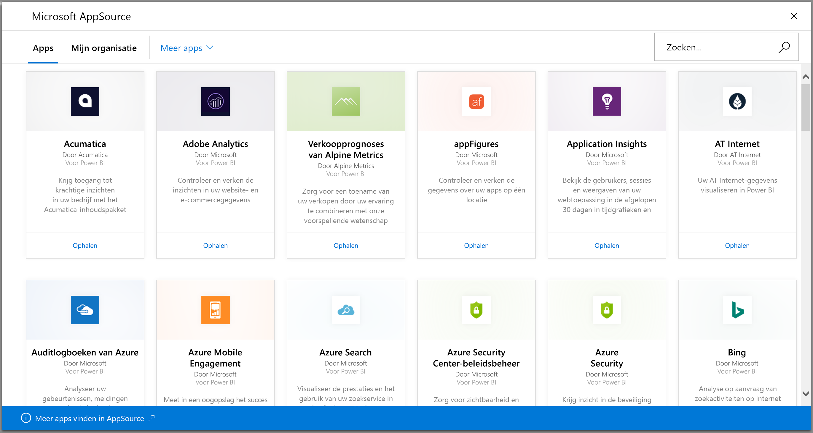
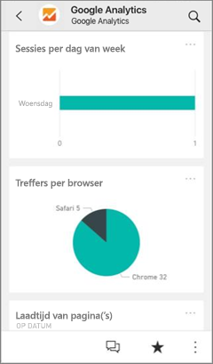
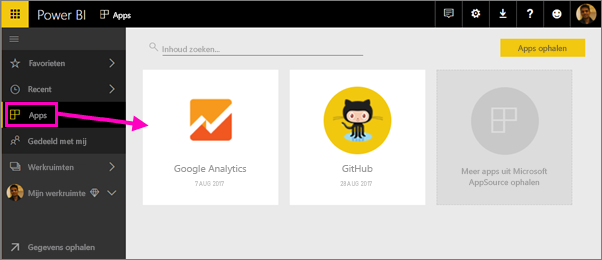
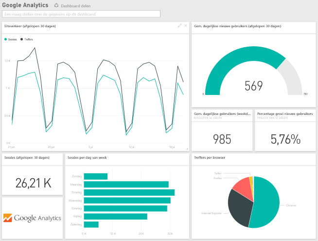
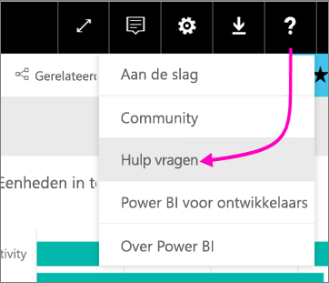

# Verbinding maken met de services die u gebruikt met Power BI
Met Power BI kunt u verbinding maken met een aantal services die u gebruikt om uw bedrijf te runnen, zoals Salesforce, Microsoft Dynamics en Google Analytics. In Power BI worden eerst uw referenties gebruikt om verbinding te maken met de service. Vervolgens wordt een Power BI-*werkruimte* met een dashboard en een reeks Power BI-rapporten gemaakt, waarop automatisch uw gegevens worden getoond en die een visueel overzicht geven van uw bedrijf.

>[!IMPORTANT]
>Service-inhoudspakketten worden vervangen door [Sjabloon-apps](./service-template-apps-overview.md). Vanaf 25 september 2019 is een aantal inhoudspakketten al afgeschaft. Elk verouderde inhoudspakket dat u hebt geïnstalleerd, blijft in uw account, maar er wordt geen documentatie of ondersteuning beschikbaar gesteld en het is niet mogelijk om het opnieuw te installeren.

Meld u aan bij Power BI om alle [services waarmee u verbinding kunt maken](https://app.powerbi.com/getdata/services) (Engelstalig) weer te geven. 

Nadat u de app hebt geïnstalleerd, kunt u het dashboard en de rapporten bekijken in de app en de werkruimte in de Power BI-service ([https://app.powerbi.com](https://app.powerbi.com)). U kunt ze ook in de mobiele Power BI-apps weergeven. In de werkruimte kunt u het dashboard en de rapporten aanpassen om aan de behoeften van uw organisatie te voldoen en deze vervolgens als *app* naar uw collega's distribueren. 

## Aan de slag
[!INCLUDE [powerbi-service-apps-get-more-apps](../includes/powerbi-service-apps-get-more-apps.md)]

## Het dashboard en de rapporten bewerken
Zodra het importeren is voltooid, wordt de nieuwe app weergegeven op de pagina Apps.

1. Selecteer in het navigatievenster de optie **Apps** en selecteer vervolgens de app.
   
     
2. U kunt een vraag stellen door te typen in een vak Q&A of op een tegel klikken om het onderliggende rapport te openen. 
   
    
   
    Pas het dashboard en de rapporten aan de behoeften van uw organisatie aan. Vervolgens kunt u [uw app naar uw collega's distribueren](../collaborate-share/service-create-distribute-apps.md)

## Wat is inbegrepen?
Nadat u verbinding met een service hebt gemaakt, ziet u een nieuwe app en werkruimte met een dashboard, rapporten en een gegevensset. De gegevens van de service zijn gericht op een specifiek scenario en bevatten mogelijk niet alle gegevens van de service. De gegevens worden eenmaal per dag automatisch vernieuwd. U kunt het schema aanpassen door de gegevensset te selecteren.

U kunt ook [verbinding maken met vele services in Power BI Desktop](desktop-data-sources.md), zoals Google Analytics, en uw eigen aangepaste dashboards en rapporten te maken.  

Zie de desbetreffende Help-pagina's voor meer informatie over het verbinding maken met bepaalde services.

## Problemen oplossen
**Lege tegels**  
Als Power BI de eerste keer verbinding maakt met de service, ziet u mogelijk een lege verzameling tegels op het dashboard. Als u na twee uur nog steeds een leeg dashboard ziet, dan is de verbinding mogelijk niet tot stand gebracht. Als u geen foutbericht hebt gekregen met informatie over het oplossen van het probleem, kunt u een ondersteuningsticket indienen.

* Selecteer in de rechterbovenhoek het vraagtekenpictogram ( **?** ) en vervolgens **Hulp vragen**.
  
    

**Ontbrekende informatie**  
Het dashboard en de rapporten bevatten inhoud van de service die is gericht op een specifiek scenario. Als u een specifieke metrische waarde in de app zoekt maar niet kunt vinden, voegt u een idee toe op de pagina voor [Power BI-ondersteuning](https://support.powerbi.com/forums/265200-power-bi).

## Services voorstellen
Gebruikt u een service die u graag als Power BI-app zou willen hebben? Ga naar de pagina [Power BI Support](https://support.powerbi.com/forums/265200-power-bi) (Ondersteuning van Power BI) en laat het ons weten.

Zie [Een sjabloon-app maken in Power BI](service-template-apps-create.md) als u meer wilt weten over het maken van sjabloon-apps die u zelf kunt distribueren. Power BI-partners kunnen Power BI-apps bouwen met weinig of geen code en deze implementeren naar Power BI-klanten. 

## Volgende stappen
* [Apps distribueren naar uw collega's](../collaborate-share/service-create-distribute-apps.md)
* [De nieuwe werkruimten maken in Power BI](../collaborate-share/service-create-the-new-workspaces.md)
* Vragen? [Misschien dat de community van Power BI het antwoord weet](https://community.powerbi.com/).