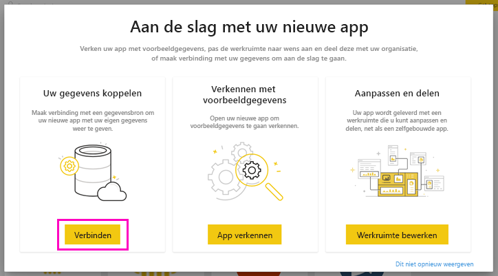
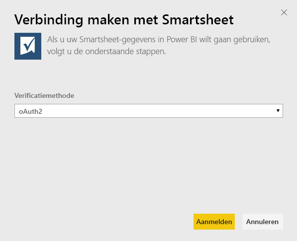
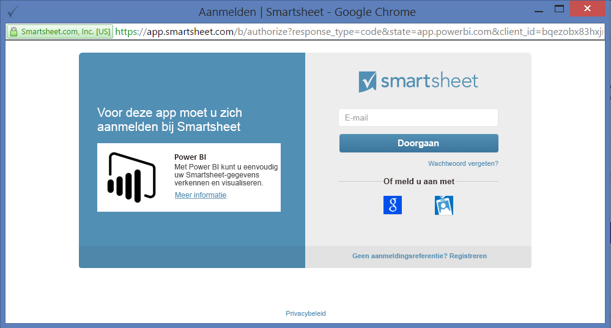
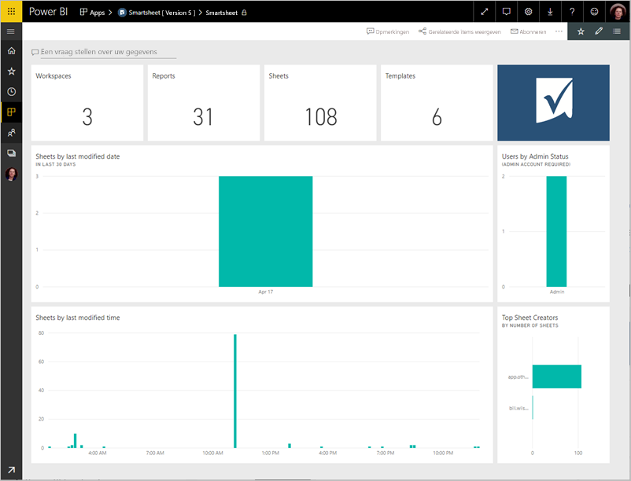
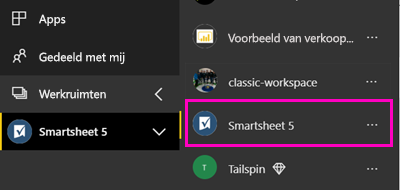
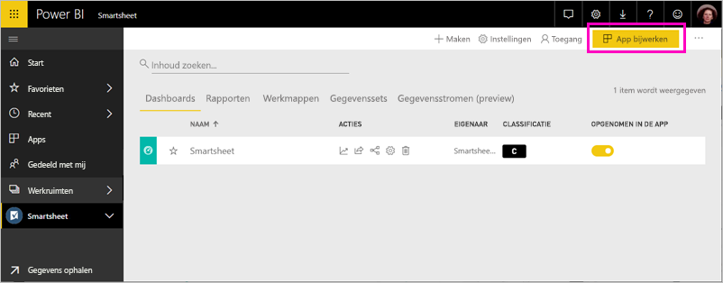

# Verbinding maken met Smartsheet via Power BI
In dit artikel wordt uitgelegd hoe u uw gegevens ophaalt uit uw Smartsheet-account met een Power BI-sjabloon-app. Smartsheet biedt een gebruiksvriendelijk platform voor samenwerking en het delen van bestanden. De Smartsheet-sjabloon-app voor Power BI bevat een dashboard, rapporten en een gegevensset die een overzicht geven van uw Smartsheet-account. U kunt ook [Power BI Desktop](desktop-connect-to-data.md) gebruiken om rechtstreeks verbinding te maken met afzonderlijke werkbladen in uw account. 

Nadat u de sjabloon-app hebt geïnstalleerd, kunt u het dashboard en rapport wijzigen. Vervolgens kunt u deze als een app distribueren naar collega's in uw organisatie.

Maak verbinding met de [Smartsheet-sjabloon-app](https://app.powerbi.com/groups/me/getapps/services/pbi-contentpacks.pbiapps-smartsheet) voor Power BI.

>[!NOTE]
>U kunt het beste een Smartsheet-beheerdersaccount gebruiken om verbinding te maken en de Power BI-sjabloon-app te laden omdat dit account over meer toegangsmogelijkheden beschikt.

## Verbinding maken

[!INCLUDE [powerbi-service-apps-get-more-apps](../includes/powerbi-service-apps-get-more-apps.md)]

3. Selecteer **Smartsheet** \> **Nu downloaden**.
4. Selecteer in **Deze Power BI-app installeren?** de optie **Installeren**.
4. Selecteer in het deelvenster **Apps** de tegel **Smartsheet**.

    

6. Selecteer in **Aan de slag met uw nieuwe app** de optie **Verbinding maken**.

    

4. Selecteer voor de verificatiemethode de optie **oAuth2 \> Aanmelden**.
   
   Geef desgevraagd uw Smartsheet-referenties op en voer het verificatieproces uit.
   
   
   
   

5. Nadat de gegevens in Power BI zijn geïmporteerd, wordt het Smartsheet-dashboard geopend.
   
   

## Uw app wijzigen en distribueren

U hebt de Smartsheet-sjabloon-app geïnstalleerd. Dit betekent dat u ook de Smartsheet-werkruimte hebt gemaakt. In de werkruimte kunt u het rapport en dashboard wijzigen en deze vervolgens als een *app* naar collega's in uw organisatie distribueren. 

1. Als u alle inhoud van de nieuwe Smartsheet-werkruimte wilt weergeven, selecteert u in het navigatievenster **Werkruimten** > **Smartsheet**. 

    

    Deze weergave is de inhoudslijst voor de werkruimte. In de rechterbovenhoek ziet u **App bijwerken**. Wanneer u klaar bent om uw app naar uw collega's te distribueren, kunt u beginnen. 

    

2. Selecteer **Rapporten** en **Gegevenssets** om de andere elementen in de werkruimte weer te geven.

    Meer informatie over [apps distribueren](../collaborate-share/service-create-distribute-apps.md) naar uw collega's.

## Wat is inbegrepen
De Smartsheet-sjabloon-app voor Power BI bevat een overzicht van uw Smartsheet-account, zoals het aantal werkruimten, uw rapporten en werkbladen, het tijdstip waarop deze zijn gewijzigd, enzovoort. Voor beheerders worden ook bepaalde gegevens weergegeven over gebruikers in hun systeem, zoals de belangrijkste makers van werkbladen.  

Als u rechtstreeks verbinding wilt maken met afzonderlijke werkbladen in uw account, kunt u de Smartsheet-connector in [Power BI Desktop](desktop-connect-to-data.md) gebruiken.  

## Volgende stappen

* [De nieuwe werkruimten maken in Power BI](../collaborate-share/service-create-the-new-workspaces.md)
* [Apps in Power BI installeren en gebruiken](../consumer/end-user-apps.md)
* [Verbinding maken met Power BI-apps voor externe services](service-connect-to-services.md)
* Vragen? [Misschien dat de Power BI-community het antwoord weet](https://community.powerbi.com/)