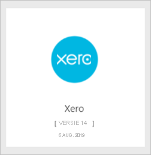
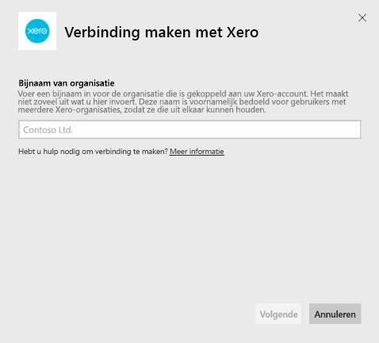
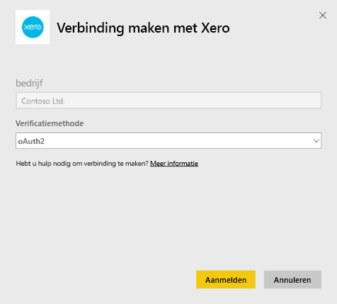
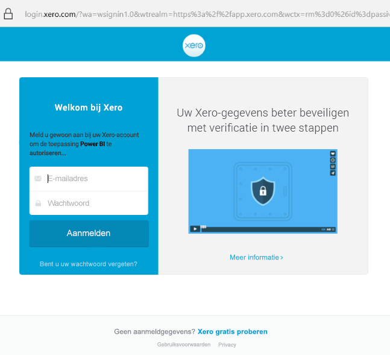

# Verbinding maken met Xero via Power BI
Xero is eenvoudig te gebruiken onlineboekhoudsoftware die speciaal ontworpen is voor kleine bedrijven. Met behulp van deze Power BI-sjabloon-app kunt u indrukwekkende visualisaties maken op basis van uw financiële gegevens in Xero. Uw standaarddashboard bevat allerlei metrische gegevens voor kleine bedrijven zoals kaspositie, omzet versus uitgaven, winst-en-verlies-trend, vervallen facturen en ROI.

Maak verbinding maken met de [Xero-sjabloon-app](https://app.powerbi.com/getdata/services/xero) voor Power BI of lees meer over de integratie tussen [Xero en Power BI](https://help.xero.com/Power-BI).

## Verbinding maken

[!INCLUDE [powerbi-service-apps-get-more-apps](../includes/powerbi-service-apps-get-more-apps.md)]

3. Selecteer **Xero** \> **Nu downloaden**.
4. Selecteer in **Deze Power BI-app installeren?** de optie **Installeren**.

    

4. Selecteer in het deelvenster **Apps** de tegel **Xero**.

   

6. Selecteer in **Aan de slag met uw nieuwe app** de optie **Verbinding maken**.

    

4. Voer een bijnaam in voor de organisatie die is gekoppeld aan uw Xero-account. Het maakt niet zo veel uit wat u hier invoert. Deze naam is voornamelijk bedoeld voor gebruikers met meerdere Xero-organisaties, zodat ze die uit elkaar kunnen houden. Zie [Parameters zoeken](#FindingParams) verderop in dit artikel voor meer informatie.

    

5. Selecteer voor de **verificatiemethode** **OAuth**. Meld u aan bij uw Xero-account wanneer daarom wordt gevraagd en selecteer de organisatie waarmee u verbinding wilt maken. Als u bent aangemeld, selecteert u **Sign in** om het laadproces te starten.
   
    
   
    
6. Nadat uw aanmelding is goedgekeurd, wordt het importeren automatisch gestart. Als dat is voltooid, bevat het navigatievenster een nieuw dashboard, rapport en model. Selecteer het dashboard om uw geïmporteerde gegevens weer te geven.
   
     

**Wat nu?**

* [Stel vragen in het vak Q&A](../consumer/end-user-q-and-a.md) boven in het dashboard.
* [Wijzig de tegels](../create-reports/service-dashboard-edit-tile.md) in het dashboard.
* [Selecteer een tegel](../consumer/end-user-tiles.md) om het onderliggende rapport te openen.
* Als uw gegevensset is ingesteld op dagelijks vernieuwen, kunt u het vernieuwingsschema wijzigen of de gegevensset handmatig vernieuwen met **Nu vernieuwen**

## Wat is inbegrepen
De sjabloon-app-dashboard bevat tegels en metrische gegevens voor verschillende gebieden, inclusief de bijbehorende rapporten:  

| Gebied | Dashboardtegels | Rapport |
| --- | --- | --- |
| Contanten |Dagelijkse kasstroom  Inkomende kasstroom  Uitgaande kasstroom  Eindsaldo per account  Eindsaldo vandaag nog |Accounts van de bank |
| Klant |Gefactureerde verkoop  Gefactureerde verkoop per klant  Gefactureerde omzetgroei trend  Vervallen facturen  Uitstaande vorderingen  Achterstallige vorderingen |De klant  Inventaris |
| Leverancier |Aankopen worden gefactureerd  Gefactureerde aankopen door leverancier  Aankopen worden gefactureerd groei van de trend   Facturen vervaldatum  Openstaande crediteuren  Achterstallige crediteuren |Leveranciers  Inventaris |
| Inventaris |Maandelijkse omzet per product |Inventaris |
| Winst en verlies |Maandelijkse winst en verlies  Nettowinst dit fiscaal jaar  Nettowinst deze maand  Topaccounts onkosten |Winst en verlies |
| Balans |Balans  De totale verplichtingen  Aandelen |Balans |
| Status |Verhouding vlottende activa  Brutowinstmarge   Terug op het totaal aantal activa  Totaal aantal verplichtingen aan vermogen verhouding |Status  Verklarende woordenlijst en technische notities |

De gegevensset bevat ook de volgende tabellen om uw rapporten en dashboards aan te passen:  

* Adressen  
* Waarschuwingen  
* Bank instructie dagelijks saldo  
* Bank-instructies  
* Contactpersonen  
* Onkosten Claims  
* Regel factuuritems  
* Facturen  
* Items  
* Einde van de maand  
* Organisatie  
* Proefbalans  
* Xero-Accounts

## Systeemvereisten
De volgende rollen zijn vereist voor toegang tot de Xero-sjabloon-app: 'Standaard + Rapporten' of 'Adviseur'.

## Parameters zoeken
Geef een naam op voor uw organisatie die kan worden bijgehouden in Power BI. Een specifieke naam maakt het mogelijk om met meerdere organisaties verbinding te maken. Het is niet mogelijk om meerdere verbindingen met dezelfde organisatie te maken, omdat dit invloed heeft op de geplande vernieuwing.   

## Problemen oplossen
* Xero-gebruikers moeten beschikken over de volgende rollen om toegang te krijgen tot de Xero-sjabloon-app voor Power BI: 'Standaard + Rapporten' of 'Adviseur'. De sjabloon-app is afhankelijk van de machtigingen op gebruikersbasis om toegang te krijgen tot rapportgegevens via Power BI.
* Tijdens het laden hebben de tegels op het dashboard een algemene laadstatus. Dat blijft zo totdat het laden volledig is voltooid. Als u een melding ontvangt dat het laden is voltooid, maar de tegels nog steeds worden geladen, probeer de dashboardtegels dan te vernieuwen met behulp van de... in de rechterbovenhoek van het dashboard.
* Als de sjabloon-app niet kan worden vernieuwd, controleert u of u per ongeluk niet meer dan één keer verbinding hebt gemaakt met dezelfde organisatie in Power BI. Xero staat slechts één actieve verbinding met een organisatie toe en mogelijk ziet u een foutbericht dat aangeeft dat uw referenties ongeldig zijn als u meer dan één keer verbinding probeert te maken met dezelfde organisatie.  
* Als er problemen zijn bij het verbinding maken met de Xero-sjabloon-app voor Power BI, zoals foutberichten of een trage respons, wist u eerst de cache en cookies, start u de browser opnieuw en maakt u vervolgens opnieuw verbinding met Power BI.  

Voor andere problemen kunt u een ondersteuningsticket maken op https://support.powerbi.com als het probleem zich blijft voordoen.

## Volgende stappen
[Aan de slag in Power BI](../fundamentals/service-get-started.md)

[Gegevens ophalen in Power BI](service-get-data.md)
