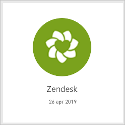
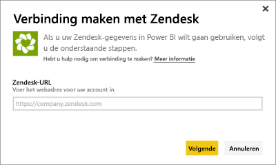
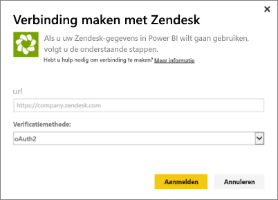
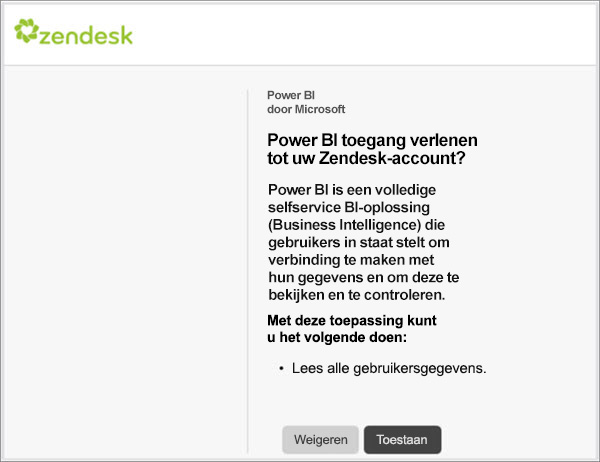
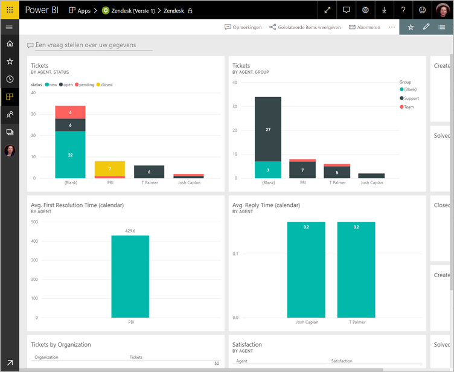
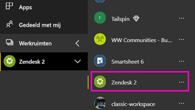
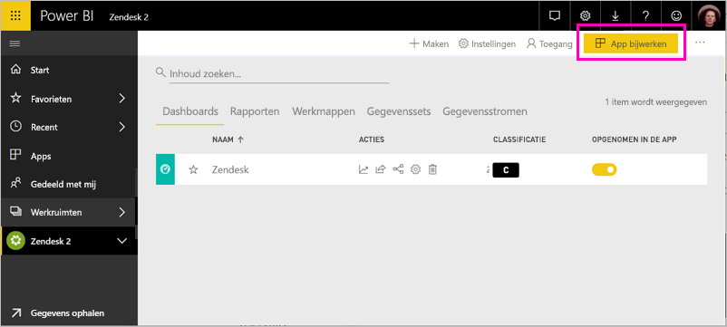

# Verbinding maken met Zendesk met Power BI

In dit artikel wordt uitgelegd hoe u uw gegevens ophaalt uit uw Zendesk-account met een Power BI-sjabloon-app. De Zendesk-app biedt een Power BI-dashboard en een set Power BI-rapporten die inzicht geven in uw ticketaantallen en agentprestaties. De gegevens worden eenmaal per dag automatisch vernieuwd. 

Nadat u de sjabloon-app hebt geïnstalleerd, kunt u het dashboard en rapport aanpassen om de informatie te markeren die u het belangrijkst vindt. Vervolgens kunt u deze als een app distribueren naar collega's in uw organisatie.

Maak verbinding met de [Zendesk-app](https://app.powerbi.com/getdata/services/zendesk) of lees meer over de [Zendesk-integratie](https://powerbi.microsoft.com/integrations/zendesk) met Power BI.

Nadat u de sjabloon-app hebt geïnstalleerd, kunt u het dashboard en rapport wijzigen. Vervolgens kunt u deze als een app distribueren naar collega's in uw organisatie.

>[!NOTE]
>U hebt een Zendesk-beheerdersaccount nodig om verbinding te maken. Meer informatie over de [vereisten](#system-requirements) leest u hieronder.

## Verbinding maken

[!INCLUDE [powerbi-service-apps-get-more-apps](../includes/powerbi-service-apps-get-more-apps.md)]

3. Selecteer **Zendesk** \> **Nu downloaden**.
4. Selecteer in **Deze Power BI-app installeren?** de optie **Installeren**.
4. Selecteer in het deelvenster **Apps** de tegel **Zendesk**.

    

6. Selecteer in **Aan de slag met uw nieuwe app** de optie **Verbinding maken**.

    

4. Geef de URL die is gekoppeld aan uw account. De URL heeft de vorm **https://company.zendesk.com** . Hieronder vindt u informatie over [het vinden van deze parameters](#finding-parameters).
   
   

5. Geef desgevraagd uw Zendesk-referenties op.  Selecteer **oAuth 2** als verificatiemethode en klik op **Aanmelden**. Volg de Zendesk-verificatieprocedure. (Als u al bent aangemeld bij Zendesk in uw browser, ontvangt u mogelijk geen prompt om referenties in te voeren.)
   
   > [!NOTE]
   > Voor deze sjabloon-app moet u verbinding maken met een Zendesk-beheerdersaccount. 
   > 
   
   
6. Klik op **Toestaan** om Power BI toegang te geven tot uw Zendesk-gegevens.
   
   
7. Klik op **Verbinding maken** om het importproces te starten. 
8. Nadat de gegevens in Power BI zijn geïmporteerd, ziet u de lijst met inhoud voor uw Zendesk-app: een nieuw dashboard, een nieuw rapport en een nieuwe gegevensset.
9. Selecteer het dashboard om het verkenningsproces te starten.

    
   
## Uw app wijzigen en distribueren

U hebt de Zendesk-sjabloon-app geïnstalleerd. Dit betekent dat u ook de Zendesk-werkruimte hebt gemaakt. In de werkruimte kunt u het rapport en dashboard wijzigen en deze vervolgens als een *app* naar collega's in uw organisatie distribueren. 

1. Als u alle inhoud van de nieuwe Zendesk-werkruimte wilt weergeven, selecteert u in het navigatievenster **Werkruimten** > **Zendesk**. 

    

    Deze weergave is de inhoudslijst voor de werkruimte. In de rechterbovenhoek ziet u **App bijwerken**. Wanneer u klaar bent om uw app naar uw collega's te distribueren, kunt u beginnen. 

    

2. Selecteer **Rapporten** en **Gegevenssets** om de andere elementen in de werkruimte weer te geven.

    Meer informatie over [apps distribueren](../collaborate-share/service-create-distribute-apps.md) naar uw collega's.

## Systeemvereisten
Een Zendesk-beheerdersaccount is vereist voor toegang tot de Zendesk-sjabloon-app. Als u een agent of een gebruiker bent en u wilt uw Zendesk-gegevens weergeven, voegt u een suggestie toe en controleert u de Zendesk-connector in de [Power BI Desktop](desktop-connect-to-data.md).

## Parameters zoeken
De URL van uw Zendesk is hetzelfde als de URL die u gebruikt bij het aanmelden bij uw Zendesk-account. Als u niet zeker weet wat uw Zendesk-URL is, kunt u de [hulp bij aanmelden](https://www.zendesk.com/login/) van Zendesk gebruiken.

## Problemen oplossen
Als u problemen ondervindt bij het maken van verbinding, controleer dan uw Zendesk-URL en bevestig dat u een Zendesk-beheerdersaccount gebruikt.

## Volgende stappen

* [De nieuwe werkruimten maken in Power BI](../collaborate-share/service-create-the-new-workspaces.md)
* [Apps in Power BI installeren en gebruiken](../consumer/end-user-apps.md)
* [Verbinding maken met Power BI-apps voor externe services](service-connect-to-services.md)
* Vragen? [Misschien dat de Power BI-community het antwoord weet](https://community.powerbi.com/)
