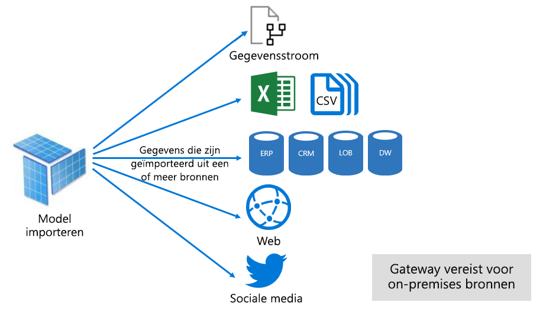
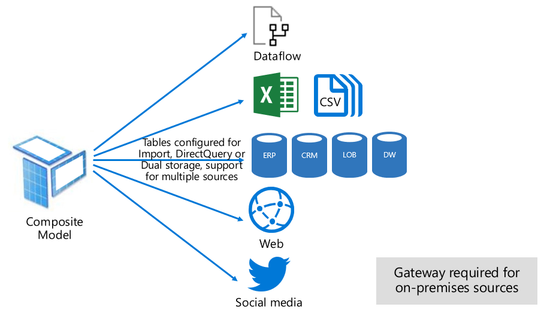

# Gegevenssetmodi in de Power BI-service

Dit artikel bevat een technische uitleg van Power BI-gegevenssetsmodi. Deze uitleg is van toepassing op gegevenssets met een liveverbinding met een extern gehost Analysis Services model en ook op modellen die zijn ontwikkeld in Power BI Desktop. In het artikel wordt de motivering voor elke modus benadrukt en de mogelijke impact op de resources van Power BI capaciteit.

De drie gegevenssetmodi zijn:

- [Import](#import-mode)
- [DirectQuery](#directquery-mode)
- [Samengesteld](#composite-mode)

## Importmodus

De _importmodus_ is de meest gebruikte modus voor het ontwikkelen van modellen. Deze modus biedt extreem snelle prestaties doordat query's worden uitgevoerd in het geheugen. Het biedt ook ontwerpflexibiliteit voor modelmakers en ondersteuning voor specifieke functies van de Power BI-service (Q&A, snelle inzichten, enzovoort). Vanwege deze sterke punten is dit de standaardmodus bij het maken van een nieuwe Power BI Desktop-oplossing.

Het is belangrijk te begrijpen dat geïmporteerde gegevens altijd op schijf worden opgeslagen. Wanneer een query wordt uitgevoerd of vernieuwd, moeten de gegevens volledig worden geladen in het geheugen van de Power BI-capaciteit. Als de gegevens eenmaal in het geheugen zijn geladen, kunnen er met importmodellen zeer snelle queryresultaten worden behaald. Het is ook belangrijk te begrijpen dat het niet mogelijk is om een importmodel gedeeltelijk in het geheugen te geladen.

Bij het vernieuwen worden gegevens gecomprimeerd en geoptimaliseerd en vervolgens met de VertiPaq-opslagengine op schijf opgeslagen. Bij het laden in het geheugen vanaf schijf is een compressiefactor van 10 mogelijk. Daarom is het redelijk te verwachten dat 10 GB aan brongegevens kan worden gecomprimeerd tot een grootte van ongeveer 1 GB. De opslaggrootte op schijf kan 20% van de gecomprimeerde grootte afnemen. (Het verschil in grootte kan worden bepaald door de Power BI Desktop-bestandsgrootte te vergelijken met het Taakbeheer-geheugengebruik van het bestand.)

Ontwerpflexibiliteit kan op drie manieren worden bereikt. Gegevensmodelmakers kunnen:

- Gegevens integreren door gegevens van gegevensstromen en externe gegevensbronnen, ongeacht het gegevensbrontype of de bestandsindeling, in de cache te plaatsen
- Gebruikmaken van alle functies van de [Power Query-formuletaal](/powerquery-m/) (informeel M genoemd) bij het maken van query's voor gegevensvoorbereiding
- Gebruikmaken van alle functies van [Data Analysis Expressions (DAX)](/dax/) bij het uitbreiden van het model met bedrijfslogica. Er wordt ondersteuning geboden voor berekende kolommen, berekende tabellen en metingen.

Zoals in de volgende afbeelding wordt weergegeven, kan een importmodel gegevens van elk gewenst aantal ondersteunde gegevensbrontypen integreren.

Hoewel importmodellen aantrekkelijke voordelen hebben, zijn er ook nadelen:

- Het volledige model moet in het geheugen worden geladen voordat Power BI het model kan opvragen. Dit kan de beschikbare capaciteitsresources onder druk zetten, vooral als het aantal en de grootte van de importmodellen toenemen
- Modelgegevens zijn slechts zo up-to-date als de laatste vernieuwing. Daarom moeten importmodellen worden vernieuwd, gewoonlijk volgens een bepaald schema
- Bij een volledige vernieuwing worden alle gegevens uit alle tabellen verwijderd en opnieuw vanuit de gegevensbron geladen. Deze bewerking kan kostbaar zijn qua tijd en resources voor de Power BI-service en de gegevensbron(nen).

    > [!NOTE]
    > Power BI kan incrementeel vernieuwen om te voorkomen dat hele tabellen worden afgekapt en opnieuw geladen. Deze functie wordt echter alleen ondersteund als de gegevensset wordt gehost in werkruimten op Premium-capaciteiten. Zie het artikel [Incrementeel vernieuwen in Power BI Premium](../admin/service-premium-incremental-refresh.md) voor meer informatie.

Vanuit het perspectief van resources van de Power BI-service is het volgende vereist voor importmodellen:

- Voldoende geheugen om het model te laden wanneer het wordt opgevraagd of vernieuwd
- Verwerkingsresources en aanvullende geheugenresources om gegevens te vernieuwen

## DirectQuery-modus

De _DirectQuery-modus_ is een alternatief voor de importmodus. In modellen die worden ontwikkeld in de DirectQuery-modus, worden geen gegevens geïmporteerd. In plaats daarvan bestaan ze alleen uit metagegevens waarmee de modelstructuur wordt gedefinieerd. Wanneer het model wordt opgevraagd, worden er systeemeigen query's gebruikt om gegevens op te halen uit de onderliggende gegevensbron.

Er zijn twee belangrijke redenen om te overwegen een DirectQuery-model te ontwikkelen:

- Wanneer de gegevens volumes te groot zijn om in een model te laden of te worden vernieuwd, zelfs wanneer er [methoden voor gegevensreductie](../guidance/import-modeling-data-reduction.md) worden toegepast
- Wanneer rapporten en dashboards 'near realtime' gegevens moeten leveren, buiten wat kan worden bereikt binnen de geplande vernieuwingslimieten. (De geplande vernieuwingslimieten zijn 8 keer per dag voor gedeelde capaciteit, en 48 keer per dag voor een Premium-capaciteit.)

DirectQuery-modellen bieden verschillende voordelen:

- De groottelimieten voor importmodellen zijn niet van toepassing
- Modellen hoeven niet te worden vernieuwd
- Rapportgebruikers krijgen de meeste recente gegevens te zien bij interactie met rapportfilters en slicers. Rapportgebruikers kunnen ook het hele rapport vernieuwen om actuele gegevens op te halen.
- Realtimerapporten kunnen worden ontwikkeld met behulp van de functie [Pagina automatisch vernieuwen](../create-reports/desktop-automatic-page-refresh.md)
- Dashboardtegels op basis van DirectQuery-modellen kunnen regelmatig automatisch worden bijgewerkt, tot zelfs elke 15 minuten

DirectQuery-modellen hebben echter ook bepaalde beperkingen:

- In DAX-formules mogen alleen functies worden gebruikt die kunnen worden getransponeerd naar systeemeigen query's die compatibel zijn met de gegevensbron. Berekende tabellen worden niet ondersteund.
- De functies Q&A en Snelle inzichten worden niet ondersteund

Vanuit het perspectief van resources van de Power BI-service is het volgende vereist voor DirectQuery-modellen:

- Er is weinig geheugen nodig om het model te laden (alleen metagegevens) bij het uitvoeren van query's
- Soms vraagt de Power BI-service veel processorcapaciteit voor het genereren en verwerken van query's die naar de gegevensbron worden verzonden. Wanneer deze situatie zich voordoet, kan dit van invloed zijn op de doorvoer, met name wanneer meerdere gebruikers tegelijk een query uitvoeren op het model.

Zie [DirectQuery gebruiken in Power BI Desktop](desktop-use-directquery.md) voor meer informatie.

## Samengestelde modus

In de modus _Samengesteld_ kunnen de modi Import en DirectQuery worden gecombineerd of meerdere DirectQuery-gegevensbronnen worden geïntegreerd. Bij modellen die worden ontwikkeld in de modus Samengesteld, kan de opslagmodus voor elke modeltabel worden geconfigureerd. Ook berekende tabellen (gedefinieerd met DAX) worden in deze modus ondersteund.

De tabelopslagmodus kan worden geconfigureerd als Import, DirectQuery of Dual. Een tabel die is geconfigureerd als de opslagmodus Dual, is zowel Import als DirectQuery. Met deze instelling kan de Power BI-service per query de meest efficiënte modus bepalen.

Bij samengestelde modellen wordt getracht het beste van de modi Import en DirectQuery te combineren. Als deze modus goed is geconfigureerd, krijgt u zowel de hoge queryprestaties van in-memory modellen als de mogelijkheid om bijna in realtime gegevens uit gegevensbronnen op te halen.

Gegevensmodelmakers die samengestelde modellen ontwikkelen, zullen waarschijnlijk dimensietabellen in de opslagmodus Import of Dual configureren, en feitentabellen in de modus DirectQuery. Zie [Meer informatie over stervormige schema's en het belang voor Power BI](../guidance/star-schema.md) voor meer informatie over modeltabelrollen.

Neem bijvoorbeeld een model met de dimensietabel **Product** in de modus Dual en de feitentabel **Sales** in de modus DirectQuery. De tabel **Product** kan efficiënt en snel worden opgevraagd uit het geheugen om een rapportslicer weer te geven. De tabel **Sales** kan ook worden opgevraagd in de modus DirectQuery met de gerelateerde tabel **Product**. Met de laatste is het mogelijk een enkele efficiënte systeemeigen SQL-query te genereren die de tabellen **Product** en **Sales** samenvoegt en filtert op de slicerwaarden.

Zie [Samengestelde modellen in Power BI Desktop gebruiken](../transform-model/desktop-composite-models.md) voor meer informatie.

## Volgende stappen

- [Gegevenssets in de Power BI-service](service-dataset-modes-understand.md)
- [Opslagmodus in Power BI Desktop](../transform-model/desktop-storage-mode.md)
- [DirectQuery gebruiken in Power BI](desktop-directquery-about.md)
- [Samengestelde modellen in Power BI Desktop gebruiken](../transform-model/desktop-composite-models.md)
- Hebt u nog vragen? [Misschien dat de Power BI-community het antwoord weet](https://community.powerbi.com/)
