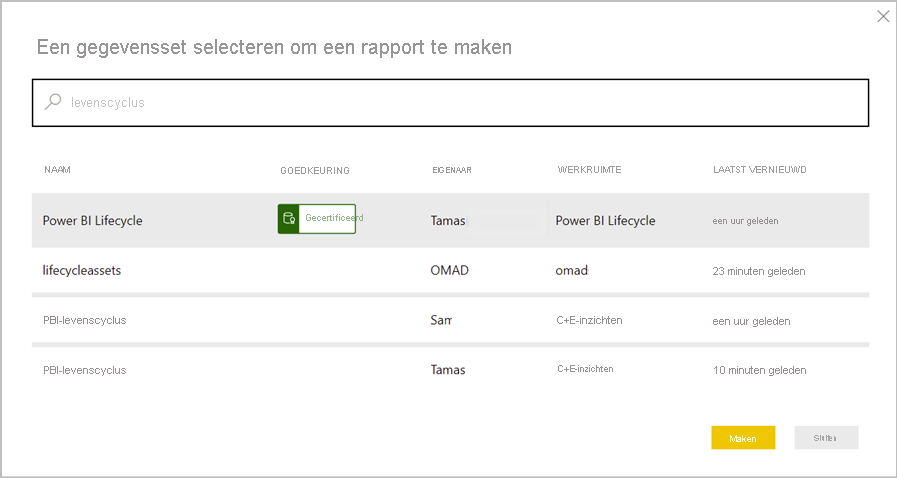

# Introductie: gegevenssets in meerdere werkruimten gebruiken (preview)

Business intelligence is een activiteit in samenwerkingsverband. Het is belangrijk dat gestandaardiseerde gegevenssets tot stand worden gebracht die 'één bron van waarheid' kan zijn. Om deze gestandaardiseerde gegevenssets vervolgens te detecteren en opnieuw te gebruiken. Wanneer deskundige modelleerders van gegevens in uw organisatie geoptimaliseerde gegevenssets maken en delen, kunnen makers van rapporten met deze gegevenssets nauwkeurige rapporten genereren. Uw organisatie beschikt vervolgens over consistente gegevens voor het nemen van beslissingen en een goed functionerende gegevenscultuur.

In Power BI kunnen makers van gegevenssets bepalen wie toegang heeft tot hun gegevens met behulp van de [samenstellingsmachtiging](service-datasets-build-permissions.md). Makers van gegevenssets kunnen gegevenssets bovendien *certificeren* of *promoten*, zodat anderen deze kunnen detecteren. Op die manier weten auteurs van rapporten welke gegevenssets van hoge kwaliteit en betrouwbaar zijn, en kunnen ze deze gegevenssets gebruiken wanneer ze inhoud maken in Power BI. Tenantbeheerders hebben een nieuwe tenantinstelling voor het [bepalen van het gebruik van gegevenssets in werkruimten](service-datasets-admin-across-workspaces.md).

## Gegevenssets delen en de nieuwe werkruimte-ervaring

Het maken van rapporten op basis van gegevenssets in verschillende werkruimten en het kopiëren van rapporten naar verschillende werkruimten zijn nauw verbonden met de [nieuwe werkruimte-ervaring](../collaborate-share/service-create-the-new-workspaces.md):

- Wanneer u in de service de catalogus met gegevenssets van een nieuwe werkruimte-ervaring opent, bevat deze gegevenssets die zich in uw werkruimte (Mijn werkruimte) bevinden en in andere werkruimten met de nieuwe werkruimte-ervaring. 
- Wanneer u de gegevenssetcatalogus van een klassieke werkruimte opent, ziet u alleen de gegevenssets in deze werkruimte, niet die in andere werkruimten.
- U kunt in Power BI Desktop Live Connect-rapporten publiceren naar verschillende werkruimten zolang de bijbehorende gegevenssets zich in de nieuwe werkruimte-ervaring-werkruimten bevinden.
- Bij het kopiëren van rapporten naar werkruimten, moet de doelwerkruimte er eentje zijn met nieuwe werkruimte-ervaring.

## Gegevenssets detecteren (preview)

Bij het samenstellen van een rapport op basis van een bestaande gegevensset moet u eerst verbinding maken met de gegevensset, in de Power BI-service of Power BI Desktop. Lees over [het detecteren van gegevenssets afkomstig uit verschillende werkruimten (preview)](service-datasets-discover-across-workspaces.md)

## Een rapport kopiëren

Wanneer u in een werkruimte of een app een rapport hebt gevonden dat u leuk vindt, kunt u er een kopie van maken en deze vervolgens aanpassen aan uw behoeften. U hoeft zich geen zorgen te maken over het maken van het gegevensmodel. Dit is al voor u gemaakt. En het is veel gemakkelijker een bestaand rapport aan te passen dan een compleet nieuw rapport te maken. Meer informatie over [rapporten kopiëren](service-datasets-copy-reports.md).

## Samenstellingsmachtiging voor gegevenssets

Met het samenstellingsmachtigingstype kunt u, als u een maker van gegevenssets bent, bepalen wie in uw organisatie nieuwe inhoud in uw gegevenssets mag ontwikkelen. Personen met een samenstellingsmachtiging kunnen ook nieuwe inhoud ontwikkelen op basis van de gegevensset buiten Power BI, zoals Excel-bladen via Analyseren in Excel, XMLA en exporteren. Meer informatie over de [Samenstellingsmachtiging](service-datasets-build-permissions.md).

## Promotie en certificering

Als u gegevenssets maakt en een gegevensset maakt waarvan anderen kunnen profiteren, kunt u het voor hen eenvoudiger maken om deze te detecteren door [uw gegevensset te promoten](service-datasets-promote.md). U kunt ook experts in uw organisatie vragen om [uw gegevensset te certificeren](service-datasets-certify.md).

## Licentieverlening

Licentieverlening voor de specifieke functies en ervaringen die op functionaliteit van de gedeelde gegevensset zijn gebouwd, vindt plaats op basis van hun bestaande scenario's. Bijvoorbeeld:

- Het detecteren en verbinding maken met gedeelde gegevenssets is in het algemeen beschikbaar voor iedereen. Deze functie is niet beperkt tot de Premium-versie.
- Gebruikers zonder een Pro-licentie kunnen alleen gegevenssets gebruiken in werkruimten voor het ontwerpen van rapporten als deze gegevenssets zich in de persoonlijke sectie Mijn werkruimte van de gebruikers bevinden, of in een werkruimte met premium-ondersteuning. Dezelfde licentiebeperking is van toepassing, ongeacht of ze rapporten maken in Power BI Desktop of in de Power BI-service.
- Voor het kopiëren van rapporten tussen werkruimten is een Pro-licentie vereist.
- Voor het kopiëren van rapporten vanuit een app is een Pro-licentie vereist, zoals is vereist voor organisatie-inhoudspakketten.
- Voor het promoten en het certificeren van gegevenssets is een Pro-licentie vereist.

## Overwegingen en beperkingen

- Als app-uitgever moet u ervoor zorgen dat uw publiek toegang heeft tot gegevenssets buiten de werkruimte. Anders ondervinden gebruikers problemen wanneer ze werken met uw app: rapporten worden niet geopend zonder toegang tot de gegevensset en dashboardtegels worden weergegeven als vergrendeld. Gebruikers kunnen de app ook niet openen als het eerste item in de navigatie een rapport is zonder toegang tot de gegevensset.
- Voor het samenstellen van een rapport op basis van een gegevensset in een andere werkruimte, is de nieuwe werkruimte-ervaring aan beide uiteinden vereist: Zowel het rapport als de gegevensset moeten zich in een nieuwe werkruimte-ervaring-werkruimte bevinden. U kunt rapporten in een nieuwe werkruimte-ervaring alleen kopiëren naar een andere nieuwe werkruimte-ervaring en niet naar klassieke werkruimten of naar Mijn werkruimte. 
- In een klassieke werkruimte bevat de interface voor detectie van gegevenssets alleen de gegevenssets in die werkruimte.
- Publiceren op internet werkt niet voor een rapport dat is gebaseerd op een gedeelde gegevensset.
- Als twee personen lid zijn van een werkruimte die toegang geeft tot een gedeelde gegevensset, is het mogelijk dat slechts een van hen de betreffende gegevensset in de werkruimte kan zien. Alleen personen met ten minste leestoegang tot de gegevensset kunnen de gedeelde gegevensset zien. 

## Volgende stappen

- [Gegevenssets promoten](service-datasets-promote.md)
- [Gegevenssets certificeren](service-datasets-certify.md)
- [Het gebruik van gegevenssets in meerdere werkruimten regelen](service-datasets-admin-across-workspaces.md)
- Vragen? [Misschien dat de Power BI-community het antwoord weet](https://community.powerbi.com/)
