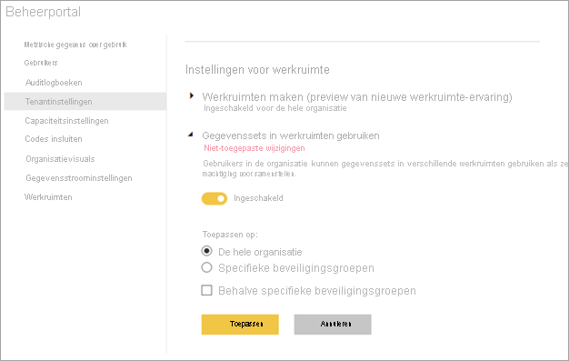

# Het gebruik van gegevenssets in meerdere werkruimten beheren

Het gebruik van gegevenssets in werkruimten is een krachtige manier om de gegevenscultuur en gegevensdemocratisering binnen een organisatie te stimuleren. Maar soms wilt u, als u een Power BI-beheerder bent, de gegevensstroom in uw Power BI-tenant beperken. Met de tenantinstelling **Gegevenssets gebruiken in werkruimten** kunt u hergebruik van gegevenssets volledig of gedeeltelijk per-beveiligingsgroep beperken.

Als u deze instelling uitschakelt, zijn dit de gevolgen voor de makers van rapporten:

- De knop voor het kopiëren van rapporten in werkruimten is niet beschikbaar. 
- In een rapport op basis van een gedeelde gegevensset is de knop **Rapport bewerken** niet beschikbaar.
- In de Power BI-service geeft de interface voor detectie alleen gegevenssets in de huidige werkruimte weer.
- In Power BI Desktop geeft de interface voor detectie alleen gegevenssets van werkruimten weer waarvan u lid bent.
- Als gebruikers in Power BI Desktop een pbix-bestand openen met een live-verbinding met een gegevensset buiten werkruimten waarvan zij lid zijn, krijgen ze een foutbericht te zien waarin ze worden gevraagd om verbinding maken met een andere gegevensset.

## Een koppeling opgeven voor het certificeringsproces

Als tenantbeheerder kunt u voorzien in een URL voor de koppeling **Meer informatie** op de instellingspagina **Onderschrijving**.  Met deze koppeling kunt u naar de documentatie over het certificeringsproces gaan. Als u geen doel voor de koppeling **Meer informatie** opgeeft, wordt standaard naar het artikel [Certificering gegevensset](service-datasets-certify.md) verwezen.

## Volgende stappen

- [Gegevenssets in werkruimten gebruiken](service-datasets-across-workspaces.md)
- Vragen? [Misschien dat de Power BI-community het antwoord weet](https://community.powerbi.com/)
