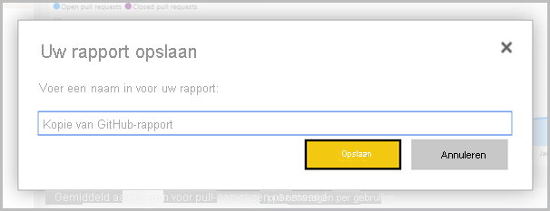

# Rapporten kopiëren uit andere werkruimten

Wanneer u in een werkruimte of app een rapport hebt gevonden dat u interessant vindt, kunt u er een kopie van maken en deze opslaan in een andere werkruimte. Vervolgens kunt u uw kopie van het rapport wijzigen en visuals en andere elementen toevoegen of verwijderen. U hoeft zich geen zorgen te maken over het maken van het gegevensmodel. Dit is al voor u gemaakt. En het is veel gemakkelijker een bestaand rapport aan te passen dan een compleet nieuw rapport te maken. Wanneer u echter een app vanuit uw werkruimte maakt, is het soms niet mogelijk om een kopie van het rapport te publiceren in de app. Zie [Overwegingen en beperkingen in het artikel Gegevenssets in werkruimten gebruiken](service-datasets-across-workspaces.md#considerations-and-limitations) voor meer informatie.

> [!NOTE]
> Als u een kopie maakt, hebt u een Pro-licentie nodig, zelfs als het oorspronkelijke rapport zich in een werkruimte in een Premium-capaciteit bevindt.

## Een kopie van een rapport opslaan in een werkruimte

1. Ga naar de lijstweergave Rapporten in een werkruimte.

    

1. Selecteer onder **Acties** **Een kopie opslaan**.

    

    U ziet alleen het pictogram **Een kopie opslaan** als het rapport zich in een nieuwe werkruimte-ervaring bevindt en u over [samenstellingsmachtigingen](service-datasets-build-permissions.md) beschikt. Zelfs als u toegang tot de werkruimte hebt, hebt u samenstellingsmachtigingen nodig voor de gegevensset.

3. Geef in **Een kopie van dit rapport opslaan** een naam op voor het rapport en selecteer de doelwerkruimte.

    

    U kunt het rapport opslaan in de huidige werkruimte of een andere werkruimte in de Power BI-service. U ziet alleen nieuwe werkruimte-ervaring-werkruimten waarin u lid bent. 
  
4. Selecteer **Opslaan**.

    In Power BI worden automatisch een kopie van het rapport en een vermelding in de lijst met gegevenssets gemaakt, als het rapport is gebaseerd op een gegevensset buiten de werkruimte. Het pictogram voor deze gegevensset wijkt af van het pictogram voor gegevenssets in de werkruimte: 
    
    Op die manier kunnen leden van de werkruimte zien welke rapporten en dashboards gebruikmaken van gegevenssets die zich buiten de werkruimte bevinden. De vermelding toont informatie over de gegevensset en een aantal bijzondere acties.

    

    Raadpleeg [Uw kopie van het rapport](#your-copy-of-the-report) in dit artikel voor meer informatie over het rapport en de gerelateerde gegevensset.

## Een rapport kopiëren in een app

1. Open het rapport dat u wilt kopiëren, in een app.
2. Selecteer in de menubalk **Meer opties** ( **...** ) > **Een kopie opslaan**.

    

    U ziet alleen de optie **Een kopie opslaan** als het rapport zich in een nieuwe werkruimte van de nieuwe versie bevindt, en u over een [Samenstellingsmachtiging](service-datasets-build-permissions.md) beschikt.

3. Geef uw rapport een naam > **Opslaan**.

    

    Uw kopie wordt automatisch opgeslagen in Mijn werkruimte.

4. Selecteer **Ga naar rapport** om de kopie te openen.

## Uw kopie van het rapport

Wanneer u een kopie van het rapport opslaat, maakt u een live-verbinding met de gegevensset en kunt u de interface voor het maken van het rapport openen met de volledige, beschikbare gegevensset. 

U hebt geen kopie van de gegevensset gemaakt. De gegevensset bevindt zich nog steeds op de oorspronkelijke locatie. U kunt alle tabellen en metingen in de gegevensset gebruiken in uw eigen rapporten. Er zijn beperkingen ten aanzien van RLS (Beveiliging op rijniveau) voor de gegevensset van kracht, zodat u alleen gegevens ziet waarvoor u gemachtigd bent om deze te zien op basis van uw RLS-rol.

## Verwante gegevenssets weergeven

Wanneer u een rapport in één werkruimte hebt dat is gebaseerd op een gegevensset in een andere werkruimte, hebt u mogelijk meer informatie nodig over de gegevensset waarop het rapport is gebaseerd.

1. Selecteer in de lijstweergave Rapporten **Gerelateerde items weergeven**.

    

1. Het dialoogvenster **Gerelateerde inhoud** geeft alle verwante items weer. In deze lijst ziet de gegevensset er net zo uit als de andere. U weet niet of deze zich in een andere werkruimte bevindt. Dit is een bekend probleem.
 
    

## Een rapport en de bijbehorende gedeelde gegevensset verwijderen

Het kan gebeuren dat u een rapport en de bijbehorende gedeelde gegevensset niet meer nodig hebt in de werkruimte.

1. U kunt het rapport dan verwijderen. Selecteer in de lijst met rapporten in de werkruimte het pictogram **Verwijderen**.

    

2. In de lijst met gegevenssets ziet u dat er bij de gedeelde gegevenssets geen pictogram **Verwijderen** staat. Vernieuw de pagina of ga naar een andere pagina en keer hier weer terug. De gegevensset is nu verdwenen. Als dat niet zo is, selecteert u **Gerelateerde items weergeven**. Het is mogelijk dat de gegevensset is gerelateerd aan een andere tabel in uw werkruimte.

    

    > [!NOTE]
    > Het verwijderen van de gedeelde gegevensset in deze werkruimte, betekent niet dat de gegevensset wordt verwijderd. Alleen de verwijzing naar de gegevensset wordt verwijderd.

## Volgende stappen

- [Gegevenssets in werkruimten gebruiken](service-datasets-across-workspaces.md)
- Vragen? [Misschien dat de Power BI-community het antwoord weet](https://community.powerbi.com/)
