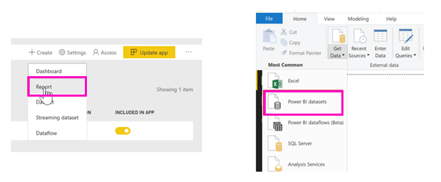
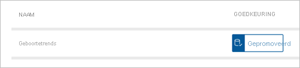

# Rapporten maken op basis van gegevenssets van verschillende werkruimten

Ontdek hoe u rapporten kunt maken in uw eigen werkruimten op basis van gegevenssets in andere werkruimten. U kunt voor het maken van een rapport op grond van een bestaande gegevensset beginnen vanuit Power BI Desktop, vanuit uw werkruimte (Mijn werkruimte) in de Power BI-service of in een [nieuwe werkruimte-ervaring](../collaborate-share/service-create-the-new-workspaces.md).

- In de Power BI-service: **Gegevens ophalen** > **Gepubliceerde gegevenssets**.
- In Power BI Desktop: **Gegevens ophalen** > **Power BI-gegevenssets**.

    
   
In beide gevallen wordt de interface voor detectie van gegevenssets gestart in dit dialoogvenster, **Een gegevensset selecteren voor het maken van een rapport**. U ziet alle gegevenssets waartoe u toegang hebt, ongeacht waar ze zich bevinden:

U ziet dat de eerste **Gepromoot** heet. Wij komen daarop terug in [Een onderschreven gegevensset zoeken](#find-an-endorsed-dataset), verderop in dit artikel.

De gegevenssets die u in deze lijst ziet, voldoen aan ten minste één van de volgende voorwaarden:

- De gegevensset bevindt zich in een van de-werkruimten met de nieuwe werkruimte-ervaring, en u bent lid van deze werkruimte. Raadpleeg [Overwegingen en beperkingen](service-datasets-across-workspaces.md#considerations-and-limitations).
- U bent gemachtigd voor het samenstellen van de gegevensset, die zich in een werkruimte met de nieuwe werkruimte-ervaring bevindt.
- De gegevensset bevindt zich in uw werkruimte (Mijn werkruimte).

> [!NOTE]
> Als u een gratis gebruiker bent, ziet u alleen gegevenssets in uw werkruimte (Mijn werkruimte), of gegevenssets waarvoor u samenstellingsmachtiging hebt die zich in werkruimten met Premium-capaciteit bevinden.

Wanneer u op **Maken** klikt, maakt u een live-verbinding met de gegevensset, waarna de interface voor het maken van het rapport wordt geopend met de volledige, beschikbare gegevensset. U hebt geen kopie van de gegevensset gemaakt. De gegevensset bevindt zich nog steeds op de oorspronkelijke locatie. U kunt alle tabellen en metingen in de gegevensset gebruiken om uw eigen rapporten te genereren. Er zijn beperkingen ten aanzien van RLS (Beveiliging op rijniveau) voor de gegevensset van kracht, zodat u alleen gegevens ziet waarvoor u gemachtigd bent om deze te zien op basis van uw RLS-rol.

U kunt het rapport opslaan in de huidige werkruimte in Power BI-service of het rapport naar een werkruimte publiceren vanuit Power BI Desktop. Power BI maakt automatisch een vermelding in de lijst met gegevenssets als het rapport is gebaseerd op een gegevensset buiten de werkruimte. Het pictogram voor deze gegevensset wijkt af van het pictogram voor gegevenssets in de werkruimte: 

Op die manier kunnen leden van de werkruimte zien welke rapporten en dashboards gebruikmaken van gegevenssets die zich buiten de werkruimte bevinden. De vermelding toont informatie over de gegevensset en een aantal bijzondere acties.

## Een onderschreven gegevensset zoeken

Er zijn twee verschillende soorten onderschreven gegevenssets. Eigenaren van gegevenssets kunnen een gegevensset die ze u aanraden, *promoten*. Bovendien kan de beheerder van Power BI-tenants experts in uw organisatie aanwijzen die gegevenssets kunnen *certificeren* voor algemeen gebruik. Gepromote en gecertificeerde gegevenssets geven beide *badges* weer die allebei zichtbaar zijn bij het zoeken naar een gegevensset en in de lijst met gegevenssets in een werkruimte. De naam van de persoon die een gegevensset heeft gecertificeerd, wordt weergegeven als knopinfo tijdens het detecteren van gegevenssets. Beweeg de muisaanwijzer over het label **Gecertificeerd** en u ziet de naam.

- In de Power BI-service: **Gegevens ophalen** > **Gepubliceerde gegevenssets**.
- In Power BI Desktop: **Gegevens ophalen** > **Power BI-gegevenssets**.

    In het dialoogvenster **Een gegevensset selecteren** staan onderschreven gegevenssets standaard boven aan de lijst. 

    

## Volgende stappen

- [Gegevenssets in werkruimten gebruiken](service-datasets-across-workspaces.md)
- Vragen? [Misschien dat de Power BI-community het antwoord weet](https://community.powerbi.com/)
