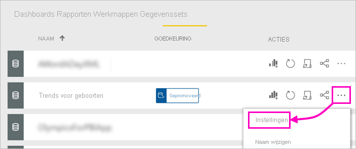

# Uw gegevensset promoveren - Power BI

De mensen die Power BI-rapporten maken, hebben nu mogelijk toegang tot veel verschillende gegevenssets, zodat bedrijven ze zelf moeten leiden naar de betrouwbare, hoogwaardige gegevenssets. Power BI biedt twee manieren om gegevenssets te *onderschrijven*:

- **Promotie**: Eigenaren kunnen hun eigen gegevenssets promoveren wanneer ze klaar zijn voor wijdverspreid gebruik. Elk lid van de werkruimte met schrijfmachtigingen kan een gegevensset promoveren. Er gelden geen beperkingen voor wie een gegevensset kan promoveren. Gegevenssets kunnen worden gepromoveerd om het gezamenlijk delen van gegevenssets binnen een organisatie te ondersteunen. Dit artikel gaat over het promoveren van uw gegevensset.
- **Certificering**: U kunt certificering aanvragen voor een gepromoveerde gegevensset. Een selecte groep gebruikers die zijn gedefinieerd in de tenantinstelling **Certificering van gegevenssets** bepaalt welke gegevenssets moeten worden gecertificeerd. Zie [Gegevenssets certificeren](service-datasets-certify.md) voor meer informatie.

## Een gegevensset promoveren

Als u uw gegevensset wilt promoveren, moet deze zich in een nieuwe werkruimte-ervaring bevinden in de Power BI-service.

1. Ga naar de lijst gegevenssets in de werkruimte.
 
1. Selecteer **Meer opties** (...) en selecteer vervolgens **Instellingen**.

    

1. Vouw **Goedkeuring** uit en selecteer **Gepromoveerd**.

    

1. Selecteer **Toepassen**.

## Certificering aanvragen voor gegevenssets

Uw Power BI-beheerder heeft mensen in de organisatie geselecteerd die gegevenssets mogen certificeren. U kunt deze mensen vragen om uw gegevensset te certificeren.

1. Geef het certificerende lid machtigingen voor de werkruimte waarin de gegevensset zich bevindt.

1. In het gedeelte **Goedkeuring** van **Instellingen** wordt **Gecertificeerd** grijs weergegeven.

1. Selecteer de koppeling **Meer informatie**.

    Uw Power BI-beheerder kan de koppeling **Meer informatie** configureren zodat deze naar een specifieke locatie leidt, met informatie over het certificeringsproces in uw tenant.   Als u de koppeling **Meer informatie** niet hebt aangepast, verwijst deze standaard naar het artikel over [certificering van gegevenssets](service-datasets-certify.md).

## Volgende stappen

* Meer informatie over [Gegevenssets in meerdere werkruimten gebruiken](service-datasets-across-workspaces.md)
* Vragen? [Misschien dat de Power BI-community het antwoord weet](https://community.powerbi.com/)
