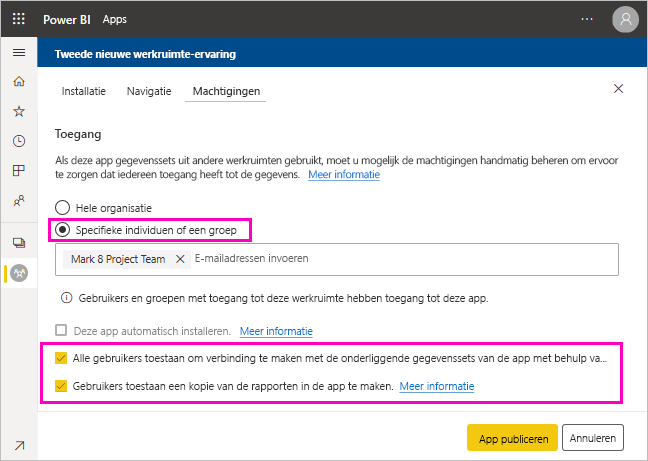
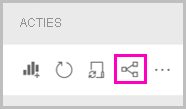
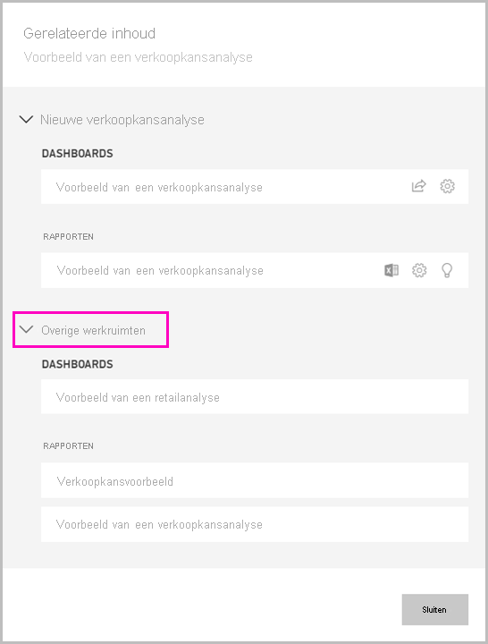

# Een gegevensset delen

Als maker van *gegevensmodellen* in Power BI Desktop maakt u *gegevenssets* die u kunt distribueren in de Power BI-service. Vervolgens kunnen andere makers van rapporten uw gegevenssets gebruiken als basis voor hun eigen rapporten. In dit artikel leest u hoe u uw gegevenssets kunt delen. Meer informatie over het verlenen en intrekken van toegang tot uw gedeelde gegevenssets vindt u in het artikel over de [samenstellingsmachtiging](service-datasets-build-permissions.md).

## Stappen voor het delen van uw gegevensset

1. U begint met het maken van een pbix-bestand met een gegevensmodel in Power BI Desktop. Als u van plan bent de gegevensset aan te bieden aan anderen zodat ze rapporten kunnen maken, mag u zelfs geen rapport ontwerpen in het pbix-bestand.

    Een van de best practices is om het pbix-bestand op te slaan in een Microsoft 365-groep.

1. Publiceer het pbix-bestand in een [nieuwe werkruimte-ervaring](../collaborate-share/service-create-the-new-workspaces.md) in de Power BI-service.
    
    Andere leden van deze werkruimte kunnen op basis van de gegevensset nu rapporten maken in andere werkruimten. Gebruik de optie Machtigingen beheren op de gegevensset in de inhoudslijst voor werkruimten en geef extra gebruikers toegang tot de gegevensset. 

1. U kunt vanuit deze werkruimte ook [een app publiceren](../collaborate-share/service-create-distribute-apps.md). Als u dit doet, geeft u op de pagina **Machtigingen** aan wie welke machtigingen krijgt.

    > [!NOTE]
    > Als u **Hele organisatie** selecteert, krijgt niemand in de organisatie de samenstellingsmachtiging. Dit probleem is al bekend. Geef in plaats daarvan e-mailadressen op in **Specifieke personen of groepen**.  Als u aan de hele organisatie samenstellingsmachtigingen wilt verlenen, geeft u voor de hele organisatie een e-mailalias op.

    

1. Selecteer **App publiceren** (of **App bijwerken**, als deze al is gepubliceerd).

## Het gebruik van uw gegevensset bijhouden

Als er een gedeelde gegevensset in uw werkruimte staat, wilt u mogelijk weten welke rapporten in andere werkruimten hierop zijn gebaseerd.

1. Selecteer in de lijstweergave Gegevenssets de optie **Gerelateerde items weergeven**.

    

1. In het dialoogvenster **Gerelateerde inhoud** worden alle verwante items weergegeven. In deze lijst ziet u de gerelateerde items in deze werkruimte en in **andere werkruimten**.
 
    

## Beperkingen en overwegingen
Houd rekening met het volgende bij het delen van gegevenssets:

* Wanneer u een gegevensset deelt door machtigingen te beheren, door rapporten of dashboards te delen of door een app te publiceren, verleent u toegang tot de gehele gegevensset, tenzij [Beveiliging op rijniveau (RLS)](../admin/service-admin-rls.md) de toegang beperkt. Rapportauteurs kunnen gebruikmaken van mogelijkheden waarmee gebruikerservaringen worden aangepast bij het weergeven van of werken met rapporten. Zo kunnen kolommen worden verborgen, de acties voor visuals worden beperkt, en meer. Deze aangepaste gebruikerservaring is niet van invloed op de gegevens waartoe gebruikers toegang hebben in de gegevensset. Gebruik [beveiliging op rijniveau](../admin/service-admin-rls.md) in de gegevensset zodat de referenties van elke persoon bepalen tot welke gegevens ze toegang hebben.

## Volgende stappen

- [Gegevenssets in werkruimten gebruiken](service-datasets-across-workspaces.md)
- Vragen? [Misschien dat de Power BI-community het antwoord weet](https://community.powerbi.com/)
