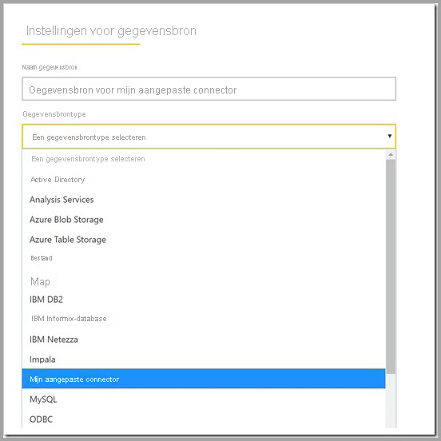

# Aangepaste gegevensconnectoren gebruiken met de on-premises gegevensgateway

[!INCLUDE [gateway-rewrite](../includes/gateway-rewrite.md)]

Met gegevensconnectors voor Power BI kunt u verbinding maken met en toegang krijgen tot gegevens vanuit een toepassing, service of gegevensbron. U kunt aangepaste gegevensconnectoren ontwikkelen en deze gebruiken in Power BI Desktop.

Zie de [GitHub-pagina Gegevensconnector-SDK](https://aka.ms/dataconnectors) voor meer informatie over het ontwikkelen van aangepaste gegevensconnectors voor Power BI. Deze site bevat informatie om aan de slag te gaan en voorbeelden voor Power BI en Power Query.

Wanneer u in Power BI Desktop rapporten bouwt die gebruikmaken van aangepaste gegevensconnectoren, kunt u de on-premises gegevensgateway gebruiken om deze rapporten vanuit de Power BI-service te vernieuwen.

## Deze functionaliteit inschakelen en gebruiken

Wanneer u de versie van juli 2018 of een latere versie van de on-premises gegevensgateway hebt geïnstalleerd, ziet u een tabblad **Connectors** in de on-premises gegevensgateway-app. Selecteer in het vak **Aangepaste gegevensconnectors laden vanuit de volgende map:** een map die toegankelijk is voor de gebruiker die de gatewayservice uitvoert. De standaardgebruiker is *NT SERVICE\PBIEgwService*. De aangepaste connectorbestanden in die map worden automatisch in de gateway geladen. Deze worden weergegeven in de lijst met gegevensconnectors.

Als u de on-premises gegevensgateway (persoonlijke modus) gebruikt, kunt u uw Power BI-rapport uploaden naar de Power BI-service en de gateway gebruiken om dit rapport te vernieuwen.

Voor de on-premises gegevensgateway moet u een gegevensbron voor uw aangepaste connector maken. Wanneer u op de pagina met gatewayinstellingen in de Power BI-service het gatewaycluster selecteert, wordt de optie weergegeven om het gebruik van aangepaste connectors voor dit cluster toe te staan. Zorg ervoor dat alle gateways in het cluster de updateversie van juli 2018 of later hebben om te kunnen beschikken over deze optie. Selecteer deze optie om het gebruik van aangepaste connectors in te schakelen voor dit cluster.

Wanneer deze optie is ingeschakeld, ziet u uw aangepaste connectors als beschikbare gegevensbronnen die u onder dit gatewaycluster kunt maken. Nadat u een gegevensbron hebt gemaakt die gebruikmaakt van uw nieuwe aangepaste connector, kunt u Power BI-rapporten vernieuwen met behulp van deze aangepaste connector in de Power BI-service.

## Overwegingen en beperkingen

* Zorg ervoor dat de map die u maakt toegankelijk is voor de gatewayservice voor de achtergrond. Normaal gesproken zijn mappen onder de map Windows of systeemmappen van uw gebruiker niet toegankelijk. In de on-premises gegevensgateway-app wordt een bericht weergegeven als de map niet toegankelijk is. Deze instructie is niet van toepassing op de on-premises gegevensgateway (persoonlijke modus).
* In de code voor aangepaste connectoren moet een sectie TestConnection worden geïmplementeerd om deze te laten werken met de on-premises gegevensgateway. Deze sectie is niet vereist als u aangepaste connectors voor Power BI Desktop gebruikt. U kunt om deze reden een connector hebben die met Power BI Desktop werkt, maar niet met de gateway. Raadpleeg [deze documentatie](https://github.com/Microsoft/DataConnectors/blob/master/docs/m-extensions.md#implementing-testconnection-for-gateway-support) voor meer informatie over het implementeren van een TestConnection-sectie.
* OAuth voor aangepaste connectors via gateways wordt momenteel alleen ondersteund voor gatewaybeheerders, maar niet voor andere gegevensbrongebruikers.
* Als de aangepaste connector zich op een netwerkstation bevindt, neemt u het volledige pad op in de on-premises gegevensgateway-app.

## Volgende stappen

* [Manage your data source - Analysis Services](service-gateway-enterprise-manage-ssas.md) (Uw gegevensbron beheren - Analysis Services)  
* [Manage your data source - SAP HANA](service-gateway-enterprise-manage-sap.md) (Uw gegevensbron beheren - SAP HANA)  
* [Manage your data source - SQL Server](service-gateway-enterprise-manage-sql.md) (Uw gegevensbron beheren - SQL Server)  
* [Manage your data source - Oracle](service-gateway-onprem-manage-oracle.md) (Gegevensbron beheren - Oracle)  
* [Uw gegevensbron beheren - importeren/geplande vernieuwing](service-gateway-enterprise-manage-scheduled-refresh.md)
* [Proxyinstellingen configureren voor de on-premises gegevensgateway](/data-integration/gateway/service-gateway-proxy)
* [Kerberos gebruiken voor eenmalige aanmelding (SSO) bij on-premises gegevensbronnen vanuit Power BI](service-gateway-sso-kerberos.md)  

Hebt u nog vragen? Misschien dat de[Power Bi-community](https://community.powerbi.com/) het antwoord weet.
