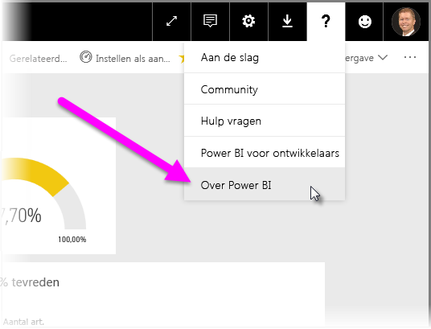

# Richtlijnen voor het implementeren van een gegevensgateway voor Power BI

[!INCLUDE [gateway-rewrite](../includes/gateway-rewrite.md)]

Dit artikel bevat richtlijnen en overwegingen voor het implementeren van een gegevensgateway voor Power BI in uw netwerkomgeving.

Zie [Wat is een on-premises gegevensgateway?](/data-integration/gateway/service-gateway-onprem) voor informatie over het downloaden, installeren, configureren en beheren van de on-premises gegevensgateway. U vindt ook meer informatie over de on-premises gegevensgateway en Power BI in de [Microsoft Power-blog](https://powerbi.microsoft.com/blog/) en op de [Microsoft Power BI-community](https://community.powerbi.com/)-site.

## Overwegingen bij de installatie van een on-premises gegevensgateway

Voordat u de on-premises gegevensgateway installeert voor uw Power BI-cloudservice, zijn er enkele overwegingen om rekening mee te houden. In de volgende secties worden deze overwegingen beschreven.

### Aantal gebruikers

Het aantal gebruikers dat via de gateway gebruikmaakt van een rapport, is een belangrijke metrische factor bij het bepalen van de locatie van de gateway. Dit zijn enkele vragen die hier van belang zijn:

* Worden deze rapporten op verschillende tijdstippen van de dag gebruikt?
* Wat voor soorten verbindingen worden er gebruikt (DirectQuery of importeren)?
* Gebruiken alle gebruikers hetzelfde rapport?

Als alle gebruikers elke dag op hetzelfde moment toegang hebben tot een bepaald rapport, moet u ervoor zorgen dat u de gateway installeert op een computer waarop al deze aanvragen kunnen worden verwerkt. Raadpleeg de volgende secties voor prestatiemeteritems en minimale vereisten waarmee u kunt bepalen of een computer toereikend is.

Door een beperking in Power BI is slechts *één* gateway per *rapport* toegestaan. Zelfs als een rapport is gebaseerd op meerdere gegevensbronnen, moeten al deze gegevensbronnen door één gateway gaan. Als een dashboard is gebaseerd op *meerdere* rapporten, kunt u een toegewezen gateway gebruiken voor elk rapport dat een bijdrage levert. Op deze manier verdeelt u de gatewaybelasting tussen de verschillende rapporten die aan het ene dashboard bijdragen.

### Type verbinding

Power BI biedt twee typen verbindingen: DirectQuery en importeren. Niet alle gegevensbronnen ondersteunen beide typen verbindingen. Uw keuze kan worden beïnvloed door diverse factoren, zoals beveiligingsvereisten, prestaties, gegevenslimieten en de grootte van gegevensmodellen. Zie de [lijst met beschikbare gegevensbrontypen](service-gateway-data-sources.md#list-of-available-data-source-types) voor meer informatie over typen verbindingen en ondersteunde gegevensbronnen.

Afhankelijk van welk type verbinding u gebruikt, kan het gatewaygebruik verschillen. Probeer bijvoorbeeld waar mogelijk DirectQuery-gegevensbronnen te scheiden van gegevensbronnen van geplande vernieuwingen. Hierbij wordt ervan uitgegaan dat ze zich in verschillende rapporten bevinden en kunnen worden gescheiden. Met het scheiden van bronnen wordt voorkomen dat de wachtrij van de gateway volloopt met duizenden DirectQuery-aanvragen op hetzelfde moment dat 's ochtends de vernieuwing is gepland van een groot gegevensmodel dat wordt gebruikt voor het belangrijkste dashboard van het bedrijf. 

Dit zijn de overwegingspunten voor beide opties:

* **Geplande vernieuwing**: afhankelijk van de grootte van uw query en het aantal vernieuwingen per dag, kunt u ervoor kiezen om de aanbevolen minimale hardwarevereisten te blijven hanteren of te upgraden naar een computer met betere prestaties. Als een bepaalde query niet is gevouwen, worden er transformaties op de gatewaycomputer uitgevoerd. Als gevolg hiervan profiteert de gatewaycomputer ervan als er meer RAM-geheugen beschikbaar is.

* **DirectQuery**: er wordt telkens een query verzonden wanneer een gebruiker het rapport opent of gegevens bekijkt. Als u verwacht dat meer dan 1000 gebruikers tegelijk toegang tot de gegevens moeten hebben, is het belangrijk om te controleren of uw computer is uitgerust met stabiele en geschikte hardwareonderdelen. Meer CPU-kernen zorgen voor een betere doorvoer voor een DirectQuery-verbinding.

Zie de [installatievereisten](/data-integration/gateway/service-gateway-install#requirements) voor on-premises gegevensgateways voor de vereisten van computerinstallaties.

### Locatie

De locatie van de gatewayinstallatie kan veel impact op de prestaties van uw query hebben. Zorg ervoor dat uw gateway, gegevensbronlocaties en de Power BI-tenant zich zo dicht mogelijk bij elkaar bevinden om netwerklatentie te minimaliseren. Om de locatie van uw Power BI-tenant te bepalen, selecteert u het vraagteken **?** in de Power BI-service in de rechterbovenhoek. Selecteer vervolgens **Over Power BI**.

Als u van plan bent om de Power BI-gateway te gebruiken met Azure Analysis Services, moet u ervoor zorgen dat de gegevensgebieden in beide overeenkomen. Bekijk [deze video](https://guyinacube.com/2018/01/power-bi-azure-analysis-services-gateway-data-region/) voor meer informatie over het instellen van gegevensgebieden voor meerdere services.

## Volgende stappen

* [Proxyinstellingen configureren](/data-integration/gateway/service-gateway-proxy)  
* [Problemen met gateways oplossen - Power BI](service-gateway-onprem-tshoot.md)  
* [Veelgestelde vragen over on-premises gegevensgateways - Power BI](service-gateway-power-bi-faq.md)  

Hebt u nog vragen? Misschien dat de [Power BI-community](https://community.powerbi.com/) het antwoord weet.
