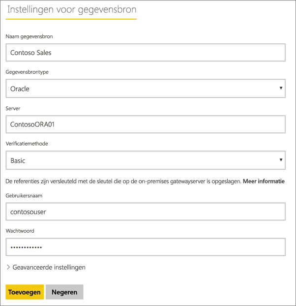
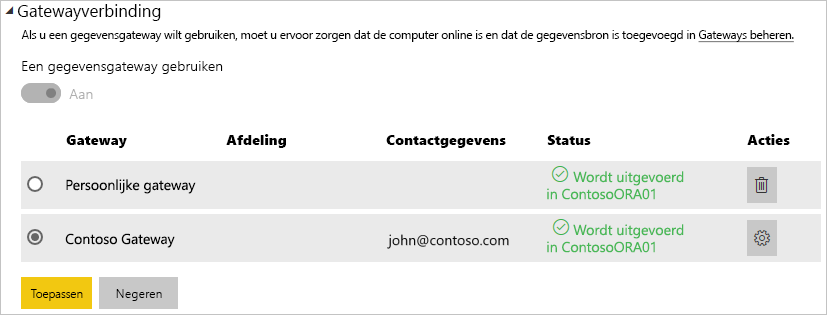

# Uw gegevensbron beheren - importeren/geplande vernieuwing

[!INCLUDE [gateway-rewrite](../includes/gateway-rewrite.md)]

Nadat u de [on-premises gegevensgateway hebt geïnstalleerd](/data-integration/gateway/service-gateway-install), moet u [gegevensbronnen toevoegen](service-gateway-data-sources.md#add-a-data-source) die met de gateway kunnen worden gebruikt. In dit artikel wordt beschreven hoe u werkt met gateways en gegevensbronnen die worden gebruikt voor geplande vernieuwing in plaats van DirectQuery of liveverbindingen.

## Een gegevensbron toevoegen

Zie [Een gegevensbron toevoegen](service-gateway-data-sources.md#add-a-data-source) voor meer informatie over het toevoegen van een gegevensbron. Selecteer een gegevensbrontype.

Alle vermelde gegevensbrontypen kunnen worden gebruikt voor geplande vernieuwing met de on-premises gegevensgateway. Analysis Services, SQL Server en SAP HANA kunnen worden gebruikt voor geplande vernieuwing of DirectQuery/liveverbindingen.

Vul vervolgens de informatie over de gegevensbron in, zoals de brongegevens en referenties voor toegang tot de gegevensbron.

> [!NOTE]
> Alle query's voor de gegevensbron worden uitgevoerd met deze referenties. Zie [Versleutelde referenties opslaan in de cloud](service-gateway-data-sources.md#store-encrypted-credentials-in-the-cloud) voor meer informatie over het opslaan van referenties.

Zie [lijst met beschikbare gegevensbrontypen](service-gateway-data-sources.md#list-of-available-data-source-types) voor een lijst met gegevensbrontypen die kunnen worden gebruikt met geplande vernieuwing.

Nadat u alles hebt ingevuld, selecteert u **Toevoegen**. U kunt deze gegevensbron nu gebruiken voor geplande vernieuwing met uw on-premises gegevens. De tekst *Verbinding gemaakt* wordt weergegeven als deze bewerking is geslaagd.

### Geavanceerde instellingen

U kunt optioneel het privacyniveau voor uw gegevensbron configureren. Met deze instelling bepaalt u hoe gegevens kunnen worden gecombineerd. Deze wordt alleen gebruikt voor geplande vernieuwing. Zie [privacyniveaus (Power query)](https://support.office.com/article/Privacy-levels-Power-Query-CC3EDE4D-359E-4B28-BC72-9BEE7900B540)voor meer informatie over privacyniveaus voor uw gegevensbron.

## De gegevensbron gebruiken voor geplande vernieuwing

Nadat u de gegevensbron hebt gemaakt, is deze beschikbaar voor gebruik met zowel DirectQuery-verbindingen als via geplande vernieuwing.

> [!NOTE]
> De servernaam en databasenaam die worden gebruikt voor Power BI Desktop en de gegevensbron in de on-premises gegevensgateway moeten overeenkomen.

De koppeling tussen uw gegevensset en de gegevensbron in de gateway is gebaseerd op de servernaam en databasenaam. Deze namen moeten overeenkomen. Als u bijvoorbeeld een IP-adres gebruikt als servernaam in Power BI Desktop, moet u dit IP-adres ook gebruiken voor de gegevensbron in de gatewayconfiguratie. Als u in Power BI Desktop *SERVER\EXEMPLAAR* gebruikt, moet u daarvan ook gebruik maken in de gegevensbron die u voor de gateway configureert.

Als u wordt vermeld op het tabblad **Gebruikers** voor de gegevensbron die is geconfigureerd in de gateway en als de server- en databasenaam overeenkomen, wordt de gateway als optie vermeld om te gebruiken bij geplande vernieuwing.

> [!IMPORTANT]
> Bij herpublicatie moet de eigenaar van de gegevensset deze opnieuw aan een gateway en de bijbehorende gegevensbron koppelen. De vorige koppeling wordt niet behouden wanneer de gegevensset opnieuw wordt gepubliceerd. 

> [!WARNING]
> Als de gegevensset meerdere gegevensbronnen bevat, moet elke gegevensbron aan de gateway worden toegevoegd. Als een of meer gegevensbronnen niet aan de gateway zijn toegevoegd, wordt de gateway niet weergegeven omdat deze niet beschikbaar is voor geplande vernieuwing.

## Volgende stappen

* [Problemen met de on-premises gegevensgateway oplossen](/data-integration/gateway/service-gateway-tshoot)
* [Problemen met gateways oplossen - Power BI](service-gateway-onprem-tshoot.md)

Nog vragen? Misschien dat de [Power BI-community](https://community.powerbi.com/) het antwoord weet.
