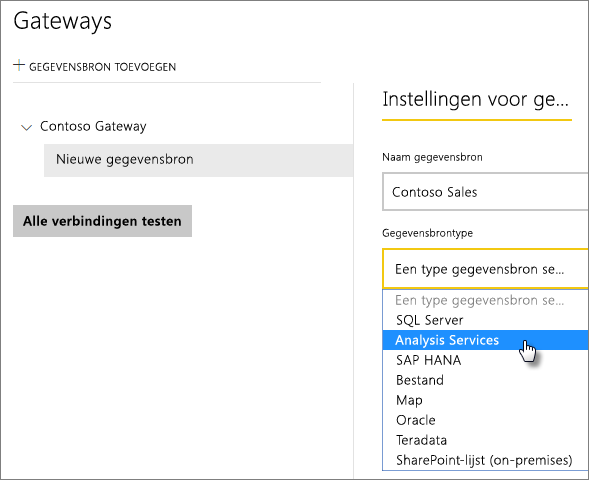
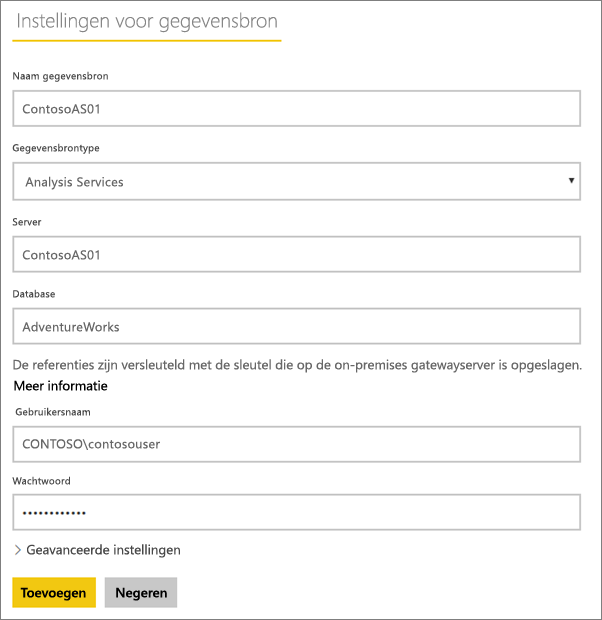
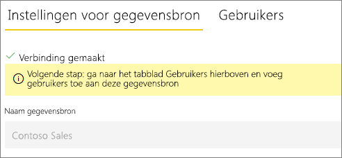
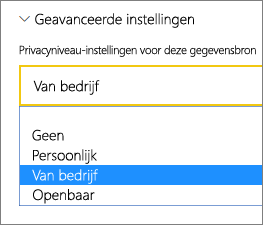
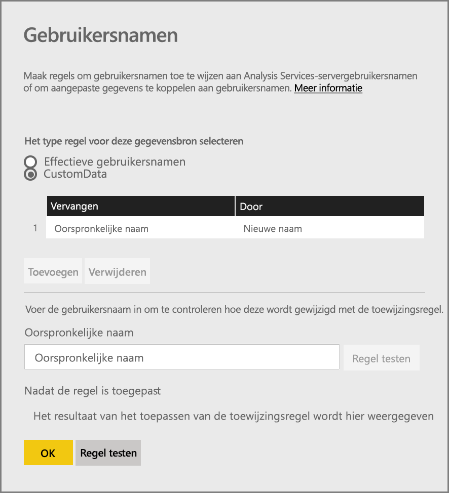
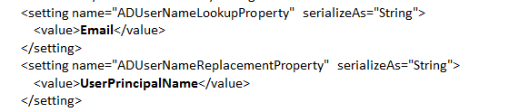
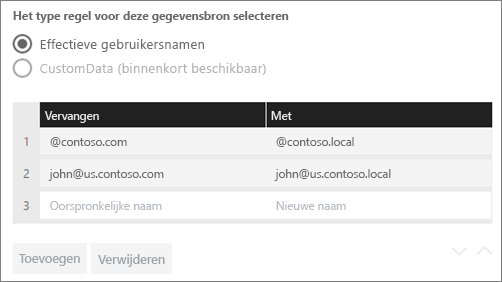
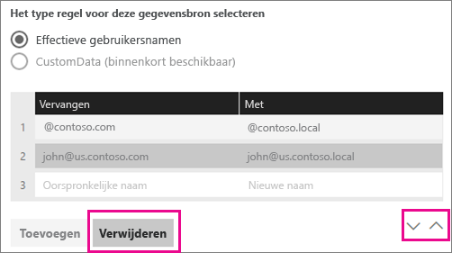
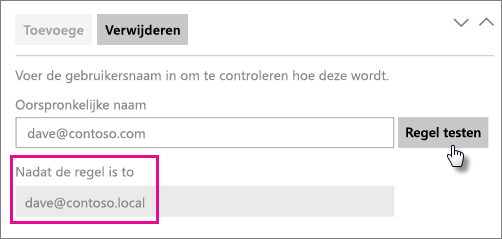
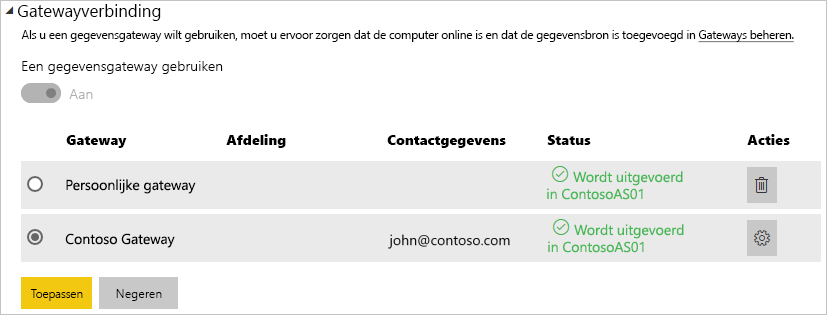

# <a name="manage-your-data-source---analysis-services"></a>Uw gegevensbron beheren - Analysis Services

[!INCLUDE [gateway-rewrite](../includes/gateway-rewrite.md)]

Nadat u de [on-premises gegevensgateway hebt geïnstalleerd](/data-integration/gateway/service-gateway-install), moet u [gegevensbronnen toevoegen](service-gateway-data-sources.md#add-a-data-source) die met de gateway kunnen worden gebruikt. In dit artikel wordt beschreven hoe u werkt met gateways en SQL Server Analysis Services (SSAS)-gegevensbronnen die worden gebruikt voor gepland vernieuwen of voor liveverbindingen.

[Bekijk deze video](https://www.youtube.com/watch?v=GPf0YS-Xbyo&feature=youtu.be) voor meer informatie over het instellen van een liveverbinding met Analysis Services.

> [!NOTE]
> Als u een gegevensbron van Analysis Services hebt, moet u de gateway installeren op een computer die lid is van hetzelfde forest/domein als de Analysis Services-server.

## <a name="add-a-data-source"></a>Een gegevensbron toevoegen

Zie [Een gegevensbron toevoegen](service-gateway-data-sources.md#add-a-data-source) voor meer informatie over het toevoegen van een gegevensbron. Selecteer **Analysis Services** als het **gegevensbrontype** als u verbinding maakt met een multidimensionale server of een server in tabelvorm.



Vul de gegevens voor de gegevensbron in, waaronder de **server** en de **database**. De gegevens die u invoert voor **Gebruikersnaam** en **Wachtwoord** worden door de gateway gebruikt om verbinding te maken met het Analysis Services-exemplaar.

> [!NOTE]
> Het Windows-account dat u invoert, moet lid zijn van de rol van serverbeheerder in het Analysis Services-exemplaar waarmee u verbinding maakt. Als het wachtwoord van dit account zo is ingesteld dat dit verloopt, kunnen gebruikers een verbindingsfout krijgen als het wachtwoord voor de gegevensbron niet op tijd wordt bijgewerkt. Zie [Versleutelde referenties opslaan in de cloud](service-gateway-data-sources.md#store-encrypted-credentials-in-the-cloud) voor meer informatie over het opslaan van referenties.



Nadat u alles hebt ingevuld, selecteert u **Toevoegen**. U kunt deze gegevensbron nu gebruiken voor geplande vernieuwing of liveverbindingen op basis van een Analysis Services-exemplaar dat on-premises wordt uitgevoerd. De tekst *Verbinding gemaakt* wordt weergegeven als deze bewerking is geslaagd.



### <a name="advanced-settings"></a>Geavanceerde instellingen

U kunt optioneel het privacyniveau voor uw gegevensbron configureren. Met deze instelling bepaalt u hoe gegevens kunnen worden gecombineerd. Deze wordt alleen gebruikt voor geplande vernieuwing. De instelling op privacyniveau is niet van toepassing op liveverbindingen. Zie [privacyniveaus (Power query)](https://support.office.com/article/Privacy-levels-Power-Query-CC3EDE4D-359E-4B28-BC72-9BEE7900B540)voor meer informatie over privacyniveaus voor uw gegevensbron.



## <a name="user-names-with-analysis-services"></a>Gebruikersnamen en Analysis Services

<iframe width="560" height="315" src="https://www.youtube.com/embed/Qb5EEjkHoLg" frameborder="0" allowfullscreen></iframe>

Steeds wanneer een gebruiker interactie heeft met een rapport dat is verbonden met Analysis Services, wordt de effectieve gebruikersnaam doorgegeven aan de gateway en vervolgens aan de on-premises Analysis Services-server. Het e-mailadres waarmee u zich bij Power BI aanmeldt, wordt als de effectieve gebruikersnaam doorgegeven aan Analysis Services. Deze informatie wordt doorgegeven via de verbindingseigenschap [EffectiveUserName](/analysis-services/instances/connection-string-properties-analysis-services#bkmk_auth). 

Het e-mailadres moet overeenkomen met een user principal name (UPN) die is gedefinieerd in het lokale Active Directory-domein. De UPN is een eigenschap van een Active Directory-account. Het Windows-account moet aanwezig zijn in een Analysis Services-rol. De aanmelding kan niet tot stand worden gebracht als er geen overeenkomst wordt gevonden in Active Directory Domain Services. Zie [Kenmerken van gebruikersnamen](/windows/win32/ad/naming-properties) voor meer informatie over Active Directory Domain Services en de naamgeving van gebruikers.

U kunt ook [uw Power BI-aanmeldingsnaam toewijzen aan een UPN in de lokale directory](service-gateway-enterprise-manage-ssas.md#map-user-names-for-analysis-services-data-sources).

## <a name="map-user-names-for-analysis-services-data-sources"></a>Gebruikersnamen toewijzen voor gegevensbronnen van Analysis Services

<iframe width="560" height="315" src="https://www.youtube.com/embed/eATPS-c7YRU" frameborder="0" allowfullscreen></iframe>

In Power BI kunt u gebruikersnamen toewijzen voor gegevensbronnen van Analysis Services. U kunt regels configureren om een gebruikersnaam die is aangemeld met Power BI toe te wijzen aan een naam die wordt doorgegeven voor EffectiveUserName tijdens de Analysis Services-verbinding. De functie voor het toewijzen van gebruikersnamen is een uitstekende oplossing voor het geval dat uw gebruikersnaam in Azure Active Directory (Azure AD) niet overeenkomt met een UPN in uw lokale Active Directory-exemplaar. Als uw e-mailadres bijvoorbeeld nancy@contoso.onmicrsoft.com is, kunt u dit adres toewijzen aan nancy@contoso.com, en dan wordt die waarde doorgegeven aan de gateway.

U kunt op twee verschillende manieren gebruikersnamen toewijzen voor Analysis Services:

* Handmatig opnieuw toewijzen van gebruikers
* On-premises Active Directory Domain Services-eigenschappen opzoeken om Azure AD-UPN's toe te wijzen aan Active Directory Domain Services-gebruikers (toewijzing op basis van Active Directory Domain Services-zoekactie)

Hoewel handmatige toewijzing mogelijk is bij de tweede benadering, is dat tijdrovend en lastig te onderhouden. Het is vooral lastig wanneer patroonvergelijking niet voldoende is. Voorbeelden zijn wanneer domeinnamen verschillen tussen Azure AD en on-premises Active Directory of wanneer namen van gebruikersaccounts verschillen tussen Azure AD en Active Directory. Daarom wordt handmatige toewijzing met de tweede methode niet aanbevolen.

We beschrijven deze twee benaderingen, op volgorde, in de volgende twee secties.

### <a name="manual-user-name-remapping"></a>Handmatig opnieuw toewijzen van gebruikersnamen

U kunt voor Analysis Services-gegevensbronnen aangepaste UPN-regels configureren. Dit maakt het eenvoudiger als uw aanmeldingsnamen voor de Power BI-service niet overeenkomen met de UPN's in uw lokale directory. Als u zich bijvoorbeeld aanmeldt bij Power BI met john@contoso.com, maar de UPN in de lokale directory john@contoso.local is, kunt u een toewijzingsregel configureren waarmee john@contoso.local wordt doorgegeven aan Analysis Services.

Volg de volgende stappen om het venster voor UPN-toewijzing te openen.

1. Ga naar het tandwielpictogram en selecteer **Gateways beheren**.
2. Vouw de gateway uit die de Analysis Services-gegevensbron bevat. Als u de Analysis Services-gegevensbron nog niet hebt gemaakt, kunt u dat ook eerst doen.
3. Selecteer de gegevensbron en selecteer vervolgens het tabblad **Gebruikers**.
4. Selecteer **Gebruikersnamen toewijzen**.

    

U krijgt dan opties te zien om regels toe te voegen en voor een bepaalde gebruiker te testen.

> [!NOTE]
> Misschien wijzigt u per ongeluk een gebruiker die u niet wilt wijzigen. Als bijvoorbeeld **Vervangen (oorspronkelijke waarde)** contoso.com is en **Door (nieuwe naam)** @contoso.local is, worden alle gebruikers met een aanmeldingsnaam die @contoso.com bevat vervangen door @contoso.local. Ook als **Vervangen (oorspronkelijke naam)** dave@contoso.com is en **Door (nieuwe naam)** dave@contoso.local is, wordt een gebruiker met de aanmeldingsnaam v-dave@contoso.com verzonden als v-dave@contoso.local.

### <a name="active-directory-lookup-mapping"></a>Toewijzen met Active Directory Domain Services-zoekactie

Volg de stappen in deze sectie om Azure AD-UPN's opnieuw toe te wijzen aan Active Directory Domain Services-gebruikers met behulp van een zoekactie op basis van on-premises Active Directory-eigenschappen. Laten we eerst doornemen hoe dit werkt.

In de Power BI-service gebeurt het volgende:

* Voor elke query door een Power BI Azure AD-gebruiker naar een on-premises SSAS-server wordt een UPN-tekenreeks doorgegeven, zoals      firstName.lastName@contoso.com.

> [!NOTE]
> Handmatige UPN-gebruikerstoewijzingen die zijn gedefinieerd in de Power BI-configuratie van de gegevensbron worden nog steeds toegepast *voordat* de gebruikersnaam wordt verzonden naar de on-premises gegevensgateway.

In de on-premises gegevensgateway met configureerbare aangepaste gebruikerstoewijzing volgt u de volgende stappen.

1. Zoek Active Directory Domain Services om te zoeken. U kunt automatisch of configureerbaar gebruiken.
2. Zoek naar het kenmerk van de Active Directory-persoon, bijvoorbeeld het e-mailadres, van de Power BI-service. Het kenmerk is gebaseerd op een binnenkomende UPN-tekenreeks, zoals firstName.lastName@contoso.com.
3. Als de Active Directory Domain Services-zoekopdracht mislukt, wordt geprobeerd de UPN door te geven aan SSAS als EffectiveUser.
4. Als de Active Directory-zoekopdracht slaagt, wordt de UserPrincipalName van die Active Directory-persoon opgehaald.
5. Het e-mailadres van de UserPrincipalName wordt aan SSAS doorgegeven als EffectiveUser, zoals Alias@corp.on-prem.contoso.

Uw gateway configureren voor het uitvoeren van de Active Directory Domain Services-zoekopdracht:

1. [Download en installeer de nieuwste versie van de gateway](/data-integration/gateway/service-gateway-install).

2. In de gateway stelt u de on-premises gegevensgatewayservice in zodat deze wordt uitgevoerd met een domeinaccount in plaats van een lokaal serviceaccount. Anders werkt de Active Directory Domain Services-zoekopdracht tijdens runtime niet naar behoren. Ga naar de [on-premises gegevensgateway-app](/data-integration/gateway/service-gateway-app) op uw computer en ga vervolgens naar **Service-instellingen** > **Serviceaccount wijzigen**. Zorg ervoor dat u de herstelsleutel voor deze gateway hebt. Deze hebt u nodig om de gateway te herstellen op dezelfde computer, tenzij u een nieuwe gateway wilt maken. Start de gatewayservice opnieuw om de wijziging door te voeren.

3. Ga naar de installatiemap van de gateway, *C:\Program Files\On-premises data gateway*, met een beheerdersaccount om te zorgen dat u schrijfmachtigingen hebt. Open het bestand *Microsoft.PowerBI.DataMovement.Pipeline.GatewayCore.dll.config*.

4. Bewerk de volgende twee configuratiewaarden voor uw Active Directory Domain Services-gebruikers volgens de kenmerkconfiguraties van *uw* Active Directory Domain Services. De volgende configuratiewaarden zijn voorbeelden. Geef de waarden op basis van uw Active Directory Domain Services-configuratie op. Deze configuraties zijn hoofdlettergevoelig. Zorg er daarom voor dat deze overeenkomen met de waarden in Active Directory Domain Services.

    

    Als er geen waarde is opgegeven voor de ADServerPath-configuratie, maakt de gateway gebruik van de globale standaardcatalogus. U kunt ook meerdere waarden opgeven voor ADServerPath. Elke waarde moet worden gescheiden door puntkomma's, zoals wordt weergegeven in het volgende voorbeeld:

    ```xml
    <setting name="ADServerPath" serializeAs="String">
        <value> >GC://serverpath1; GC://serverpath2;GC://serverpath3</value>
    </setting>
    ```

    De gateway parseert de waarden voor ADServerPath van links naar rechts totdat een overeenkomst is gevonden. Als er geen overeenkomst wordt gevonden, wordt de oorspronkelijke UPN gebruikt. Zorg ervoor dat het account waarmee de gatewayservice (PBIEgwService) wordt uitgevoerd, over querymachtigingen beschikt voor alle Active Directory Domain Services-servers die u in ADServerPath opgeeft.

    De gateway ondersteunt twee typen ADServerPath, zoals wordt weergegeven in de volgende voorbeelden:

    **WinNT**

    ```xml
    <value="WinNT://usa.domain.corp.contoso.com,computer"/>
    ```

    **GC**

    ```xml
    <value> GC://USA.domain.com </value>
    ```

5. Start de on-premises gegevensgatewayservice opnieuw om de configuratiewijziging door te voeren.

### <a name="work-with-mapping-rules"></a>Werken met toewijzingsregels

Als u een toewijzingsregel wilt maken, voert u een waarde in voor **Oorspronkelijke naam** en **Nieuwe naam** en selecteert u vervolgens **Toevoegen**.

| Veld | Description |
| --- | --- |
| Vervangen (Oorspronkelijke naam) |Het e-mailadres dat u hebt gebruikt om u aan te melden bij Power BI. |
| Door (nieuwe naam) |De waarde waarmee u de oorspronkelijke naam wilt vervangen. Het resultaat van deze vervanging wordt doorgegeven aan de eigenschap EffectiveUserName voor de Analysis Services-verbinding. |



Wanneer u een item in de lijst selecteert, kunt u ervoor kiezen deze opnieuw te rangschikken met behulp van de pictogrammen met dubbele punthaken. Het is ook mogelijk de vermelding te verwijderen.



### <a name="use-a-wildcard"></a>Een jokerteken gebruiken

U kunt een jokerteken (*) gebruiken in uw tekenreeks **Vervangen (oorspronkelijke naam)** . Deze kan alleen los worden gebruikt, niet in combinatie met een ander deel van een tekenreeks. Gebruik een jokerteken als u alle gebruikers als een enkele waarde aan de gegevensbron wilt doorgeven. Dit is handig als u wilt dat alle gebruikers in uw organisatie dezelfde gebruiker gebruiken in uw lokale omgeving.

### <a name="test-a-mapping-rule"></a>Een toewijzingsregel testen

Als u wilt valideren waardoor een oorspronkelijke naam wordt vervangen, voert u een waarde voor **Oorspronkelijke naam** in. Selecteer **Regel testen**.



> [!NOTE]
> Het duurt enkele minuten voordat opgeslagen regels door de service in gebruik worden genomen. De regel werkt onmiddellijk in de browser.

### <a name="limitations-for-mapping-rules"></a>Beperkingen voor toewijzingsregels

De toewijzing is alleen van toepassing voor de gegevensbron die wordt geconfigureerd. Het is geen globale instelling. Als u meerdere Analysis Services-gegevensbronnen gebruikt, moet u de gebruikers voor elke gegevensbron toewijzen.

## <a name="authentication-to-a-live-analysis-services-data-source"></a>Verificatie voor een live-gegevensbron van Analysis Services

Steeds wanneer een gebruiker interactie heeft met Analysis Services, wordt de effectieve gebruikersnaam doorgegeven aan de gateway en vervolgens aan de on-premises Analysis Services-server. De UPN (dit is meestal het e-mailadres) waarmee u zich bij de cloud aanmeldt, wordt als de effectieve gebruiker doorgegeven aan Analysis Services. De UPN wordt doorgegeven via de verbindingseigenschap EffectiveUserName. 

Dit e-mailadres moet overeenkomen met een UPN die is gedefinieerde in het lokale Active Directory-domein. De UPN is een eigenschap van een Active Directory-account. Dat Windows-account moet aanwezig zijn in een Analysis Services-rol om toegang te hebben tot de server. De aanmelding kan niet tot stand worden gebracht als er geen overeenkomst wordt gevonden in Active Directory Domain Services.

Analysis Services kan ook filtering aanbieden op basis van dit account. Deze filtering kan plaatsvinden met behulp van op rollen gebaseerde beveiliging of beveiliging op rijniveau.

## <a name="role-based-security"></a>Beveiliging op basis van rollen

Modellen bieden beveiliging op basis van gebruikersrollen. Rollen worden gedefinieerd voor een bepaald modelproject tijdens het ontwerpen van het project in SQL Server Data Tools – Business Intelligence. Dit kan trouwens ook nadat een model is geïmplementeerd; in dat geval met behulp van SQL Server Management Studio. Rollen bevatten leden op Windows-gebruikersnaam of Windows-groep. Via rollen wordt bepaald welke machtigingen een gebruiker heeft om query's of acties uit te voeren op het model. De meeste gebruikers behoren tot een rol met leesmachtigingen. Andere rollen zijn bedoeld voor beheerders met machtigingen voor het verwerken van items, en voor het beheren van databasefuncties en andere rollen.

## <a name="row-level-security"></a>Beveiliging op rijniveau

Beveiliging op rijniveau is specifiek voor beveiliging op rijniveau van Analysis Services. Modellen kunnen dynamische beveiliging op rijniveau bieden. In tegenstelling tot de aanpak waarbij gebruikers ten minste één rol moeten hebben, is dynamische beveiliging niet vereist voor een tabellair model. In algemene zin bepaalt dynamische beveiliging de leestoegang van een gebruiker voor gegevens, gespecificeerd tot een bepaalde rij in een bepaalde tabel. Net als bij rollen, is voor dynamische beveiliging op rijniveau de Windows-gebruikersnaam van een gebruiker nodig.

De mogelijkheid van een gebruiker om modelgegevens op te vragen en te bekijken, wordt bepaald door:

- De rollen waartoe het Windows-gebruikersaccount van de gebruiker behoort.
- Dynamische beveiliging op rijniveau, als deze is geconfigureerd.

De implementatie van op rollen gebaseerde beveiliging en dynamische beveiliging op rijniveau valt buiten het bereik van dit artikel. U kunt op MSDN meer informatie (Engelstalig) vinden over [rollen (SSAS Tabular)](/analysis-services/tabular-models/roles-ssas-tabular) en [beveiligingsrollen (Analysis Services - Multidimensional Data)](/analysis-services/multidimensional-models/olap-logical/security-roles-analysis-services-multidimensional-data). Voor het uitgebreidste overzicht van beveiliging met modellen in tabelvorm kunt u het technische artikel [Het semantische BI-model in tabelvorm beveiligen](https://download.microsoft.com/download/D/2/0/D20E1C5F-72EA-4505-9F26-FEF9550EFD44/Securing%20the%20Tabular%20BI%20Semantic%20Model.docx) downloaden en lezen.

## <a name="what-about-azure-ad"></a>Hoe zit het met Azure AD?

Microsoft-cloudservices maken gebruik van [Azure AD](/azure/active-directory/fundamentals/active-directory-whatis) voor de verificatie van gebruikers. Azure AD is de tenant met gebruikersnamen en beveiligingsgroepen. Het e-mailadres waarmee een gebruiker zich aanmeldt, is meestal hetzelfde als de UPN van het account.

## <a name="what-is-the-role-of-my-local-active-directory-instance"></a>Wat is de rol van mijn lokale Active Directory Domain Services-exemplaar?

Analysis Services moet bepalen of een gebruiker die verbinding maakt met de service behoort tot een rol met machtigingen voor het lezen van gegevens. Hiervoor moet de server de effectieve gebruikersnaam converteren die door Azure AD wordt doorgegeven aan de gateway en vervolgens aan de Analysis Services-server. De Analysis Services-server geeft de effectieve gebruikersnaam door aan een Windows Active Directory Domain Services-domeincontroller (DC). De Active Directory Domain Services-DC valideert vervolgens of de effectieve gebruikersnaam een geldige UPN is voor een lokaal account. Vervolgens wordt de Windows-gebruikersnaam van de gebruiker teruggestuurd naar de Analysis Services-server.

EffectiveUserName kan alleen worden gebruikt met een Analysis Services-server die aan een domein is gekoppeld. De Analysis Services-server moet deel uitmaken van een domein om aanmeldingsfouten te voorkomen.

## <a name="how-do-i-tell-what-my-upn-is"></a>Hoe weet ik wat mijn UPN is?

U weet mogelijk niet wat uw UPN is en u bent mogelijk geen domeinbeheerder. Gebruik de volgende opdracht vanaf uw computer om de UPN voor uw account op te vragen.

    whoami /upn

Het resultaat ziet eruit als een e-mailadres, maar dit is de UPN voor uw domeinaccount. Als u een Analysis Services-gegevensbron gebruikt voor liveverbindingen en de UPN niet overeenkomt met het e-mailadres waarmee u zich aanmeldt bij Power BI, kan het nuttig zijn te kijken naar het [toewijzen van gebruikersnamen](#map-user-names-for-analysis-services-data-sources).

## <a name="synchronize-an-on-premises-active-directory-with-azure-ad"></a>Een on-premises Active Directory Domain Services synchroniseren met Azure AD

Als u Analysis Services-liveverbindingen wilt gebruiken, moeten uw lokale Active Directory Domain Services-accounts overeenkomen met Azure AD. De UPN moet overeenkomen tussen de accounts.

De cloudservices kennen alleen accounts binnen Azure AD. Het maakt niet uit of u een account hebt toegevoegd in uw lokale Active Directory Domain Services-exemplaar. Als het account niet bestaat in Azure AD, kan het niet worden gebruikt. Er zijn verschillende manieren waarop u uw lokale Active Directory Domain Services-accounts in overeenstemming kunt brengen met Azure AD:

- U kunt accounts handmatig toevoegen aan Azure AD.

   U kunt een account maken in Azure Portal of in het Microsoft 365-beheercentrum. De accountnaam komt dan overeen met de UPN van het lokale Active Directory-account.

- U kunt het hulpprogramma [Azure AD Connect](/azure/active-directory/hybrid/how-to-connect-sync-whatis) gebruiken om lokale accounts te synchroniseren met uw Azure AD-tenant.

   Het hulpprogramma Azure AD Connect biedt opties voor directorysynchronisatie en het instellen van verificatie. Opties zijn onder meer wachtwoord-hashsynchronisatie, pass-through-verificatie en federatie. Als u geen tenantbeheerder of lokale domeinbeheerder bent, moet u contact opnemen met uw IT-beheerder voor hulp bij de configuratie.

   Door gebruik te maken van Azure AD Connect weet u zeker dat de UPN overeenkomt tussen Azure AD en uw lokale Active Directory Domain Services-exemplaar.

> [!NOTE]
> Het synchroniseren van accounts met het hulpprogramma Azure AD Connect betekent dat er nieuwe accounts worden gemaakt binnen uw Azure AD-tenant.

## <a name="use-the-data-source"></a>De gegevensbron gebruiken

Nadat u de gegevensbron hebt gemaakt, is deze beschikbaar voor gebruik met zowel liveverbindingen als via geplande vernieuwing.

> [!NOTE]
> De servernaam en databasenaam die worden gebruikt voor Power BI Desktop en de gegevensbron in de on-premises gegevensgateway moeten overeenkomen.

De koppeling tussen uw gegevensset en de gegevensbron in de gateway is gebaseerd op de servernaam en databasenaam. Deze namen moeten overeenkomen. Als u bijvoorbeeld een IP-adres gebruikt als servernaam in Power BI Desktop, moet u dit IP-adres ook gebruiken voor de gegevensbron in de gatewayconfiguratie. Als u in Power BI Desktop *SERVER\EXEMPLAAR* gebruikt, moet u daarvan ook gebruik maken in de gegevensbron die u voor de gateway configureert.

Deze vereiste geldt voor zowel liveverbindingen als geplande vernieuwing.

### <a name="use-the-data-source-with-live-connections"></a>De gegevensbron gebruiken met liveverbindingen

Zorg ervoor dat de servernaam en databasenaam voor Power BI Desktop en de geconfigureerde gegevensbron voor de gateway overeenkomen. U moet er ook voor zorgen dat uw gebruiker wordt vermeld op het tabblad **Gebruikers** voor de gegevensbron om gegevenssets met een liveverbinding te kunnen publiceren. De selectie voor liveverbindingen vindt plaats binnen Power BI Desktop, wanneer u voor het eerst gegevens importeert.

Nadat u de gegevens hebt gepubliceerd, werken uw rapporten vanuit Power BI Desktop of via **Gegevens ophalen**. Nadat u de gegevensbron in de gateway hebt gemaakt, kan het enkele minuten duren voordat de verbinding kan worden gebruikt.

### <a name="use-the-data-source-with-scheduled-refresh"></a>De gegevensbron gebruiken met geplande vernieuwing

Als u wordt vermeld op het tabblad **Gebruikers** voor de gegevensbron die is geconfigureerd in de gateway en als de server- en databasenaam overeenkomen, wordt de gateway als optie vermeld om te gebruiken bij geplande vernieuwing.



### <a name="limitations-of-analysis-services-live-connections"></a>Beperkingen van liveverbindingen van Analysis Services

U kunt een liveverbinding gebruiken voor tabelvormige of multidimensionale exemplaren.

| **Server-versie** | **Vereiste SKU** |
| --- | --- |
| 2012 SP1 CU4 of hoger |Business Intelligence en Enterprise-SKU |
| 2014 |Business Intelligence en Enterprise-SKU |
| 2016 |Standaard SKU of hoger |

* Opmaak op celniveau en vertaalfuncties worden niet ondersteund.
* Acties en benoemde sets zijn niet beschikbaar in Power BI. U kunt nog wel verbinding maken met multidimensionale kubussen die ook acties of benoemde sets bevatten. Ook kunt u visuals en rapporten maken.

## <a name="next-steps"></a>Volgende stappen

* [Problemen met de on-premises gegevensgateway oplossen](/data-integration/gateway/service-gateway-tshoot)
* [Problemen met gateways oplossen - Power BI](service-gateway-onprem-tshoot.md)

Nog vragen? Misschien dat de [Power BI-community](https://community.powerbi.com/) het antwoord weet.
