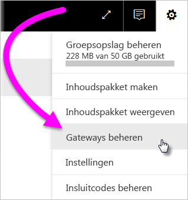
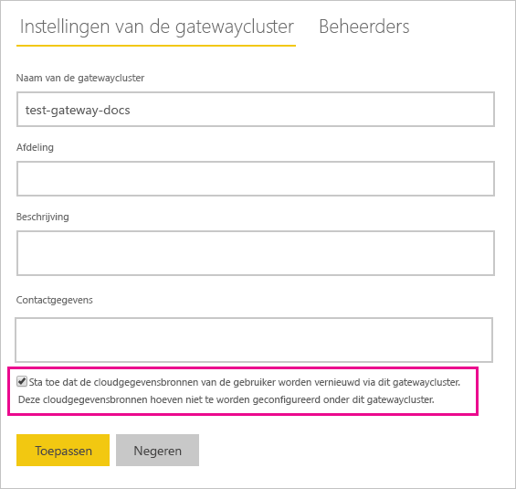
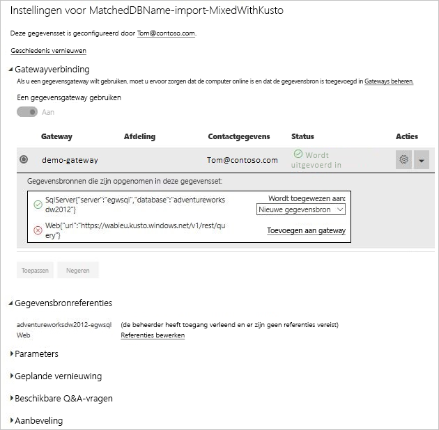

# On-premises en cloudgegevensbronnen samenvoegen of toevoegen

[!INCLUDE [gateway-rewrite](../includes/gateway-rewrite.md)]

U kunt de on-premises gegevensgateway gebruiken om on-premises en cloudgegevensbronnen samen te voegen in of om ze toe te voegen aan één query. Deze oplossing is handig als u gegevens uit verschillende bronnen wilt combineren zonder afzonderlijke query's te hoeven gebruiken.

>[!NOTE]
>Dit artikel is alleen van toepassing op gegevenssets met cloud- en on-premises gegevensbronnen die zijn samengevoegd in of toegevoegd aan één query. Voor gegevenssets met afzonderlijke query's (een om verbinding te maken met een on-premises gegevensbron en een andere om verbinding te maken met een cloudgegevensbron) voert de gateway de query niet uit voor de cloudgegevensbron.

## Vereisten

- Een [gateway die is geïnstalleerd](/data-integration/gateway/service-gateway-install) op een lokale computer.
- Een Power BI Desktop-bestand met query's waarin on-premises en cloudgegevensbronnen worden gecombineerd.

>[!NOTE]
>Zorg ervoor dat de gateway toegang heeft tot de betreffende cloudgegevensbronnen als er gebruik van wordt gemaakt.

1. Selecteer rechtsboven in de Power BI-service het tandwielpictogram  > **Gateways beheren**.

    

2. Selecteer de gateway die u wilt configureren.

3. Onder **Clusterinstellingen van de gateway** selecteert u **Toestaan dat de cloudgegevensbronnen van gebruikers worden vernieuwd via dit gatewaycluster** > **Toepassen**.

    

4. Via dit gatewaycluster voegt u alle [on-premises gegevensbronnen](service-gateway-enterprise-manage-scheduled-refresh.md#add-a-data-source) toe die u gebruikt in uw query's. U hoeft hier niet de cloudgegevensbronnen toe te voegen.

5. Upload uw Power BI Desktop-bestand naar de Power BI-service. Dit bestand bevat de query's waarin on-premises en cloudgegevensbronnen worden gecombineerd.

6. Op de pagina **Gegevenssetinstellingen** van de nieuwe gegevensset:

   - Voor de on-premises bron selecteert u de gateway die is gekoppeld aan deze gegevensbron.
   - Bij **Gegevensbronreferenties** bewerkt u de referenties van de cloudgegevensbronnen waar nodig.

    Zorg ervoor dat de privacyniveaus voor zowel de cloud- als on-premises gegevensbronnen op de juiste wijze zijn ingesteld zodat de joins veilig worden verwerkt.

     

7. Als de cloudreferenties zijn ingesteld, kunt u de gegevensset vernieuwen via de optie **Nu vernieuwen**. U kunt ook instellen dat er periodiek wordt vernieuwd.

## Volgende stappen

Zie [De gegevensbron gebruiken voor geplande vernieuwing](service-gateway-enterprise-manage-scheduled-refresh.md#use-the-data-source-for-scheduled-refresh) voor meer informatie over gegevensvernieuwing voor gateways.
