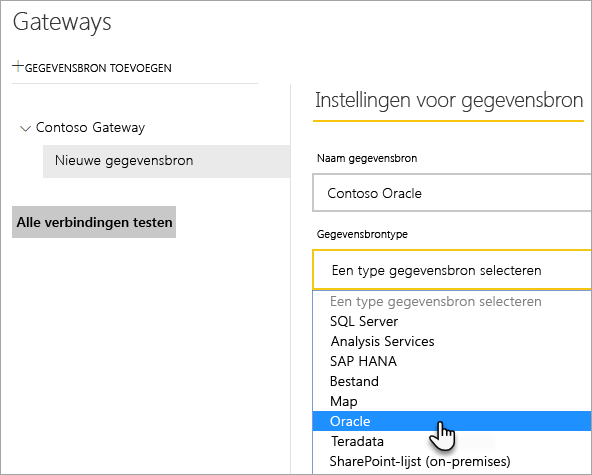
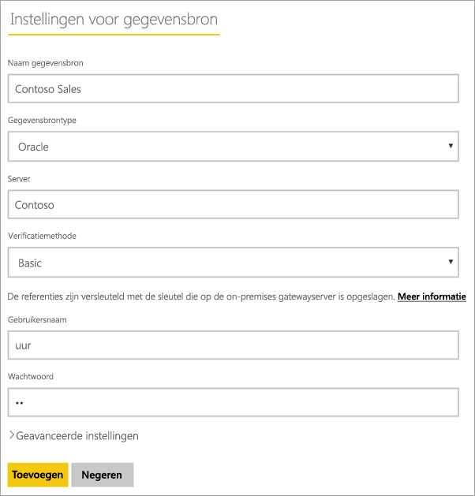
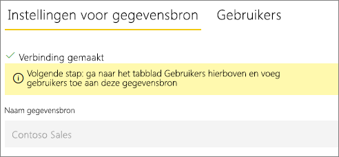
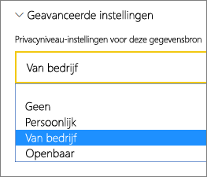
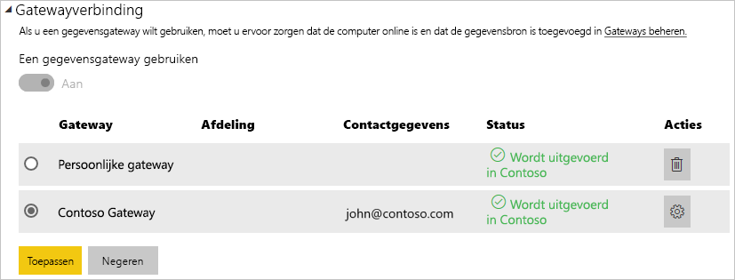

# De gegevensbron beheren - Oracle

[!INCLUDE [gateway-rewrite](../includes/gateway-rewrite.md)]

Nadat u de [on-premises gegevensgateway hebt geïnstalleerd](/data-integration/gateway/service-gateway-install), moet u [gegevensbronnen toevoegen](service-gateway-data-sources.md#add-a-data-source) die met de gateway kunnen worden gebruikt. In dit artikel wordt beschreven hoe u gateways en Oracle-gegevensbronnen gebruikt voor gepland vernieuwen of voor DirectQuery.

## Verbinding maken met een Oracle-database
Als u een Oracle-database wilt verbinden met de on-premises gegevensgateway, moet u de juiste Oracle-clientsoftware installeren op de computer waarop de gateway wordt uitgevoerd. De Oracle-clientsoftware die u gebruikt, hangt af van de versie van de Oracle-server, maar deze komt altijd overeen met de 64-bits gateway.

Ondersteunde Oracle-versies: 
- Oracle Server 9 en hoger
- Oracle Data Access Client-software (ODAC) 11.2 en hoger

## De Oracle-client installeren
- [Download en installeer de 64-bits Oracle-client](https://www.oracle.com/database/technologies/odac-downloads.html).

> [!NOTE]
> Kies een versie van Oracle Data Access Client (ODAC) die compatibel is met uw Oracle Server. ODAC 12.x biedt bijvoorbeeld niet altijd ondersteuning voor Oracle Server-versie 9.
> Kies het installatieprogramma van Windows van de Oracle Client.
> Zorg er tijdens de configuratie van de Oracle-client voor dat u *ODP.NET-en/of Oracle-providers configureren voor ASP.NET op computerniveau* inschakelt door het bijbehorende selectievakje tijdens de installatiewizard in te schakelen. Bij sommige versies van de Oracle-clientwizard wordt het selectievakje standaard geselecteerd, maar bij andere niet. Zorg ervoor dat het selectievakje is ingeschakeld, zodat Power BI verbinding kan maken met uw Oracle-database.
 
Zodra de client is geïnstalleerd en ODAC op de juiste manier is geconfigureerd, wordt u aangeraden PowerBI Desktop of een andere testclient te gebruiken om de juiste installatie en configuratie op de gateway te controleren.

## Een gegevensbron toevoegen

Zie [Een gegevensbron toevoegen](service-gateway-data-sources.md#add-a-data-source) voor meer informatie over het toevoegen van een gegevensbron. Selecteer onder **Gegevensbrontype** de optie **Oracle**.

Nadat u het Oracle-gegevensbrontype hebt geselecteerd, vult u de gegevens voor de gegevensbron in, met inbegrip van **Server** en **Database**. 

Onder **Verificatiemethode** kunt u **Windows** of **Basic** kiezen. Kies **Basic** als u een account wilt gebruiken dat binnen Oracle is gemaakt, in plaats van Windows-verificatie. Voer vervolgens de referenties in die u voor deze gegevensbron wilt gebruiken.

> [!NOTE]
> Alle query's over de gegevensbron worden uitgevoerd met deze referenties. Zie [Versleutelde referenties opslaan in de cloud](service-gateway-data-sources.md#store-encrypted-credentials-in-the-cloud) voor meer informatie over het opslaan van referenties.

Nadat u alles hebt ingevuld, selecteert u **Toevoegen**. U kunt deze gegevensbron nu gebruiken voor gepland vernieuwen of DirectQuery op een on-premises Oracle-server. De tekst *Verbinding gemaakt* wordt weergegeven als deze bewerking is geslaagd.

### Geavanceerde instellingen

U kunt optioneel het privacyniveau voor uw gegevensbron configureren. Met deze instelling bepaalt u hoe gegevens kunnen worden gecombineerd. Deze wordt alleen gebruikt voor geplande vernieuwing. De privacyniveau-instelling is niet van toepassing op DirectQuery. Zie [privacyniveaus (Power query)](https://support.office.com/article/Privacy-levels-Power-Query-CC3EDE4D-359E-4B28-BC72-9BEE7900B540)voor meer informatie over privacyniveaus voor uw gegevensbron.

## De gegevensbron gebruiken

Nadat u de gegevensbron hebt gemaakt, is deze beschikbaar voor gebruik met zowel DirectQuery-verbindingen als via geplande vernieuwing.

> [!WARNING]
> De servernaam en databasenaam die worden gebruikt voor Power BI Desktop en de gegevensbron in de on-premises gegevensgateway moeten overeenkomen.

De koppeling tussen uw gegevensset en de gegevensbron in de gateway is gebaseerd op uw server- en databasenaam. Deze namen moeten overeenkomen. Als u bijvoorbeeld een IP-adres gebruikt als servernaam in Power BI Desktop, moet u dit IP-adres ook gebruiken voor de gegevensbron in de gatewayconfiguratie. Deze naam moet ook overeenkomen met een alias die is gedefinieerd in het bestand tnsnames.ora. Raadpleeg [De Oracle-client installeren](#install-the-oracle-client) voor meer informatie over het bestand tnsnames.ora.

Deze vereiste geldt voor zowel DirectQuery als gepland vernieuwen.

### De gegevensbron gebruiken met DirectQuery-verbindingen

Zorg ervoor dat de servernaam en databasenaam voor Power BI Desktop en de geconfigureerde gegevensbron voor de gateway overeenkomen. Zorg er ook voor dat de gebruiker wordt vermeld op het tabblad **Gebruikers** van de gegevensbron om DirectQuery-gegevenssets te kunnen publiceren. De selectie voor DirectQuery vindt plaats in Power BI Desktop wanneer u voor het eerst gegevens importeert. Zie [DirectQuery in Power BI Desktop gebruiken](desktop-use-directquery.md) voor meer informatie over het gebruik van DirectQuery.

Nadat u de gegevens hebt gepubliceerd, werken uw rapporten vanuit Power BI Desktop of via **Gegevens ophalen**. Nadat u de gegevensbron in de gateway hebt gemaakt, kan het enkele minuten duren voordat de verbinding kan worden gebruikt.

### De gegevensbron gebruiken met geplande vernieuwing

Als u wordt vermeld op het tabblad **Gebruikers** voor de gegevensbron die is geconfigureerd in de gateway en als de server- en databasenaam overeenkomen, wordt de gateway als optie vermeld om te gebruiken bij geplande vernieuwing.

## Problemen oplossen

Als de naamgevingssyntaxis onjuist is of niet goed is geconfigureerd, kunnen in Oracle diverse fouten optreden:

* ORA-12154: TNS:could not resolve the connect identifier specified. (TNS:kan de opgegeven verbindings-id niet omzetten.)
* ORA-12514: TNS:listener does not currently know of service requested in connect descriptor. (TNS:de aangevraagde service in de verbindingsdescriptor is niet bekend bij de listener.)
* ORA-12541: TNS:no listener. (TNS:geen listener.)
* ORA-12170: TNS:connect timeout occurred. (TNS:time-out opgetreden voor de verbinding.)
* ORA-12504: TNS:listener was not given the SERVICE_NAME in CONNECT_DATA. (TNS:listener heeft niet de SERVICE_NAME in CONNECT_DATA.)

Deze fouten kunnen zich voordoen als de Oracle-client niet is geïnstalleerd of niet juist is geconfigureerd. Als de client wel is geïnstalleerd, controleert u of het bestand tnsnames.ora goed is geconfigureerd en of u de juiste net_service_name gebruikt. Zorg er ook voor dat de net_service_name hetzelfde is op de computer waarop Power BI Desktop wordt gebruikt als op de computer waarop de gateway wordt uitgevoerd. Zie [De Oracle-client installeren](#install-the-oracle-client) voor meer informatie.

Er kan ook een compatibiliteitsprobleem optreden tussen de versie van de Oracle-server en de versie van de Oracle Data Access-client. Doorgaans wilt u dat deze versies overeenkomen, aangezien sommige combinaties niet compatibel zijn. ODAC 12.x biedt bijvoorbeeld geen ondersteuning voor Oracle Server-versie 9.

Als u verbindingsproblemen tussen de gegevensbronserver en de gatewaycomputer wilt diagnosticeren, wordt u aangeraden een client (zoals PowerBI Desktop of Oracle ODBC Test) op de gatewaycomputer te installeren. U kunt de client gebruiken om de verbinding met de gegevensbronserver te controleren.

Raadpleeg [Problemen met de on-premises gegevensgateway oplossen](/data-integration/gateway/service-gateway-tshoot) voor aanvullende informatie over het oplossen van gatewaygerelateerde problemen.

## Volgende stappen

* [Problemen met gateways oplossen - Power BI](service-gateway-onprem-tshoot.md)
* [Power BI Premium](../admin/service-premium-what-is.md)

Hebt u nog vragen? Misschien dat de[Power Bi-community](https://community.powerbi.com/) het antwoord weet.
