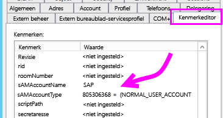
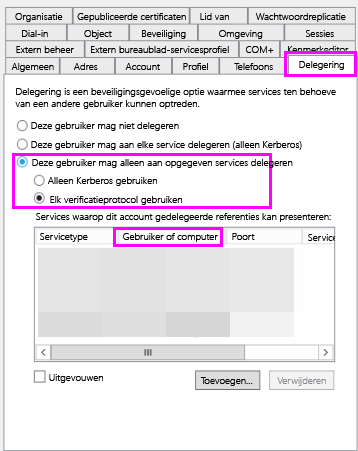
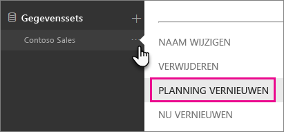

# <a name="troubleshoot-gateways---power-bi"></a>Problemen met gateways oplossen - Power BI

[!INCLUDE [gateway-rewrite](../includes/gateway-rewrite.md)]

In dit artikel worden enkele veelvoorkomende problemen besproken bij het gebruik van de on-premises gegevensgateway met Power BI. Als u een probleem ondervindt dat hier niet wordt vermeld, kunt u de site van de Power BI-[community](https://community.powerbi.com) gebruiken. U kunt ook een [ondersteuningsticket](https://powerbi.microsoft.com/support) maken.

## <a name="configuration"></a>Configuratie

### <a name="error-power-bi-service-reported-local-gateway-as-unreachable-restart-the-gateway-and-try-again"></a>Fout: De Power BI-service rapporteert dat de lokale gateway niet bereikbaar is. Start de gateway opnieuw en probeer het opnieuw.

Aan het einde van de configuratie wordt de Power BI-service opnieuw aangeroepen om de gateway te valideren. De Power BI-service rapporteert niet dat de gateway live is. De communicatie slaagt mogelijk wel als u de Windows-service opnieuw start. Voor meer informatie kunt u de logboeken verzamelen en bekijken, zoals beschreven in [Logboeken van de on-premises gegevensgateway-app verzamelen](/data-integration/gateway/service-gateway-tshoot#collect-logs-from-the-on-premises-data-gateway-app).

## <a name="data-sources"></a>Gegevensbronnen

### <a name="error-unable-to-connect-details-invalid-connection-credentials"></a>Fout: Kan geen verbinding maken. Details: 'Ongeldige verbindingsreferenties'

Onder **Details weergeven** wordt het foutbericht weergegeven dat van de gegevensbron is ontvangen. Voor SQL Server ziet dit er ongeveer als volgt uit:

    Login failed for user 'username'.

Controleer of u de juiste gebruikersnaam en het juiste wachtwoord gebruikt. Controleer ook of deze referenties verbinding kunnen maken met de gegevensbron. Zorg ervoor dat het gebruikte account overeenkomt met de verificatiemethode.

### <a name="error-unable-to-connect-details-cannot-connect-to-the-database"></a>Fout: Kan geen verbinding maken. Details: 'Kan geen verbinding maken met de database'

Er kan wel verbinding worden gemaakt met de server, maar niet met de opgegeven database. Controleer de naam van de database en of de gebruikersreferenties de juiste machtigingen hebben voor toegang tot deze database.

Onder **Details weergeven** wordt het foutbericht weergegeven dat van de gegevensbron is ontvangen. Voor SQL Server ziet dit er ongeveer als volgt uit:

    Cannot open database "AdventureWorks" requested by the login. The login failed. Login failed for user 'username'.

### <a name="error-unable-to-connect-details-unknown-error-in-data-gateway"></a>Fout: Kan geen verbinding maken. Details: 'Onbekende fout in de gegevensgateway'

Deze fout kan verschillende oorzaken hebben. Controleer of u verbinding kunt maken met de gegevensbron vanaf de computer die als host fungeert voor de gateway. Deze situatie kan voorkomen wanneer de server niet toegankelijk is.

Onder **Details weergeven** ziet u de foutcode **DM_GWPipeline_UnknownError**.

U kunt ook **Gebeurtenislogboeken** > **Logboeken Toepassingen en Services** > **On-premises gegevensgateway-service** raadplegen voor meer informatie.

### <a name="error-we-encountered-an-error-while-trying-to-connect-to-server-details-we-reached-the-data-gateway-but-the-gateway-cant-access-the-on-premises-data-source"></a>Fout: Er is een fout opgetreden tijdens het verbinden met de \<server\>. Details: 'Er is contact gemaakt met de gegevensgateway, maar de gateway heeft geen toegang tot de on-premises gegevensbron.'

Er kan geen verbinding worden gemaakt met de opgegeven gegevensbron. Controleer de informatie die is opgegeven voor de gegevensbron.

Onder **Details weergeven** ziet u de foutcode **DM_GWPipeline_Gateway_DataSourceAccessError**.

Als het onderliggende foutbericht op de volgende melding lijkt, betekent dit dat het account dat u voor de gegevensbron gebruikt geen serverbeheerder is voor het betreffende Analysis Services-exemplaar. Zie [Grant server admin rights to an Analysis Services instance](https://docs.microsoft.com/sql/analysis-services/instances/grant-server-admin-rights-to-an-analysis-services-instance) (Serverbeheerdersrechten aan een Analysis Services-exemplaar verlenen) voor meer informatie.

    The 'CONTOSO\account' value of the 'EffectiveUserName' XML for Analysis property is not valid.

Als het onderliggende foutbericht op de volgende melding lijkt, kan dit betekenen dat het directorykenmerk [token-groups-global-and-universal](/windows/win32/adschema/a-tokengroupsglobalanduniversal) (TGGAU) ontbreekt voor het serviceaccount voor Analysis Services.

    The username or password is incorrect.

Het TGGAU-kenmerk is ingeschakeld voor domeinen met toegang die compatibel is met oudere versies dan Windows 2000. Voor de meeste nieuw gemaakte domeinen is dit kenmerk niet standaard ingeschakeld. Zie [Sommige toepassingen en API's moeten toegang hebben tot de gegevens op account-objecten](https://support.microsoft.com/kb/331951) voor meer informatie.

Voer de volgende stappen uit om te controleren of het kenmerk is ingeschakeld.

1. Maak verbinding met de Analysis Services-computer in SQL Server Management Studio. Neem in de geavanceerde verbindingseigenschappen EffectiveUserName op voor de betrokken gebruiker en kijk of de fout nog steeds optreedt.
2. U kunt het Active Directory-hulpprogramma dsacls gebruiken om te controleren of het kenmerk wordt weergegeven. Dit hulpprogramma bevindt zich op een domeincontroller. U moet weten wat de onderscheidende domeinnaam voor het account is en die naam aan het hulpprogramma doorgeven.

        dsacls "CN=John Doe,CN=UserAccounts,DC=contoso,DC=com"

    Het resultaat zou op het volgende moeten lijken:

            Allow BUILTIN\Windows Authorization Access Group
                                          SPECIAL ACCESS for tokenGroupsGlobalAndUniversal
                                          READ PROPERTY

Als u dit probleem wilt oplossen, moet u TGGAU inschakelen voor het account dat wordt gebruikt voor de Windows-service Analysis Services.

#### <a name="another-possibility-for-the-username-or-password-is-incorrect"></a>Een andere mogelijkheid voor 'De gebruikersnaam of het wachtwoord is onjuist'.

Deze fout kan ook optreden als de Analysis Services-server zich in een ander domein bevindt dan de gebruikers en er geen wederzijdse vertrouwensrelatie tot stand is gebracht.

Vraag uw domeinbeheerders om hulp bij het controleren van de vertrouwensrelatie tussen domeinen.

#### <a name="unable-to-see-the-data-gateway-data-sources-in-the-get-data-experience-for-analysis-services-from-the-power-bi-service"></a>Kan de gegevensbronnen van de gegevensgateway niet zien via de Analysis Services-functie 'Gegevens ophalen' van de Power BI-service

Zorg ervoor dat uw account wordt vermeld op het tabblad **Gebruikers** van de gegevensbron in de configuratie van de gateway. Als u geen toegang tot de gateway hebt, neemt u contact op met de beheerder van de gateway en vraagt u deze de informatie te controleren. Alleen op accounts die zijn opgenomen in de lijst met **Gebruikers** is de gegevensbron te zien die wordt weergegeven in de Analysis Services-lijst.

### <a name="error-you-dont-have-any-gateway-installed-or-configured-for-the-data-sources-in-this-dataset"></a>Fout: U hebt geen gateway geïnstalleerd of geconfigureerd voor de gegevensbronnen in deze gegevensset.

Zorg ervoor dat u een of meer gegevensbronnen hebt toegevoegd aan de gateway, zoals beschreven in [Een gegevensbron toevoegen](service-gateway-data-sources.md#add-a-data-source). Als de gateway niet wordt weergegeven in de beheerportal onder **Gateways beheren**, maakt u de browsercache leeg of meldt u zich af en weer aan bij de service.

## <a name="datasets"></a>Gegevenssets

### <a name="error-there-is-not-enough-space-for-this-row"></a>Fout: Er is onvoldoende ruimte voor deze rij.

Deze fout treedt alleen op als een enkele rij groter is dan 4 MB. Bepaal om welke rij uit de gegevensbron het gaat en filter de rij weg of maak deze kleiner.

### <a name="error-the-server-name-provided-doesnt-match-the-server-name-on-the-sql-server-ssl-certificate"></a>Fout: De opgegeven servernaam komt niet overeen met de servernaam op het SSL-certificaat van SQL Server.

Deze fout kan optreden wanneer de algemene naam voor het certificaat voor de servers een FQDN (Fully Qualified Domain Name) is, maar u alleen de NetBIOS-naam voor de server hebt opgegeven. Hierdoor komt de servernaam niet overeen met het certificaat. Om dit probleem op te lossen moet u de servernaam in de gegevensbron van de gateway en in het PBIX-bestand instellen op de FQDN van de server.

### <a name="error-you-dont-see-the-on-premises-data-gateway-present-when-you-configure-scheduled-refresh"></a>Fout: U ziet de on-premises gegevensgateway niet bij het configureren van een geplande vernieuwing.

Enkele andere scenario's kunnen deze fout veroorzaken:

- De server- en databasenaam komen niet overeen met wat is ingevoerd in Power BI Desktop en de geconfigureerde gegevensbron voor de gateway. Deze namen moeten hetzelfde zijn. De waarden zijn niet hoofdlettergevoelig.
- Uw account wordt niet vermeld op het tabblad **Gebruikers** van de gegevensbron in de configuratie van de gateway. De beheerder van de gateway moet u aan deze lijst toevoegen.
- Uw Power BI Desktop-bestand bevat meerdere gegevensbronnen en niet al deze gegevensbronnen zijn geconfigureerd bij de gateway. U moet elke gegevensbron bij de gateway definiëren als u wilt dat de gateway wordt weergegeven voor geplande vernieuwing.

### <a name="error-the-received-uncompressed-data-on-the-gateway-client-has-exceeded-the-limit"></a>Fout: De niet-gecomprimeerde gegevens die door de gatewayclient zijn ontvangen, hebben de limiet overschreden.

De exacte beperking is 10 GB aan niet-gecomprimeerde gegevens per tabel. Als dit probleem optreedt, zijn er goede mogelijkheden om uw gegevens te optimaliseren en het probleem te voorkomen. U kunt met name het gebruik van zeer constante, lange tekenreekswaarden beperken en in plaats daarvan een genormaliseerde sleutel gebruiken. Of u kunt de kolom verwijderen als deze niet in gebruik is.

## <a name="reports"></a>Rapporten

### <a name="error-report-could-not-access-the-data-source-because-you-do-not-have-access-to-our-data-source-via-an-on-premises-data-gateway"></a>Fout: Rapport heeft geen toegang tot de gegevensbron omdat u geen toegang tot onze gegevensbron hebt via een on-premises gegevensgateway.

Deze fout wordt meestal veroorzaakt door een van de volgende zaken:

- De informatie van de gegevensbron komt niet overeen met wat er in de onderliggende gegevensset aanwezig is. De server- en databasenaam die in de on-premises gegevensgateway zijn opgegeven voor de gegevensbron, moeten overeenkomen met wat u hebt opgegeven in Power BI Desktop. Als u in Power BI Desktop een IP-adres gebruikt, moet de gegevensbron voor de on-premises gegevensgateway ook een IP-adres gebruiken.
- Er is op geen enkele gateway binnen uw organisatie een gegevensbron beschikbaar. U kunt de gegevensbron configureren op een nieuwe of bestaande on-premises gegevensgateway.

### <a name="error-data-source-access-error-please-contact-the-gateway-administrator"></a>Fout: Fout met toegang tot de gegevensbron. Neem contact op met de gatewaybeheerder.

Als dit rapport gebruikmaakt van een live-Analysis Services-verbinding, treedt er mogelijk een probleem op waarbij er een waarde aan EffectiveUserName wordt doorgegeven die niet geldig is of die geen machtigingen heeft op de Analysis Services-computer. Een verificatieprobleem wordt doorgaans veroorzaakt doordat de waarde die voor EffectiveUserName wordt doorgegeven, niet overeenkomt met een lokale User Principal Name (UPN).

Voer de volgende stappen uit om de effectieve gebruikersnaam te bevestigen.

1. U vindt de effectieve gebruikersnaam in de [gatewaylogboeken](/data-integration/gateway/service-gateway-tshoot#collect-logs-from-the-on-premises-data-gateway-app).
2. Wanneer u de waarde hebt achterhaald die wordt doorgegeven, controleert u of deze juist is. Als dit uw gebruiker is, kunt u de volgende opdracht uitvoeren vanaf de opdrachtprompt om de UPN te zien. De UPN ziet eruit als een e-mailadres.

        whoami /upn

Eventueel kunt u nagaan wat Power BI ophaalt uit Azure Active Directory.

1. Blader naar [https://developer.microsoft.com/graph/graph-explorer](https://developer.microsoft.com/graph/graph-explorer).
2. Selecteer in de rechterbovenhoek **Aanmelden**.
3. Voer de volgende query uit. Er wordt nu een vrij groot JSON-antwoord weergegeven.

        https://graph.windows.net/me?api-version=1.5
4. Zoek hierin naar **UserPrincipalName**.

Als uw Azure Active Directory-UPN niet overeenkomt met uw lokale Active Directory-UPN, kunt u de functie [Gebruikersnamen toewijzen](service-gateway-enterprise-manage-ssas.md#map-user-names-for-analysis-services-data-sources) gebruiken om deze te vervangen door een geldige waarde. U kunt ook contact opnemen met uw tenantbeheerder of lokale Active Directory Domain Services-beheerder om uw UPN te wijzigen.

## <a name="kerberos"></a>Kerberos

Als de onderliggende databaseserver en on-premises gegevensgateway niet op de juiste wijze zijn geconfigureerd voor [beperkte Kerberos-delegatie](service-gateway-sso-kerberos.md), schakelt u [uitgebreide logboekregistratie](/data-integration/gateway/service-gateway-performance#slow-performing-queries) in op de gateway. Doe vervolgens op basis van de fouten of traceringen in de logboekbestanden van de gateway onderzoek om problemen op te lossen. Zie [Logboeken van de on-premises gegevens gateway-app verzamelen](/data-integration/gateway/service-gateway-tshoot#collect-logs-from-the-on-premises-data-gateway-app) hoe u de gatewaylogboeken verzamelt voor weergave.

### <a name="impersonationlevel"></a>ImpersonationLevel (imitatieniveau)

Het ImpersonationLevel (imitatieniveau) is gerelateerd aan de installatie van de SPN of de lokale beleidsinstelling.

```
[DataMovement.PipeLine.GatewayDataAccess] About to impersonate user DOMAIN\User (IsAuthenticated: True, ImpersonationLevel: Identification)
```

**Oplossing**

Volg deze stappen om het probleem op te lossen.

1. Stel een SPN in voor de on-premises gateway.
2. Stel beperkte delegatie in uw Active Directory Domain Services in.

### <a name="failedtoimpersonateuserexception-failed-to-create-windows-identity-for-user-userid"></a>FailedToImpersonateUserException: Kan geen Windows-identiteit maken voor userid van gebruiker

FailedToImpersonateUserException doet zich voor als u niet kunt imiteren namens een andere gebruiker. Deze fout kan ook optreden als het account dat u probeert te imiteren uit een ander domein komt dan het domein waarop de gatewayservice zich bevindt. Dit is een beperking.

**Oplossing**

* Controleer of de configuratie klopt volgens de stappen in de vorige sectie ImpersonationLevel.
* Zorg ervoor dat de gebruikers-id die wordt geïmiteerd een geldig Active Directory Domain Services-account is.

### <a name="general-error-1033-error-while-you-parse-the-protocol"></a>Algemene fout: Fout 1033 tijdens het parseren van het protocol

Fout 1033 wordt weergegeven wanneer uw externe id die is geconfigureerd in SAP HANA niet overeenkomt met de aanmelding, als de gebruiker wordt geïmiteerd met behulp van de UPN (alias@domain.com). In de logboeken ziet u bovenaan dat de oorspronkelijke UPN alias@domain.com is vervangen door een nieuwe UPN alias@domain.com, zoals hier wordt weergegeven:

```
[DM.GatewayCore] SingleSignOn Required. Original UPN 'alias@domain.com' replaced with new UPN 'alias@domain.com.'
```

**Oplossing**

* Voor SAP HANA is vereist dat de geïmiteerde gebruiker het kenmerk sAMAccountName in Active Directory Domain Services (gebruikersalias) gebruikt. Als dit kenmerk niet juist is, ziet u de fout 1033.

    

* In de logboeken ziet u de sAMAccountName (alias) en niet de UPN. Dit is de alias die wordt gevolgd door het domein (alias@doimain.com).

    

```xml
      <setting name="ADUserNameReplacementProperty" serializeAs="String">
        <value>sAMAccount</value>
      </setting>
      <setting name="ADServerPath" serializeAs="String">
        <value />
      </setting>
      <setting name="CustomASDataSource" serializeAs="String">
        <value />
      </setting>
      <setting name="ADUserNameLookupProperty" serializeAs="String">
        <value>AADEmail</value>
```

### <a name="sap-aglibodbchdb-dllhdbodbc-communication-link-failure-10709-connection-failed-rte-1-kerberos-error-major-miscellaneous-failure-851968-minor-no-credentials-are-available-in-the-security-package"></a>[SAP AG][LIBODBCHDB DLL][HDBODBC] Fout communicatiekoppeling:-10709 Kan geen verbinding maken (RTE:[-1] Kerberos-fout. Primair: 'Overige fout [851968].' Secundair: 'Er zijn geen referenties beschikbaar in het beveiligingspakket.'

Het foutbericht '-10709 Kan geen verbinding maken' wordt weergegeven als de delegatie niet juist is geconfigureerd in Active Directory Domain Services.

**Oplossing**

* Zorg ervoor dat de SAP Hana-server zich bevindt op het tabblad Delegatie in Active Directory Domain Services voor het gatewayserviceaccount.

   

## <a name="refresh-history"></a>Geschiedenis vernieuwen

Wanneer u de gateway gebruikt voor een geplande vernieuwing, kunt u met de **geschiedenis van het vernieuwen** zien welke fouten zijn opgetreden. Deze kan ook nuttige gegevens bieden als u een ondersteuningsaanvraag wilt maken. U kunt geplande vernieuwingen en vernieuwingen op aanvraag bekijken. In de volgende stappen ziet u hoe u de geschiedenis van het vernieuwen kunt ophalen.

1. Ga in het Power BI-navigatievenster naar **Gegevenssets** en selecteer een gegevensset. Open het menu en selecteer **Vernieuwen plannen**.

    

2. Selecteer in het venster **Instellingen voor...** &gt; **Vernieuwen plannen** en selecteer **Geschiedenis vernieuwen**.

    

    

Zie [Problemen met vernieuwingsscenario's oplossen](refresh-troubleshooting-refresh-scenarios.md) voor meer informatie over het oplossen van fouten bij vernieuwingen.

## <a name="fiddler-trace"></a>Traceren met Fiddler

[Fiddler](https://www.telerik.com/fiddler) is een gratis hulpprogramma van Telerik dat HTTP-verkeer controleert. U kunt hiermee het verkeer tussen de Power BI-service en de clientcomputer bekijken. Deze verkeerslijst kan fouten en aanverwante informatie bevatten.


## <a name="next-steps"></a>Volgende stappen

* [Problemen met de on-premises gegevensgateway oplossen](/data-integration/gateway/service-gateway-tshoot)
* [Proxyinstellingen configureren voor de on-premises gegevensgateway](/data-integration/gateway/service-gateway-proxy)  
* [Manage your data source - Analysis Services](service-gateway-enterprise-manage-ssas.md) (Uw gegevensbron beheren - Analysis Services)  
* [Manage your data source - SAP HANA](service-gateway-enterprise-manage-sap.md) (Uw gegevensbron beheren - SAP HANA)  
* [Manage your data source - SQL Server](service-gateway-enterprise-manage-sql.md) (Uw gegevensbron beheren - SQL Server)  
* [Uw gegevensbron beheren - importeren/geplande vernieuwing](service-gateway-enterprise-manage-scheduled-refresh.md)  

Hebt u nog vragen? Misschien dat de [Power BI-community](https://community.powerbi.com/) het antwoord weet.
