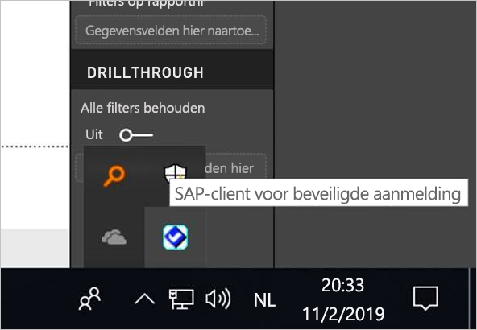
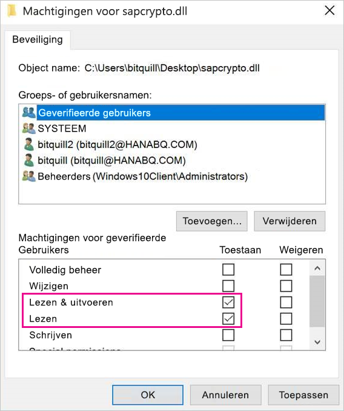
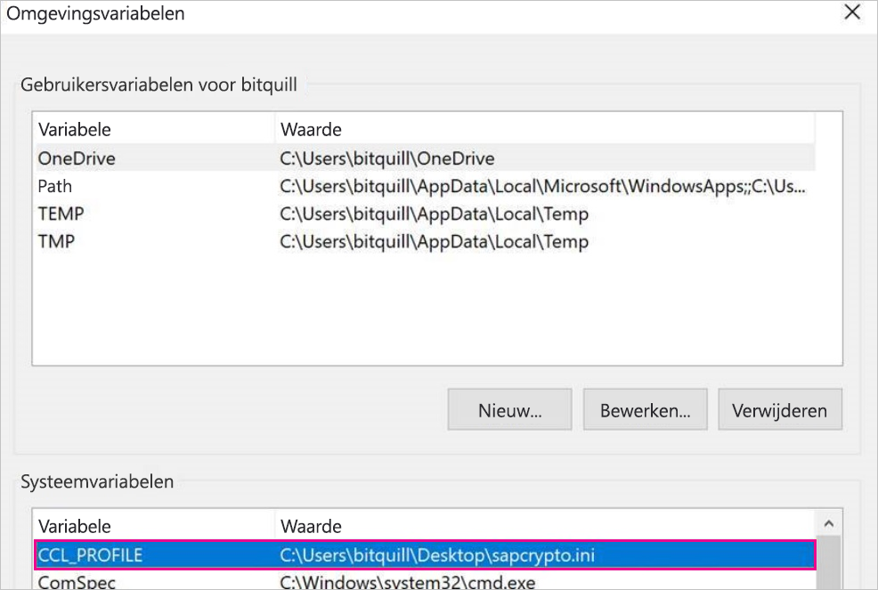
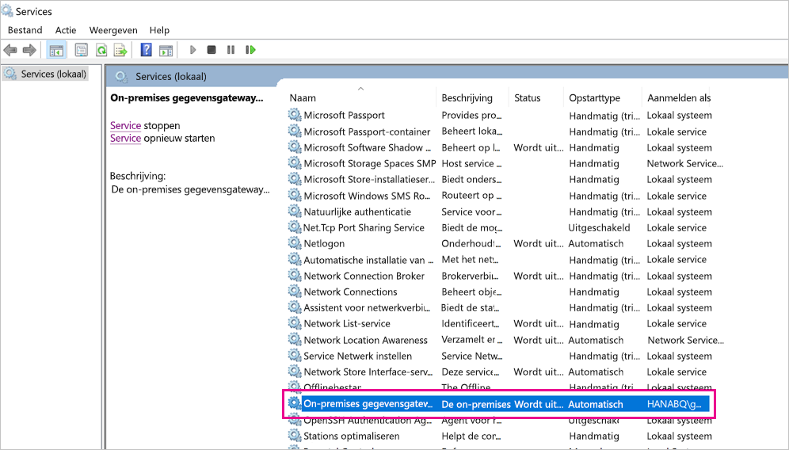
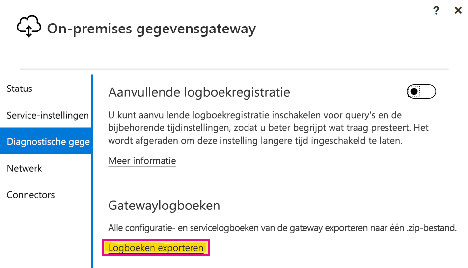
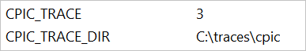

# <a name="use-kerberos-single-sign-on-for-sso-to-sap-bw-using-commoncryptolib-sapcryptodll"></a>Eenmalige aanmelding van Kerberos gebruiken voor SSO in SAP BW met CommonCryptoLib (sapcrypto.dll)

In dit artikel wordt beschreven hoe u uw SAP BW-gegevensbron configureert voor het gebruik van SSO vanuit de Power BI-service door CommonCryptoLib (sapcrypto.dll) te gebruiken.

> [!NOTE]
> Volg de stappen in dit artikel en in [Kerberos SSO configureren](service-gateway-sso-kerberos.md) voordat u probeert een op SAP BW gebaseerd rapport dat gebruikmaakt van Kerberos SSO te vernieuwen. Als u CommonCryptoLib gebruikt als uw SNC-bibliotheek zijn SSO-verbindingen voor zowel SAP BW-toepassingsservers als SAP BW-berichtenservers mogelijk.

## <a name="configure-sap-bw-to-enable-sso-using-commoncryptolib"></a>SAP BW configureren om SSO met behulp van CommonCryptoLib in te schakelen

> [!NOTE]
> De on-premises gegevensgateway is 64-bits software en heeft daarom de 64-bits versie van CommonCryptoLib (sapcrypto.dll) nodig om BW SSO uit te voeren. Als u de SSO-verbinding naar uw SAP BW-server in SAP GUI wilt testen voordat u een SSO-verbinding test via de gateway (aanbevolen) hebt u ook de 32-bits versie van CommonCryptoLib nodig, aangezien SAP GUI 32-bits software is.

1. Zorg ervoor dat uw BW-server op de juiste manier is geconfigureerd voor Kerberos-SSO met CommonCryptoLib. Als dat het geval is, kunt u SSO gebruiken voor toegang tot uw BW-server (rechtstreeks of via een SAP BW-berichtenserver) met een SAP-hulpprogramma als SAP GUI, dat is geconfigureerd om gebruik te maken van CommonCryptoLib. 

   Zie voor meer informatie over de installatiestappen [Eenmalige aanmelding van SAP: verificatie met Kerberos/SPNEGO](https://blogs.sap.com/2017/07/27/sap-single-sign-on-authenticate-with-kerberosspnego/). De BW-server moet CommonCryptoLib gebruiken als SNC-bibliotheek. De server moet een SNC-naam hebben die begint met *CN=* , zoals *CN=BW1*. Raadpleeg [SNC-parameters voor Kerberos-configuratie](https://help.sap.com/viewer/df185fd53bb645b1bd99284ee4e4a750/3.0/360534094511490d91b9589d20abb49a.html) voor meer informatie over vereisten voor SNC-namen (in het bijzonder de parameter snc/identity/as).

1. Als u dit nog niet hebt gedaan, installeert u nu de 64-bitsversie van de [SAP .NET Connector](https://support.sap.com/en/product/connectors/msnet.html) op de computer waarop de gateway is geïnstalleerd. 
   
   U kunt controleren of het onderdeel is geïnstalleerd door verbinding te maken met uw BW-server in Power BI Desktop vanuit de gatewaycomputer. Als u geen verbinding kunt maken met behulp van de 2.0-implementatie, is de .NET Connector niet geïnstalleerd of is deze niet geïnstalleerd in de GAC.

1. Zorg ervoor dat SAP Secure Login Client (SLC) niet wordt uitgevoerd op de computer waarop de gateway is geïnstalleerd. 

   Via SLC worden Kerberos-tickets zodanig in de cache geplaatst dat dit invloed kan hebben op het vermogen van de gateway om Kerberos voor SSO te gebruiken. 

1. Als SLC is geïnstalleerd, moet u dit verwijderen of de SAP-client voor beveiligde aanmelding afsluiten. Klik met de rechtermuisknop op het pictogram in het systeemvak en selecteer **Afmelden** en **Afsluiten** voordat u een SSO-verbinding probeert te maken met behulp van de gateway. 

   SLC wordt niet ondersteund voor gebruik op Windows Server-computers. Zie [SAP-notitie 2780475](https://launchpad.support.sap.com/#/notes/2780475) (s-gebruiker vereist) voor meer informatie.

   

1. Als u SLC verwijdert of **Afmelden** en **Afsluiten** selecteert, opent u een cmd-venster en voert u `klist purge` in om alle in cache opgeslagen Kerberos-tickets te wissen voordat u probeert een SSO-verbinding tot stand te brengen via de gateway.

1. Download de 64-bits CommonCryptoLib (sapcrypto.dll) versie *8.5.25 of hoger* via het SAP Launchpad en kopieer deze versie naar een map op uw gatewaycomputer. In dezelfde map waarnaar u sapcrypto.dll hebt gekopieerd, maakt u een bestand met de naam sapcrypto.ini, met de volgende inhoud:

    ```
    ccl/snc/enable_kerberos_in_client_role = 1
    ```

    Het .ini-bestand bevat configuratie-informatie die voor CommonCryptoLib vereist is om SSO in te schakelen in het gatewayscenario.

    > [!NOTE]
    > Deze bestanden moeten worden opgeslagen op dezelfde locatie; met andere woorden: _/pad/naar/sapcrypto/_ moet zowel sapcrypto.ini als sapcrypto.dll bevatten.

    Zowel de gatewayservicegebruiker als de Active Directory-gebruiker (AD) die door de servicegebruiker wordt geïmiteerd, hebben lees- en uitvoermachtigingen nodig voor beide bestanden. U wordt aangeraden machtigingen voor zowel het .ini- als het .dll-bestand toe te wijzen aan de geverifieerde gebruikersgroep. Voor testdoeleinden kunt u deze machtigingen ook expliciet toewijzen aan zowel de gatewayservicegebruiker als de Active Directory-gebruiker die u gebruikt voor tests. In de volgende schermopname zijn aan de geverifieerde gebruikersgroep **lees- &amp; uitvoer**machtigingen voor sapcrypto.dll toegewezen:

    

1. Als u nog geen SAP BW-gegevensbron hebt gekoppeld aan de gateway waar u de SSO-verbinding doorheen wilt laten lopen, voegt u er een toe op de pagina **Manage gateways** in de Power BI-service. Als u al zo'n gegevensbron hebt, kunt u deze bewerken: 
    - Kies **SAP Business Warehouse** voor het **type gegevensbron** als u een SSO-verbinding met een BW-toepassingsserver wilt maken. 
    - Selecteer **SAP Business Warehouse-berichtenserver** als u een SSO-verbinding met een BW-berichtenserver wilt maken.

1. Voor **SNC-bibliotheek** selecteert u de omgevingsvariabele **SNC\_LIB** of **SNC\_LIB\_64** of **Aangepast**. 

   - Als u de optie **SNC\_LIB** selecteert, moet u de waarde van de omgevingsvariabele **SNC\_LIB\_64** op de gatewaycomputer instellen op het absolute pad van de 64-bits kopie van sapcrypto.dll op de gatewaycomputer. Bijvoorbeeld *C:\Users\Test\Desktop\sapcrypto.dll*.

   - Als u **Aangepast** kiest, plakt u het absolute pad naar *sapcrypto.dll* in het veld Pad naar aangepaste SNC-bibliotheek dat op de pagina **Gateways beheren** wordt weergegeven. 

1. Voor de SNC-naam van de BW-server in als **SNC-partnernaam**. Zorg er onder **Geavanceerde instellingen** voor dat **Eenmalige aanmelding via Kerberos gebruiken voor DirectQuery-query's** is aangevinkt. Vul de overige velden in alsof u een Windows-verificatieverbinding vanuit Power BI Desktop maakt.

1. Maak een omgevingsvariabele voor het **CCL\_PROFILE**-systeem en stel de waarde in op het pad naar sapcrypto.ini.

    

    De bestanden sapcrypto.dll en sapcrypto.ini moeten zich op dezelfde locatie bevinden. In het bovenstaande voorbeeld bevinden sapcrypto.ini en sapcrypto.dll zich beide op het bureaublad.

1. Start de gatewayservice opnieuw op.

    

1. [Een Power BI-rapport uitvoeren](service-gateway-sso-kerberos.md#run-a-power-bi-report)

## <a name="troubleshooting"></a>Problemen oplossen

Als u het rapport niet kunt vernieuwen in de Power BI-service, kunt u gatewaytracering, CPIC-tracering en CommonCryptoLib-tracering gebruiken om het probleem te diagnosticeren. Aangezien CPIC-tracering en CommonCryptoLib SAP-producten zijn, kan Microsoft hiervoor geen ondersteuning bieden.

### <a name="gateway-logs"></a>Gatewaylogboeken

1. Reproduceer het probleem.

2. Open de [gateway-app](/data-integration/gateway/service-gateway-app) en selecteer **Logboeken exporteren** op het tabblad **Diagnostische gegevens**.

      

### <a name="cpic-tracing"></a>CPIC-tracering

1. Als u CPIC-tracering wilt inschakelen, moet u twee omgevingsvariabelen instellen: **CPIC\_TRACE** en **CPIC\_TRACE\_DIR**. 

   Met de eerste variabele wordt het traceringsniveau ingesteld, met de tweede variabele wordt de bestandsmap voor tracering ingesteld. De map moet een locatie zijn waarnaar leden van de geverifieerde gebruikersgroep kunnen schrijven. 
 
2. Stel **CPIC\_TRACE** in op *3* en **CPIC\_TRACE\_DIR** op de map waarnaar u de traceringsbestanden wilt schrijven. Bijvoorbeeld:

   

3. Reproduceer het probleem en controleer of **CPIC\_TRACE\_DIR** traceringsbestanden bevat.
 
    Met CPIC-tracering kunnen problemen van een hoger niveau worden vastgesteld, zoals een fout bij het laden van de sapcrypto.dll- bibliotheek. Dit is bijvoorbeeld een fragment van een CPIC-traceringsbestand waarin een laadfout met het .dll-bestand is opgetreden:

    ```
    [Thr 7228] *** ERROR => DlLoadLib()==DLENOACCESS - LoadLibrary("C:\Users\test\Desktop\sapcrypto.dll")
    Error 5 = "Access is denied." [dlnt.c       255]
    ```

    Als een dergelijke fout optreedt, maar u de machtigingen voor lezen en uitvoeren in sapcrypto.dll en sapcrypto.ini hebt ingesteld zoals beschreven in [de sectie hierboven](#configure-sap-bw-to-enable-sso-using-commoncryptolib), stelt u dezelfde voor machtigingen voor lezen en uitvoeren in als die voor de map die de bestanden bevat.

    Als u het .dll-bestand nog steeds niet kunt laden, schakelt u [controleren voor het bestand](/windows/security/threat-protection/auditing/apply-a-basic-audit-policy-on-a-file-or-folder) in. Als u de resulterende auditlogboeken bekijkt in de Logboeken van Windows, kan dit u helpen vast te stellen waarom het laden van het bestand mislukt. Zoek naar een foutvermelding die is geïnitieerd door de geïmiteerde Active Directory-gebruiker. Voor de geïmiteerde gebruiker `MYDOMAIN\mytestuser` ziet een fout in het auditlogboek er bijvoorbeeld ongeveer als volgt uit:

    ```
    A handle to an object was requested.

    Subject:
        Security ID:        MYDOMAIN\mytestuser
        Account Name:       mytestuser
        Account Domain:     MYDOMAIN
        Logon ID:       0xCF23A8

    Object:
        Object Server:      Security
        Object Type:        File
        Object Name:        <path information>\sapcrypto.dll
        Handle ID:      0x0
        Resource Attributes:    -

    Process Information:
        Process ID:     0x2b4c
        Process Name:       C:\Program Files\On-premises data gateway\Microsoft.Mashup.Container.NetFX45.exe

    Access Request Information:
        Transaction ID:     {00000000-0000-0000-0000-000000000000}
        Accesses:       ReadAttributes
                
    Access Reasons:     ReadAttributes: Not granted
                
    Access Mask:        0x80
    Privileges Used for Access Check:   -
    Restricted SID Count:   0
    ```

### <a name="commoncryptolib-tracing"></a>CommonCryptoLib-tracering 

1. Schakel CommonCryptoLib-tracering in door deze regels toe te voegen aan het sapcrypto.ini-bestand dat u eerder hebt gemaakt:

    ```
    ccl/trace/level=5
    ccl/trace/directory=<drive>:\logs\sectrace
    ```

2. Wijzig de optie `ccl/trace/directory` in op een locatie waarnaar leden van de geverifieerde gebruikersgroep kunnen schrijven. 

3. Een andere mogelijkheid is een nieuw .ini-bestand maken om dit gedrag te veranderen. In dezelfde map als sapcrypto.ini en sapcrypto.dll maakt u een bestand met de naam sectrace.ini, met de volgende inhoud. Vervang de optie `DIRECTORY` door een locatie op uw computer waarnaar leden van de groep Geverifieerde gebruikers kunnen schrijven:

    ```
    LEVEL = 5
    DIRECTORY = <drive>:\logs\sectrace
    ```

4. Reproduceer het probleem en controleer of de locatie waarnaar **MAP** verwijst de traceringsbestanden bevat. 

5. Schakel CPIC- en CCL-tracering uit wanneer u klaar bent.

    Zie [SAP-notitie 2491573](https://launchpad.support.sap.com/#/notes/2491573) (SAP s-gebruiker vereist) voor meer informatie over CommonCryptoLib-tracering.

## <a name="next-steps"></a>Volgende stappen

Raadpleeg de volgende bronnen voor meer informatie over de on-premises gegevensgateway en DirectQuery:

* [Wat is een on-premises gegevensgateway?](/data-integration/gateway/service-gateway-onprem)
* [DirectQuery in Power BI](desktop-directquery-about.md)
* [Data sources supported by DirectQuery](power-bi-data-sources.md) (Gegevensbronnen die worden ondersteund door DirectQuery)
* [DirectQuery en SAP BW](desktop-directquery-sap-bw.md)
* [DirectQuery en SAP HANA](desktop-directquery-sap-hana.md)