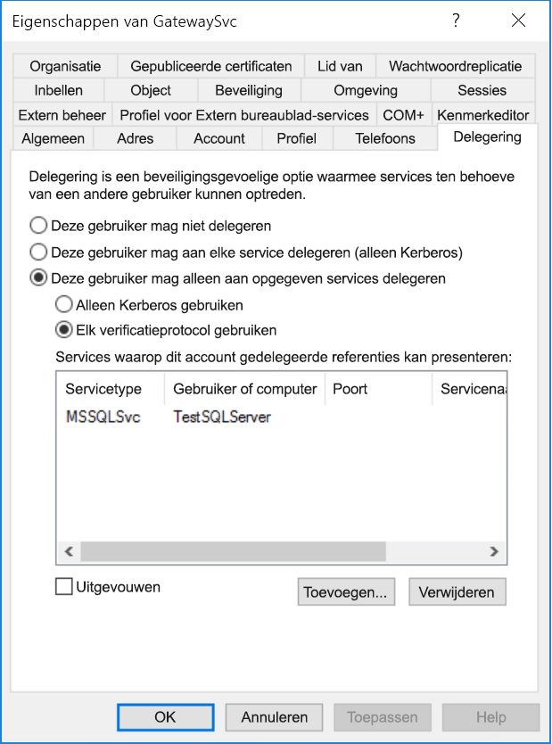
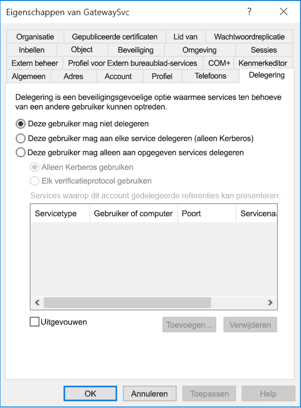
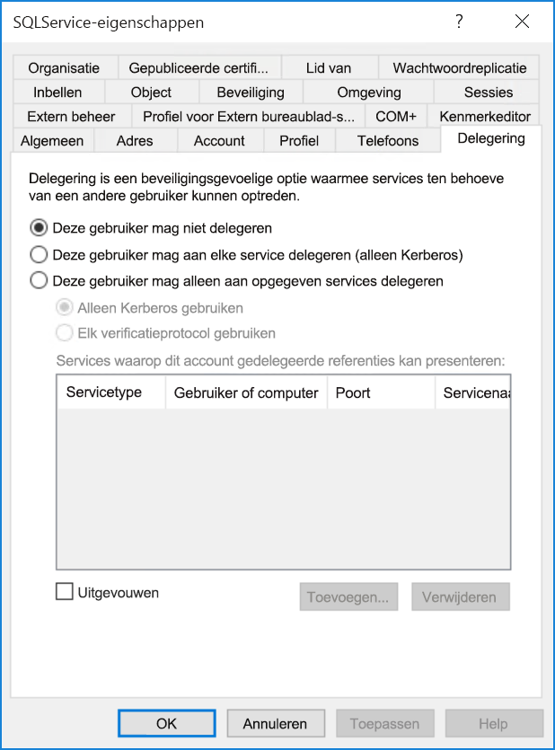
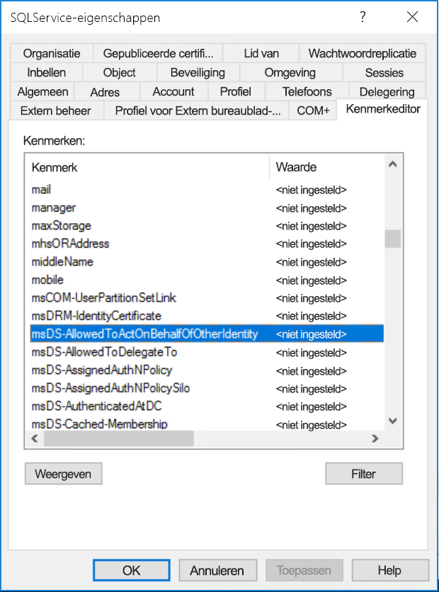
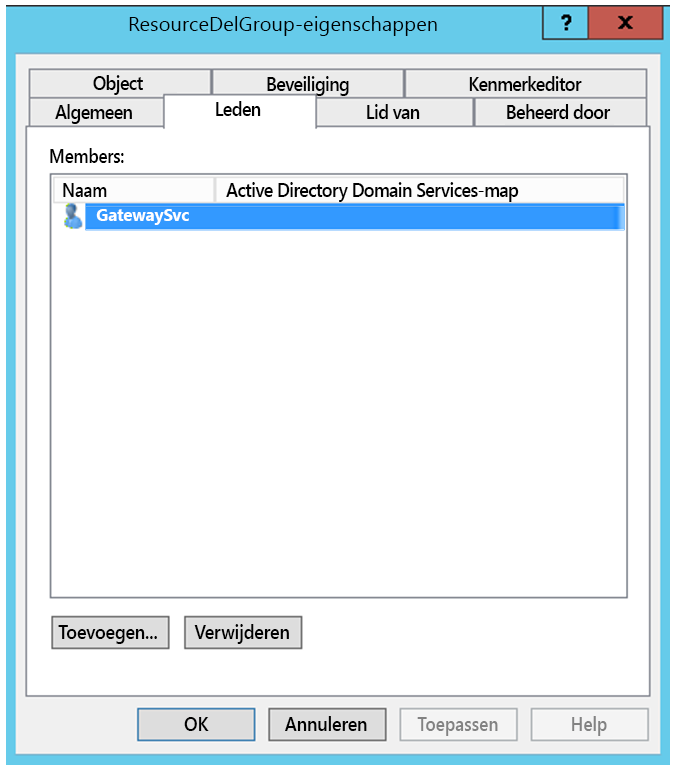
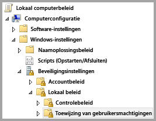
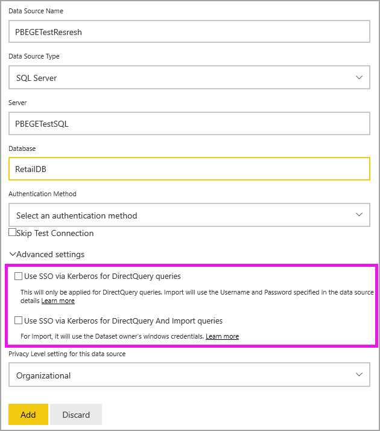

# <a name="configure-kerberos-based-sso-from-power-bi-service-to-on-premises-data-sources"></a>SSO met Kerberos vanuit Power BI-service naar on-premises gegevensbronnen configureren

Met inschakeling van SSO is het eenvoudiger om gegevens van on-premises gegevensbronnen te vernieuwen in Power BI-rapporten en -dashboards, terwijl machtigingen van het gebruikersniveau die op deze gegevensbronnen zijn geconfigureerd, worden gehandhaafd. Gebruik [beperkte Kerberos-delegering](/windows-server/security/kerberos/kerberos-constrained-delegation-overview) om naadloze connectiviteit via SSO mogelijk te maken. 

## <a name="prerequisites"></a>Vereisten

Er moeten verschillende items worden geconfigureerd om ervoor te zorgen dat beperkte Kerberos-delegering goed werkt, waaronder _Service Principal Names_ (SPN) en delegeringsinstellingen voor serviceaccounts.

### <a name="install-and-configure-the-microsoft-on-premises-data-gateway"></a>De on-premises gegevensgateway van Microsoft installeren en configureren

De on-premises gegevensgateway biedt ondersteuning voor een in-place upgrade en voor het _overnemen van de instellingen_ van bestaande gateways.

### <a name="run-the-gateway-windows-service-as-a-domain-account"></a>De gatewayservice in Windows moet worden uitgevoerd als een domeinaccount

In een standaardinstallatie wordt de gateway uitgevoerd als een lokaal serviceaccount (**NT Service\PBIEgwService**).


Als u beperkte Kerberos-delegering wilt inschakelen, moet de gateway worden uitgevoerd als een domeinaccount, tenzij uw Azure AD-exemplaar (Azure Active Directory) al wordt gesynchroniseerd met uw lokale Active Directory-exemplaar (met behulp van Azure AD DirSync/Connect). Zie [Het on-premises serviceaccount van de gegevensgateway wijzigen](/data-integration/gateway/service-gateway-service-account) om over te schakelen naar een domeinaccount.

> [!NOTE]
> Als Azure AD Connect is geconfigureerd en gebruikersaccounts worden gesynchroniseerd, hoeft de gatewayservice tijdens runtime niet te zoeken in de lokale Azure AD. In plaats daarvan kunt u de lokale service-SID gebruiken voor de gatewayservice om alle vereiste configuraties in Azure AD te voltooien. De stappen voor het configureren van beperkte Kerberos-delegering in dit artikel zijn hetzelfde als de configuratiestappen die vereist zijn in de Azure AD-context. Ze worden toegepast op het computerobject van de gateway in Azure AD (zoals aangegeven met de lokale service-SID) in plaats van op het domeinaccount.

## <a name="obtain-domain-admin-rights-to-configure-spns-setspn-and-kerberos-constrained-delegation-settings"></a>Verkrijg domeinbeheerdersrechten om instellingen voor SPN's (SetSPN) en de beperkte Kerberos-delegering te configureren

Als u SPN’s en instellingen voor Kerberos-delegering wilt configureren, moet een domeinbeheerder geen rechten toewijzen aan iemand die geen domeinbeheerdersrechten heeft. In het volgende gedeelte worden de aanbevolen configuratiestappen in meer detail besproken.

## <a name="configure-kerberos-constrained-delegation-for-the-gateway-and-data-source"></a>Beperkte Kerberos-delegering configureren voor de gateway en de gegevensbron

Configureer als domeinbeheerder zo nodig een SPN-naam voor het domeinaccount van de gatewayservice en configureer delegeringsinstellingen in het domeinaccount van de gatewayservice.

### <a name="configure-an-spn-for-the-gateway-service-account"></a>Een SPN voor het gatewayserviceaccount configureren

Bepaal eerst of er al een SPN is gemaakt voor het domeinaccount dat wordt gebruikt als gatewayserviceaccount:

1. Open als domeinbeheerder de module **Active Directory: gebruikers en computers** Microsoft Management Console (MMC).

2. Klik in het linkerdeelvenster met de rechtermuisknop op de domeinnaam, selecteer **Zoeken** en voer de accountnaam van het gatewayserviceaccount in.

3. Klik in de zoekresultaten met de rechtermuisknop op het gatewayserviceaccount en selecteer **Eigenschappen**.

4. Als het tabblad **Delegering** in het dialoogvenster **Eigenschappen** wordt weergegeven, is er al een SPN gemaakt en kunt u direct doorgaan naar [Beslissen over het type beperkte Kerberos-delegering dat moet worden gebruikt](#decide-on-the-type-of-kerberos-constrained-delegation-to-use).

5. Als het dialoogvenster **Eigenschappen** geen tabblad **Delegering** bevat, kunt u handmatig een SPN maken voor het account om dit in te schakelen. Gebruik het [setspn-hulpprogramma](https://technet.microsoft.com/library/cc731241.aspx) dat standaard deel uitmaakt van Windows (u moet domeinbeheerdersrechten hebben om de SPN te maken).

   Stel dat het gatewayserviceaccount de naam **Contoso\GatewaySvc** heeft en dat de gatewayservice wordt uitgevoerd op een computer met de naam **MyGatewayMachine**. Voer de volgende opdracht uit om de SPN in te stellen voor het gatewayserviceaccount:

   ```setspn -a gateway/MyGatewayMachine Contoso\GatewaySvc```

   U kunt de SPN ook instellen met behulp van de MMC-module **Active Directory: gebruikers en computers**.
   
### <a name="add-gateway-service-account-to-windows-authorization-and-access-group-if-required"></a>Voeg een gatewayserviceaccount toe aan de groep voor toegang tot Windows-machtigingen, indien nodig

In bepaalde scenario's moet het gatewayserviceaccount worden toegevoegd aan de groep voor toegang tot Windows-machtigingen. Deze scenario’s omvatten de beveiliging van de Active Directory-omgeving, wanneer het gatewayserviceaccount en de gebruikersaccounts die worden geïmiteerd met de gateway, zich in afzonderlijke domeinen of forests bevinden. U kunt het gatewayserviceaccount ook toevoegen aan de groep voor toegang tot Windows-machtigingen wanneer de domein/forest niet is beveiligd, maar dit is niet vereist.

Zie [Groep voor toegang tot Windows-machtigingen](/windows/security/identity-protection/access-control/active-directory-security-groups#bkmk-winauthaccess) voor meer informatie.

Als u deze configuratiestap wilt voltooien, doet u het volgende voor elk domein dat Active Directory-gebruikers bevat die u wilt laten imiteren met het gatewayserviceaccount:
1. Meld u aan bij een computer in het domein, en start de MMC-module Active Directory-gebruikers en -computers.
2. Ga naar de **groep voor toegang tot Windows-machtigingen** die zich meestal in de container **Builtin** bevindt.
3. Dubbelklik op de groep en klik op het tabblad **Leden**.
4. Klik op **Toevoegen** en wijzig de domeinlocatie in het domein waarin het gatewayserviceaccount zich bevindt.
5. Typ de naam van het gatewayserviceaccount en klik op **Namen controleren** om te controleren of het gatewayserviceaccount toegankelijk is.
6. Klik op **OK**.
7. Klik op **Toepassen**.
8. Start de gatewayservice opnieuw op.

### <a name="decide-on-the-type-of-kerberos-constrained-delegation-to-use"></a>Bepalen welk type beperkte Kerberos-delegering moet worden gebruikt

U kunt instellingen voor delegering configureren voor standaard beperkte Kerberos-delegering of beperkte Kerberos-delegering op basis van resources. Gebruik delegering op basis van resources (hiervoor is Windows Server 2012 o f een recentere versie vereist) als uw gegevensbron deel uitmaakt van een ander domein dan uw gateway. Zie [het overzicht van beperkte Kerberos-delegering](/windows-server/security/kerberos/kerberos-constrained-delegation-overview) voor meer informatie over de verschillen tussen de twee methoden van delegering.

 Ga, afhankelijk van de methode die u wilt gebruiken, door naar een van de volgende secties. Voer niet beide secties uit:
 - [Gatewayserviceaccount configureren voor standaard beperkte Kerberos-delegering](#configure-the-gateway-service-account-for-standard-kerberos-constrained-delegation)
- [Gatewayserviceaccount configureren voor beperkte Kerberos-delegering op basis van resources](#configure-the-gateway-service-account-for-resource-based-kerberos-constrained-delegation). 

## <a name="configure-the-gateway-service-account-for-standard-kerberos-constrained-delegation"></a>Gatewayserviceaccount configureren voor standaard beperkte Kerberos-delegering

> [!NOTE]
> Volg de stappen in deze sectie als u de [standaarduitvoering van beperkte Kerberos-delegering](/windows-server/security/kerberos/kerberos-constrained-delegation-overview) wilt inschakelen. Als u beperkte Kerberos-delegering op basis van resources wilt inschakelen, gaat u naar [Gatewayserviceaccount configureren voor beperkte Kerberos-delegering op basis van resources](#configure-the-gateway-service-account-for-resource-based-kerberos-constrained-delegation).

We gaan nu de instellingen voor delegering configureren voor het gatewayserviceaccount. Er zijn verschillende hulpprogramma's die u kunt gebruiken om deze stappen uit te voeren. Hier gebruiken we de MMC-module **Active Directory: gebruikers en computers** om informatie in de adreslijst te beheren en te publiceren. Deze is standaard beschikbaar op domeincontrollers, maar u kunt de module op andere computers inschakelen via de configuratie van Windows-onderdelen.

We moeten beperkte Kerberos-delegering met protocoldoorvoer configureren. Bij beperkte delegering moet u expliciet zijn voor wat betreft de services waaraan de gateway gedelegeerde referenties mag aanbieden. Zo worden delegatieaanroepen vanuit het gatewayserviceaccount alleen geaccepteerd door SQL-server of uw SAP HANA-server.

In deze sectie wordt ervan uitgegaan dat u al SPN-namen hebt geconfigureerd voor uw onderliggende gegevensbronnen (zoals SQL Server, SAP HANA, SAP BW, Teradata of Spark). Raadpleeg de technische documentatie voor de betreffende databaseserver en lees de sectie *Welke SPN heeft uw app nodig?* in de blogpost [Mijn Kerberos-controlelijst](https://techcommunity.microsoft.com/t5/SQL-Server-Support/My-Kerberos-Checklist-8230/ba-p/316160) voor het configureren van deze SPN’s voor gegevensbronservers.

In de volgende stappen wordt uitgegaan van een on-premises omgeving met twee computers op hetzelfde domein: een gatewaycomputer en een databaseserver met SQL Server die al is geconfigureerd voor SSO op basis van Kerberos. De stappen kunnen worden aangepast voor een van de andere ondersteunde gegevensbronnen, op voorwaarde dat de gegevensbron al is geconfigureerd voor eenmalige aanmelding op basis van Kerberos. In dit voorbeeld gebruiken we de volgende instellingen:

* Active Directory-domein (Netbios): **Contoso**
* Naam van de gatewaymachine: **MyGatewayMachine**
* Gatewayserviceaccount: **Contoso\GatewaySvc**
* Computernaam SQL Server-gegevensbron: **TestSQLServer**
* Serviceaccount voor SQL Server-gegevensbron: **Contoso\SQLService**

U kunt de delegeringsinstellingen als volgt configureren:

1. Open als domeinbeheerder de MMC-module **Active Directory: gebruikers en computers**.

2. Klik met de rechtermuisknop op het gatewayserviceaccount (**Contoso\GatewaySvc**) en selecteer **Eigenschappen**.

3. Selecteer het tabblad **Delegering**.

4. Selecteer **Deze computer mag alleen aan opgegeven services delegeren** > **Elk protocol voor authenticatie gebruiken**.

5. Selecteer **Toevoegen** onder **Services waaraan dit account gedelegeerde referenties kan presenteren**.

6. Selecteer **Gebruikers of computers** in het nieuwe dialoogvenster.

7. Voer het serviceaccount voor de gegevensbron in en selecteer daarna **OK**.

   Een SQL Server-gegevensbron kan bijvoorbeeld een serviceaccount hebben zoals *Contoso\SQLService*. Er moet al een geschikte SPN voor de gegevensbron zijn ingesteld voor dit account. 

8. Selecteer de SPN die u hebt gemaakt voor de databaseserver. 

   In ons voorbeeld begint de SPN-naam met *MSSQLSvc*. Als u zowel de FQDN als de NetBIOS SPN voor uw databaseservice hebt toegevoegd, selecteert u deze hier allebei. U ziet er mogelijk maar één.

9. Selecteer **OK**. 

   U zou de SPN nu in de lijst met services moeten zien waaraan het gatewayserviceaccount gedelegeerde referenties kan laten zien.

    

10. Ga naar [Lokale beleidsrechten toewijzen aan gatewayserviceaccount op gatewaycomputer](#grant-the-gateway-service-account-local-policy-rights-on-the-gateway-machine) om door te gaan met het configuratieproces.

## <a name="configure-the-gateway-service-account-for-resource-based-kerberos-constrained-delegation"></a>Gatewayserviceaccount configureren voor beperkte Kerberos-delegering op basis van resources

> [!NOTE]
> Volg de stappen in deze sectie als u [beperkte Kerberos-delegering op basis van resources](/windows-server/security/kerberos/kerberos-constrained-delegation-overview#resource-based-constrained-delegation-across-domains) wilt inschakelen. Als u standaard beperkte Kerberos-delegering wilt inschakelen, gaat u naar [Het gatewayserviceaccount configureren voor standaard beperkte Kerberos-delegering](#configure-the-gateway-service-account-for-standard-kerberos-constrained-delegation).

Gebruik [beperkte Kerberos-delegering op basis van resources](/windows-server/security/kerberos/kerberos-constrained-delegation-overview#resource-based-constrained-delegation-across-domains) om eenmalige aanmelding voor Windows Server 2012 en later in te schakelen. Met dit type delegering staat u toe dat front-end- en back-end-services zich in verschillende domeinen bevinden. Om het te laten werken, moet het domein van de back-end-service het domein van de front-end-service vertrouwen.

In de volgende stappen wordt uitgegaan van een on-premises omgeving met twee computers in verschillende domeinen: een gatewaycomputer en een databaseserver met SQL Server die al is geconfigureerd voor SSO op basis van Kerberos. Deze stappen kunnen worden aangepast voor een van de andere ondersteunde gegevensbronnen, op voorwaarde dat de gegevensbron al is geconfigureerd voor eenmalige aanmelding op basis van Kerberos. In dit voorbeeld gebruiken we de volgende instellingen:

* Active Directory front-enddomein (Netbios): **ContosoFrontEnd**
* Active Directory back-enddomein (Netbios): **ContosoBackEnd**
* Naam van de gatewaymachine: **MyGatewayMachine**
* Gatewayserviceaccount: **ContosoFrontEnd\GatewaySvc**
* Computernaam SQL Server-gegevensbron: **TestSQLServer**
* Serviceaccount voor SQL Server-gegevensbron: **ContosoBackEnd\SQLService**

Voer de volgende configuratiestappen uit:

1. Gebruik de MMC-module **Active Directory: gebruikers en computers** op de domeincontroller voor het **ContosoFrontEnd**-domein en verifieer of er geen instellingen voor delegering zijn toegepast voor het gatewayserviceaccount.

    

2. Gebruik **Active Directory: gebruikers en computers** op de domeincontroller voor het domein **ContosoBackEnd** om te verifiëren dat er geen instellingen voor delegering worden toegepast op het serviceaccount van de back-end.

    

3. Verifieer op het tabblad **Kenmerkeditor** onder de accounteigenschappen dat het kenmerk **msDS-AllowedToActOnBehalfOfOtherIdentity** niet is ingesteld.

    

4. Maak in **Active Directory: gebruikers en computers** een groep op de domeincontroller voor het domein **ContosoBackEnd**. Voeg het gatewayserviceaccount **GatewaySvc** toe aan de groep **ResourceDelGroup**. 

    

5. Open een opdrachtprompt en voer de volgende opdrachten uit op de domeincontroller voor het domein **ContosoBackEnd** om het kenmerk **msDS-AllowedToActOnBehalfOfOtherIdentity** van het serviceaccount van de back-end bij te werken:

    ```powershell
    $c = Get-ADGroup ResourceDelGroup
    Set-ADUser SQLService -PrincipalsAllowedToDelegateToAccount $c
    ```

6. Verifieer in **Active Directory: gebruikers en computers** dat de update wordt weergegeven onder de eigenschappen voor het back-end-serviceaccount op het tabblad **Kenmerkeditor**. 

## <a name="grant-the-gateway-service-account-local-policy-rights-on-the-gateway-machine"></a>Lokale beleidsrechten toewijzen aan gatewayserviceaccount op gatewaycomputer

Verleen ten slotte op de computer waarop de gatewayservice wordt uitgevoerd (**MyGatewayMachine** in ons voorbeeld), het lokale beleid **Een client nabootsen na verificatie** en **Functioneren als deel van het besturingssysteem (SeTcbPrivilege)** aan het gatewayserviceaccount. Voer deze configuratie uit met de Lokale groepsbeleidobjecteditor (**gpedit.msc**).

1. Voer op de gatewaycomputer **gpedit.msc** uit.

2. Ga naar **Lokaal computerbeleid** &gt; **Computerconfiguratie** &gt; **Windows-instellingen** &gt; **Beveiligingsinstellingen** &gt; **Lokaal beleid** &gt; **Toewijzing van gebruikersrechten**.

    

3. Selecteer onder **Toewijzing van gebruikersrechten** in de lijst met beleidsregels de optie **Een client nabootsen na verificatie**.

    
    
4. Klik met de rechtermuisknop op het beleid, open **Eigenschappen** en geef vervolgens de lijst met accounts weer. 

    De lijst moet het gatewayserviceaccount (**Contoso\GatewaySvc** of **ContosoFrontEnd\GatewaySvc** bevatten, afhankelijk van het type beperkte delegatie).

5. Selecteer in de lijst met beleidsregels onder **Toewijzing van gebruikersrechten** de optie **Functioneren als deel van het besturingssysteem (SeTcbPrivilege)** . Zorg ervoor dat het gatewayserviceaccount wordt opgenomen in de lijst met accounts.

6. Start het serviceproces van de **on-premises gegevensgateway** opnieuw op.

### <a name="set-user-mapping-configuration-parameters-on-the-gateway-machine-if-necessary"></a>Configuratieparameters voor gebruikerstoewijzing instellen op gatewaycomputer (indien nodig)

Als u Azure AD Connect niet hebt geconfigureerd, volgt u deze stappen om een gebruiker van de Power BI-service toe te wijzen aan een lokale Active Directory-gebruiker. Elke Active Directory-gebruiker die op deze manier wordt toegewezen, moet SSO-machtigingen hebben voor uw gegevensbron. Bekijk de [Guy in a Cube-video](https://www.youtube.com/watch?v=NG05PG9aiRw)voor meer informatie.

1. Open het belangrijkste gatewayconfiguratiebestand, Microsoft.PowerBI.DataMovement.Pipeline.GatewayCore.dll. Dit bestand bevindt zich standaard in C:\Program Files\On-premises data gateway.

1. Stel **ADUserNameLookupProperty** in op een niet-gebruikt Active Directory-kenmerk. We gebruiken `msDS-cloudExtensionAttribute1` in de volgende stappen. Dit kenmerk is alleen beschikbaar in Windows Server 2012 en hoger. 

1. Stel **ADUserNameReplacementProperty** in op `SAMAccountName` en sla het configuratiebestand op.

1. Klik op het tabblad **Services** met de rechtermuisknop op de gateway-service en selecteer **Opnieuw opstarten**.

    

1. Voor elke gebruiker van de Power BI-service waarvoor u SSO met Kerberos wilt inschakelen, stelt u de eigenschap `msDS-cloudExtensionAttribute1` van een lokale Active Directory-gebruiker (met SSO-machtiging voor uw gegevensbron) in op de volledige gebruikersnaam (UPN) van de gebruiker van de Power BI-service. Als u zich bijvoorbeeld aanmeldt bij de Power BI-service als test@contoso.com en u deze gebruiker wilt toewijzen aan een lokale Active Directory-gebruiker met SSO-machtigingen, bijvoorbeeld test@LOCALDOMAIN.COM, stelt u het `msDS-cloudExtensionAttribute1`-kenmerk van deze gebruiker in op test@contoso.com.

    U kunt de eigenschap `msDS-cloudExtensionAttribute1` instellen met de MMC-module Active Directory: gebruikers en computers:
    
    1. Start als domeinbeheerder **Active Directory: gebruikers en computers**.
    
    1. Klik met de rechtermuisknop op de domeinnaam, selecteer **Zoeken** en typ de accountnaam van de lokale Active Directory-gebruiker die u wilt toewijzen.
    
    1. Selecteer het tabblad **Kenmerkeditor**.
    
        Zoek de eigenschap `msDS-cloudExtensionAttribute1` en dubbelklik hierop. Stel de waarde in op de volledige gebruikersnaam (UPN) van de gebruiker waarmee u zich aanmeldt bij de Power BI-service.
    
    1. Selecteer **OK**.
    
        
    
    1. Selecteer **Toepassen**. Controleer of de juiste waarde is ingesteld in de kolom **Waarde**.

## <a name="complete-data-source-specific-configuration-steps"></a>Configuratiestappen uitvoeren die specifiek gelden voor gegevensbron

Voor SAP HANA en SAP BW gelden aanvullende vereisten en voorwaarden voor wat betreft de configuratie van gegevensbronnen waaraan u moet voldoen voordat u via de gateway een SSO-verbinding kunt opzetten naar deze gegevensbronnen. Zie de [configuratie voor SAP HANA](service-gateway-sso-kerberos-sap-hana.md) en [de configuratiepagina SAP BW - CommonCryptoLib (sapcrypto.dll)](service-gateway-sso-kerberos-sap-bw-commoncryptolib.md) voor meer informatie. Hoewel het mogelijk is om [SAP BW te configureren voor gebruik met de SNC-bibliotheek gx64krb5](service-gateway-sso-kerberos-sap-bw-gx64krb.md), wordt deze bibliotheek niet aanbevolen omdat deze niet meer wordt ondersteund door SAP. Gebruik CommonCryptoLib _of_ gx64krb5 als uw SNC-bibliotheek. Voer de configuratiestappen niet uit voor beide bibliotheken.

> [!NOTE]
> Hoewel andere SNC-bibliotheken mogelijk ook werken voor SSO via BW, worden deze niet officieel ondersteund door Microsoft.

## <a name="run-a-power-bi-report"></a>Een Power BI-rapport uitvoeren

Nadat u alle configuratiestappen hebt voltooid, kunt u de pagina **Gateway beheren** in Power BI gebruiken om de gegevensbron te configureren die u wilt gebruiken voor SSO. Als u meerdere gateways hebt, moet u de gateway selecteren die u voor SSO via Kerberos hebt geconfigureerd. Zorg ervoor dat onder **Geavanceerde instellingen** voor de gegevensbron het selectievakje **Eenmalige aanmelding via Kerberos gebruiken voor DirectQuery-query's** of **Eenmalige aanmelding gebruiken via Kerberos voor DirectQuery- en Import-query's** is ingeschakeld voor rapporten die op DirectQuery zijn gebaseerd, en dat het selectievakje **Eenmalige aanmelding gebruiken via Kerberos voor DirectQuery- en Import-query's** is ingeschakeld voor rapporten op basis van vernieuwen.



Als u een rapport op basis van DirectQuery publiceert vanuit Power BI Desktop en dit toewijst aan een gegevensbron waarbij het selectievakje **Eenmalige aanmelding gebruiken via Kerberos voor DirectQuery-query's** of **Eenmalige aanmelding gebruiken via Kerberos voor DirectQuery- en Import-query's** is ingeschakeld, maakt dit rapport gebruik van voor de gebruiker toegankelijke gegevens die zijn toegewezen aan de (Azure) Active Directory-gebruiker die zich bij de Power BI-service aanmeldt.

Als u op dezelfde manier een op vernieuwen gebaseerd rapport publiceert vanuit Power BI Desktop en dit toewijst aan een gegevensbron met het selectievakje **Eenmalige aanmelding gebruiken via Kerberos voor DirectQuery- en Import-query's** ingeschakeld, hoeft u geen referenties op te geven. Vernieuwen wordt uitgevoerd onder de Active Directory-context van de gegevensseteigenaar.

Als u dit echter toewijst aan een gegevensbron waarbij het selectievakje **Eenmalige aanmelding gebruiken via Kerberos voor DirectQuery- en Import-query's** niet is ingeschakeld, wordt bij de vernieuwing de referenties gebruikt die u hebt ingevoerd in de velden **Gebruikersnaam** en **Wachtwoord** tijdens het maken van de gegevensbron. Met andere woorden: Kerberos SSO wordt *niet* gebruikt. 

 Selecteer tijdens het publiceren de gateway die u voor SSO hebt geconfigureerd (indien u meerdere gateways hebt). 

Deze configuratie werkt in de meeste gevallen. Er kunnen echter andere Kerberos-configuraties nodig zijn, afhankelijk van uw omgeving. Neem contact op met uw domeinbeheerder voor verdere hulp als het rapport niet wordt geladen. Als uw gegevensbron SAP BW is, kunt u de secties voor probleemoplossing raadplegen op de configuratiepagina's van een gegevensbron voor [CommonCryptoLib](service-gateway-sso-kerberos-sap-bw-commoncryptolib.md#troubleshooting) en [gx64krb5/gsskrb5](service-gateway-sso-kerberos-sap-bw-gx64krb.md#troubleshooting), afhankelijk van welke SNC-bibliotheek u hebt gekozen.

## <a name="next-steps"></a>Volgende stappen

Raadpleeg de volgende bronnen voor meer informatie over de on-premises gegevensgateway en DirectQuery:

* [Wat is een on-premises gegevensgateway?](/data-integration/gateway/service-gateway-onprem)
* [DirectQuery in Power BI](desktop-directquery-about.md)
* [Data sources supported by DirectQuery](power-bi-data-sources.md) (Gegevensbronnen die worden ondersteund door DirectQuery)
* [DirectQuery en SAP BW](desktop-directquery-sap-bw.md)
* [DirectQuery en SAP HANA](desktop-directquery-sap-hana.md)
